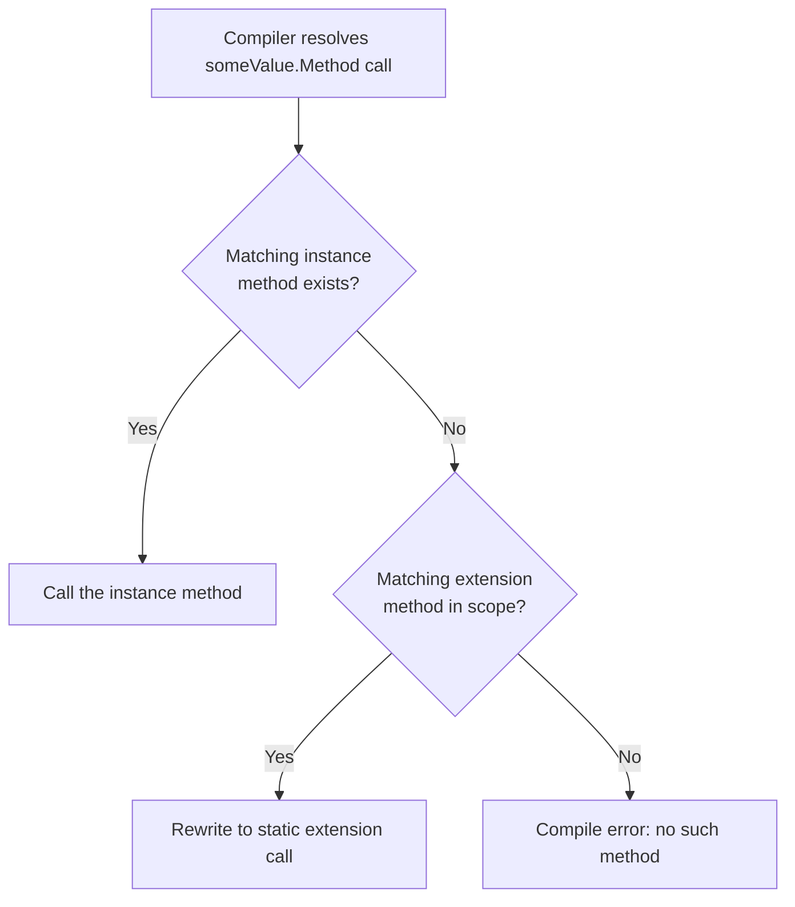

# Extension Methods in C#

## Introduction

Before reading this lesson, you should already be comfortable with **[required Members and Object Initializers](../02-oop/02-22-required-members-object-initializers.md)**, which controlled how a type's own properties get set. This lesson looks at adding behavior to a type from the *outside* — **extension methods**, which let you call `someValue.NewMethod()` on a type even when you have no ability to edit that type's source code at all, including types built into .NET itself.

By the end of this lesson, you will be able to:

- Write a static class containing an extension method using the `this` parameter modifier
- Call an extension method with ordinary instance-method syntax
- Add new methods to a type you don't own, such as `string` or `IEnumerable<T>`
- Recognize the common LINQ-style extension method pattern of filtering, projecting, or aggregating a sequence
- Explain why extension methods can't access a type's private members and aren't polymorphic

## Extension Methods — A Layman's Perspective

Imagine you rent an apartment. The lease is clear: you cannot knock down walls, rewire the electrical panel, or touch anything structural — the building belongs to the landlord, and its blueprint is fixed. But nothing stops you from screwing a coat hook into your own closet door, mounting a shelf bracket on your bedroom wall, or clipping a small caddy onto the shower rod. None of these additions change the apartment's structure — the landlord's blueprint is untouched, and any other tenant who later rents the exact same unit gets the exact same walls, with none of your hooks or shelves. But for as long as you live there, your apartment *behaves* as though it always had a coat hook by the door, because you added one yourself, from the outside, without needing the landlord's permission to alter the building.

This is a genuinely useful trick for exactly the situation where you can't change the original — you don't own the blueprints, you didn't build the walls, and asking the landlord to add a hook for you isn't realistic. Instead you find an approved, external way to attach new convenience to something you're only ever going to *use*, never redesign.

There's an important limit to this trick, though: you can hang things on the walls, but you can't rewire what's already inside them. Your coat hook doesn't get to reach into the wall cavity and rearrange the landlord's plumbing — it only ever works with what's already reachable from outside the wall, like the doorframe's surface. If the apartment's blueprint changes years later — say, the landlord installs a proper built-in coat closet — your external hook doesn't automatically know about it or interact with it; it's simply been made redundant, still hanging there attached the same external way it always was.

C# extension methods work exactly like that coat hook. You write a method that appears to belong to an existing type — even a type from the .NET class library that you could never touch the source code of — without needing to modify, recompile, or inherit from that original type at all. And just like the coat hook can only use what's reachable from outside the wall, an extension method can only see a type's *public* members; it has no special access to anything private, no matter how naturally it reads as though it belongs there.

The bridge to programming: an extension method lets you call `value.YourNewMethod()` on any existing type — one you wrote, or one Microsoft wrote — by defining that method separately, in your own static class, using only the type's already-public surface, without ever touching or recompiling the original type.

## Extension Methods — A Programming Language Perspective

An **extension method** is a `static` method, declared in a `static` class, whose first parameter is prefixed with the `this` modifier — `public static bool IsValidOrderId(this string value)`. That `this` prefix is a purely compile-time signal: at the call site, `someString.IsValidOrderId()` is syntactic sugar the compiler rewrites into the ordinary static call `StringExtensions.IsValidOrderId(someString)`, provided the containing static class's namespace is in scope via a `using` directive. Because the rewrite happens entirely at compile time, extension methods are resolved statically, not dynamically — there is no virtual dispatch, they cannot override anything, and if a genuine instance method with a matching signature exists on the type, the compiler always prefers the real instance method over any extension method. Extension methods can only use a type's public members, exactly like any other external caller — they carry no special access to private or protected state. Available since C# 3.0, this feature underlies the entire LINQ standard query operator library (`Where`, `Select`, `OrderBy`, and dozens more), all of which are ordinary extension methods on `IEnumerable<T>`.

## How to Write and Use Extension Methods in C#

An extension method lives in a `static class` — required by the compiler — and its first parameter carries the `this` modifier naming the type being extended. Everything after that first parameter is a normal parameter list, and the method body is ordinary code working only with what the extended type's public surface exposes.

```mermaid
flowchart LR
    A["\"ORD-1001\".IsValidOrderId()"] --> B{"Instance method\nIsValidOrderId on string?"}
    B -->|No| C["Search static classes in scope\nfor a matching extension method"]
    C --> D["StringExtensions.IsValidOrderId(\"ORD-1001\")"]
    D --> E[Method executes normally]
```
*Figure 1: The compiler rewrites an extension method call into an ordinary static method call when no matching instance method exists.*

```csharp
// Program.cs — .NET 10 / C# 14

Console.WriteLine("ORD-1001".IsValidOrderId());
Console.WriteLine("12345".IsValidOrderId());
Console.WriteLine("ORD-12".IsValidOrderId());

static class StringExtensions
{
    public static bool IsValidOrderId(this string value) =>
        value.StartsWith("ORD-", StringComparison.Ordinal) && value.Length == 8;
}
```

**Console Output:**

```text
True
False
False
```

`"ORD-1001".IsValidOrderId()` reads exactly like calling a method `string` itself defines, but `string` has no such method — the compiler finds `IsValidOrderId` in the `StringExtensions` static class because its first parameter is marked `this string value`, and rewrites the call accordingly. `"12345"` fails because it doesn't start with `"ORD-"`; `"ORD-12"` fails the length check even though the prefix matches — both show the extension method behaving exactly like any other method, just attached to `string` from the outside.

## Real-Time Example: Extension Methods in E-Commerce Order Processing

Continuing the E-Commerce Order Processing case study, this example adds two extension methods directly onto `IEnumerable<Order>` — an interface defined in the .NET base class library that this codebase has no ability to modify. `TotalRevenue` follows the common LINQ-style pattern of aggregating a sequence into a single value; `HighValue` follows the equally common pattern of filtering a sequence and returning another `IEnumerable<Order>`, so it can be chained just like `Where` or `OrderBy`.

```csharp
// Program.cs — .NET 10 / C# 14 — Real-Time Example
// E-Commerce Order Processing case study: extension methods add reusable,
// order-specific operations directly onto IEnumerable<Order>, a BCL interface.

var orders = new List<Order>
{
    new Order("ORD-1001", 249.99m, OrderStatus.Pending),
    new Order("ORD-1002", 899.50m, OrderStatus.Shipped),
    new Order("ORD-1003", 40.00m, OrderStatus.Cancelled),
    new Order("ORD-1004", 1250.00m, OrderStatus.Delivered),
    new Order("ORD-1005", 1499.00m, OrderStatus.Pending),
};

Console.WriteLine($"Total revenue (excluding cancelled): {orders.TotalRevenue():C}");

Console.WriteLine("High-value orders (>= $1,000):");
foreach (Order order in orders.HighValue(1000m))
{
    Console.WriteLine($"  {order.OrderId}: {order.Total:C}");
}

record Order(string OrderId, decimal Total, OrderStatus Status);

enum OrderStatus { Pending, Shipped, Delivered, Cancelled }

static class OrderExtensions
{
    public static decimal TotalRevenue(this IEnumerable<Order> orders) =>
        orders.Where(o => o.Status != OrderStatus.Cancelled).Sum(o => o.Total);

    public static IEnumerable<Order> HighValue(this IEnumerable<Order> orders, decimal threshold) =>
        orders.Where(o => o.Total >= threshold);
}
```

**Console Output:**

```text
Total revenue (excluding cancelled): $3,898.49
High-value orders (>= $1,000):
  ORD-1004: $1,250.00
  ORD-1005: $1,499.00
```

`orders.TotalRevenue()` and `orders.HighValue(1000m)` read exactly like methods `List<Order>` itself provides, but neither `List<T>` nor `IEnumerable<T>` defines them — they're ordinary extension methods, callable on any `List<Order>`, array of `Order`, or other `IEnumerable<Order>` anywhere else in the codebase. This is exactly how a real order-processing system accumulates a shared library of domain-specific query helpers without ever needing to wrap or subclass .NET's own collection types.

## Extension Methods vs Instance Methods

An instance method lives inside the type's own declaration and can freely see and use that type's private and protected members — it's part of the type's actual design. An extension method lives entirely outside the type, in an unrelated static class, and can only work with what's already public, exactly like any other consumer of the type. Extension methods also resolve statically: they're never virtual, can never be overridden by a derived class, and if a real instance method with a matching name and signature exists, the compiler always calls that instance method instead — an extension method can add convenience, but it can never shadow or replace a type's genuine behavior. Use an instance method whenever you own the type and the behavior is core to what it *is*; reach for an extension method when you don't own the type, or when the behavior is a convenience layered on top rather than a fundamental part of the type's identity.


*Figure 2: Instance methods always take priority; extension methods are only considered once no matching instance method exists.*

| Aspect | Instance Method | Extension Method |
|---|---|---|
| Declared | Inside the type itself | In a separate `static` class |
| Access to private members | Yes | No — public surface only |
| Requires owning the source | Yes | No |
| Dispatch | Can be virtual / overridden | Always resolved statically |
| Typical use | Core behavior defining the type | Add-on convenience, especially for types you can't modify |

## Types of Extension Method Patterns in C#

Extension methods show up across the language and library in a few recurring shapes, several of which get their own dedicated lesson:

1. **[C# 14 Extension Blocks](../02-oop/02-24-csharp-14-extension-blocks.md)** — the modern syntax that extends a type with properties, operators, and indexers, not just methods.
2. **[Introduction to LINQ](../04-linq/04-01-introduction-to-linq.md)** — the single largest, most widely used library of extension methods in the entire BCL.
3. **[Generic Methods](../03-collections-generics/03-17-generic-methods.md)** — extension methods are frequently written generically so they work across many collection element types at once.
4. **[Static Members and Static Classes](../02-oop/02-09-static-members-and-classes.md)** — the static-class rules every extension method must live inside.
5. **[Writing Custom LINQ Operators](../04-linq/04-18-writing-custom-linq-operators.md)** — a deeper dive into building your own chainable, LINQ-style extension methods.

## What You've Learned & What's Next

Extension methods let you attach new, callable-as-if-native methods to any type — including ones you don't own, like `string` or `IEnumerable<T>` — by writing an ordinary static method in a static class and marking its first parameter with `this`. They're resolved entirely at compile time, can only see a type's public surface, and always lose out to a genuine instance method of the same signature, but that's exactly what makes them safe: they add convenience without ever silently overriding a type's real behavior.

Continue your learning journey with **[C# 14 Extension Blocks](../02-oop/02-24-csharp-14-extension-blocks.md)**, where this same idea gets a substantial upgrade — extension *properties*, operators, and indexers, not just methods.

---
*Applies to: .NET 10 / C# 14. Last reviewed 2026-08-16.*
