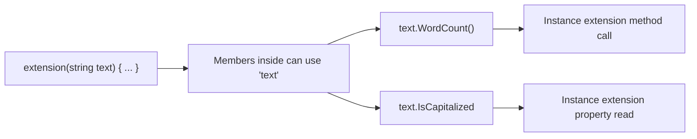
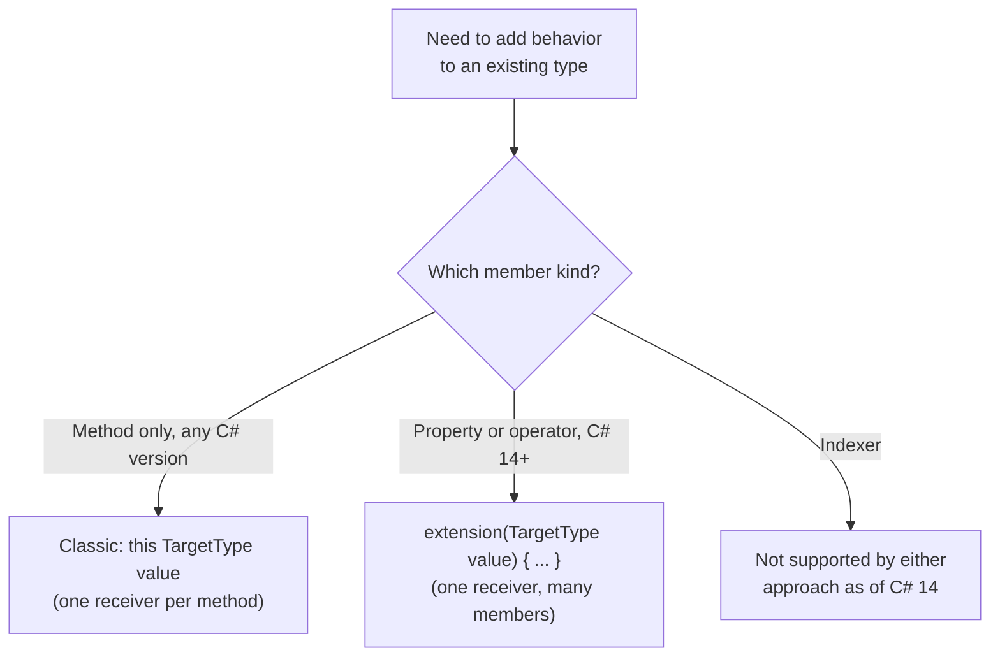

# C# 14 Extension Blocks

## Introduction

Before reading this lesson, you should already be comfortable with **[Extension Methods in C#](../02-oop/02-23-extension-methods-in-csharp.md)**, which used the `this` parameter modifier to bolt new methods onto an existing type. This lesson covers **C# 14's extension blocks** — a genuinely new piece of syntax, `extension(ReceiverType receiver) { ... }`, that doesn't just clean up the old `this`-parameter style but adds two member kinds the classic mechanism could never produce at all: **extension properties** and **extension operators**.

By the end of this lesson, you will be able to:

- Declare an `extension(...)` block inside a static class and add members to it
- Write an extension property using a named receiver, callable as `value.SomeProperty`
- Write a static extension member using an unnamed receiver, callable as `Type.SomeMember()`
- Add an extension operator to a type without modifying that type's own source
- Explain precisely what C# 14 extension blocks add over classic `this`-parameter extension methods, and what they still don't support

## C# 14 Extension Blocks — A Layman's Perspective

Recall the earlier idea of hanging a coat hook on your rented apartment's wall — a small addition from the outside, without needing the landlord's permission to touch the building itself. Now imagine the old paperwork for doing that: every single time you wanted to add anything at all — a coat hook today, a shelf bracket next month, a towel bar the month after — you had to fill out an entirely separate permit slip, and at the top of every single one of those slips, you had to write out your apartment's full address and unit number again from scratch. Three fixtures meant three slips, each repeating the same address, each processed one at a time.

Now imagine the building finally introduces a better form: a single consolidated renovation permit. You write your apartment's address and unit number exactly once at the top, and then, underneath that one heading, you list every fixture you want to add in the same submission — the coat hook, the shelf, the towel bar — all attached to the one address you already wrote down. No more repeating your unit number on slip after slip.

But the new form does something the old one genuinely couldn't: it has entirely new boxes to check that simply didn't exist on the old slip. The old permit only had a box for "attach a hook-shaped object to the wall" — that was the one and only kind of addition it understood. The new form adds a box for "install a small built-in shelf that reads the room's existing shape" (something that behaves like it was always part of the room, not just clipped onto it) and even a box for "replace how two objects combine," like swapping in a smarter hinge that changes how the door and frame work together. Those aren't just faster versions of hanging a hook — they're categories of addition the old permit had no way to describe, no matter how many times you filled it out.

That's the real story of C# 14's extension blocks. The old approach — one separate `this`-parameter method at a time, each repeating its target type — is like the old permit slip: functional, but repetitive, and limited to exactly one kind of addition. The new `extension(...)` block is the consolidated permit: state the type you're extending once, then list every addition underneath it. And critically, the new form has boxes the old one never had — genuine extension *properties*, which read like they were always part of the type, and extension *operators*, which change how two values of a type combine — additions that classic extension methods, no matter how cleverly written, simply could not produce.

## C# 14 Extension Blocks — A Programming Language Perspective

An **extension block**, introduced in C# 14, groups one or more extension member declarations inside `extension(ReceiverType receiver) { ... }` (or, generically, `extension<T>(SomeType<T> receiver) { ... }`), nested inside an ordinary `static class`. A **named** receiver parameter — `extension(string text)` — declares *instance* extension members: methods and properties usable as `value.Member`, with `text` bound to the calling instance inside the block, exactly as `this string text` did in classic syntax. An **unnamed** receiver — `extension(Point)`, type only, no parameter name — declares *static* extension members instead, callable as `Type.Member()` with no instance available at all; C# 14's static extension members and extension operators (operators are inherently `static` in C#) both require this unnamed form. Under the hood, extension blocks still compile down to ordinary static methods, just as classic `this`-parameter methods always did — there is no new runtime mechanism, only new compiler-supported surface syntax and two categories of member the compiler previously had no way to synthesize: extension properties and extension operators. Extension *indexers* were proposed during design but did not ship in the C# 14 release; only methods, properties, and operators are supported.

## How to Declare and Use C# 14 Extension Blocks

An extension block starts with the `extension` contextual keyword followed by the receiver in parentheses — named for instance members, unnamed for static members — and everything inside the block's braces is an ordinary member declaration that can refer to the receiver by its declared name.


*Figure 1: One extension block declares the receiver once; every member inside shares it, whether it's a method or a property.*

```csharp
// Program.cs — .NET 10 / C# 14

Console.WriteLine("Hello there, extension blocks".WordCount());
Console.WriteLine("SingleWord".IsCapitalized);

static class StringExtensions
{
    extension(string text)
    {
        public int WordCount() =>
            text.Split(' ', StringSplitOptions.RemoveEmptyEntries).Length;

        public bool IsCapitalized =>
            text.Length > 0 && char.IsUpper(text[0]);
    }
}
```

**Console Output:**

```text
4
True
```

`WordCount()` and `IsCapitalized` are both declared inside the same `extension(string text)` block, sharing the one receiver `text` without either member having to redeclare `this string` the way two separate classic extension methods would have to. `WordCount()` is called with parentheses because it's a method; `IsCapitalized` is read with no parentheses at all because it's a genuine property — something no classic `this`-parameter extension method could ever express directly.

## Real-Time Example: C# 14 Extension Blocks in E-Commerce Order Processing

Continuing the E-Commerce Order Processing case study, this example rewrites the order analytics helpers from the previous lesson as a single extension block. `TotalRevenue` and `ActiveCount` become genuine extension *properties* on `IEnumerable<Order>` — read without parentheses, exactly like a property the interface had always declared — and a second, unnamed-receiver block adds `Order.Placeholder()`, a static extension member callable directly on the `Order` type itself, something classic extension methods have no way to express at all.

```csharp
// Program.cs — .NET 10 / C# 14 — Real-Time Example
// E-Commerce Order Processing case study: the same order analytics from the previous
// lesson, rewritten as a C# 14 extension block so TotalRevenue reads as a property, and
// a static extension member adds a factory directly on the Order type itself.

var orders = new List<Order>
{
    new Order("ORD-2001", 129.00m, OrderStatus.Pending),
    new Order("ORD-2002", 749.99m, OrderStatus.Shipped),
    new Order("ORD-2003", 15.50m, OrderStatus.Cancelled),
    new Order("ORD-2004", 2100.00m, OrderStatus.Delivered),
};

Console.WriteLine($"Total revenue (excluding cancelled): {orders.TotalRevenue:C}");
Console.WriteLine($"Active order count:                  {orders.ActiveCount}");

Order placeholder = Order.Placeholder();
Console.WriteLine($"Placeholder order id: {placeholder.OrderId}");

record Order(string OrderId, decimal Total, OrderStatus Status);

enum OrderStatus { Pending, Shipped, Delivered, Cancelled }

static class OrderExtensions
{
    extension(IEnumerable<Order> orders)
    {
        public decimal TotalRevenue =>
            orders.Where(o => o.Status != OrderStatus.Cancelled).Sum(o => o.Total);

        public int ActiveCount =>
            orders.Count(o => o.Status != OrderStatus.Cancelled);
    }

    extension(Order)
    {
        public static Order Placeholder() => new("ORD-0000", 0m, OrderStatus.Pending);
    }
}
```

**Console Output:**

```text
Total revenue (excluding cancelled): $2,978.99
Active order count:                  3
Placeholder order id: ORD-0000
```

`orders.TotalRevenue` and `orders.ActiveCount` read exactly like properties `IEnumerable<Order>` had all along, even though nothing in the BCL ever declared them — a readability win over the previous lesson's `orders.TotalRevenue()` method call. `Order.Placeholder()` is even more distinctive: it's called directly on the `Order` type, with no instance in sight, which is precisely what an unnamed-receiver extension block enables and classic `this`-parameter extension methods, tied permanently to an instance, structurally could not do.

## Classic Extension Methods vs C# 14 Extension Blocks

The classic `this`-parameter style and C# 14's extension blocks both compile to the same underlying static-method IL, so nothing here is a runtime capability upgrade — it's a compile-time surface upgrade. Classic syntax repeats `this TargetType value` on every single extension method, even when ten methods all extend the same type. An extension block states the receiver once and lets every member inside share it. More importantly, classic syntax can only ever produce methods — there was never a way to write a callable-without-parentheses extension *property*, or an extension *operator* that changes how two values of a type combine, because the `this`-parameter mechanism has no concept of a property accessor or an operator signature. Extension blocks add exactly those two member kinds. One thing neither approach supports yet: extension *indexers* (`this[int i]`) were proposed for C# 14 but did not ship, so a type's `[]` indexing behavior still can't be extended from outside.


*Figure 2: Classic extension methods still work everywhere; extension blocks add property and operator support that classic syntax structurally cannot provide.*

| Aspect | Classic Extension Methods (C# 3+) | C# 14 Extension Blocks |
|---|---|---|
| Declaration | `this TargetType value` per method | `extension(TargetType value) { ... }` grouping |
| Extension methods | Supported | Supported |
| Extension properties | Not possible | Supported |
| Extension operators | Not possible | Supported (unnamed receiver) |
| Static extension members | Not possible | Supported (unnamed receiver) |
| Extension indexers | Not possible | Not yet — still unsupported in C# 14 |
| Receiver repetition | Once per method | Once per block |

## Types of Extension Constructs in C#

Extension blocks sit alongside a wider set of related type-design tools worth knowing:

1. **[Extension Methods in C#](../02-oop/02-23-extension-methods-in-csharp.md)** — the classic mechanism extension blocks build directly on top of, and remain fully compatible with.
2. **[Operator Overloading in Depth](../02-oop/02-05-operator-overloading-in-depth.md)** — the general rules that also govern operators declared inside an unnamed-receiver extension block.
3. **[Static Members and Static Classes](../02-oop/02-09-static-members-and-classes.md)** — extension blocks must still live inside a `static class`, just like classic extension methods.
4. **[Generic Methods](../03-collections-generics/03-17-generic-methods.md)** — how a generic extension block, `extension<T>(...)`, constrains the receiver's type parameter.
5. **[Introduction to LINQ](../04-linq/04-01-introduction-to-linq.md)** — a prime future candidate for extension-block-based rewrites of the kind shown in this lesson's real-time example.

## What You've Learned & What's Next

C# 14's `extension(...)` blocks group extension methods, properties, and operators under a single, once-declared receiver, replacing the repetition of the classic `this`-parameter style. The genuinely new capability isn't performance or syntax brevity — it's that extension properties and extension operators simply didn't exist before C# 14, no matter how the classic mechanism was used. Indexers remain the one gap not yet closed.

Continue your learning journey with **[Partial Classes and Partial Methods](../02-oop/02-25-partial-classes-and-methods.md)**, where we look at splitting a single class's definition across multiple files — including the pattern source generators rely on to add generated code to a type you wrote by hand.

---
*Applies to: .NET 10 / C# 14. Last reviewed 2026-08-16.*
