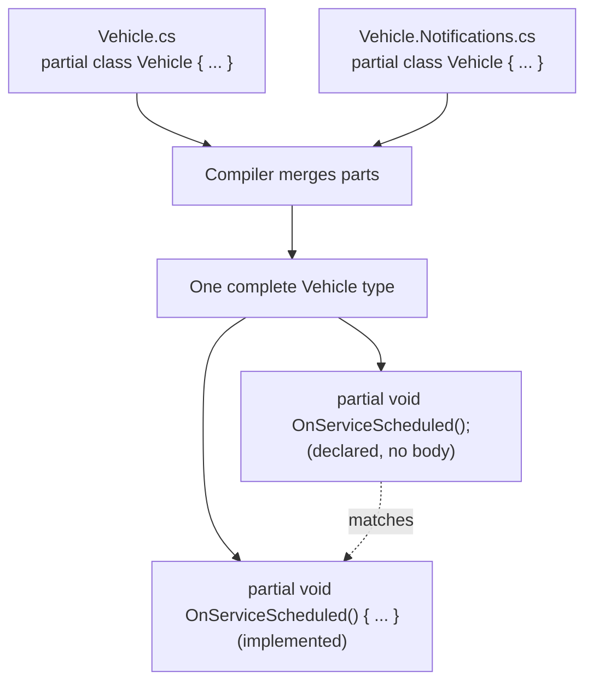
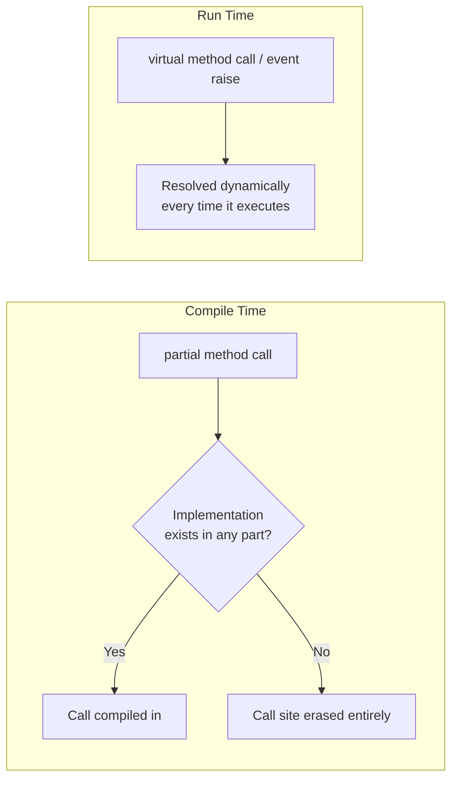

# Partial Classes and Partial Methods

## Introduction

Before reading this lesson, you should already be comfortable with **[C# 14 Extension Blocks](../02-oop/02-24-csharp-14-extension-blocks.md)**, which added new members to a type from a completely separate file without touching its original source. This lesson covers a different way to spread one type across multiple files — **`partial` classes**, which let a single class's *own* definition be split into pieces the compiler merges back together, and **partial methods**, a compile-time extension point built specifically for the pattern that tools like source generators rely on: hand-written code and machine-generated code sharing one type.

By the end of this lesson, you will be able to:

- Split one class's declaration across two or more `partial class` blocks
- Declare a `partial` method as a hook with no body, and implement it in a separate part
- Explain what happens at compile time if a partial method is never implemented
- Recognize why source generators depend on partial classes and partial methods specifically
- Distinguish a partial method's compile-time hook from a runtime extension point like a virtual method or event

## Partial Classes and Partial Methods — A Layman's Perspective

Picture a large architectural blueprint for a building — too large and detailed to fit on one sheet of paper, so the drafting office splits it across several sheets: one sheet for the plumbing layout, one for the electrical wiring, one for the structural framing. Each sheet is clearly labeled with the same building name at the top, and none of them is a separate building — they're all pages of the exact same set of blueprints, and when the construction crew lays them all out together on the table, they read as one single, complete plan. Splitting the blueprint this way isn't about creating multiple buildings; it's purely about making one very large plan manageable to work on, since the plumbing team and the electrical team can each work on their own sheet without needing to touch, or even see, the other's drawings.

Now imagine one very specific box printed on the framing sheet: "Reinforcement detail — see structural engineer's addendum." The framing sheet's drafter deliberately leaves this box blank and simply labels it, because they know a structural engineer, working separately, will fill in the actual reinforcement specification on their own addendum sheet later. If the engineer's addendum never arrives, the box simply stays labeled and empty — nobody treats its absence as an error, because leaving it blank was always an accepted, valid outcome. But if the addendum does arrive, it slots into that exact labeled space, and the final combined blueprint reads as though it was always one complete, seamless document — nobody looking at the finished plan can tell that one team drew the outline and a different team, working independently and later, filled in that one specific detail.

That's exactly the relationship between a partial class and a partial method. A `partial class` is the blueprint split across several sheets — the same class, declared across separate files, that the compiler reassembles into one complete type, letting different people (or different tools) each work on their own piece without touching the rest. A partial method is that specific labeled, optional box: a hook that one part of the class declares by name but leaves empty, trusting that another part — possibly written by a completely different process, like an automated code generator — will supply the actual implementation. And critically, if nobody ever fills that box in, nothing breaks; the blank box is simply treated as though it was never there at all.

## Partial Classes and Partial Methods — A Programming Language Perspective

A **`partial class`** (also available for `struct` and `interface`) is a type declaration split into two or more physical source files, each written as `partial class TypeName { ... }`; the compiler merges every part into a single type at compile time — all parts must agree on accessibility and any base type, and together they contribute to one shared set of members, one constructor list, and one set of fields. A **partial method** is declared in one part with no body — `partial void OnCheckedOut(string borrowerName);` — and optionally implemented with a body in another part. If a partial method with no accessibility modifier is never implemented anywhere, the compiler removes both the declaration and every call site to it entirely, at compile time, producing zero IL and zero runtime cost — this is what makes partial methods safe as an optional, machine-generated extension point rather than a hard requirement. (Since C# 9, partial methods may also declare an accessibility modifier and a non-`void` return type, in which case an implementation becomes mandatory rather than optional.) This split-declaration model is precisely what Roslyn source generators depend on: hand-written code occupies one part of a `partial class`, and generator-emitted code occupies another part, combined by the compiler into one type without either side needing to know the other's file even exists.

## How to Declare and Use Partial Classes and Partial Methods in C#

Every part of a partial class repeats the `partial` modifier and the same class name; the compiler is responsible for stitching the parts together, so member order across files doesn't matter. A partial method's declaring part writes only its signature, ending in a semicolon; an implementing part supplies the body using the identical signature.


*Figure 1: Two files, each declaring `partial class Vehicle`, merge into one type; the partial method's declaration and implementation are matched up the same way.*

```csharp
// Program.cs — .NET 10 / C# 14
// In a real project, these two partial declarations would live in separate files —
// Vehicle.cs and Vehicle.Notifications.cs — combined here into one runnable file.

var vehicle = new Vehicle("Forklift-07");
vehicle.ScheduleService();

partial class Vehicle
{
    public string Name { get; }

    public Vehicle(string name) => Name = name;

    public void ScheduleService()
    {
        Console.WriteLine($"{Name}: service scheduled.");
        OnServiceScheduled();
    }

    partial void OnServiceScheduled();
}

partial class Vehicle
{
    partial void OnServiceScheduled()
    {
        Console.WriteLine($"{Name}: notification sent to maintenance team.");
    }
}
```

**Console Output:**

```text
Forklift-07: service scheduled.
Forklift-07: notification sent to maintenance team.
```

Both `partial class Vehicle` blocks merge into one type with one `Name` property and one constructor, even though they're written as two separate declarations. `ScheduleService` calls `OnServiceScheduled()` without knowing or caring which part implements it — that call simply resolves to whichever part supplies a body. Had the second `partial class Vehicle` block never existed at all, the call to `OnServiceScheduled()` would have compiled away to nothing, and the program would have printed only the first line, with no error and no trace that the hook was ever declared.

## Real-Time Example: Partial Classes and Partial Methods in Library/Inventory Management

Continuing the Library/Inventory Management case study, `LibraryItem`'s first part owns the real checkout logic — the rules around who can borrow a book and when. Its second part stands in for code a source generator would emit automatically (the exact scenario **[Introduction to Roslyn Source Generators](../13-reflection-sourcegen-lowlevel/13-04-introduction-to-source-generators.md)** covers building for real): an audit-logging implementation of a partial method the hand-written part only declares.

```csharp
// Program.cs — .NET 10 / C# 14 — Real-Time Example
// Library/Inventory Management case study: the hand-written half of LibraryItem owns
// checkout logic; the second half simulates code a source generator would emit — the
// audit-logging pattern Module 13 covers when building real source generators.

var item = new LibraryItem("Clean Code", "978-0132350884");
item.CheckOut("Grace Hopper");
item.CheckOut("Alan Turing");
item.Return();

partial class LibraryItem
{
    public string Title { get; }
    public string Isbn { get; }
    public string? CurrentBorrower { get; private set; }

    public LibraryItem(string title, string isbn)
    {
        Title = title;
        Isbn = isbn;
    }

    public void CheckOut(string borrowerName)
    {
        if (CurrentBorrower is not null)
        {
            Console.WriteLine(
                $"{Title}: already checked out to {CurrentBorrower}. Request denied for {borrowerName}.");
            return;
        }

        CurrentBorrower = borrowerName;
        Console.WriteLine($"{Title}: checked out to {borrowerName}.");
        OnCheckedOut(borrowerName);
    }

    public void Return()
    {
        string? previousBorrower = CurrentBorrower;
        CurrentBorrower = null;
        Console.WriteLine($"{Title}: returned by {previousBorrower}.");
    }

    partial void OnCheckedOut(string borrowerName);
}

// A source generator — or, here, a hand-written stand-in for one — supplies the
// implementation for the hook the part above only declared.
partial class LibraryItem
{
    private static int _auditSequence;

    partial void OnCheckedOut(string borrowerName)
    {
        _auditSequence++;
        Console.WriteLine($"  [audit log #{_auditSequence}] {Isbn} -> {borrowerName}");
    }
}
```

**Console Output:**

```text
Clean Code: checked out to Grace Hopper.
  [audit log #1] 978-0132350884 -> Grace Hopper
Clean Code: already checked out to Grace Hopper. Request denied for Alan Turing.
Clean Code: returned by Grace Hopper.
```

Alan Turing's request is denied before `OnCheckedOut` is ever reached, so no second audit entry appears — the hook only fires on a successful checkout. In a real system, the "generated" part shown here would genuinely be produced by a source generator scanning `LibraryItem` for an attribute like `[Audited]`, emitting the logging implementation automatically so the hand-written part never has to import a logging framework or even know how auditing is implemented at all.

## Partial Methods vs Virtual Methods and Events

A partial method is a compile-time hook: it's resolved when the parts of a partial class are stitched together into one type, requires every part to live in the same assembly, supports exactly one implementation, and — if that implementation never shows up — is erased so completely that it costs nothing at runtime, not even a check. A virtual method or an event is a runtime extension point instead: a derived class can override a virtual method, or any number of subscribers can attach to an event, from any assembly that references the type, resolved dynamically each time the method is called or the event is raised — and that flexibility carries a small but real runtime cost even when nothing has overridden or subscribed to it. Source generators reach for partial methods precisely because the relationship between hand-written and generated code is known entirely at compile time, within one assembly, with exactly one generator supplying the implementation — the heavier, more flexible machinery of virtual dispatch or an event's invocation list would be solving a problem that doesn't exist here.


*Figure 2: A partial method is resolved once, at compile time, with zero cost if unused; a virtual method or event is resolved fresh at every call, at runtime.*

| Aspect | Partial Method | Virtual Method / Event |
|---|---|---|
| Resolved | Compile-time, across parts of one type | Runtime, via inheritance or subscription |
| Cost if unused | Zero — call site erased entirely | Small runtime cost even with no override/subscribers |
| Cross-assembly | No — all parts share one assembly | Yes — override or subscribe from any assembly |
| Implementers | Exactly one | Many (event subscribers) or one per derived class |
| Typical use | Compile-time codegen hook | Runtime extensibility and notifications |

## Types of Split-Declaration and Extension-Point Constructs in C#

Partial classes and partial methods are one part of a broader set of tools for organizing large types and building extension points:

1. **[Partial Properties (C# 13)](../02-oop/02-26-partial-properties.md)** — the next lesson, extending this same split-declaration idea to properties.
2. **[Introduction to Roslyn Source Generators](../13-reflection-sourcegen-lowlevel/13-04-introduction-to-source-generators.md)** — where partial classes and partial methods become the essential glue between hand-written and generated code.
3. **[Building a Source Generator](../13-reflection-sourcegen-lowlevel/13-05-building-a-source-generator.md)** — hands-on practice with the exact pattern this lesson's real-time example simulated by hand.
4. **[Nested Types in C#](../02-oop/02-27-nested-types-in-csharp.md)** — another way to organize a large type's members, without splitting the type across files.
5. **[Events in C#](../06-delegates-events/06-04-events-in-csharp.md)** — the runtime-resolved extension point this lesson's comparison section contrasted partial methods against.

## What You've Learned & What's Next

A `partial class` lets one type's definition span multiple files, merged back into a single type by the compiler — useful for keeping large classes manageable and essential for letting hand-written and generated code coexist in the same type. A partial method is the compile-time hook that makes that coexistence safe: declared without a body in one part, optionally implemented in another, and erased entirely, at zero runtime cost, if no implementation ever shows up.

Continue your learning journey with **[Partial Properties (C# 13)](../02-oop/02-26-partial-properties.md)**, where this same split-declaration idea extends to properties, closing one of the gaps partial classes originally left open.

---
*Applies to: .NET 10 / C# 14. Last reviewed 2026-08-16.*
