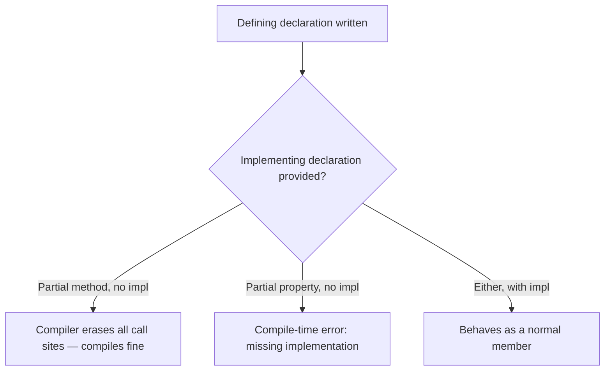

# Partial Properties (C# 13)

## Introduction

Before reading this lesson, you should already be comfortable with **[Partial Classes and Partial Methods](../02-oop/02-25-partial-classes-and-methods.md)** — splitting a single type's definition across multiple files, and declaring a method signature in one place while its body is supplied elsewhere. This lesson extends that same split-definition idea to a member C# had never allowed it for until recently: **properties**. **Partial properties**, introduced in **C# 13**, let you declare a property's signature (its name, type, and accessors) in one partial declaration and supply the actual `get`/`set` implementation in another partial declaration of the same type — most commonly because a source generator is writing that implementation for you.

By the end of this lesson, you will be able to:

- Explain what a partial property is and why C# 13 added it
- Write a partial property's *defining* declaration and its *implementing* declaration correctly
- Understand the compiler rules that connect the two halves (matching signature, exactly one implementing declaration)
- Recognize why this feature exists chiefly to support source generators, using a realistic generator-style scenario
- Distinguish partial properties from partial methods and from ordinary auto-properties

## Partial Properties — A Layman's Perspective

Think about how a large company handles a new employee's ID badge. The HR department doesn't manufacture the badge itself — it fills out a request form that says "this person needs a badge: their name is X, their access level is Y, their photo is attached." That form is a *promise* of what the badge will look like and what it must be able to do (open certain doors, show a photo at the front desk). HR hands that promise off to the badge-printing department, which actually manufactures the physical card: laminating it, embossing the chip, wiring up the electronics that make the door sensors respond. Two different departments, two different files of paperwork, one final badge — and neither department could produce a working badge alone.

That's exactly the shape of a partial property. One part of your codebase — the part a human writes — declares "this type has a property called `FullName`, it's a `string`, and it can be read." That's the promise, the HR request form. It doesn't say *how* the value gets computed or stored. Somewhere else — often a file nobody hand-writes at all, produced automatically by a tool — the actual mechanics live: where the value comes from, how it's stored, what happens when someone reads it. That's the badge-printing department's job: turning a promise into a physically working thing.

Why split it this way at all, rather than just writing the whole badge request and the manufacturing instructions in the same place? Because in a big company, badge manufacturing is standardized and automated — a machine stamps out badges the same way every time, following rules that don't change person to person. It would be wasteful and error-prone for every HR request form to also hand-write the embossing instructions. Better to let HR just describe *what's needed*, and let the automated machinery fill in *how it's built*, consistently, every time, without a human retyping the mechanical part.

In code, that "automated machinery" is a source generator — a program that runs during your build and writes code for you based on some pattern it detects (an attribute on your class, a matching database column, a configuration file). The source generator can't magically add a brand-new property to a class it doesn't own the whole definition of unless the class explicitly leaves a slot open for it. Partial properties are exactly that slot: you (or your tooling) write the declaration — "there is a property here, and this is its shape" — and the generator supplies the accessor bodies, in a separate file, at build time.

The bridge back to programming: a partial property's *defining declaration* is the promise — name, type, and whether it has a getter and/or setter — and its *implementing declaration* is where the actual accessor logic lives, most often machine-written by a source generator rather than typed by hand.

## Partial Properties — A Programming Language Perspective

Introduced in **C# 13**, a **partial property** allows a property's member to be split across two declarations within a `partial class`, `partial struct`, or `partial interface`: a *defining declaration* that specifies the property's name, type, and accessor signatures without bodies (e.g., `public partial string Name { get; set; }`), and an *implementing declaration* in another partial part that supplies the actual accessor bodies (e.g., `public partial string Name { get => _name; set => _name = value; }`). The two declarations must match exactly in accessibility, type, and which accessors (`get`/`set`/`init`) are present. Unlike a partial *method*, which can be left entirely unimplemented (the compiler erases the call site), a partial property's implementing declaration is **required** — the compiler reports an error if a defining declaration has no matching implementation. This feature was added specifically to unblock source generator authors: previously, a generator could not contribute the *body* of a property that the user's own partial class also referenced elsewhere, forcing awkward workarounds like generating an entirely separate backing field and method pair instead of a clean property.

## How to Declare Partial Properties in C#

A partial property requires the `partial` modifier on **both** halves. The defining declaration looks like an auto-property but uses `partial` and has no accessor bodies (just `get;` / `set;`, no braces with logic and no `= value` initializer). The implementing declaration, in a different `partial` part of the same type, repeats the exact same signature but supplies real accessor bodies. Both halves must agree on type, accessor list, and modifiers such as `required` or `virtual`.

```mermaid
classDiagram
    class Product {
        <<partial (defining part)>>
        +partial string DisplayName { get; set; }
    }
    class Product2["Product (generated part)"] {
        <<partial (implementing part)>>
        -string _displayName
        +partial string DisplayName { get => ...; set => ...; }
    }
    Product2 --|> Product : same type, second file
```
*Figure 1: The defining declaration (hand-written) and the implementing declaration (often generated) are two partial parts of the same `Product` type.*

```csharp
// Product.cs — .NET 10 / C# 14 — hand-written defining declaration
public partial class Product
{
    public partial string DisplayName { get; set; }
}

// Product.Generated.cs — .NET 10 / C# 14 — implementing declaration (what a source generator emits)
public partial class Product
{
    private string _displayName = "";

    public partial string DisplayName
    {
        get => _displayName;
        set => _displayName = value.Trim();
    }
}

// Program.cs
var product = new Product { DisplayName = "  Wireless Mouse  " };
Console.WriteLine($"[{product.DisplayName}]");
```

**Console Output:**

```text
[Wireless Mouse]
```

The `DisplayName` property is declared twice: once in `Product.cs` with no logic (just the promise that a `string` property named `DisplayName` with a getter and setter exists), and once in `Product.Generated.cs` with the actual backing field and trimming logic. From the caller's point of view in `Program.cs`, there is only one `DisplayName` property — the split is invisible at the call site, which is exactly the point: consuming code never needs to know whether a property's logic was hand-written or generated.

## Real-Time Example: Partial Properties in Library/Inventory Management

We continue building on the `Book` domain from the Library/Inventory Management case study. A source generator in this system reads each `Book` class for a `[Barcode]` attribute-style convention and generates a `NormalizedIsbn` property that always stores ISBNs without hyphens or spaces, regardless of how staff type them in. The hand-written part of `Book` declares the property's shape; the generated part supplies the normalization logic — mirroring exactly how tools like source generators for JSON serialization or dependency injection registration attach real behavior to a property slot you only declared.

```csharp
// Book.cs — .NET 10 / C# 14 — hand-written defining declarations
public partial class Book
{
    public string Title { get; init; } = "";

    // Defining declaration only — no body, no backing field here.
    public partial string NormalizedIsbn { get; set; }
}

// Book.Generated.cs — .NET 10 / C# 14 — simulates source-generator output
public partial class Book
{
    private string _normalizedIsbn = "";

    public partial string NormalizedIsbn
    {
        get => _normalizedIsbn;
        set => _normalizedIsbn = value.Replace("-", "").Replace(" ", "").ToUpperInvariant();
    }
}

// Program.cs — .NET 10 / C# 14 — Real-Time Example
var catalog = new List<Book>
{
    new Book { Title = "Clean Code", NormalizedIsbn = "978-0-13-235088-4" },
    new Book { Title = "The Pragmatic Programmer", NormalizedIsbn = "978 0135957059" },
};

foreach (Book book in catalog)
{
    Console.WriteLine($"{book.Title}: {book.NormalizedIsbn}");
}

bool foundDuplicate = catalog[0].NormalizedIsbn == "9780132350884";
Console.WriteLine($"First ISBN matches normalized lookup key: {foundDuplicate}");
```

**Console Output:**

```text
Clean Code: 9780132350884
The Pragmatic Programmer: 9780135957059
First ISBN matches normalized lookup key: True
```

Notice that `Book.cs` — the file a librarian-system developer actually edits — never mentions trimming, hyphens, or a backing field; it just states that `NormalizedIsbn` exists. All of that mechanical, easy-to-get-wrong normalization logic lives in the generated part, written once by tooling and applied consistently to every `Book` instance. This is precisely the payoff for the inventory system: catalog lookups by ISBN work reliably no matter how each ISBN was originally typed into a barcode scanner or a manual entry form, without every call site remembering to normalize it itself.

## Partial Properties vs Partial Methods

Both features split a member's declaration across two partial parts of the same type, but they differ in what happens when the second half is missing. A partial *method* is optional by design: if no implementing declaration exists, the compiler simply erases every call to that method, which is why partial methods historically had to return `void` (there'd be no sensible value to produce from a call that vanishes). A partial *property*, by contrast, always represents real, observable state — callers read and write it as a normal property — so the compiler requires exactly one implementing declaration; leaving it out is a compile error, not a silent no-op.


*Figure 2: Partial methods tolerate a missing implementation; partial properties do not.*

| Aspect | Partial Method | Partial Property |
|---|---|---|
| Implementation required? | No — safely erased if absent | Yes — compile error if missing |
| Typical return type | Historically `void` (C# 9 relaxed this for private/non-`virtual` methods) | Any type, like a normal property |
| Primary use case | Optional hooks/extension points | Source-generator-backed computed or backed state |
| Introduced in | C# 3.0 (extended in C# 9) | C# 13 |
| Call-site visibility | Invisible if erased | Always present, behaves like one property |

## Types of Partial Members in C#

Partial properties are one of several ways C# lets a single member's declaration span multiple files, all built on the same `partial` foundation:

1. **[Partial Classes and Partial Methods](../02-oop/02-25-partial-classes-and-methods.md)** — the foundation this lesson builds on, splitting whole types and methods.
2. **[Nested Types in C#](../02-oop/02-27-nested-types-in-csharp.md)** — another way to organize a type's members, though not a "split declaration" mechanism.
3. **[Records in C#](../02-oop/02-19-records-in-csharp.md)** — record types can also declare partial properties, useful when a generator needs to augment a record's members.
4. **[Object Initialization Patterns](../02-oop/02-30-object-initialization-patterns.md)** — shows how `required` and `init` accessors, which partial properties can also carry, fit into the bigger picture of initializing objects.
5. **[Introduction to Roslyn Source Generators](../13-reflection-sourcegen-lowlevel/13-04-introduction-to-source-generators.md)** — the tooling category that motivated partial properties in the first place.

## What You've Learned & What's Next

Partial properties let you declare a property's public shape by hand while leaving its actual accessor logic to be supplied elsewhere — typically by a source generator — with the compiler enforcing that exactly one implementation exists. This closes a long-standing gap between partial classes/methods and properties, making generator-augmented types feel like ordinary, fully-formed classes to everyone who consumes them.

Continue your learning journey with **[Nested Types in C#](../02-oop/02-27-nested-types-in-csharp.md)**, where we look at declaring one type entirely inside another to express strong ownership relationships.

---
*Applies to: .NET 10 / C# 14. Last reviewed 2026-08-16.*
