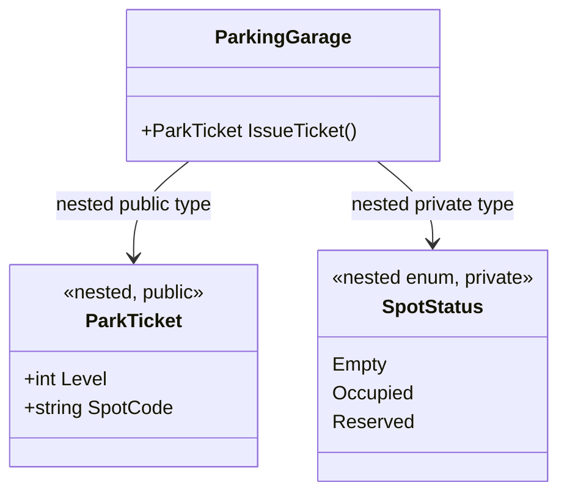
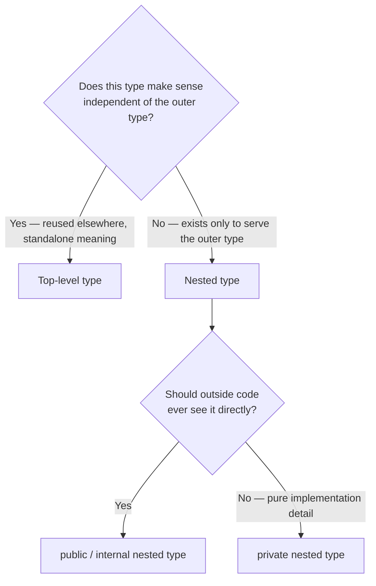

# Nested Types in C#

## Introduction

Before reading this lesson, you should already be comfortable with **[Partial Properties (C# 13)](../02-oop/02-26-partial-properties.md)** — one way a type's members can be organized and split across files. This lesson looks at a different organizational tool: declaring one entire type — a class, struct, or enum — **inside** another type. A **nested type** is a type whose declaration lives within the body of an enclosing type, giving it a special relationship to that outer type's members and a namespace-like grouping under it.

By the end of this lesson, you will be able to:

- Declare a nested class, struct, or enum inside another class
- Explain the access modifier rules that apply to nested types and how they differ from top-level types
- Read and write the fully qualified name used to reference a nested type from outside
- Identify when a nested type communicates genuine ownership versus when it should be a top-level type instead
- Recognize common real-world uses of nesting, like a builder, an enumerator, or a small supporting enum

## Nested Types — A Layman's Perspective

Picture a company's org chart for a single department, say the Shipping department. Shipping doesn't just have a manager — it has its own internal roles that only make sense in the context of Shipping: a "Packing Slip" role, a "Damage Report" role, a small internal classification like "Priority Level: Standard / Express / Overnight." These roles and labels aren't things the rest of the company hires for independently — Sales doesn't have its own Packing Slip role, and Accounting has no use for Shipping's Priority Level classification. They exist *because* Shipping exists, they only make sense *inside* Shipping, and if Shipping were ever dissolved, these roles would dissolve with it.

Now contrast that with something like "Employee" — a concept every department needs and shares. Employee isn't nested inside Shipping; it stands on its own, at the top level of the company, because Sales, Accounting, and Shipping all reference the very same idea of an employee. Nesting a type only makes sense when the inner concept's very existence and meaning are tied to the outer one — not when it's a general-purpose idea reused everywhere.

This is exactly the judgment call C# asks you to make with nested types. If you write a `PackingSlip` class or a `PriorityLevel` enum entirely inside a `ShippingDepartment` class, you're telling every future reader of the code: "this thing has no independent existence — it belongs to, and only makes sense within, `ShippingDepartment`." That's a strong, deliberate statement about ownership. It's the difference between naming a type `Employee` (globally meaningful, top-level) and naming one `ShippingDepartment.PriorityLevel` (locally meaningful, nested, dotted-into like an org-chart sub-role).

There's a practical side-benefit too, much like how a badge system might grant Shipping's internal roles special access to Shipping's own restricted files that outsiders — even other departments — can't touch. A nested type in C# can be declared `private`, meaning literally nobody outside the enclosing type can even see it exists; it's an implementation detail, a helper the outer type uses internally and never exposes. That's something a top-level type can never do — every top-level type is at least visible within its own assembly, but a nested type can be hidden completely.

The bridge back to programming: a nested type is a class, struct, or enum declared inside another type's body, used when the inner type's identity and usefulness are inseparable from its enclosing type — sometimes visible to the outside world as a qualified sub-name, sometimes hidden away entirely as a private implementation detail.

## Nested Types — A Programming Language Perspective

A **nested type** is a type declaration (`class`, `struct`, `enum`, `interface`, `record`, or `delegate`) placed within the body of another type, called the **enclosing type** or **containing type**. Syntactically, a nested type behaves as a member of its enclosing type and may therefore use any member access modifier — `public`, `internal`, `protected`, `private`, or `protected internal` / `private protected` — unlike a top-level (non-nested) type, which may only be `public` or `internal`. A `private` nested type is visible only within the enclosing type's own body, making it a true implementation detail invisible even to derived classes or other code in the same assembly. From outside the enclosing type, a nested type is referenced by its **qualified name** — `OuterType.InnerType` — exactly like a static member is accessed through its declaring type. A nested type does *not* automatically gain access to an *instance* of its enclosing type (there's no implicit `outer` reference as in some other languages); any relationship between an instance of the outer type and the nested type must be established explicitly, typically by passing a reference through a constructor or field.

## How to Declare Nested Types in C#

A nested type is declared by simply writing a type declaration inside the braces of another type, with whatever access modifier fits its intended visibility. From outside, you reference it with the dotted, qualified name; from inside the enclosing type (and other nested members of it), you can use the short name directly.


*Figure 1: `ParkTicket` is a nested type visible to callers as `ParkingGarage.ParkTicket`; `SpotStatus` is a nested private enum, invisible outside `ParkingGarage`.*

```csharp
// Program.cs — .NET 10 / C# 14
public class ParkingGarage
{
    private SpotStatus _groundFloorSpot = SpotStatus.Empty;

    public ParkTicket IssueTicket(int level, string spotCode)
    {
        _groundFloorSpot = SpotStatus.Occupied;
        return new ParkTicket(level, spotCode);
    }

    // Public nested type — part of ParkingGarage's public surface.
    public class ParkTicket
    {
        public int Level { get; }
        public string SpotCode { get; }

        public ParkTicket(int level, string spotCode)
        {
            Level = level;
            SpotCode = spotCode;
        }

        public override string ToString() => $"Level {Level}, Spot {SpotCode}";
    }

    // Private nested type — an implementation detail, invisible outside ParkingGarage.
    private enum SpotStatus
    {
        Empty,
        Occupied,
        Reserved
    }
}

var garage = new ParkingGarage();
ParkingGarage.ParkTicket ticket = garage.IssueTicket(level: 2, spotCode: "B14");
Console.WriteLine(ticket);
```

**Console Output:**

```text
Level 2, Spot B14
```

Notice the qualified name `ParkingGarage.ParkTicket` used at the call site — that's how any code outside `ParkingGarage` must refer to the nested class. `SpotStatus`, by contrast, is `private`: nothing outside `ParkingGarage` could write `ParkingGarage.SpotStatus` even if it wanted to — the compiler would reject it, because a private nested type is a true implementation detail of its enclosing type.

## Real-Time Example: Nested Types in Banking/ATM

We continue building on the Banking/ATM case study. An `Account` needs to produce a detailed transaction receipt, but a "receipt line" only ever makes sense in the context of one specific account's history — no other part of the banking system reuses the concept independently. Rather than scatter a general-purpose `ReceiptLine` class across the codebase, we nest it inside `Account`, and we nest a small `Category` enum inside the receipt line type itself, one level deeper.

```csharp
// Program.cs — .NET 10 / C# 14 — Real-Time Example
public class Account
{
    public string Owner { get; }
    private readonly List<ReceiptLine> _history = new();

    public Account(string owner) => Owner = owner;

    public void RecordDeposit(decimal amount) =>
        _history.Add(new ReceiptLine(ReceiptLine.Category.Deposit, amount));

    public void RecordWithdrawal(decimal amount) =>
        _history.Add(new ReceiptLine(ReceiptLine.Category.Withdrawal, -amount));

    public void PrintStatement()
    {
        Console.WriteLine($"Statement for {Owner}");
        decimal runningBalance = 0m;
        foreach (ReceiptLine line in _history)
        {
            runningBalance += line.Amount;
            Console.WriteLine($"  {line.Type,-11} {line.Amount,10:C}  Balance: {runningBalance,10:C}");
        }
    }

    // Nested public type: a receipt line only ever makes sense as part of an Account's history.
    public class ReceiptLine
    {
        public Category Type { get; }
        public decimal Amount { get; }

        public ReceiptLine(Category type, decimal amount)
        {
            Type = type;
            Amount = amount;
        }

        // Nested one level deeper: this classification only exists to describe a ReceiptLine.
        public enum Category
        {
            Deposit,
            Withdrawal
        }
    }
}

var account = new Account("Rosa Delgado");
account.RecordDeposit(500.00m);
account.RecordWithdrawal(120.00m);
account.RecordDeposit(75.50m);
account.PrintStatement();
```

**Console Output:**

```text
Statement for Rosa Delgado
  Deposit        $500.00  Balance:    $500.00
  Withdrawal    -$120.00  Balance:    $380.00
  Deposit         $75.50  Balance:    $455.50
```

Referencing `Account.ReceiptLine` and `Account.ReceiptLine.Category` from outside `Account` makes the ownership explicit in the type name itself — anyone reading `Account.ReceiptLine.Category.Deposit` immediately understands this classification belongs to a receipt line, which belongs to an account, without needing to check any documentation. If `ReceiptLine` were ever needed by an unrelated part of the banking system — say, a shared reporting module across multiple account types — that would be the signal to promote it out of `Account` and into its own top-level type instead.

## Nested Types vs Top-Level Types

A top-level type is a standalone, independently meaningful concept that any code in the namespace can reference directly and that (outside `internal`) can even be used by other assemblies. A nested type trades that independence for a tighter, explicit relationship with its enclosing type — at the cost of a longer qualified name and, for `private` nested types, being invisible outside the enclosing type entirely. The decision isn't about code size; a tiny nested `enum` and a substantial nested `class` are both fine as long as the *ownership* relationship is genuinely one-directional and permanent.


*Figure 2: Whether a type should be top-level or nested — and if nested, how visible — follows from its ownership relationship to the enclosing type.*

| Aspect | Top-Level Type | Nested Type |
|---|---|---|
| Allowed access modifiers | `public`, `internal` only | Any: `public`, `internal`, `protected`, `private`, `protected internal`, `private protected` |
| Reference from outside | Short name, e.g. `Employee` | Qualified name, e.g. `Account.ReceiptLine` |
| Implies ownership? | No — independently meaningful | Yes — tied to the enclosing type's identity |
| Can be fully hidden? | No — always at least assembly-visible | Yes — `private` hides it completely |
| Typical use | Domain concepts reused across the codebase | Builders, small enums, enumerators, event-args tied to one type |

## Types of Nested Type Scenarios in C#

Nesting shows up in several recurring shapes, some covered in more depth elsewhere in the curriculum:

1. **[Enums in C#](../01-fundamentals/01-24-enums-in-csharp.md)** — small classification enums, like `ReceiptLine.Category` above, are one of the most common things to nest.
2. **[`IEnumerable<T>` and `IEnumerator<T>`](../03-collections-generics/03-13-ienumerable-and-ienumerator.md)** — custom collection types often nest a private `Enumerator` struct that only that collection produces.
3. **[Anonymous Types](../02-oop/02-28-anonymous-types.md)** — the next lesson; conceptually the opposite extreme of nesting, since the compiler generates an unnamed type instead of a hand-nested one.
4. **[Records in C#](../02-oop/02-19-records-in-csharp.md)** — a nested `record` is a common way to model a small, owned value like `Order.LineItem`.
5. **[Introduction to Generics](../03-collections-generics/03-15-introduction-to-generics.md)** — nested generic types combine both features and appear often in builder-style APIs.

## What You've Learned & What's Next

Nested types let you declare a class, struct, or enum entirely inside another type when the inner type's identity is inseparable from its owner — gaining access to every member modifier, including a `private` visibility no top-level type can have, at the cost of a qualified, dotted name from the outside. Use nesting when ownership is genuine and permanent; promote a type to the top level the moment it needs to stand on its own.

Continue your learning journey with **[Anonymous Types](../02-oop/02-28-anonymous-types.md)**, where we look at the opposite end of the spectrum — letting the compiler generate an entirely unnamed type for you on the fly.

---
*Applies to: .NET 10 / C# 14. Last reviewed 2026-08-16.*
