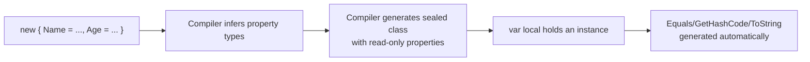

# Anonymous Types

## Introduction

Before reading this lesson, you should already be comfortable with **[Nested Types in C#](../02-oop/02-27-nested-types-in-csharp.md)** — declaring a named type inside another when ownership is strong and permanent. This lesson looks at the opposite extreme: types with **no name at all**. An **anonymous type**, created with `new { ... }` syntax, is a read-only type the C# compiler generates for you on the spot, used for quick, local groupings of values that don't deserve — and don't need — a dedicated class declaration anywhere in your codebase.

By the end of this lesson, you will be able to:

- Create an anonymous type with `new { Property = value, ... }` syntax
- Explain what the compiler actually generates behind an anonymous type and why it's read-only
- Recognize anonymous types' most common home: LINQ projections
- List the concrete limitations that keep anonymous types local to a single method or a tight scope
- Decide when an anonymous type is the right call versus reaching for a named class or record

## Anonymous Types — A Layman's Perspective

Imagine a teacher grading a stack of quizzes and jotting a quick note to themselves on a sticky note for each student: "Priya — 92%, needs review on question 4." That sticky note isn't a permanent school record — it's not filed in the student's official folder, nobody designed an official form for it, and the teacher will likely throw it away once grades are entered into the real system. It exists purely to serve one immediate purpose: helping the teacher remember, for the next ten minutes, a couple of facts bundled together. The teacher doesn't ask the school's printing office to design and produce an official "Quick Grading Note" form for this — that would be wildly excessive for something this disposable and this local to one task.

Now, here's the interesting part: the teacher didn't even design the sticky note's layout themselves. They just wrote down whatever fields felt useful in the moment — name, score, one comment — and the note took whatever shape those fields implied. Nobody had to pre-approve a template; the act of jotting down "here are the fields I need, right now" was enough to produce something usable immediately.

That is exactly what an anonymous type is for. When you write `new { Name = "Priya", Score = 92, Comment = "needs review on question 4" }` in C#, you are jotting exactly that kind of sticky note. You didn't design a form (a class) in advance; you just said "I need these three pieces of information bundled together, right here, right now," and the compiler produced a matching shape for you on the spot — with no name you'll ever need to write down, because you'll never refer to that "form type" again by name.

Just like the teacher's sticky note is read-only in spirit — you don't scratch out "92%" and change it later, you'd just throw it away and write a new one if the score changed — an anonymous type's properties are read-only too. Once you've jotted the values down, you can read them back, but you can't reassign them; if you need different values, you create a whole new note.

And just as that sticky note only makes sense on the teacher's own desk for the next ten minutes — it would be meaningless (and impossible) to mail it to another school and have their system "read" it, since it was never a recognized, named form to begin with — an anonymous type lives entirely within the scope where the compiler can see the values it produced. It's not something you can hand back as the return type of a public method for other code to consume by name, because there is no name to give.

The bridge back to programming: an anonymous type is a compiler-generated, read-only, on-the-spot grouping of values, most useful when the grouping is local, temporary, and never needs to leave the scope where it was created — exactly like a quick note jotted for your own immediate use.

## Anonymous Types — A Programming Language Perspective

An **anonymous type** is a type generated by the C# compiler at compile time from the `new { Property1 = expr1, Property2 = expr2, ... }` expression syntax. The compiler infers each property's type from the corresponding initializer expression, generates a sealed internal class with those properties as **read-only** (get-only, no setter), and overrides `Equals`, `GetHashCode`, and `ToString` to provide structural (value-based) equality and a readable debug string — much like a positional `record` does, but without a name you can write in source. Property names can be inferred from a member access or variable name (`new { customer.Name, age }` yields properties `Name` and `age`), or given explicitly (`new { DisplayName = customer.Name }`). Because the generated type has no accessible name, an anonymous type's use is necessarily confined to contexts where the compiler can track its shape through type inference — local variables (`var`), LINQ query expressions and method chains, and generic method type arguments inferred at the call site — and it cannot appear as an explicit parameter type, field type, or public method return type.

## How to Create Anonymous Types in C#

The `new { ... }` syntax, assigned to a `var`-typed local, is the standard way to create an anonymous type. Two anonymous types created with the same property names, in the same order, with the same inferred types, are treated by the compiler as the *same* generated type within an assembly — which is why a `List<var-typed-anonymous>` built from repeated `new { ... }` expressions of identical shape works correctly.


*Figure 1: An anonymous type expression is turned into a compiler-generated, read-only class behind the scenes.*

```csharp
// Program.cs — .NET 10 / C# 14
var employee = new { Name = "Diego Ramirez", Department = "Logistics", YearsOfService = 4 };
Console.WriteLine(employee);
Console.WriteLine($"{employee.Name} works in {employee.Department}.");

var sameShape = new { Name = "Diego Ramirez", Department = "Logistics", YearsOfService = 4 };
Console.WriteLine($"Structurally equal: {employee.Equals(sameShape)}");

var people = new List<Employee>
{
    new("Ana", 3), new("Leo", 9)
};

var summaries = people.Select(p => new { p.Name, IsSenior = p.YearsAtCompany >= 5 });
foreach (var summary in summaries)
{
    Console.WriteLine($"{summary.Name}: Senior={summary.IsSenior}");
}

record Employee(string Name, int YearsAtCompany);
```

**Console Output:**

```text
{ Name = Diego Ramirez, Department = Logistics, YearsOfService = 4 }
Diego Ramirez works in Logistics.
Structurally equal: True
Ana: Senior=False
Leo: Senior=True
```

`Console.WriteLine(employee)` prints a readable `{ Name = ..., ... }` string automatically, courtesy of the compiler-generated `ToString`. `employee.Equals(sameShape)` returns `true` because both anonymous type instances have identical property names, order, and types — the compiler reused the same generated class for both, and its `Equals` compares property values, not references. The `Select` call shows the most common real home for anonymous types: projecting each `Employee` down to just the fields a caller currently needs, without declaring a dedicated class for that one-off shape.

## Real-Time Example: Anonymous Types in E-Commerce Order Processing

We continue building on the `Order` and `Customer` types from the E-Commerce Order Processing case study. A dashboard needs a quick per-customer summary — order count and total spend — computed and printed once, with no other part of the system ever needing that exact shape again. An anonymous type, produced inline from a LINQ grouping, is a better fit here than declaring a dedicated `CustomerSpendSummary` class solely for this one report.

```csharp
// Program.cs — .NET 10 / C# 14 — Real-Time Example
var orders = new List<Order>
{
    new("ORD-2001", "Sana Ito", 129.99m),
    new("ORD-2002", "Sana Ito", 349.50m),
    new("ORD-2003", "Marco Diaz", 89.00m),
    new("ORD-2004", "Sana Ito", 15.00m),
    new("ORD-2005", "Marco Diaz", 220.75m),
};

var summaries = orders
    .GroupBy(o => o.CustomerName)
    .Select(g => new
    {
        Customer = g.Key,
        OrderCount = g.Count(),
        TotalSpend = g.Sum(o => o.Total)
    })
    .OrderByDescending(s => s.TotalSpend);

Console.WriteLine("Customer Spend Report");
foreach (var summary in summaries)
{
    Console.WriteLine($"  {summary.Customer,-12} Orders: {summary.OrderCount}   Total: {summary.TotalSpend:C}");
}

record Order(string OrderId, string CustomerName, decimal Total);
```

**Console Output:**

```text
Customer Spend Report
  Sana Ito     Orders: 3   Total: $494.49
  Marco Diaz   Orders: 2   Total: $309.75
```

The shape `{ Customer, OrderCount, TotalSpend }` exists only for the lifetime of this report — it's assigned straight into a `var` and consumed immediately in the `foreach`, never passed to another method or stored as a field. That's exactly the profile that favors an anonymous type over a named `CustomerSpendSummary` class: a single-use, throwaway grouping computed and displayed in one continuous flow, with nothing else in the order-processing system ever needing to reference that exact shape by name.

## Anonymous Types vs Named Types (Records/Classes)

Anonymous types and named types (classes or records) both bundle values with named properties, but an anonymous type can never leave the scope where the compiler can track its inferred shape — it cannot be a method's declared return type, a field type, or a parameter type across a method boundary in a way other code can reference by name. A named `record`, by contrast, gets nearly the same read-only, structurally-equal behavior *and* a real name usable anywhere: as a return type, a parameter type, or a field, and consumable from another assembly entirely.

```mermaid
flowchart TD
    A{Will this shape ever cross<br/>a method boundary by name,<br/>or get reused elsewhere?}
    A -->|No — local, throwaway, one-off| B[Anonymous type: new { ... }]
    A -->|Yes — needs a return type/parameter/field| C[Named type: record or class]
```
*Figure 2: Anonymous types suit local, throwaway shapes; named types suit anything crossing a boundary or reused elsewhere.*

| Aspect | Anonymous Type | Named Type (record/class) |
|---|---|---|
| Declared with | `new { ... }` inline expression | `class`/`record` declaration elsewhere |
| Can be a method's return type | No (not by name; `dynamic`/`object` lose shape) | Yes |
| Mutability | Read-only properties always | Configurable (`init`, `set`, or fully mutable) |
| Equality | Structural, auto-generated | Reference (class) or structural (record), auto for records |
| Typical use | One-off LINQ projections, quick local groupings | Reusable domain concepts, public APIs |

## Types/Related Concepts to Anonymous Types in C#

Anonymous types sit alongside several related ways of grouping and projecting data, most covered elsewhere in the curriculum:

1. **[Tuples, Deconstruction, and Pattern Matching](../01-fundamentals/01-25-tuples-deconstruction-pattern-matching.md)** — a named-tuple often solves the same "quick local grouping" problem and, unlike an anonymous type, can be a method's return type.
2. **[Records in C#](../02-oop/02-19-records-in-csharp.md)** — the named, reusable alternative once a projection's shape needs to leave a single method or scope.
3. **[Projection with `Select`](../04-linq/04-05-projection-with-select.md)** — the most common home for anonymous types in real codebases.
4. **[Nested Types in C#](../02-oop/02-27-nested-types-in-csharp.md)** — the opposite tool: a fully named type deliberately scoped to one owner, rather than unnamed and scope-local.
5. **[`var` and `dynamic`](../01-fundamentals/01-22-var-and-dynamic.md)** — required for holding an anonymous type instance, since there is no name to declare the variable's type with explicitly.

## What You've Learned & What's Next

Anonymous types let you bundle a handful of values into a read-only, structurally-equal shape on the spot, with the compiler inferring and generating the type for you — ideal for one-off LINQ projections and other quick, local groupings that will never need a name outside the scope they were created in. The moment a shape needs to cross a method boundary or get reused, it has outgrown an anonymous type and calls for a named `record` or `class` instead.

Continue your learning journey with **[Local Functions](../02-oop/02-29-local-functions.md)**, where we look at declaring functions inside a method body — another tool, like anonymous types, for keeping something tightly scoped to exactly where it's needed.

---
*Applies to: .NET 10 / C# 14. Last reviewed 2026-08-16.*
