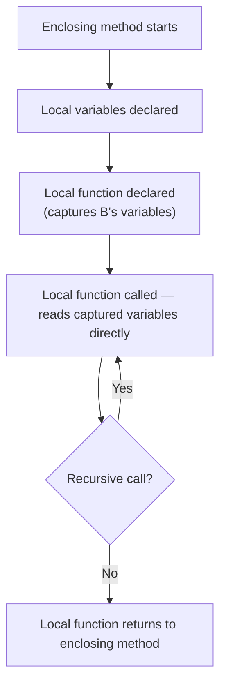
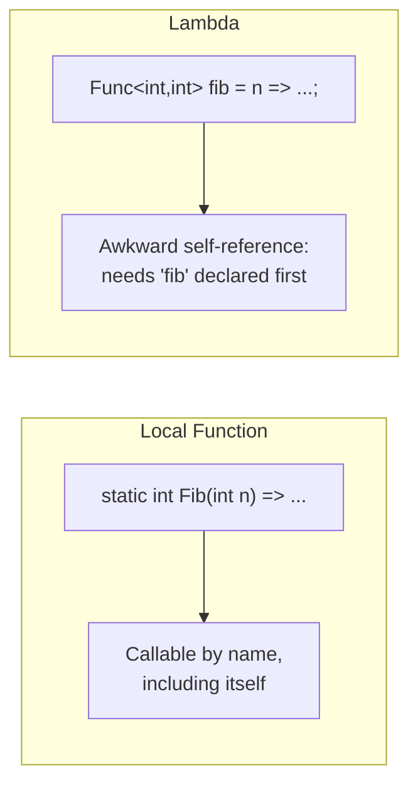

# Local Functions

## Introduction

Before reading this lesson, you should already be comfortable with **[Anonymous Types](../02-oop/02-28-anonymous-types.md)** — one way to keep something scoped tightly to where it's used. This lesson introduces another scoping tool aimed at behavior rather than data: the **local function**, a named function declared directly inside the body of another method, constructor, or even another local function. Local functions let you carve out a self-contained helper without polluting the enclosing type with a private method that only ever makes sense in one place.

By the end of this lesson, you will be able to:

- Declare a local function inside a method body and call it like any other method
- Explain how a local function captures variables from its enclosing scope
- Write a recursive local function, and understand why recursion is natural for local functions but awkward for lambdas
- Contrast local functions with lambda expressions: named vs anonymous, and their differing ergonomics for recursion
- Recognize when a local function is a better fit than either a private method or a lambda stored in a variable

## Local Functions — A Layman's Perspective

Picture a chef preparing a complicated multi-course dinner. Partway through, they need to reduce a sauce — a fiddly, multi-step process: simmer, taste, adjust, simmer again, taste again, until it reaches the right consistency. That reduction process isn't something the chef writes down in the restaurant's permanent recipe book as its own standalone dish — nobody orders "the reduction" off a menu. It's a helper technique that exists purely in service of *this* dish, right now, in *this* kitchen, for *this* order. The chef might even say it out loud to a sous-chef standing right there: "reduce it, taste it, and if it's still thin, do it again" — a self-contained little procedure, referred to by name, usable more than once during this one dish, but meaningless outside the context of preparing it.

Notice something else: while reducing the sauce, the chef doesn't ignore what's already on the counter. They glance at the exact wine already poured into the pan, the exact herbs already measured out on the cutting board just an arm's length away — ingredients that were already there before the reduction step even started. The chef's reduction routine doesn't need those handed to it explicitly on a fresh tray; it just reaches for what's already present in the kitchen around it.

That's a local function. It's a named little procedure, declared right where it's needed — inside the body of some larger recipe (a method) — usable by name, possibly more than once, and, crucially, able to reach out and directly use variables that already exist in its surrounding scope, without those variables needing to be explicitly handed to it as ingredients (parameters). And just like the chef's reduction technique will never appear as its own line on tonight's menu — it's an internal step, invisible to the diner — a local function is invisible to any code outside the method that declares it. It cannot be called from anywhere else in the codebase, because it doesn't exist anywhere else.

Recursion — a technique calling itself again on a smaller version of the same problem — also fits naturally here. If the chef's sauce-reduction step sometimes needs to say "reduce it, then check again, and if still thin, reduce it again the exact same way," that's the technique referring to itself by its own name mid-process. A named local function can call itself by name exactly the same way a top-level method can — it's simply a normal, named routine, just declared in an unusually local place.

The bridge back to programming: a local function is a named function declared inside a method body, automatically able to read variables already in scope around it, callable by name (including calling itself, for recursion), and entirely invisible to any code outside the method that contains it.

## Local Functions — A Programming Language Perspective

A **local function** is a method declared within the body of another member — a method, constructor, property accessor, or another local function — using ordinary method syntax (a name, parameter list, return type, and body) rather than lambda syntax. A local function has full access to all local variables and parameters in scope at its point of declaration, forming a **closure** over them: if a local function is later passed around as a delegate (e.g., returned from its enclosing method), the compiler generates a hidden class to keep those captured variables alive for as long as the delegate exists. Unlike a lambda expression assigned to a `Func<>`/`Action<>` variable, a local function is **named**, so it can call itself directly for straightforward recursion, and it can appear anywhere a statement can, including before its own declaration in source order (subject to definite-assignment rules for what it captures). Local functions may be marked `static` — a **static local function** — to explicitly opt out of capturing any enclosing state, which the compiler enforces and which typically results in a small performance benefit by avoiding closure allocation entirely.

## How to Declare and Use Local Functions in C#

A local function is written exactly like a normal method, just placed inside another method's body — anywhere before it's needed textually, thanks to the compiler hoisting local function declarations. It sees every local variable already declared in the enclosing method's scope without needing them passed in as parameters, and it can call itself by name for recursion.


*Figure 1: A local function closes over its enclosing method's variables and can call itself by name.*

```csharp
// Program.cs — .NET 10 / C# 14
int threshold = 10;

Console.WriteLine(CountAboveThreshold(new[] { 4, 15, 8, 22, 3, 11 }));
Console.WriteLine(Factorial(5));

int CountAboveThreshold(int[] values)
{
    int count = 0;
    foreach (int value in values)
    {
        if (IsAboveThreshold(value)) count++;
    }
    return count;

    // Local function: reads 'threshold' directly from the enclosing scope — no parameter needed for it.
    bool IsAboveThreshold(int candidate) => candidate > threshold;
}

static int Factorial(int n)
{
    // Static local function: recursive, and explicitly captures nothing from outside.
    return Compute(n);

    static int Compute(int value) => value <= 1 ? 1 : value * Compute(value - 1);
}
```

**Console Output:**

```text
3
120
```

`IsAboveThreshold` never receives `threshold` as a parameter — it simply reads it from the enclosing method's scope, because a local function closes over its surrounding variables automatically. `Compute` demonstrates the other half of the story: marked `static`, it captures nothing at all, and calls itself by name (`Compute(value - 1)`) exactly like any ordinary recursive method would — something a lambda stored in a `Func<int,int>` variable cannot do without first declaring the variable and awkwardly referencing it from inside its own initializer.

## Real-Time Example: Local Functions in Library/Inventory Management

We continue building on the Library/Inventory Management case study's `Book` catalog. A method that builds a shelving report needs a small recursive helper to walk a category tree (some categories have sub-categories) and a small validation helper that reads the catalog's `lowStockThreshold` directly, without needing it passed around as an extra parameter to every helper.

```csharp
// Program.cs — .NET 10 / C# 14 — Real-Time Example
record Category(string Name, int BookCount, List<Category> SubCategories);

var fiction = new Category("Fiction", 40, new List<Category>
{
    new("Science Fiction", 12, new List<Category>()),
    new("Mystery", 8, new List<Category>())
});

PrintShelvingReport(fiction, lowStockThreshold: 10);

void PrintShelvingReport(Category root, int lowStockThreshold)
{
    PrintCategory(root, depth: 0);

    // Local function: recurses over sub-categories, and reads 'lowStockThreshold'
    // directly from the enclosing method — no need to thread it through every call.
    void PrintCategory(Category category, int depth)
    {
        string indent = new string(' ', depth * 2);
        string flag = IsLowStock(category) ? "  [LOW STOCK]" : "";
        Console.WriteLine($"{indent}{category.Name}: {category.BookCount} books{flag}");

        foreach (Category sub in category.SubCategories)
        {
            PrintCategory(sub, depth + 1);
        }

        bool IsLowStock(Category c) => c.BookCount < lowStockThreshold;
    }
}
```

**Console Output:**

```text
Fiction: 40 books
  Science Fiction: 12 books
  Mystery: 8 books  [LOW STOCK]
```

`PrintCategory` calls itself once per sub-category — natural recursion for a tree-shaped catalog — while `IsLowStock`, nested one level deeper still, reads `lowStockThreshold` straight from `PrintShelvingReport`'s parameter list without it being re-passed at every level of recursion. In a real inventory system, this keeps the recursive traversal logic, the low-stock rule, and the threshold value all colocated exactly where the report is generated, instead of scattering three separate private methods across the `Catalog` class that only ever make sense together, in this one report.

## Local Functions vs Lambda Expressions

Both local functions and lambda expressions let you define behavior close to where it's used and both can capture enclosing variables, but they differ in naming and in how naturally they support recursion. A local function has a real name from the moment it's declared, so it can call itself directly. A lambda assigned to a variable (`Func<int,int> fib = n => ...;`) has no name of its own to call recursively from inside its own body — referencing the variable `fib` from within its own initializer requires it to already be assigned, which C# doesn't allow in the same statement, forcing an awkward two-step declaration-then-assignment split. Local functions also support `ref`/`out` parameters and iterator (`yield return`) bodies directly, which lambda expressions do not.


*Figure 2: A local function's name is available immediately for recursion; a lambda variable's name is only usable after its own assignment completes.*

| Aspect | Local Function | Lambda Expression |
|---|---|---|
| Has a name | Yes | No (anonymous; a name only exists if assigned to a variable) |
| Natural recursion | Yes — calls itself by name directly | Awkward — needs the variable pre-declared |
| Can use `yield return` | Yes | No |
| Can use `ref`/`out` parameters | Yes | No |
| Typical storage | Not stored — invoked directly | Often stored in a `Func<>`/`Action<>` variable or passed as an argument |

## Types/Variants of Local Behavior Scoping in C#

Local functions are one of several tools C# offers for keeping behavior or data tightly scoped:

1. **[Lambda Expressions](../06-delegates-events/06-06-lambda-expressions.md)** — the anonymous, delegate-based alternative contrasted above.
2. **[Anonymous Types](../02-oop/02-28-anonymous-types.md)** — the previous lesson's equivalent idea applied to data instead of behavior.
3. **[Closures in C#](../06-delegates-events/06-07-closures-in-csharp.md)** — a deeper look at exactly how captured variables stay alive.
4. **[Custom Iterators with `yield`](../03-collections-generics/03-14-custom-iterators-with-yield.md)** — local functions can be iterator methods themselves, something lambdas cannot do.
5. **[Methods in C#](../01-fundamentals/01-17-methods-in-csharp.md)** — where recursion is first introduced; local functions make a recursive helper easy to scope tightly to one caller.

## What You've Learned & What's Next

Local functions let you declare a named, closure-capturing helper directly inside a method body — ideal for logic that's only ever useful to one enclosing method, supports natural recursion by calling itself by name, and (when marked `static`) can opt out of capturing anything at all. Reach for a lambda instead when you need to pass the behavior itself around as a value; reach for a local function when you just need a well-scoped, possibly recursive helper that never leaves the method it serves.

Continue your learning journey with **[Object Initialization Patterns](../02-oop/02-30-object-initialization-patterns.md)**, a consolidating lesson comparing constructors, object initializers, `required` members, and primary constructors as different ways to bring a new object into being.

---
*Applies to: .NET 10 / C# 14. Last reviewed 2026-08-16.*
