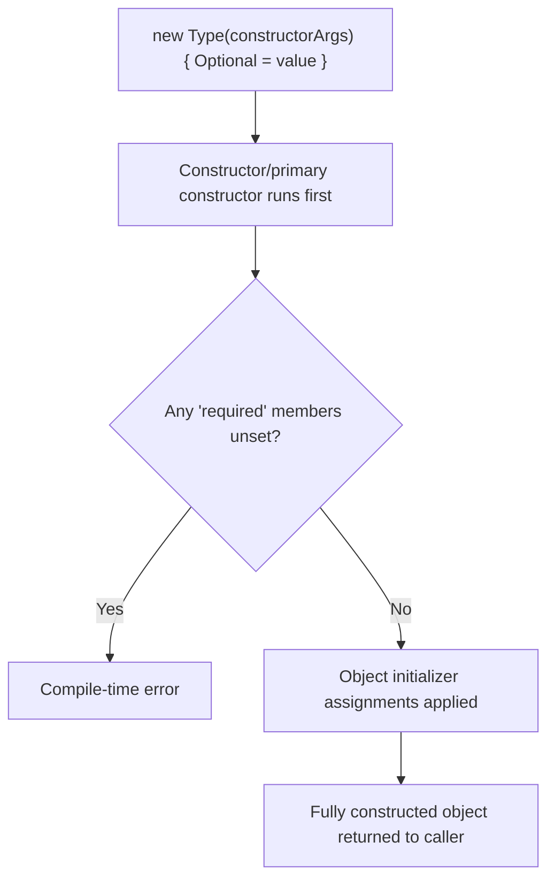
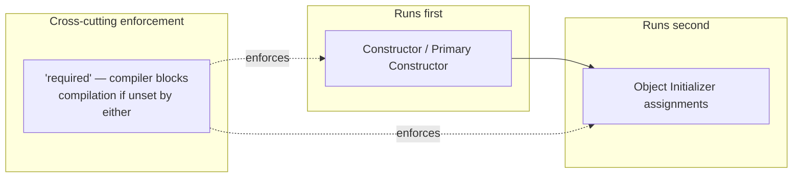

# Object Initialization Patterns

## Introduction

Before reading this lesson, you should already be comfortable with **[Local Functions](../02-oop/02-29-local-functions.md)**, plus everything Module 02 has built up so far: classes, constructors, `required` members, and primary constructors have each appeared individually in earlier lessons. This lesson is a consolidating stop: rather than teach a new syntax, it puts **constructors**, **object initializers**, **`required` members**, and **primary constructors** side by side, so you can recognize each on sight and make a deliberate choice about which one fits a given type.

By the end of this lesson, you will be able to:

- Recognize all four initialization styles at a glance: constructor, object initializer, `required` member, primary constructor
- Explain what problem each style was introduced to solve, in the order C# added them
- Combine styles correctly — for example, a constructor alongside an object initializer, or `required` properties alongside a primary constructor
- Choose the right initialization style (or combination) for a given type's validation and readability needs
- Avoid the common mistake of skipping a `required` member or assuming initializer order guarantees validation

## Object Initialization Patterns — A Layman's Perspective

Think about the different ways a piece of furniture can arrive at your home. Some furniture is fully assembled at the factory — a bed frame, say — and just needs to be positioned exactly once, fully formed from the moment it's carried through your door. That's like calling a **constructor**: everything the object needs is provided together, in one motion, before it's usable at all.

Other furniture — a bookshelf from a flat-pack retailer — comes with a base structure but genuinely optional add-ons you attach afterward, at your own pace: extra shelf pegs here, a decorative trim there, in whatever order suits you, each one snapping into a slot the shelf was already built with. That's an **object initializer**: the core object exists (constructed) and you're filling in additional details in a flexible, readable, one-item-at-a-time way after the fact — except that in C#, this all still happens in one atomic "assembly session" before anyone else gets to use the shelf.

Now imagine the delivery company has a strict rule: certain pieces are non-negotiable — a crib absolutely cannot leave the warehouse without its safety rail attached, no matter how the rest of the order is customized. That's a **required member**: a property so essential to the object being safe or meaningful to use that the compiler simply refuses to let the object leave the "warehouse" (compile) unless that piece was explicitly provided, regardless of which door (constructor or initializer) it went out through.

And finally, imagine some furniture is now sold as one all-in-one purchase where selecting the model number *at the point of purchase* already fixes several defining measurements at once — height, width, base color — because the manufacturer folded the "core specification" step directly into the order form, rather than making you separately confirm each measurement afterward. That's a **primary constructor**: the class declaration itself states the essential parameters up front, right where you declare the type, collapsing what used to be a separate constructor body into the class header.

None of these four approaches is universally "best" — a crib truly does need its non-negotiable safety rail; a decorative bookshelf trim genuinely can be optional and added flexibly; a simple all-in-one product benefits from folding its core spec into the purchase step itself. The skill this lesson builds is recognizing which situation you're in, so you reach for the initialization style that actually matches what your object needs to guarantee.

The bridge back to programming: constructors guarantee an object arrives fully formed in one motion; object initializers let you set additional properties flexibly and readably right after; `required` members force certain properties to be set no matter which path is used; and primary constructors fold a class's essential parameters directly into its declaration.

## Object Initialization Patterns — A Programming Language Perspective

C# offers four complementary mechanisms for bringing an object into existence with its initial state. A **constructor** is a method matching the type's name, run exactly once at creation, guaranteeing that any logic it contains (validation, computed defaults) executes before the object is usable. An **object initializer** (`new Type { Prop = value, ... }`) sets accessible settable or `init`-only properties after the constructor runs but before any other code can observe the instance, compiling down to a sequence of assignments the compiler guarantees happen atomically from the caller's perspective. A **`required` member** (C# 11) is a property or field marked `required`, which the compiler enforces must be assigned via object initializer syntax (or a constructor annotated with `[SetsRequiredMembers]`) at every construction site, regardless of the member's own accessibility. A **primary constructor** (parameters added directly to a `class`/`struct`/`record` declaration, C# 12 for classes/structs, since C# 9 for positional records) folds parameter declaration directly into the type header, making those parameters available throughout the class body and, for `record` types, automatically synthesizing corresponding `init` properties. These four are not mutually exclusive — a single type routinely combines a primary constructor for its essential fields, `required` properties for mandatory extras that don't fit the constructor's shape, and an object initializer for optional ones.

## How to Combine Initialization Styles in C#

A well-designed type typically layers these techniques: a constructor (or primary constructor) enforces what's truly non-negotiable at creation time, `required` catches mandatory properties that don't naturally fit constructor parameters, and an object initializer handles genuinely optional extras — all resolved by the compiler before any other code can see a half-built object.


*Figure 1: Construction order — constructor first, then a compiler check for required members, then initializer assignments, all before the caller ever sees the object.*

```csharp
// Program.cs — .NET 10 / C# 14
public class Employee
{
    public string Name { get; }
    public required string Department { get; init; }
    public string? Manager { get; init; }

    public Employee(string name)
    {
        Name = name;
    }
}

// Primary constructor version of the same essential shape, for comparison.
public class EmployeeRecordStyle(string name)
{
    public string Name { get; } = name;
    public required string Department { get; init; }
    public string? Manager { get; init; }
}

var e1 = new Employee("Farah Nasser") { Department = "Engineering", Manager = "Priya Shah" };
var e2 = new EmployeeRecordStyle("Tom Baker") { Department = "Sales" };

Console.WriteLine($"{e1.Name} — {e1.Department} (manager: {e1.Manager})");
Console.WriteLine($"{e2.Name} — {e2.Department} (manager: {e2.Manager ?? "none"})");
```

**Console Output:**

```text
Farah Nasser — Engineering (manager: Priya Shah)
Tom Baker — Sales (manager: none)
```

`Employee` uses a traditional constructor for `Name` (always required, always the same shape) and `required` plus `init` for `Department` (mandatory, but naturally set through the initializer rather than the constructor's parameter list). Leaving out `Department` at either construction site would be a compile-time error, not a runtime surprise. `EmployeeRecordStyle` shows the primary-constructor equivalent: `name` is folded directly into the class header instead of a separately written constructor body, while `Department` still uses `required` — proving the two techniques compose rather than compete.

## Real-Time Example: Object Initialization Patterns in Banking/ATM

We continue building on the Banking/ATM case study's `Account` type. Opening a new account has one truly non-negotiable piece of data (the owner's name, provided through a primary constructor) plus one mandatory compliance field that doesn't belong in the constructor's parameter list (`NationalIdLast4`, enforced with `required`) plus genuinely optional details (a nickname for the account) set through an object initializer.

```csharp
// Program.cs — .NET 10 / C# 14 — Real-Time Example
public class Account(string owner, decimal openingBalance)
{
    public string Owner { get; } = owner;
    public decimal Balance { get; private set; } = openingBalance;

    // Mandatory for compliance, but doesn't fit naturally as a constructor parameter
    // alongside the account's core identity — enforced instead via 'required'.
    public required string NationalIdLast4 { get; init; }

    // Genuinely optional — most accounts never set this.
    public string? Nickname { get; init; }

    public void Deposit(decimal amount) => Balance += amount;

    public override string ToString() =>
        $"{Nickname ?? Owner} (ID ***{NationalIdLast4}) — Balance: {Balance:C}";
}

var checking = new Account("Wen Zhao", 1_500m)
{
    NationalIdLast4 = "4821",
    Nickname = "Household Checking"
};

var savings = new Account("Wen Zhao", 10_000m)
{
    NationalIdLast4 = "4821"
};

checking.Deposit(250m);

Console.WriteLine(checking);
Console.WriteLine(savings);
```

**Console Output:**

```text
Household Checking (ID ***4821) — Balance: $1,750.00
Wen Zhao (ID ***4821) — Balance: $10,000.00
```

`owner` and `openingBalance` arrive through the primary constructor because every account fundamentally needs them from the first instant it exists. `NationalIdLast4` is marked `required` rather than folded into the primary constructor because it's a compliance concern layered on top of the account's core identity — the compiler still refuses to compile either `new Account(...)` call above if it's omitted, exactly as strictly as a constructor parameter would, just expressed through the initializer instead. `Nickname` remains genuinely optional, defaulting to `null` and falling back to `Owner` in `ToString` — precisely the kind of detail that shouldn't force every caller to type an extra argument just to skip it.

## Constructors vs Object Initializers vs Required Members vs Primary Constructors

The four styles differ mainly in *when* they run relative to each other and *how strongly* they can be enforced. Constructors and primary constructors both run first and can contain validation logic; plain object initializer assignments run after and cannot contain arbitrary logic beyond the property's own `init` accessor body. `required` is not really a separate initialization mechanism so much as a *compiler-enforced obligation* layered onto whichever mechanism sets that property — it just guarantees the property can't be silently skipped, no matter which style is otherwise used.


*Figure 2: Constructors run before initializers; `required` is an enforcement rule layered across both.*

| Aspect | Constructor | Object Initializer | `required` Member | Primary Constructor |
|---|---|---|---|---|
| When it runs | First, at creation | Immediately after the constructor | N/A — a compile-time obligation | First, folded into the type header |
| Can contain validation logic | Yes | Only via the property's own `init` accessor | No (it's a constraint, not logic) | Yes, within the class body |
| Enforced by compiler if omitted | Yes (missing constructor args) | No (properties can be skipped unless `required`) | Yes — compile error if unset | Yes (missing constructor args) |
| Best for | Core, always-needed state | Optional, flexible extras | Mandatory extras that don't fit the constructor | Concise, essential state for simple types |

## Types/Variants of Object Initialization in C#

Each style above is covered in more depth in its own dedicated lesson earlier in this module:

1. **[Constructors in C#](../02-oop/02-02-constructors-in-csharp.md)** — the foundational, always-available initialization mechanism, including primary constructor syntax.
2. **[`required` Members and Object Initializers](../02-oop/02-22-required-members-object-initializers.md)** — a closer look at the flexible, post-construction assignment style and the compiler-enforced obligation layered over it.
3. **[Records in C#](../02-oop/02-19-records-in-csharp.md)** — combines a primary constructor with auto-generated `init` properties and value equality by default.
4. **[`record struct` and Value-Based Records](../02-oop/02-20-record-struct-value-based-records.md)** — the value-type sibling, initialized the same way.
5. **[`init`-Only Setters](../02-oop/02-32-init-only-setters.md)** — a focused look at the accessor that makes object initializers safe for immutable-by-default types.
6. **[Builder Pattern](../12-advanced-concepts/12-09-builder-pattern.md)** — a design pattern built entirely around staged, flexible object initialization *(optional 6th)*.

## What You've Learned & What's Next

Constructors guarantee an object's most essential state exists from the first instant it's usable; object initializers add flexible, readable, optional detail immediately afterward; `required` closes the gap by forcing certain properties to be set no matter which mechanism is used; and primary constructors fold essential parameters directly into a type's declaration for simple, concise types. Real-world classes routinely combine all four — the skill is matching each piece of state to the mechanism that best expresses how essential, optional, or enforceable it needs to be.

Continue your learning journey with **[Immutability in C#](../02-oop/02-31-immutability-in-csharp.md)**, where we build on `init`-only properties and these initialization patterns to design objects that can never change state after construction.

---
*Applies to: .NET 10 / C# 14. Last reviewed 2026-08-16.*
