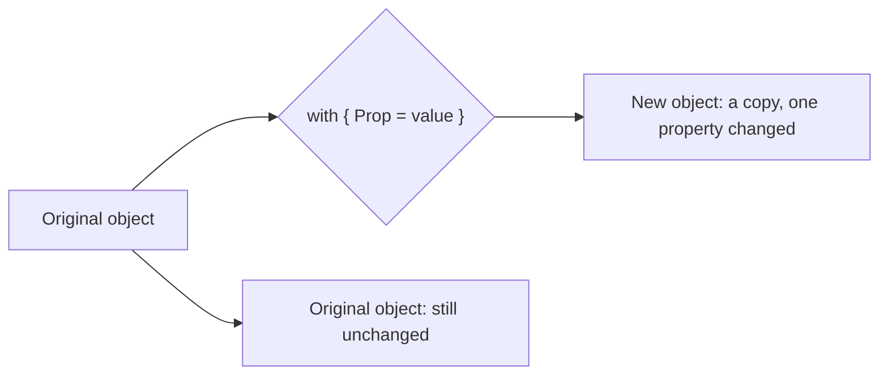
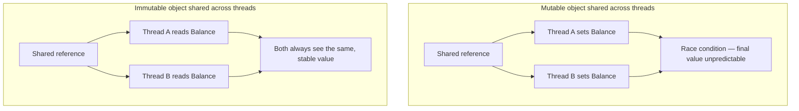

# Immutability in C#

## Introduction

Before reading this lesson, you should already be comfortable with **[Object Initialization Patterns](../02-oop/02-30-object-initialization-patterns.md)** — object initializers, factory methods, and fluent builders for constructing objects cleanly. This lesson shifts the question from *how do I build an object* to *what happens to it after it's built*: specifically, why so many well-designed C# types are deliberately built to never change once construction finishes, and the small toolkit of language features that make that possible.

By the end of this lesson, you will be able to:

- Explain why immutable objects eliminate whole categories of bugs around threading and shared state
- Tell the difference between a variable that is simply never reassigned and an object that is genuinely immutable
- Lock in an object's state permanently using `readonly` fields
- Produce a modified copy of an immutable object using a record type and a `with` expression, without mutating the original
- Recognize where `init` accessors fit into this toolkit, ahead of a full deep dive in the next lesson

## Immutability in C# — A Layman's Perspective

Think about the difference between a printed bank receipt and a running tab scribbled on a bar napkin. The napkin is deliberately informal — the bartender pencils in a drink, crosses out a mistake, adds another line, and by the end of the night it's been edited a dozen times. Nobody expects the napkin to be a permanent record; its whole purpose is to be changed in place as the evening goes on.

A printed receipt is a completely different kind of object. The moment it comes off the printer and is handed to you, it is done. If the cashier realizes afterward that they charged you for the wrong item, nobody hunts down your receipt and scratches out a number — that would destroy the one thing a receipt is for: being trustworthy proof of exactly what happened at that exact moment. Instead, they print a *new* document — a corrected receipt, or a refund slip — and hand you that instead. The original keeps existing, unaltered, as the historical record; the correction lives in a brand new piece of paper that happens to share almost everything with the original except the one line that was wrong.

This is precisely the distinction between mutable and immutable objects in software. A mutable object is the bar napkin — built to be scribbled on repeatedly as your program runs, which is fine for values that are genuinely transient and privately owned by one part of the code. An immutable object is the printed receipt — once it exists, it exists in that exact form forever, and "changing" it doesn't mean editing it, it means producing an entirely new receipt that mostly matches the old one.

Why insist on printed receipts instead of just letting the cashier annotate a running tab forever? Because the moment a piece of paper might be shared — copied to head office, handed to an auditor, filed for tax purposes, kept by three different people — allowing anyone to scribble on any copy at any time becomes chaos. Whose scribble is authoritative? What did it say five minutes ago? Did two people edit two different copies differently at the same instant? A printed receipt sidesteps every one of those questions by simply never changing after the fact. That is exactly why immutability matters most for objects that get shared — across threads, across method calls, across a whole system — rather than objects that live briefly and privately in one place.

The bridge back to programming: an immutable object, like a printed receipt, is finished the moment it's constructed. Any part of your program can hold a reference to it, read from it, hand it to another thread, or pass it into ten different methods, with an absolute guarantee that none of that reading will ever see it in a half-changed or inconsistent state — because there is no such thing as "changing" it. When a value genuinely needs to be different, the code produces a new object, the same way a cashier prints a new receipt, and the old one keeps sitting there as a stable, trustworthy fact about the past.

## Immutability in C# — A Programming Language Perspective

An object is **immutable** when none of its observable state can change after its constructor finishes running — every field that contributes to its public behavior is fixed for the object's entire lifetime. This is stronger than a `readonly` *local variable* or a `const`, which only prevent *reassigning a variable*; a variable can be marked never to point somewhere else while still referring to an object whose internal state keeps changing. True immutability is a property of the object, not the variable pointing at it.

C# provides several cooperating features for building immutable types: a `readonly` instance field can only be assigned inside a constructor (or as a field initializer), after which it is fixed for that instance's lifetime; `record` types (both `record class` and `record struct`) are designed around immutability by convention, pairing value-based equality with properties that are typically `init`-only; and the `with` expression (`instance with { Prop = newValue }`) performs a **non-destructive mutation** — it copies the entire instance and applies only the changes you specify, leaving the original completely untouched. The `init` accessor, previewed here and covered in full next lesson, is the mechanism that makes a property settable during object-initializer syntax while remaining permanently locked afterward.

## How to Build Immutable Types in C#

The simplest form of immutability is a `readonly` field: assign it once, in the constructor, and the compiler refuses to compile any later assignment to it from outside that constructor. Records go further, generating an entire immutable value type — constructor, properties, equality, and a `ToString()` override — from a single declaration, and pairing naturally with the `with` expression whenever you need something that looks like "the same object, but different in one respect."


*Figure 1: A `with` expression copies an immutable object, changing only the specified properties, and never touches the original.*

```csharp
// Program.cs — .NET 10 / C# 14

var snapshot = new BalanceSnapshot("ACC-1001", 500.00m);
Console.WriteLine($"Snapshot: {snapshot}");

var afterDeposit = snapshot with { Balance = 650.00m };
Console.WriteLine($"After deposit: {afterDeposit}");
Console.WriteLine($"Original snapshot unchanged: {snapshot}");

var entry = new AuditEntry("Deposit", new DateOnly(2026, 8, 16));
Console.WriteLine(entry);

record BalanceSnapshot(string AccountNumber, decimal Balance);

class AuditEntry
{
    public readonly string Action;
    public readonly DateOnly Date;

    public AuditEntry(string action, DateOnly date)
    {
        Action = action;
        Date = date;
    }

    public override string ToString() => $"[{Date:yyyy-MM-dd}] {Action}";
}
```

**Console Output:**

```text
Snapshot: BalanceSnapshot { AccountNumber = ACC-1001, Balance = 500.00 }
After deposit: BalanceSnapshot { AccountNumber = ACC-1001, Balance = 650.00 }
Original snapshot unchanged: BalanceSnapshot { AccountNumber = ACC-1001, Balance = 500.00 }
[2026-08-16] Deposit
```

`BalanceSnapshot` is a record, so its two properties are `init`-only by default — nothing in the program above could reassign `snapshot.Balance` even if it tried. `snapshot with { Balance = 650.00m }` doesn't touch `snapshot` at all; it builds an entirely new `BalanceSnapshot`, copies `AccountNumber` across unchanged, and substitutes the new `Balance` — which is exactly why the third line still prints the original 500.00. `AuditEntry` shows the more manual route: two `readonly` fields, assignable only inside the constructor, achieving the same guarantee by hand for a type that doesn't need everything a record provides.

## Real-Time Example: Immutability in Banking/ATM Transaction Ledgers

We continue the Banking/ATM case study, this time modeling the transaction ledger an ATM and a bank's backend both read from. Every `Transaction` is an immutable record; when a teller discovers that a transaction was entered with the wrong amount, the fix is never to mutate the existing entry — it's to produce a corrected copy, exactly like reissuing a receipt, while the original stays intact as the audit trail.

```csharp
// Program.cs — .NET 10 / C# 14 — Real-Time Example
// Continuing the Banking/ATM case study: an immutable transaction ledger.

var ledger = new List<Transaction>
{
    new("TXN-5001", TransactionType.Deposit, 1000.00m, new DateOnly(2026, 8, 10)),
    new("TXN-5002", TransactionType.Withdrawal, 250.00m, new DateOnly(2026, 8, 12)),
    new("TXN-5003", TransactionType.Withdrawal, 40.00m, new DateOnly(2026, 8, 14)),
};

Console.WriteLine("Original ledger:");
PrintLedger(ledger);
Console.WriteLine($"Balance: {CalculateBalance(ledger):C}");

// The ATM receipt for TXN-5003 shows 400.00, not 40.00. A Transaction record
// cannot be edited in place — `with` produces a corrected copy instead.
Transaction corrected = ledger[2] with { Amount = 400.00m };
var correctedLedger = new List<Transaction>(ledger) { [2] = corrected };

Console.WriteLine();
Console.WriteLine("Corrected ledger (a new list — the original above is untouched):");
PrintLedger(correctedLedger);
Console.WriteLine($"Balance: {CalculateBalance(correctedLedger):C}");

Console.WriteLine();
Console.WriteLine($"Original TXN-5003 still reads: {ledger[2].Amount:C}");

static void PrintLedger(IReadOnlyList<Transaction> transactions)
{
    foreach (Transaction t in transactions)
    {
        Console.WriteLine($"  {t.TransactionId} | {t.Type,-10} | {t.Amount,10:C} | {t.PostedOn}");
    }
}

static decimal CalculateBalance(IReadOnlyList<Transaction> transactions)
{
    decimal balance = 0m;
    foreach (Transaction t in transactions)
    {
        balance += t.Type == TransactionType.Deposit ? t.Amount : -t.Amount;
    }
    return balance;
}

enum TransactionType { Deposit, Withdrawal }

record Transaction(string TransactionId, TransactionType Type, decimal Amount, DateOnly PostedOn);
```

**Console Output:**

```text
Original ledger:
  TXN-5001 | Deposit    |  $1,000.00 | 8/10/2026
  TXN-5002 | Withdrawal |    $250.00 | 8/12/2026
  TXN-5003 | Withdrawal |     $40.00 | 8/14/2026
Balance: $710.00

Corrected ledger (a new list — the original above is untouched):
  TXN-5001 | Deposit    |  $1,000.00 | 8/10/2026
  TXN-5002 | Withdrawal |    $250.00 | 8/12/2026
  TXN-5003 | Withdrawal |    $400.00 | 8/14/2026
Balance: $350.00

Original TXN-5003 still reads: $40.00
```

Notice that fixing the ledger never involved mutating `TXN-5003` in place — `ledger` and `correctedLedger` are two different lists holding two different (but mostly identical) `Transaction` instances. This is exactly the guarantee a real banking system needs: dozens of ATMs and backend services can hold references to the same `Transaction` objects and read them concurrently without a single lock, because nothing can ever change underneath them. If a correction is needed, it produces a new fact rather than silently rewriting history — which is also precisely what an auditor expects a financial ledger to do.

## Immutable vs Mutable Objects

A mutable object is the right tool when state is private, short-lived, and never shared across concurrent contexts — a loop counter, a `StringBuilder` accumulating output, a temporary buffer. The moment an object might be read by more than one thread, cached and reused, or handed out as a "fact" other code will rely on later, mutability turns into a liability: every reader has to worry about whether the object might change mid-read, and every writer has to coordinate with every other potential writer.


*Figure 2: Sharing a mutable object across threads invites race conditions; sharing an immutable one is always safe because nothing can change underneath a reader.*

| Aspect | Mutable Object | Immutable Object |
|---|---|---|
| State after construction | Can change via setters or methods | Fixed permanently |
| Thread safety | Needs locks/synchronization to share safely | Safe to share across threads with zero locking |
| Equality over time | The same reference may look different later | Never changes, so equality is always stable |
| "Changing" a value | Mutate the existing instance | Construct a new instance (e.g., via `with`) |
| Typical C# tools | Public setters, mutable fields | `readonly` fields, `init` accessors, records, `with` |

## Types of Immutability-Related Constructs in C#

Immutability isn't one keyword — it's a small family of cooperating language features, several with their own dedicated lessons:

1. **[Constants and `readonly` Fields](../01-fundamentals/01-23-constants-and-readonly.md)** — the most basic building block: a field that can only be assigned once, at construction time.
2. **[`init`-Only Setters](../02-oop/02-32-init-only-setters.md)** — the very next lesson, covering the accessor that makes object-initializer syntax and permanent immutability compatible.
3. **[Records in C# (`record class`)](../02-oop/02-19-records-in-csharp.md)** — reference types built around immutability and value equality by default.
4. **[`record struct` and Value-Based Records](../02-oop/02-20-record-struct-value-based-records.md)** — the value-type counterpart, immutable by default when declared without mutable accessors.
5. **[`required` Members and Object Initializers](../02-oop/02-22-required-members-object-initializers.md)** — how to demand that immutable properties are set before an object is considered valid.
6. **[Immutable Collections (`ImmutableList<T>`, etc.)](../03-collections-generics/03-11-immutable-collections.md)** — extending the same idea from single objects to entire collections.

## What You've Learned & What's Next

Immutability means an object's state is fixed the moment construction finishes — "changing" it means producing a new object, not editing the existing one — and that single guarantee is what makes shared objects safe to read from multiple threads without locks, and safe to trust as a stable record of a fact. `readonly` fields, records, and `with` expressions are the toolkit that make this practical instead of tedious, and every one of them relies on `init` accessors working correctly under the hood.

Continue your learning journey with **[`init`-Only Setters](../02-oop/02-32-init-only-setters.md)**, where we open up exactly how the `init` accessor works and how it lets a property be set only during initialization.

---
*Applies to: .NET 10 / C# 14. Last reviewed 2026-08-16.*
