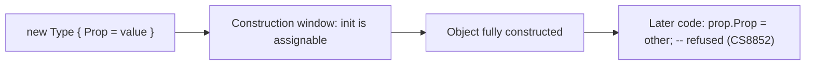
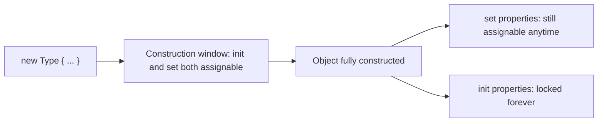

# init-Only Setters

## Introduction

Before reading this lesson, you should already be comfortable with **[Immutability in C#](../02-oop/02-31-immutability-in-csharp.md)** — why locking down an object's state after construction eliminates whole categories of bugs. That lesson previewed `init` as one of the tools that makes immutability practical; this lesson opens it up fully: the exact accessor syntax, precisely when it allows an assignment and when it refuses one, and how it composes with `required` from a few lessons back to give you types that are both mandatory to configure and permanently locked once configured.

By the end of this lesson, you will be able to:

- Declare a property with an `init` accessor instead of a `set` accessor
- Explain exactly when the compiler allows an assignment to an `init` property, and when it produces a compile-time error
- Combine `init` with `required` so a property must be supplied by the caller, then can never change again
- Recognize that a record's positional properties are `init`-only by default
- Choose between `init`, `set`, and a plain `readonly` field for a given property

## init-Only Setters — A Layman's Perspective

Picture ordering a custom-built bicycle at a specialty bike shop. When you walk up to the counter to place the order, the clerk hands you a configuration form: frame size, frame color, number of gears, handlebar style. This is your window to specify exactly what you want, and the shop is happy to let you fill in as many fields as you like, in whatever order you like, all in one sitting. That configuration window is wide open — for now.

Once you sign the form and the shop starts building your bike, that window closes. A week later, when you come to pick up your finished bicycle, you cannot call the shop and say "actually, make the frame blue instead of red." The bike has already been built to the specification you gave at the counter; changing it now would mean building an entirely different bike, not editing this one. Compare that to a bike with swappable, screw-in accessories — a water bottle cage, a bell — which the shop, or you, can change at absolutely any time, before pickup or five years later. And compare it again to a fully assembled bike bought straight off a showroom floor, where you never had a configuration window at all — you simply take whatever the manufacturer already built.

Three different bicycles, three different rules about when their features can be set: the showroom bike's specs were fixed before you ever touched it; the custom bike's specs were open only during the ordering conversation at the counter, then locked forever; and the accessories can be swapped whenever you like, indefinitely. Software properties work exactly the same way, and C#'s `init` accessor is built specifically to describe that middle case — the custom bike. It's not "always open" like a screw-in accessory, and it's not "never open to you" like a showroom bike's fixed specs. It's open for exactly one window — the moment of construction, while you're at the counter filling in the order form — and locked the instant that window closes.

The bridge back to programming: an `init` accessor lets a property be assigned only while an object is being constructed — inside its constructor, or inside the curly braces of an object initializer immediately following `new`. The moment that single construction step finishes, the property behaves like it has no setter at all. That's the deliberate middle ground `init` occupies: friendlier than a constructor parameter list for callers who want to use named, self-documenting initializer syntax, but every bit as permanent as a `readonly` field once the object exists.

## init-Only Setters — A Programming Language Perspective

The `init` accessor is a property accessor, declared in place of `set` (e.g., `public string Title { get; init; }`), that restricts assignment to the object-construction context: inside the containing type's own constructors, or inside an object-initializer block (`new Type { Title = "..." }`) evaluated immediately after the constructor runs. Any attempt to assign the property from outside that window — a later statement, a different method, another type entirely — is a compile-time error (CS8852), not a runtime one. Under the hood, the compiler marks the backing setter with `modreq(IsExternalInit)` in metadata, which is what legacy compilers and reflection-unaware code correctly interpret as "not assignable after construction." `init` composes directly with `required` (introduced in C# 11): a `required` property forces every caller to supply a value through object-initializer syntax, and pairing it with `init` guarantees that value, once supplied, can never be replaced. Records generate `init` accessors automatically for their positional properties, which is why records are immutable by default without any extra keywords.

## How to Declare init-Only Properties in C#

Declaring an `init` property looks identical to a normal auto-property, except `set` is replaced with `init`. You can then construct the object using ordinary object-initializer syntax — `new Type { PropertyA = x, PropertyB = y }` — exactly as you would with a mutable property. The difference only shows up afterward: the compiler statically refuses any later assignment, wherever it's attempted, rather than allowing it and failing at runtime.


*Figure 1: `init` accepts assignment only during the construction window; any later assignment is a compile-time error, not a runtime one.*

```csharp
// Program.cs — .NET 10 / C# 14

var book = new CatalogEntry
{
    Isbn = "978-0-13-468599-1",
    Title = "The Pragmatic Programmer",
    Copies = 3
};

Console.WriteLine(book);

// The next line does not compile if uncommented:
// book.Copies = 5; // CS8852: init-only property can only be assigned
//                  // in an object initializer or constructor.

var restocked = book with { Copies = book.Copies + 2 };
Console.WriteLine(restocked);

record CatalogEntry
{
    public required string Isbn { get; init; }
    public required string Title { get; init; }
    public int Copies { get; init; }

    public override string ToString() =>
        $"{Title} ({Isbn}) — {Copies} cop{(Copies == 1 ? "y" : "ies")} in stock";
}
```

**Console Output:**

```text
The Pragmatic Programmer (978-0-13-468599-1) — 3 copies in stock
The Pragmatic Programmer (978-0-13-468599-1) — 5 copies in stock
```

`Isbn` and `Title` are marked `required`, so the object initializer must supply them — omitting either is a compile-time error, not a runtime `null`. All three properties use `init`, so once `book` exists, none of them can be reassigned; the commented-out line shows exactly the error the compiler would raise if you tried. To "restock" the book, the code doesn't touch `book` at all — it uses the `with` expression from the previous lesson to build `restocked`, a new `CatalogEntry` with two copies added, leaving the original untouched.

## Real-Time Example: init-Only Setters in Library/Inventory Management

We continue the Library/Inventory Management case study with a `Book` type that mixes both worlds deliberately: its bibliographic identity — ISBN, title, author — is `required` and `init`-only, because those facts about a physical or catalog book never legitimately change after it's cataloged. Its `AvailableCopies` count, by contrast, is a perfectly ordinary mutable `{ get; set; }` property, because how many copies are currently on the shelf is genuinely operational data that changes every time a book is borrowed or returned.

```csharp
// Program.cs — .NET 10 / C# 14 — Real-Time Example
// Continuing the Library/Inventory Management case study.

var catalog = new List<Book>
{
    new Book { Isbn = "978-0-13-468599-1", Title = "The Pragmatic Programmer", Author = "Hunt & Thomas", AvailableCopies = 2 },
    new Book { Isbn = "978-1-59327-584-6", Title = "Eloquent JavaScript", Author = "Marijn Haverbeke", AvailableCopies = 0 },
};

PrintCatalog(catalog);

Console.WriteLine();
Console.WriteLine("Processing: 'The Pragmatic Programmer' is returned...");
BorrowOrReturn(catalog[0], returned: true);

Console.WriteLine("Processing: 'Eloquent JavaScript' has a copy returned...");
BorrowOrReturn(catalog[1], returned: true);

Console.WriteLine();
PrintCatalog(catalog);

static void BorrowOrReturn(Book book, bool returned)
{
    book.AvailableCopies += returned ? 1 : -1;
}

static void PrintCatalog(IEnumerable<Book> books)
{
    Console.WriteLine("Catalog:");
    foreach (var book in books)
    {
        Console.WriteLine($"  {book}");
    }
}

class Book
{
    public required string Isbn { get; init; }
    public required string Title { get; init; }
    public required string Author { get; init; }
    public int AvailableCopies { get; set; }

    public override string ToString() =>
        $"{Title} by {Author} ({Isbn}) — {AvailableCopies} available";
}
```

**Console Output:**

```text
Catalog:
  The Pragmatic Programmer by Hunt & Thomas (978-0-13-468599-1) — 2 available
  Eloquent JavaScript by Marijn Haverbeke (978-1-59327-584-6) — 0 available

Processing: 'The Pragmatic Programmer' is returned...
Processing: 'Eloquent JavaScript' has a copy returned...

Catalog:
  The Pragmatic Programmer by Hunt & Thomas (978-0-13-468599-1) — 3 available
  Eloquent JavaScript by Marijn Haverbeke (978-1-59327-584-6) — 1 available
```

`BorrowOrReturn` freely mutates `AvailableCopies` — and it should, since real copies really do get borrowed and returned all day. But nothing in this program, or anywhere else that references a `Book`, can ever accidentally reassign its `Isbn`, `Title`, or `Author` — the compiler enforces that at every call site, not just by convention. That's the practical value of `init`: it lets you be selective, locking down identity fields while leaving genuinely operational fields free to change, in the very same type.

## `init` vs `set` Accessors

A `set` accessor is the right choice for state that legitimately changes throughout an object's lifetime — a shopping cart's item count, a bank account's balance, a book's available-copy count. An `init` accessor is the right choice for state that should be supplied once, at construction, and never again — an identifier, a creation timestamp, a fact that defines what the object fundamentally *is* rather than what condition it's currently *in*. Reaching for `init` by default on identity-shaped properties, and `set` only where mutation is a genuine business requirement, is what keeps a type's "always true" facts separate from its "can change" facts.


*Figure 2: After construction, `set` properties remain assignable for the object's whole lifetime, while `init` properties are permanently locked.*

| Aspect | `set` | `init` |
|---|---|---|
| When assignable | Any time, from any code with access | Only inside a constructor or object initializer |
| Typical purpose | Genuinely mutable state | Immutable state that's still initializer-friendly |
| Pairs with `required`? | Legal, but rarely useful — "must set now, can still change later" | The most common real pairing — "must set once, can never change again" |
| Assignment outside the window | Always compiles | Compile-time error CS8852 |

## Types Related to init-Only Setters

`init` doesn't work in isolation — it's most useful alongside a handful of closely related features:

1. **[Records in C# (`record class`)](../02-oop/02-19-records-in-csharp.md)** — generate `init`-only positional properties automatically, with no extra keywords needed.
2. **[`required` Members and Object Initializers](../02-oop/02-22-required-members-object-initializers.md)** — the feature that pairs most naturally with `init`, forcing callers to supply a value exactly once.
3. **[Immutability in C#](../02-oop/02-31-immutability-in-csharp.md)** — the broader design goal `init` exists to serve.
4. **[Constructors in C#](../02-oop/02-02-constructors-in-csharp.md)** — the other way to guarantee a property is set exactly once, without object-initializer syntax at all.
5. **[Object Initialization Patterns](../02-oop/02-30-object-initialization-patterns.md)** — the broader set of construction techniques `init` slots into.
6. **[Equality: Equals, ==, and IEquatable\<T\>](../02-oop/02-33-equality-equals-iequatable.md)** — up next: how the immutable state `init` protects is compared for equality.

## What You've Learned & What's Next

`init` gives a property exactly one window in which it can be assigned — the moment an object is constructed — and refuses every assignment attempted after that, at compile time rather than at runtime. Paired with `required`, it produces properties that must be supplied by every caller and can never be changed again, which is precisely the shape most identity data — an ISBN, an account number, an order ID — should take. Records lean on this pattern so heavily that they generate it for you automatically.

Continue your learning journey with **[Equality: Equals, ==, and IEquatable\<T\>](../02-oop/02-33-equality-equals-iequatable.md)**, where we look at how C# decides whether two objects — including the immutable ones you now know how to build — actually count as "equal."

---
*Applies to: .NET 10 / C# 14. Last reviewed 2026-08-16.*
