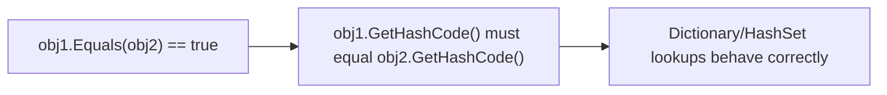
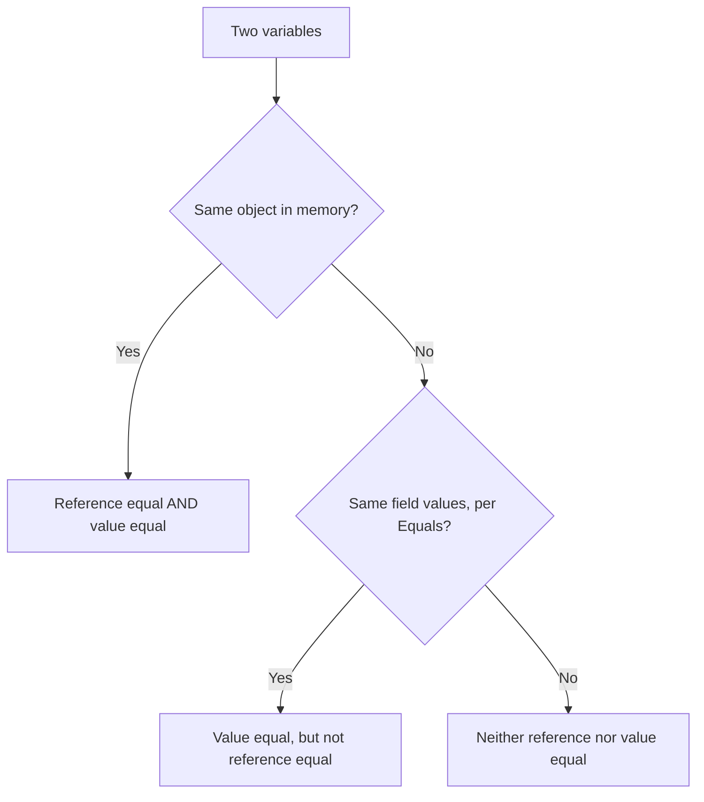

# Equality: Equals, ==, and IEquatable<T>

## Introduction

Before reading this lesson, you should already be comfortable with **[init-Only Setters](../02-oop/02-32-init-only-setters.md)** — how to lock an object's state after construction. Immutable objects are compared for equality constantly — checking whether a shopping cart already contains a product, whether two accounts refer to the same customer, whether a cache already holds a value — so this lesson tackles a question C# answers differently depending on how you ask it: when are two objects actually "equal"?

By the end of this lesson, you will be able to:

- Distinguish reference equality ("the exact same object") from value equality ("the same data")
- Explain what `==` and `.Equals()` do by default for classes, and why that default is rarely what a business type needs
- Override `Equals` and `GetHashCode` correctly, respecting the contract that connects them
- Implement `IEquatable<T>` for strongly-typed, allocation-free equality checks
- Explain why `record` types get all of this "for free"

## Equality — A Layman's Perspective

Picture identical twins, dressed in matching outfits their mother picked out for a family photo. Ask any question about *what* they look like — hair color, height, the pattern on their shirts — and the answer is the same for both. In every meaningful sense of "the same," they are the same. But ask a different question — "is this the exact person I spoke to five minutes ago?" — and the answer depends entirely on which twin is standing in front of you right now. They are two distinct individuals who happen to match perfectly, not one person appearing twice.

Now picture a ten-dollar bill in your wallet, and a different ten-dollar bill in a friend's wallet. Ask "are these worth the same amount?" and the answer is an unambiguous yes — a ten is a ten, no matter whose pocket it came from. But ask "is this the literal same physical piece of paper?" and the answer is just as unambiguously no — they have different serial numbers, different wear patterns, different histories. Two completely different physical objects, and yet, for the purpose that actually matters when you're paying for something, they are completely interchangeable.

These two questions — "is this literally the same one?" versus "does this represent the same thing?" — are asked constantly, about all sorts of objects, and the right answer depends entirely on which question you're actually trying to answer. If a librarian asks "is this the exact copy of the book Sarah checked out last week?", they mean the physical object, with its particular scuffed cover and that coffee stain on page 40 — a different, brand-new copy of the same title is not an acceptable answer. But if a customer at a store asks "does this shirt come in my size?", they don't care in the slightest which physical shirt off the rack you hand them — any shirt matching the same size and color is exactly what they mean by "this one."

Software objects raise the identical question every time you write code that compares two of them. Sometimes you genuinely need to know "is this the exact same object in memory as that one?" — perhaps you're checking whether two variables both point at a shared cache entry. Far more often, especially for the kind of data-carrying objects this module has spent so long building — an order, a product, a bank transaction — what you actually mean is the ten-dollar-bill question: "do these two represent the same data, regardless of whether they're literally the same object?" Getting this distinction wrong is a genuinely common source of bugs: code that treats two "equal" products as different because they happen to be two separate objects, or — just as bad — treats two objects as interchangeable when they were never meant to be.

The bridge back to programming: C# gives you a way to answer both questions precisely, and the rest of this lesson is about choosing the right one, and implementing "same data" correctly once you decide that's the question you're actually asking.

## Equality — A Programming Language Perspective

**Reference equality** asks whether two references point to the same object on the heap; **value equality** asks whether two objects' state is considered equivalent by some type-specific rule. By default, `class` types use reference equality for both `Equals(object)` (inherited from `System.Object`) and the `==` operator — two separately constructed instances with identical field values are *not* equal unless you say otherwise. `struct` types get a default *member-wise* value equality from `ValueType.Equals`, though it's reflection-based and comparatively slow. To get correct, fast value equality on a class, you override `Equals(object?)`, override `GetHashCode()` to match it exactly, and typically overload `==`/`!=` to match as well. `IEquatable<T>` adds a strongly-typed `Equals(T? other)` method, letting callers — and, critically, generic collections like `Dictionary<TKey,TValue>` and `HashSet<T>` — compare instances without boxing or a runtime type check. The non-negotiable contract: if `a.Equals(b)` is `true`, then `a.GetHashCode()` **must** equal `b.GetHashCode()`; violating this silently corrupts hash-based collections. `record` types generate all of this — `Equals`, `GetHashCode`, `==`, `!=`, and `IEquatable<T>` — automatically, based on every property, which is exactly why they're the default choice whenever value equality is what you actually want.

## How to Implement Equality Correctly in C#

Overriding `Equals` well means handling `null`, handling reference equality as a fast path, and comparing exactly the fields that define "sameness" for your type — not necessarily every field. `GetHashCode` must be derived from those same fields, using `HashCode.Combine` rather than hand-rolled bit-shuffling. Implementing `IEquatable<T>` alongside the override, and routing the `object` override through it, keeps both paths consistent by construction rather than by discipline.


*Figure 1: The equality contract — equal objects must produce equal hash codes, or hash-based collections silently misbehave.*

```csharp
// Program.cs — .NET 10 / C# 14

var p1 = new StockKeepingUnit("SKU-100", "Warehouse-A");
var p2 = new StockKeepingUnit("SKU-100", "Warehouse-A");
var p3 = new StockKeepingUnit("SKU-100", "Warehouse-B");

Console.WriteLine($"p1 == p2: {p1 == p2}");
Console.WriteLine($"p1.Equals(p2): {p1.Equals(p2)}");
Console.WriteLine($"p1 == p3: {p1 == p3}");
Console.WriteLine($"ReferenceEquals(p1, p2): {ReferenceEquals(p1, p2)}");

var lookup = new HashSet<StockKeepingUnit> { p1 };
Console.WriteLine($"lookup.Contains(p2): {lookup.Contains(p2)}");

class StockKeepingUnit : IEquatable<StockKeepingUnit>
{
    public string Code { get; }
    public string Location { get; }

    public StockKeepingUnit(string code, string location) => (Code, Location) = (code, location);

    public bool Equals(StockKeepingUnit? other)
    {
        if (other is null) return false;
        if (ReferenceEquals(this, other)) return true;
        return Code == other.Code && Location == other.Location;
    }

    public override bool Equals(object? obj) => Equals(obj as StockKeepingUnit);

    public override int GetHashCode() => HashCode.Combine(Code, Location);

    public static bool operator ==(StockKeepingUnit? left, StockKeepingUnit? right) => Equals(left, right);
    public static bool operator !=(StockKeepingUnit? left, StockKeepingUnit? right) => !Equals(left, right);
}
```

**Console Output:**

```text
p1 == p2: True
p1.Equals(p2): True
p1 == p3: False
ReferenceEquals(p1, p2): False
lookup.Contains(p2): True
```

`p1` and `p2` are two entirely separate objects — `ReferenceEquals` confirms that — yet `==` and `.Equals()` both report `True`, because `Equals` compares `Code` and `Location`, not object identity. `p3` shares the same `Code` but a different `Location`, so it correctly compares unequal. The `HashSet<StockKeepingUnit>` lookup is the payoff: because `GetHashCode` is derived from exactly the same fields as `Equals`, and `IEquatable<T>` lets the set skip boxing and reflection entirely, `lookup.Contains(p2)` correctly finds `p1` even though they're different objects.

## Real-Time Example: Equality in E-Commerce Order Processing

We continue the E-Commerce Order Processing case study with a cart-deduplication problem every online store faces: a customer might add "the same" product to their cart twice — once from a search result, once from a recommendation widget — as two entirely separate `Product` objects that both happen to describe SKU `SKU-2001`. Without a correct `Equals`/`GetHashCode`, the cart would treat them as two different line items instead of merging the quantity.

```csharp
// Program.cs — .NET 10 / C# 14 — Real-Time Example
// Continuing the E-Commerce Order Processing case study.

var scannedFromSearch = new Product("SKU-2001", "Wireless Mouse", 24.99m);
var scannedFromRecommendation = new Product("SKU-2001", "Wireless Mouse", 24.99m);
var keyboard = new Product("SKU-2002", "Mechanical Keyboard", 79.99m);

var cart = new Dictionary<Product, int>();

AddToCart(cart, scannedFromSearch, 1);
AddToCart(cart, keyboard, 1);
AddToCart(cart, scannedFromRecommendation, 2); // same SKU, different object reference

PrintCart(cart);

static void AddToCart(Dictionary<Product, int> cart, Product product, int quantity)
{
    cart[product] = cart.GetValueOrDefault(product) + quantity;
}

static void PrintCart(Dictionary<Product, int> cart)
{
    Console.WriteLine("Cart contents:");
    decimal total = 0m;
    foreach (var (product, quantity) in cart)
    {
        decimal lineTotal = product.Price * quantity;
        total += lineTotal;
        Console.WriteLine($"  {product.Name} (SKU {product.Sku}) x{quantity} = {lineTotal:C}");
    }
    Console.WriteLine($"Total: {total:C}");
    Console.WriteLine($"Distinct line items: {cart.Count}");
}

class Product : IEquatable<Product>
{
    public string Sku { get; }
    public string Name { get; }
    public decimal Price { get; }

    public Product(string sku, string name, decimal price) => (Sku, Name, Price) = (sku, name, price);

    // Equality is deliberately based on Sku alone: for cart-merging purposes,
    // two catalog entries with the same SKU are the same product, even if
    // Name or Price briefly differ during a catalog sync.
    public bool Equals(Product? other)
    {
        if (other is null) return false;
        if (ReferenceEquals(this, other)) return true;
        return Sku == other.Sku;
    }

    public override bool Equals(object? obj) => Equals(obj as Product);

    public override int GetHashCode() => Sku.GetHashCode();
}
```

**Console Output:**

```text
Cart contents:
  Wireless Mouse (SKU SKU-2001) x3 = $74.97
  Mechanical Keyboard (SKU SKU-2002) x1 = $79.99
Total: $154.96
Distinct line items: 2
```

Even though `scannedFromSearch` and `scannedFromRecommendation` are two separate `Product` objects, `AddToCart` correctly merges them into a single line item with quantity 3, because `Dictionary<Product,int>` uses `Product`'s `Equals`/`GetHashCode` to locate the existing key. Notice that equality here intentionally checks only `Sku` — not `Name` or `Price` — because business rules, not "compare every field," should decide what "the same product" means. Getting this wrong in either direction — comparing too many fields, or too few — is a real source of duplicate-cart and duplicate-order bugs in production e-commerce systems.

## Reference Equality vs Value Equality

Reference equality asks "are these the exact same object in memory?" and is what `class` types get by default — it's the right question for caches, singletons, and identity checks where you genuinely care about *which* object you're holding, not just what it contains. Value equality asks "do these two objects represent the same data?" and is what you almost always want for domain data like money, coordinates, product SKUs, or order IDs, where two separately constructed instances describing the same real-world fact should compare as equal.


*Figure 2: Reference equality and value equality ask different questions — two objects can be value-equal without ever being reference-equal.*

| Aspect | Reference Equality | Value Equality |
|---|---|---|
| Question asked | "Are these the exact same object?" | "Do these represent the same data?" |
| Default for | `class` types (unless overridden) | `struct` types (member-wise), `record` types |
| Checked via | `ReferenceEquals`, default `==` on a plain class | Overridden `Equals`/`==`, `IEquatable<T>` |
| Two separately-`new`'d, identical-data objects | Not equal | Equal |
| Typical use | Caching, singletons, identity checks | Money, coordinates, IDs, any domain value |

## Types Related to Equality in C#

Equality touches nearly every type-design decision in C#, and connects to several other lessons directly:

1. **[The `object` Class and Common Overrides](../02-oop/02-18-object-class-and-common-overrides.md)** — the base `Equals`, `GetHashCode`, and `ToString` this lesson builds directly on.
2. **[Records in C# (`record class`)](../02-oop/02-19-records-in-csharp.md)** — get correct value equality, `GetHashCode`, and `IEquatable<T>` generated automatically.
3. **[`record struct` and Value-Based Records](../02-oop/02-20-record-struct-value-based-records.md)** — the value-type equivalent, with the same generated equality.
4. **[`IComparable<T>` and `IComparer<T>`](../03-collections-generics/03-20-icomparable-and-icomparer.md)** — a related but distinct question: not "are these equal," but "which one comes first."
5. **[Operator Overloading in Depth](../02-oop/02-05-operator-overloading-in-depth.md)** — the mechanics behind overloading `==` and `!=` to match `Equals`.
6. **[Tuples, Deconstruction, and Pattern Matching](../01-fundamentals/01-25-tuples-deconstruction-pattern-matching.md)** — where you first saw structural equality, on tuples, before this lesson explained how it's actually implemented.

## What You've Learned & What's Next

Reference equality and value equality answer two genuinely different questions, and a `class`'s default behavior — reference equality — is very often not the answer your domain data needs. Overriding `Equals` and `GetHashCode` together, correctly, and implementing `IEquatable<T>` for a fast, strongly-typed path, is how you get value equality right by hand; records get you there automatically, which is why they're usually the better choice whenever a type's whole job is to represent a value.

Continue your learning journey with **[Introduction to SOLID Principles](../02-oop/02-34-introduction-to-solid-principles.md)**, where Module 02 zooms out from individual type mechanics to the design principles that guide how types and classes relate to each other.

---
*Applies to: .NET 10 / C# 14. Last reviewed 2026-08-16.*
