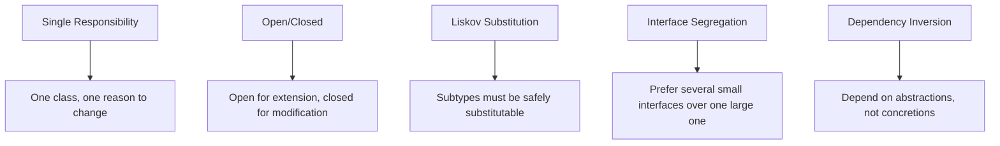
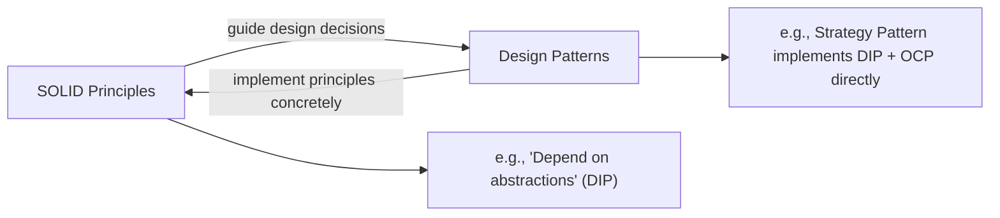

# Introduction to SOLID Principles

## Introduction

Before reading this lesson, you should already be comfortable with **[Equality: Equals, ==, and IEquatable<T>](../02-oop/02-33-equality-equals-iequatable.md)** and, more broadly, with everything Module 02 has covered so far about designing individual classes, records, and interfaces well. This lesson zooms out from a single type's mechanics to a bigger question: how should types and classes relate to *each other* in a well-designed program? SOLID is an acronym for five such guidelines. **This lesson is an overview only** — each principle gets one or two paragraphs and a small illustrative example here. The full deep dive, with deliberate "before" violations refactored step by step into "after" fixes, lives in **Module 12: Advanced Concepts**, lessons 12-01 through 12-05.

By the end of this lesson, you will be able to:

- Name all five SOLID principles and, in one sentence each, what problem each one guards against
- Recognize, informally, when a class is doing too much or when code depends on something too concrete
- Understand that SOLID principles are guidelines about relationships between types, not new C# syntax to memorize
- See a small, working example that touches all five principles in one compact program
- Know exactly where to go for the full before/after refactor treatment of each principle

## SOLID Principles — A Layman's Perspective

Picture a well-run restaurant kitchen during the dinner rush. At the grill station stands a chef who does exactly one job: cook whatever needs grilling, and nothing else. That chef doesn't also plate desserts, doesn't also answer the phone for reservations, doesn't also manage inventory orders — one station, one responsibility, so that a change to the dessert menu never means retraining, or even talking to, the grill chef at all. That's the entire idea behind the first principle: give each part of a system exactly one job, so a change to one job never ripples into another.

Now suppose the restaurant wants to add a new seasonal dish to the menu. A well-designed kitchen handles that by adding a new recipe card and briefing the relevant station — nobody rewrites the existing menu, retrains every chef, or reworks the whole kitchen layout just to introduce one new dish. The kitchen is *open* to new dishes being added, while everything already working stays *closed*, untouched, undisturbed.

Consider what happens when the head chef calls in sick and a trained sous-chef steps in to run the pass. If the kitchen is well-run, service continues exactly as expected — orders still go out, timing still works, nobody has to redesign the workflow just because a different qualified person is standing in that role today. Any properly trained substitute should be able to fill in without breaking anything, precisely because they're expected to honor the same responsibilities as whoever they're replacing.

Think, too, about the equipment list handed to each station. The pastry station's checklist lists piping bags, a stand mixer, cooling racks — it does not also list a meat cleaver and a fish scaler, because those tools belong to a completely different station and have nothing to do with pastry work. Handing every station the exact same enormous master equipment list, most of which they'll never touch, only creates confusion about what each role actually needs.

Finally, consider how the head chef assigns the grill station itself. The nightly schedule doesn't say "call Marcus specifically" — it says "whoever is scheduled for grill tonight." The kitchen depends on the *role* — a qualified grill cook — not on one named individual, which is exactly why the kitchen keeps running smoothly no matter who's actually staffing that station on a given night.

The bridge back to programming: a class should have one job, like the grill chef; a system should welcome new behavior through addition, not rewriting; a substitute type should honor its predecessor's contract completely; an interface should offer only what a specific role actually needs; and higher-level code should depend on a role — an abstraction — rather than one specific, named implementation. Those five ideas are exactly SRP, OCP, LSP, ISP, and DIP.

## SOLID Principles — A Programming Language Perspective

**SOLID** is a set of five object-oriented design principles, popularized by Robert C. Martin, describing how classes and interfaces should relate to one another to stay maintainable as a codebase grows. They are heuristics, not compiler-enforced rules — nothing stops you from violating any of them, but violating them tends to make code brittle. **SRP** (Single Responsibility Principle): a class should have exactly one reason to change. **OCP** (Open/Closed Principle): a type should be open for extension but closed for modification — new behavior arrives via new code, not edits to existing code. **LSP** (Liskov Substitution Principle): any subtype must be usable anywhere its base type is expected, without breaking the caller's expectations. **ISP** (Interface Segregation Principle): clients shouldn't be forced to depend on members they don't use — prefer several small, focused interfaces over one large one. **DIP** (Dependency Inversion Principle): high-level code should depend on abstractions (interfaces), not on concrete, low-level implementations. Module 12 revisits each with a dedicated before/after refactor.

## How to Apply the Five SOLID Principles at a Glance

Here, all five ideas fit into one small, honest example rather than five separate toy programs: a checkout function that calculates a discounted total, where each design choice maps directly to one principle.


*Figure 1: The five SOLID principles, each in one line.*

```csharp
// Program.cs — .NET 10 / C# 14

var order = new Order("ORD-9001", 200.00m);

IDiscountPolicy tenPercentOff = new PercentageDiscount(0.10m);
IDiscountPolicy flatTenDollarsOff = new FixedAmountDiscount(10.00m);

Console.WriteLine(Checkout(order, tenPercentOff));
Console.WriteLine(Checkout(order, flatTenDollarsOff));

// Adding a new discount type later means adding a new class here —
// Checkout and Order never need to change. (Open/Closed Principle)
Console.WriteLine(Checkout(order, new PercentageDiscount(0.25m)));

// Checkout depends on the IDiscountPolicy abstraction, not a concrete
// discount class. (Dependency Inversion Principle)
static string Checkout(Order order, IDiscountPolicy discount)
{
    decimal finalTotal = discount.Apply(order.Total);
    return $"{order.OrderId}: {order.Total:C} -> {finalTotal:C} via {discount.GetType().Name}";
}

// Order has exactly one reason to change: how order data is represented.
// (Single Responsibility Principle)
record Order(string OrderId, decimal Total);

// A narrow, single-purpose abstraction. (Interface Segregation Principle)
interface IDiscountPolicy
{
    decimal Apply(decimal total);
}

// Both implementations honor the same contract — never exceed the
// original total, never go negative — so either is safely substitutable
// anywhere an IDiscountPolicy is expected. (Liskov Substitution Principle)
class PercentageDiscount(decimal rate) : IDiscountPolicy
{
    public decimal Apply(decimal total) => Math.Max(0, total - (total * rate));
}

class FixedAmountDiscount(decimal amount) : IDiscountPolicy
{
    public decimal Apply(decimal total) => Math.Max(0, total - amount);
}
```

**Console Output:**

```text
ORD-9001: $200.00 -> $180.00 via PercentageDiscount
ORD-9001: $200.00 -> $190.00 via FixedAmountDiscount
ORD-9001: $200.00 -> $150.00 via PercentageDiscount
```

Every one of the five principles is present, but none of them required extra ceremony: `Order` just holds data, `IDiscountPolicy` is narrow and focused, `Checkout` depends only on that interface, and both discount classes are freely interchangeable. Adding a `BuyOneGetOneDiscount` next month means writing one new class — nothing shown here would need to change.

## Real-Time Example: SOLID in the Library Checkout Workflow

We continue the Library/Inventory Management case study with a checkout workflow, kept deliberately small — this is an overview, so the full "messy service that does everything" versus "cleanly separated" before/after comparison is Module 12's job, not this lesson's. What we show here is the "after": a `CheckoutService` whose only responsibility is coordinating a checkout, which depends on an `INotifier` abstraction rather than a specific notification technology.

```csharp
// Program.cs — .NET 10 / C# 14 — Real-Time Example
// Continuing the Library/Inventory Management case study.

var deskCheckout = new CheckoutService(new ConsoleNotifier());
deskCheckout.CheckOut("978-0-13-468599-1", "Grace Hopper");

var remoteCheckout = new CheckoutService(new EmailNotifier("branch-notifications@library.example"));
remoteCheckout.CheckOut("978-1-59327-584-6", "Ada Lovelace");

// A narrow abstraction — Interface Segregation Principle.
interface INotifier
{
    void Notify(string message);
}

class ConsoleNotifier : INotifier
{
    public void Notify(string message) => Console.WriteLine($"[Console] {message}");
}

class EmailNotifier(string address) : INotifier
{
    public void Notify(string message) => Console.WriteLine($"[Email to {address}] {message}");
}

// CheckoutService's one job is coordinating a checkout (Single Responsibility);
// it depends on INotifier, not a concrete notifier (Dependency Inversion), so
// swapping notification channels never requires changing this class at all
// (Open/Closed).
class CheckoutService(INotifier notifier)
{
    public void CheckOut(string isbn, string borrowerName)
    {
        // Real checkout logic — updating available copies, setting a due
        // date — would live here; this class's one job is the coordination.
        notifier.Notify($"'{isbn}' checked out to {borrowerName}.");
    }
}
```

**Console Output:**

```text
[Console] '978-0-13-468599-1' checked out to Grace Hopper.
[Email to branch-notifications@library.example] '978-1-59327-584-6' checked out to Ada Lovelace.
```

Notice what didn't need to change to support a second notification channel: `CheckoutService` itself. It only knows about the `INotifier` role, not which technology fulfills it — the same reason the kitchen keeps running when a different qualified cook fills the grill station. This is a small taste of why the principles matter in practice; Module 12 will show the messier, more realistic starting point this kind of design is usually refactored away from.

## SOLID Principles vs Design Patterns

SOLID principles and design patterns are easy to blur together, but they answer different kinds of questions. A principle is a *goal* — "depend on abstractions, not concretions" — that doesn't, by itself, tell you what code to write. A design pattern is a *specific, named shape* of classes and interfaces that satisfies one or more principles in a proven, reusable way. The Strategy Pattern, for instance — introduced in the next lesson and covered fully in Module 12 — is essentially a direct, ready-made implementation of DIP and OCP together: an interface, several interchangeable implementations, and a caller that depends only on the interface. This lesson gave you the "why"; the next lesson introduces the "here's a proven shape that already does it."


*Figure 2: Principles describe design goals; patterns are proven, reusable shapes that satisfy those goals.*

| Aspect | SOLID Principles | Design Patterns |
|---|---|---|
| What it is | A guideline about how types should relate | A named, reusable solution shape for a recurring problem |
| Scope | Applies broadly, to almost any design | Applies to a specific, recurring situation |
| Concrete or abstract | Abstract — a goal to aim for | Concrete — a specific structure of classes/interfaces |
| Example | "Depend on abstractions, not concretions" (DIP) | Strategy Pattern — a direct implementation of DIP + OCP |
| Covered in this curriculum | Overview here; full refactors in Module 12 (12-01 to 12-05) | Overview next lesson; full 23-pattern catalog in Module 12 |

## The Five SOLID Principles

This lesson only introduced each principle briefly. The full treatment — a realistic violation, and a step-by-step refactor to fix it — lives in Module 12:

1. **[Single Responsibility Principle](../12-advanced-concepts/12-01-single-responsibility-principle.md)** — a class should have exactly one reason to change.
2. **[Open/Closed Principle](../12-advanced-concepts/12-02-open-closed-principle.md)** — open for extension, closed for modification.
3. **[Liskov Substitution Principle](../12-advanced-concepts/12-03-liskov-substitution-principle.md)** — subtypes must be safely substitutable for their base type.
4. **[Interface Segregation Principle](../12-advanced-concepts/12-04-interface-segregation-principle.md)** — prefer several small, focused interfaces over one large one.
5. **[Dependency Inversion Principle](../12-advanced-concepts/12-05-dependency-inversion-principle.md)** — depend on abstractions, not concrete implementations.

## What You've Learned & What's Next

SOLID is five heuristics for how types should relate to each other — one responsibility per class, extend instead of edit, substitutes must honor the original contract, keep interfaces narrow, and depend on roles rather than named implementations. None of it is C# syntax; all of it is judgment you apply while designing. This lesson only scratched the surface — Module 12 walks through a genuine "before" violation and a genuine "after" fix for each principle in turn.

Continue your learning journey with **[Introduction to Design Patterns](../02-oop/02-35-introduction-to-design-patterns.md)**, where you'll see the proven, reusable shapes — like the discount policy interface you just used — that these five principles tend to produce.

---
*Applies to: .NET 10 / C# 14. Last reviewed 2026-08-16.*
