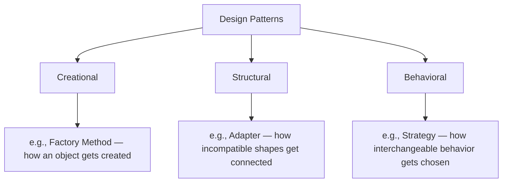
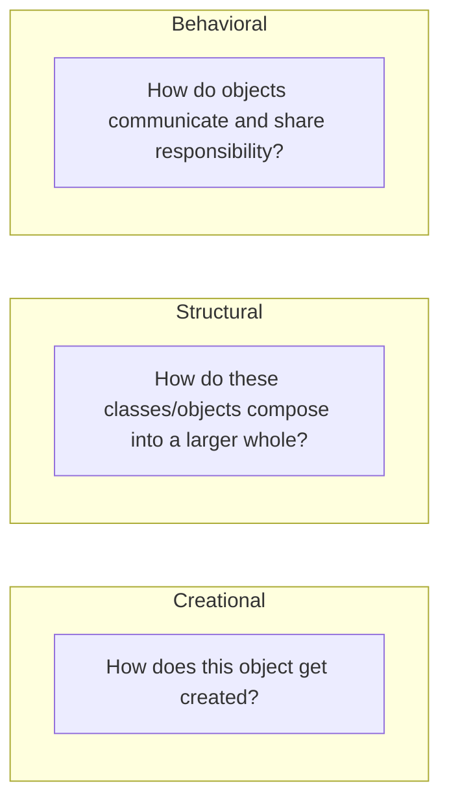

# Introduction to Design Patterns

## Introduction

Before reading this lesson, you should already be comfortable with **[Introduction to SOLID Principles](../02-oop/02-34-introduction-to-solid-principles.md)** — the five guidelines that describe how well-designed types should relate to one another. Design patterns are what those guidelines tend to produce in practice: recognizable, reusable *shapes* of classes and interfaces that experienced developers reach for by name instead of reinventing from scratch. **This lesson is an overview only.** It defines what a pattern is (and isn't), introduces the three classic categories with one named example each, and points you to **Module 12: Advanced Concepts**, which covers all 23 Gang-of-Four patterns in full, starting at lesson 12-06.

By the end of this lesson, you will be able to:

- Explain what a design pattern actually is — and why it isn't a library or a class you import
- Name the three Gang-of-Four pattern categories and the question each one answers
- Recognize one named example pattern from each category and its rough shape
- Read a small program and identify where a Factory Method, an Adapter, and a Strategy are each being used
- Know exactly where the full 23-pattern catalog is covered in this curriculum

## Design Patterns — A Layman's Perspective

Architects have a long tradition of naming recurring building layouts. A "courtyard house" refers to a specific, recognizable arrangement — rooms wrapped around a central open-air space — that has been reinvented independently by builders across countless cultures because it solves a real, recurring problem: how do you give every room natural light and airflow without every room needing its own exterior wall? Once an arrangement like this earns a name, something powerful happens: an architect can say "let's use a courtyard layout here" to another architect, and both instantly picture the same shape, the same trade-offs, and the same reasons you'd choose it — without either of them having to explain floor plans from first principles.

Crucially, "courtyard house" doesn't refer to one specific building. It's not a blueprint you photocopy and reuse exactly. It's a *shape* — a relationship between rooms and open space — that gets reimplemented differently every single time, adapted to the actual site, climate, and budget. A courtyard house in a hot, dry climate looks nothing brick-for-brick like one built in a temperate one, yet both proudly carry the same name, because what makes them "a courtyard house" was never the specific materials — it was the underlying arrangement solving the underlying problem.

Architects also group these named layouts by the kind of problem they solve. Some patterns are about how a building's structure gets assembled in the first place — prefabricated modules trucked in versus a poured concrete foundation built on-site. Others are about how the physical pieces connect into a coherent whole — how a hallway's walls meet a courtyard's edges. And still others describe how the building's *systems* behave and coordinate once it's standing — how a thermostat, a furnace, and a set of vents work together to keep every room at the right temperature without anyone touching a single knob. Three completely different kinds of questions, each with its own vocabulary of named, reusable answers.

Software design patterns work exactly the same way. A pattern isn't code you copy-paste, and it definitely isn't a library you install — it's a named shape, a relationship between a handful of classes and interfaces, that has been reinvented independently by enough developers solving the same recurring problem that it earned a shared name. Learning "the Adapter pattern" is like learning "the courtyard house": you're not memorizing one specific implementation, you're learning to recognize a shape, so that the next time you need it, you reach for a name instead of reinventing it from nothing — and so that when you say the name to another developer, they instantly picture the same trade-offs you do.

## Design Patterns — A Programming Language Perspective

A **design pattern** is a named, reusable solution to a recurring design problem in object-oriented software — a description of the classes/interfaces involved, how they relate, and the trade-off it makes, not a specific block of code or a library you import. The canonical catalog comes from *Design Patterns: Elements of Reusable Object-Oriented Software* (Gamma, Helm, Johnson, Vlissides — the "Gang of Four," 1994), which organized 23 patterns into three categories: **creational** patterns concern how objects get instantiated (deciding *what* gets created and *how*, often hiding the concrete type behind an abstraction); **structural** patterns concern how classes and objects are composed into larger structures (often making incompatible shapes work together); and **behavioral** patterns concern how objects communicate and distribute responsibility (often making an algorithm or behavior swappable). Patterns are still entirely current in modern C# — interfaces, generics, and delegates simply give you more concise ways to express the same underlying shapes. Module 12 covers the full 23-pattern catalog, starting with **Singleton** at lesson 12-06.

## How to Recognize a Design Pattern's Shape

Rather than one pattern at a time, this single small program shows one example from each GoF category working together, so you can see how the same overall codebase can lean on all three kinds at once.


*Figure 1: The three GoF pattern categories, each with one named example.*

```csharp
// Program.cs — .NET 10 / C# 14

// Creational: a Factory Method decides which concrete type to create.
INotifier emailNotifier = NotifierFactory.Create("email");
INotifier smsNotifier = NotifierFactory.Create("sms");

// Structural: an Adapter lets a pre-existing type satisfy a modern interface.
INotifier legacyAdapter = new LegacyPagerAdapter(new LegacyPager());

// Behavioral: a Strategy lets the caller swap the notification behavior.
Announce(emailNotifier, "Order ORD-9001 has shipped.");
Announce(smsNotifier, "Order ORD-9001 has shipped.");
Announce(legacyAdapter, "Order ORD-9001 has shipped.");

static void Announce(INotifier notifier, string message) => notifier.Send(message);

interface INotifier
{
    void Send(string message);
}

static class NotifierFactory
{
    public static INotifier Create(string channel) => channel switch
    {
        "email" => new EmailNotifier(),
        "sms" => new SmsNotifier(),
        _ => throw new ArgumentException($"Unknown channel: {channel}")
    };
}

class EmailNotifier : INotifier
{
    public void Send(string message) => Console.WriteLine($"[Email] {message}");
}

class SmsNotifier : INotifier
{
    public void Send(string message) => Console.WriteLine($"[SMS] {message}");
}

// A pre-existing type that doesn't, and can't, implement INotifier directly.
class LegacyPager
{
    public void Page(string text) => Console.WriteLine($"[Legacy Pager] {text}");
}

// Adapts LegacyPager so it satisfies the modern INotifier shape.
class LegacyPagerAdapter(LegacyPager pager) : INotifier
{
    public void Send(string message) => pager.Page(message);
}
```

**Console Output:**

```text
[Email] Order ORD-9001 has shipped.
[SMS] Order ORD-9001 has shipped.
[Legacy Pager] Order ORD-9001 has shipped.
```

`NotifierFactory.Create` hides the decision of *which* concrete `INotifier` to build behind a single method call — that's the Factory Method shape. `LegacyPagerAdapter` doesn't change `LegacyPager` at all; it wraps it so that code expecting an `INotifier` can use it unmodified — that's the Adapter shape. And `Announce` never knows or cares which concrete notifier it received; it just calls `Send` on whatever `INotifier` shows up — that's the Strategy shape, the same interchangeable-behavior idea you saw powering the discount policies in the previous lesson.

## Real-Time Example: The Strategy Pattern for E-Commerce Shipping Costs

We continue the E-Commerce Order Processing case study with a problem every checkout flow faces: calculating shipping cost, where the calculation genuinely differs by shipping speed. Rather than one method riddled with `if`/`else` branches for every shipping option — which would violate the Open/Closed Principle from the previous lesson every time a new shipping tier launched — this applies the **Strategy pattern**: one interface, one implementation per shipping option, each fully interchangeable.

```csharp
// Program.cs — .NET 10 / C# 14 — Real-Time Example
// Continuing the E-Commerce Order Processing case study.
// Applies the Strategy pattern (behavioral) to shipping cost calculation;
// Strategy in full depth is covered in Module 12.

var order = new ShippingRequest("ORD-9010", WeightKg: 4.5m);

IShippingStrategy[] options =
[
    new StandardShipping(),
    new ExpressShipping(),
    new OvernightShipping()
];

foreach (var strategy in options)
{
    decimal cost = strategy.CalculateCost(order);
    Console.WriteLine($"{strategy.Name,-10}: {cost:C} for {order.OrderId} ({order.WeightKg} kg)");
}

record ShippingRequest(string OrderId, decimal WeightKg);

interface IShippingStrategy
{
    string Name { get; }
    decimal CalculateCost(ShippingRequest request);
}

class StandardShipping : IShippingStrategy
{
    public string Name => "Standard";
    public decimal CalculateCost(ShippingRequest request) => 4.99m + (request.WeightKg * 0.50m);
}

class ExpressShipping : IShippingStrategy
{
    public string Name => "Express";
    public decimal CalculateCost(ShippingRequest request) => 9.99m + (request.WeightKg * 0.80m);
}

class OvernightShipping : IShippingStrategy
{
    public string Name => "Overnight";
    public decimal CalculateCost(ShippingRequest request) => 19.99m + (request.WeightKg * 1.30m);
}
```

**Console Output:**

```text
Standard  : $7.24 for ORD-9010 (4.5 kg)
Express   : $13.59 for ORD-9010 (4.5 kg)
Overnight : $25.84 for ORD-9010 (4.5 kg)
```

Each `IShippingStrategy` implementation owns its own pricing formula completely, and the `foreach` loop that calculates every option's cost never needed to know how many shipping tiers exist or how each one prices itself — it just calls `CalculateCost` polymorphically. Launching a new "Same-Day" tier next quarter means writing one new class implementing `IShippingStrategy`; the checkout loop above stays untouched. That's the practical payoff of recognizing this as "a Strategy" rather than reinventing the same interchangeable-behavior shape from scratch: the design decision — and its trade-offs — already comes with a name.

## The Three GoF Categories, Side by Side

Creational, structural, and behavioral patterns answer three genuinely different design questions, and recognizing which question you're actually facing usually points you straight at the right category to search within. A problem about *what gets built and how* is creational; a problem about *how existing pieces fit together* is structural; a problem about *how objects coordinate or vary their behavior* is behavioral.


*Figure 2: The three GoF categories each answer a distinct kind of design question.*

| Aspect | Creational | Structural | Behavioral |
|---|---|---|---|
| Question it answers | How does this object get created? | How do parts compose into a larger whole? | How do objects communicate and share responsibility? |
| Named example (this lesson) | Factory Method | Adapter | Strategy |
| Building analogy | Choosing how a structure gets assembled | How rooms and walls connect into a floor plan | How a thermostat and furnace coordinate |
| Typical payoff | Hides or centralizes flexible construction logic | Makes incompatible shapes work together | Makes behavior swappable without conditionals |

## Where the Full Pattern Catalog Lives

This lesson named three patterns out of twenty-three. The complete catalog — creational, structural, and behavioral alike, each with a full worked example — is Module 12's job:

1. **[Singleton Pattern](../12-advanced-concepts/12-06-singleton-pattern.md)** — the starting point of the full catalog, ensuring a type has exactly one instance.
2. **[Factory Method Pattern](../12-advanced-concepts/12-07-factory-method-pattern.md)** — the creational pattern demonstrated above, covered in full depth.
3. **[Adapter Pattern](../12-advanced-concepts/12-11-adapter-pattern.md)** — the structural pattern demonstrated above, covered in full depth.
4. **[Strategy Pattern](../12-advanced-concepts/12-18-strategy-pattern.md)** — the behavioral pattern behind both examples in this lesson, covered in full depth.
5. **[Repository and Unit of Work Patterns](../12-advanced-concepts/12-29-repository-and-unit-of-work.md)** — practical, widely-used additions to the classic GoF catalog.
6. **[Introduction to SOLID Principles](../02-oop/02-34-introduction-to-solid-principles.md)** — the design goals these patterns tend to satisfy, revisited.

## What You've Learned & What's Next

A design pattern is a named, reusable *shape* for a recurring design problem — not code you copy, not a library you install — and the Gang of Four organized twenty-three of them into three categories: creational (how objects get created), structural (how pieces compose), and behavioral (how objects communicate). Recognizing a problem as "this is an Adapter situation" or "this needs a Strategy" lets you reach for a proven shape instead of improvising one, and gives you a shared name to describe it to the rest of your team.

Continue your learning journey with **[Class vs Object — Consolidated Comparison](../02-oop/02-36-class-vs-object-comparison.md)**, which steps back from patterns and principles to consolidate the most fundamental distinction this entire module has been built on.

---
*Applies to: .NET 10 / C# 14. Last reviewed 2026-08-16.*
