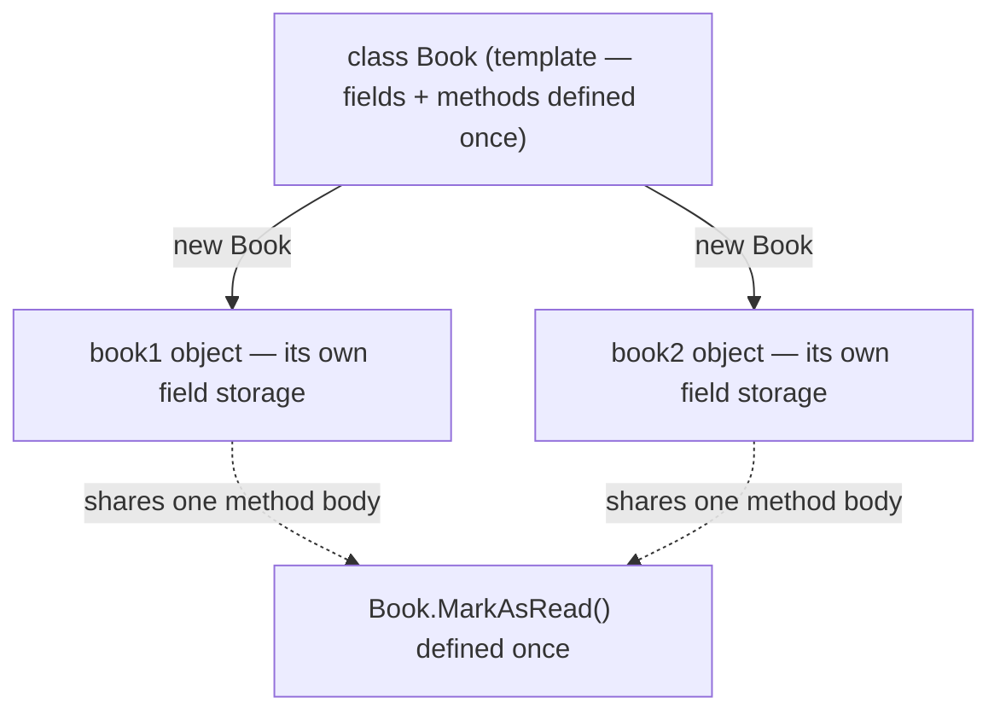

# Class vs Object — Consolidated Comparison

## Introduction

Before reading this lesson, you should already be comfortable with **[Introduction to Design Patterns](../02-oop/02-35-introduction-to-design-patterns.md)** and, really, with everything else in Module 02 — constructors, fields and properties, inheritance, records, and structs. By now you've written dozens of classes and created objects from them without necessarily stopping to pin down, once and for all, exactly what separates the two and how that separation plays out identically whether the type in question is a `class`, a `record`, or a `struct`. This lesson introduces no new syntax. Instead it is a deliberate pause: a single, thorough, side-by-side treatment of *class vs object* that consolidates everything Module 02 has built so far.

By the end of this lesson, you will be able to:

- State precisely what a class is (a compile-time template) and what an object is (a runtime instance)
- Trace how constructors, fields, and properties each play a distinct role in turning a class definition into a live object
- Explain why two objects built from the same class, with identical field values, are still independent and distinguishable
- Compare how classes, records, and structs each produce instances differently — reference identity vs value equality, heap vs copy-by-value
- Recognize that static members belong to the class itself, never to any one object
- Use the consolidated comparison table as a mental checklist when choosing between `class`, `struct`, `record class`, and `record struct`

## Class vs Object — A Layman's Perspective

Picture an architect's blueprint for a small house. The blueprint specifies everything about the design: three bedrooms in these exact positions, a kitchen of this size, plumbing that runs along this wall. It is complete and precise, but you cannot sleep in a blueprint, store groceries in it, or lock its front door — it's a description of a house, not a house. The blueprint is drawn exactly once, filed away in the architect's office, and referenced every time a construction crew wants to build another house of that design. That blueprint is a class: a single, complete definition of what something looks like and how it behaves, written once.

Now picture the construction crew actually building from that blueprint on three different lots. Each finished house is a real, physical structure — you can walk through its rooms, its address is unique, and turning on the stove in house #1 does nothing to house #2's stove, even though both stoves sit in identically positioned kitchens. Each house has its own furniture, its own family living in it, its own broken window that only it has, despite following the very same blueprint down to the millimeter. Those three built houses are objects: separate, independent instances that all share one design but none of which share any actual bricks, furniture, or occupants with each other.

The construction crew itself corresponds to a constructor — the process that takes an empty lot and the blueprint and produces a genuinely livable house, wiring the plumbing, pouring the foundation, and hanging the front door in one coordinated pass, so that by the time anyone walks in, the house is already usable, not half-built. The rooms of the house are like a class's fields — the actual storage where things live — while the front desk of a hotel built from a similar blueprint is like a property: a controlled point of contact that decides what a visitor is allowed to see or change about a room, rather than letting guests wander in and rearrange the furniture directly.

Two more useful variations on the blueprint idea round out this analogy. A show-home blueprint that comes with every room already fully furnished and staged — down to which vase sits on which shelf — is like a record: a template that, in addition to the structure itself, comes with a built-in, automatic way of comparing "is this show-home staged identically to that one?" without anyone having to write that comparison logic by hand. And a blueprint for something small enough to be mass-produced and handed to someone directly — a garden shed kit, say, rather than a permanent house with its own street address — is like a struct: cheap to duplicate, carried and copied as a whole unit rather than visited at a fixed address.

The bridge back to programming: a class is the one-time blueprint; an object is each independently built, independently lived-in instance of it — and constructors, fields, and properties are simply the construction crew, the rooms, and the front desk that make that instance real and usable.

## Class vs Object — A Programming Language Perspective

A **class** is a compile-time type definition — a named specification of fields, properties, methods, and constructors that exists once in your program's metadata, regardless of how many instances are later created from it. An **object** is a runtime instance produced by evaluating a `new` expression against a class: for reference types, this allocates storage on the managed heap and returns a reference to it, giving that instance an identity distinct from any other instance's identity, even when every field holds an equal value. The **constructor** is the member that runs exactly once per `new` expression, responsible for bringing that allocated instance to a valid initial state. **Fields** are the actual per-instance storage locations; **properties** are accessor members (`get`/`set`) that wrap access to that storage, enforcing invariants without exposing raw fields publicly. `static` members are the one documented exception to per-instance storage: they belong to the class itself, shared across every object, not duplicated per instance. A `struct` produces a *value* instance instead of an object — copied by value on assignment rather than referenced — while `record class`/`record struct` layer compiler-synthesized value equality on top of an ordinary class or struct, without changing whether instances are heap objects or copied values underneath.

## How to Compare a Class and Its Objects in C#

The clearest way to see the class/object distinction is to create two objects from the same class with identical constructor arguments, then show that they remain two separate objects — changing one has no effect on the other, even though every field they were given started out equal.

```mermaid
flowchart LR
    A["class Book (definition — written once)"] -->|new Book(...)| B[book1 object]
    A -->|new Book(...)| C[book2 object]
    B -.independent state.- C
```
*Figure 1: One class definition produces as many independent objects as you call `new` for.*

```csharp
// Program.cs — .NET 10 / C# 14

var book1 = new Book("The Pragmatic Programmer", "David Thomas", 1999);
var book2 = new Book("The Pragmatic Programmer", "David Thomas", 1999);

Console.WriteLine($"book1: {book1.Title} ({book1.Year})");
Console.WriteLine($"book2: {book2.Title} ({book2.Year})");
Console.WriteLine($"Same field values? {book1.Title == book2.Title && book1.Year == book2.Year}");
Console.WriteLine($"Same object (ReferenceEquals)? {ReferenceEquals(book1, book2)}");

book1.MarkAsRead();
Console.WriteLine($"book1.HasBeenRead = {book1.HasBeenRead}");
Console.WriteLine($"book2.HasBeenRead = {book2.HasBeenRead}");

class Book
{
    public string Title { get; }
    public string Author { get; }
    public int Year { get; }
    public bool HasBeenRead { get; private set; }

    public Book(string title, string author, int year)
    {
        Title = title;
        Author = author;
        Year = year;
    }

    public void MarkAsRead() => HasBeenRead = true;
}
```

**Console Output:**

```text
book1: The Pragmatic Programmer (1999)
book2: The Pragmatic Programmer (1999)
Same field values? True
Same object (ReferenceEquals)? False
book1.HasBeenRead = True
book2.HasBeenRead = False
```

`Book` is written exactly once, yet `new Book(...)` is called twice, producing `book1` and `book2` as two distinct objects on the heap. Their field values are equal, but `ReferenceEquals` reports `False` because reference equality compares *identity*, not content. Calling `book1.MarkAsRead()` only ever touches `book1`'s own storage — `book2.HasBeenRead` stays `false` — which is exactly the independence the house-blueprint analogy predicted.

## Real-Time Example: Class vs Object in Library/Inventory Management

We extend the Library/Inventory Management case study, contrasting a `class` object, a `record struct` value, and a `record class` snapshot side by side — the same three variations described in the analogy above, now as real, runnable types.

```csharp
// Program.cs — .NET 10 / C# 14 — Real-Time Example
// Extends the Library/Inventory Management case study, showing how a class,
// a record struct, and a record class each produce instances differently.

var isbnA = new Isbn("978-0135957059");
var isbnB = new Isbn("978-0135957059");

var copy1 = new LibraryBook(isbnA, "Shelf A-12");
var copy2 = new LibraryBook(isbnB, "Shelf A-13");

Console.WriteLine($"copy1 shelf: {copy1.ShelfLocation}, ISBN: {copy1.Isbn}");
Console.WriteLine($"copy2 shelf: {copy2.ShelfLocation}, ISBN: {copy2.Isbn}");
Console.WriteLine($"Same physical copy (ReferenceEquals)? {ReferenceEquals(copy1, copy2)}");
Console.WriteLine($"Same ISBN value (==)? {isbnA == isbnB}");

copy1.CheckOut();
Console.WriteLine($"copy1 checked out? {copy1.IsCheckedOut}");
Console.WriteLine($"copy2 checked out? {copy2.IsCheckedOut}");

var snapshot = new CatalogSnapshot("Clean Code", 2);
var snapshotAfterLoan = snapshot with { CopiesAvailable = 1 };
Console.WriteLine($"snapshot: {snapshot}");
Console.WriteLine($"snapshotAfterLoan: {snapshotAfterLoan}");
Console.WriteLine($"snapshot == snapshotAfterLoan? {snapshot == snapshotAfterLoan}");

readonly record struct Isbn(string Value)
{
    public override string ToString() => Value;
}

class LibraryBook
{
    public Isbn Isbn { get; }
    public string ShelfLocation { get; }
    public bool IsCheckedOut { get; private set; }

    public LibraryBook(Isbn isbn, string shelfLocation)
    {
        Isbn = isbn;
        ShelfLocation = shelfLocation;
    }

    public void CheckOut() => IsCheckedOut = true;
}

record CatalogSnapshot(string Title, int CopiesAvailable);
```

**Console Output:**

```text
copy1 shelf: Shelf A-12, ISBN: 978-0135957059
copy2 shelf: Shelf A-13, ISBN: 978-0135957059
Same physical copy (ReferenceEquals)? False
Same ISBN value (==)? True
copy1 checked out? True
copy2 checked out? False
snapshot: CatalogSnapshot { Title = Clean Code, CopiesAvailable = 2 }
snapshotAfterLoan: CatalogSnapshot { Title = Clean Code, CopiesAvailable = 1 }
snapshot == snapshotAfterLoan? False
```

`copy1` and `copy2` are two distinct `LibraryBook` objects — two physical copies on different shelves — so `ReferenceEquals` is `False` even though both happen to catalog the same title. Their `Isbn` values, however, are `record struct` values compared by content, so `isbnA == isbnB` is `True`: the ISBN doesn't need identity, only correctness. Checking out `copy1` never touches `copy2`'s state, exactly like `Book` did earlier. The `CatalogSnapshot` record shows the third variation: `with` produces a new object holding updated data, leaving the original `snapshot` untouched — useful for a library system that wants to keep a point-in-time reporting snapshot immutable.

## Class vs Object — The Consolidated Comparison

Everything in this lesson collapses into one distinction, applied consistently across four type categories you've now met throughout Module 02: a **class is the template**, defined once; an **object is a runtime instance** of that template, created as many times as `new` is called. That single idea explains a surprising amount once you trace it through each category.

For an ordinary `class`, "object" means a heap-allocated instance with its own identity — two objects with identical field values are still different objects, distinguishable by `ReferenceEquals`, exactly as `book1` and `book2` demonstrated. The constructor is what bridges the gap between "a class exists" and "an object exists": it runs once per `new` call, and its parameters are the only way outside code can influence that object's starting state, since fields are typically private and properties expose only what the class chooses to expose. Two objects never share field storage — each gets its own independent copy of every instance field the class declares — which is exactly why calling a mutating method on one object, like `MarkAsRead()` or `CheckOut()`, is invisible to every other object built from the same class. The one deliberate exception is `static` members: a `static` field or property belongs to the class itself, not to any instance, so every object (and code that never creates an object at all) sees the same shared value — a detail covered in its own lesson but worth remembering here, since it's the one place "object independence" doesn't apply.

A `struct` keeps the same class/object vocabulary at the type-definition level — you still write `struct Isbn { ... }` once — but its instances are **values**, not objects in the heap-allocation sense: assigning a struct value to a new variable, or passing it to a method, copies its entire contents rather than sharing one instance behind two references. That's precisely why nobody would ever call `ReferenceEquals` meaningful for two `Isbn` values; there is no shared identity to compare, only content, which is also why value types default to per-field equality rather than reference equality.

Records don't introduce a third storage model — a `record class` is still a class (heap-allocated, reference-identity-capable) and a `record struct` is still a struct (copied by value) — but both automatically generate `Equals`, `GetHashCode`, `ToString`, and `==`/`!=` based on their properties' values, plus non-destructive mutation via `with`. That's why `snapshot == snapshotAfterLoan` compared *content*, not identity, even though `CatalogSnapshot` is a `record class` and therefore still produces genuine heap objects underneath — the equality *behavior* changed, not the underlying instance model.


*Figure 2: Every object gets independent field storage, but all objects of the same class share the very same method definitions.*

| Aspect | `class` | `struct` | `record class` | `record struct` |
|---|---|---|---|---|
| Type category | Reference type | Value type | Reference type | Value type |
| Instance is called | Object | Value | Object | Value |
| Default equality | Reference (`Equals`/`==`) | Per-field value | Synthesized per-property value | Synthesized per-property value |
| Assignment behavior | Copies the reference (same object) | Copies all fields (independent) | Copies the reference (same object) | Copies all fields (independent) |
| Example from this lesson | `Book`, `LibraryBook` | `Isbn` (without `record`) | `CatalogSnapshot` | `Isbn` (as written above) |

## Types of Class/Object Relationships in C#

The class-vs-object distinction shows up differently depending on which category of type you're working with — several are covered in their own dedicated lessons:

1. **[Constructors in C#](../02-oop/02-02-constructors-in-csharp.md)** — the member responsible for turning a class definition into a validly-initialized object.
2. **[Fields, Properties, and the `field` Keyword](../02-oop/02-03-fields-properties-field-keyword.md)** — the storage and controlled-access layer every object carries independently.
3. **[Records in C# (`record class`)](../02-oop/02-19-records-in-csharp.md)** — objects with synthesized value equality layered on top of ordinary reference semantics.
4. **[`record struct` and Value-Based Records](../02-oop/02-20-record-struct-value-based-records.md)** — value instances with the same synthesized equality, copied rather than referenced.
5. **[Structs vs Classes](../02-oop/02-21-structs-vs-classes.md)** — the full reference-vs-value-type comparison this lesson leaned on.
6. **[Equality: `Equals`, `==`, and `IEquatable<T>`](../02-oop/02-33-equality-equals-iequatable.md)** — exactly how each type category decides whether two instances "are equal."

## What You've Learned & What's Next

A class is a template written once; an object is an independent runtime instance created from it, with its own field storage, distinguishable from every other object even when every value it holds is identical. That single idea, traced consistently across `class`, `struct`, `record class`, and `record struct`, is the thread running underneath everything Module 02 has covered so far.

Continue your learning journey with **[OOP in C# — Putting the Four Pillars Together](../02-oop/02-37-oop-four-pillars-together.md)**, where encapsulation, abstraction, inheritance, and polymorphism combine in a single class hierarchy.

---
*Applies to: .NET 10 / C# 14. Last reviewed 2026-08-16.*
