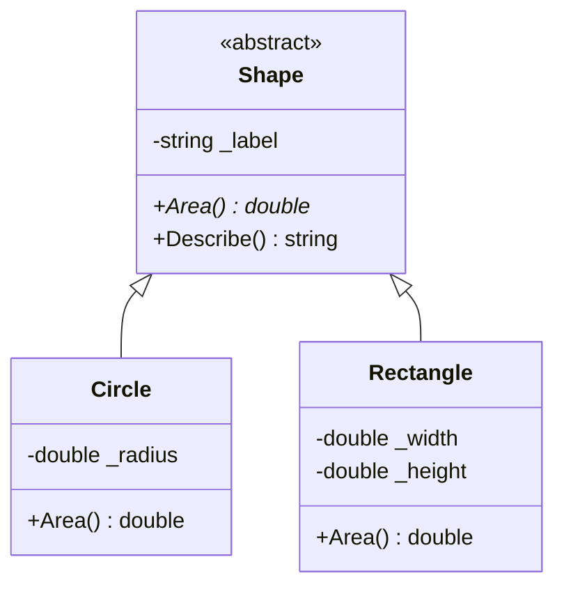
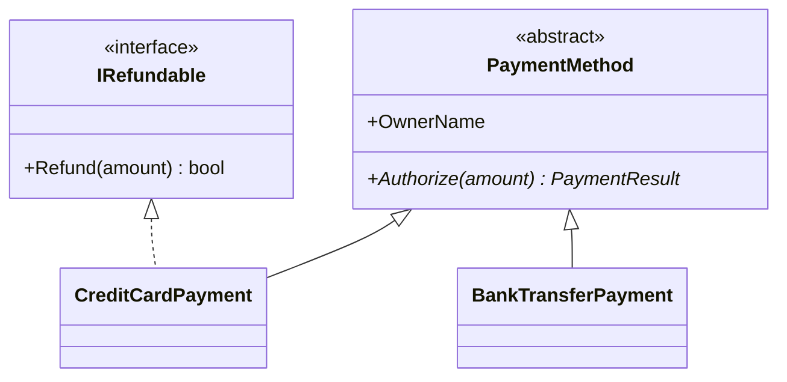

# OOP in C# — Putting the Four Pillars Together

## Introduction

Before reading this lesson, you should already be comfortable with **[Class vs Object — Consolidated Comparison](../02-oop/02-36-class-vs-object-comparison.md)**, and, from earlier in Module 02, with each of the four pillars individually: encapsulation, abstraction, inheritance, and polymorphism. Each pillar so far has had its own dedicated lesson and its own isolated example. Real code, however, never uses just one pillar at a time — a well-designed class hierarchy leans on all four simultaneously, each one solving a different part of the same design problem. This lesson builds a single, small hierarchy and explicitly labels which pillar every piece of it demonstrates, so you can see them cooperate rather than stand alone.

By the end of this lesson, you will be able to:

- Identify encapsulation, abstraction, inheritance, and polymorphism within one real class hierarchy, not just in isolated examples
- Explain how an abstract base class supplies both abstraction (via abstract members) and shared implementation (via concrete members) at once
- Trace how a single polymorphic call resolves to different code depending on an object's actual runtime type
- Recognize private state and constructor-only initialization as encapsulation, wherever they appear
- Compare abstract classes and interfaces as two different mechanisms for expressing the same abstraction pillar

## The Four Pillars — A Layman's Perspective

Picture a community talent show. The evening's program lists several acts — a singer, a dancer, a musician — but the printed program never explains *how* each act pulls off their performance; it just promises that when their name is called, each act will do something worth watching. That's abstraction: the audience, and the host reading names off the program, only need to know that every act performs *something*, not the internal details of how.

Backstage is a different story. The lighting board, the sound mixer's exact settings, the singer's warm-up routine — none of that is visible to the audience, and none of it needs to be. The sound technician controls the mixer directly; nobody in the audience can reach behind the curtain and start adjusting dials themselves. That backstage privacy — state that's fully under one person's control, exposed to the outside world only through a single, deliberate interface like a stage cue — is encapsulation.

Now notice that a "Musician" act and a "Singer-Musician" act — someone who sings while playing guitar — share a lot in common: both need a sound check, both bow at the end, both wait for their cue from the same stage manager. Rather than teaching the stage manager two completely separate sets of instructions, the talent show organizes every act under one shared "Performer" category, and a "Singer-Musician" simply extends the ordinary "Musician" category with singing added on top, inheriting everything a plain musician already does. That reuse of a shared category, extended rather than rebuilt from scratch, is inheritance.

Finally, watch what happens when the host calls "Next performer, please" — the exact same instruction, every single time. A singer walks out and sings; a dancer walks out and dances; a musician walks out and plays. The host's cue doesn't change based on who's coming — it's one uniform instruction — but what actually happens in response depends entirely on which specific act is currently up. That's polymorphism: one call, resolved differently depending on which concrete performer receives it.

A well-run talent show needs all four working together: a program that abstracts away each act's internal preparation, backstage privacy that encapsulates each act's own equipment and routine, shared categories that let related acts inherit common structure, and one uniform cue that resolves polymorphically to whatever the current act actually does. Peel back any single one of those and the show becomes either unmanageable backstage chaos or a program that has to spell out every act's inner workings by name. C# classes work exactly the same way — and the example in this lesson labels each pillar as it appears, the same way this analogy just did.

## The Four Pillars — A Programming Language Perspective

**Encapsulation** bundles state and the behavior that operates on it inside one type, exposing only a deliberate, validated surface — typically private fields reachable only through constructors, methods, or properties. **Abstraction** separates *what* a type can do from *how* it does it, most commonly expressed through an `abstract` member (or an interface member) that declares a contract without supplying an implementation, deferring that detail to whichever type ultimately implements it. **Inheritance** lets a derived class reuse a base class's members — fields, properties, methods, constructors invoked via `base(...)` — extending rather than duplicating shared structure. **Polymorphism** is what makes a single call site — say, `shape.Area()` — resolve, at runtime, to whichever `override` the object's actual concrete type provides, via the CLR's virtual dispatch mechanism. In C# 14, all four remain expressed through the same keywords introduced across Module 02: `private`/properties for encapsulation, `abstract`/interface members for abstraction, `: BaseClass` and `base(...)` for inheritance, and `virtual`/`override` for polymorphism.

## How to Combine the Four Pillars in One Hierarchy

The clearest way to see all four pillars cooperate is a small `Shape` hierarchy: an abstract base class supplies shared, encapsulated behavior and one abstraction point, while each derived shape inherits that shared behavior and overrides only the one thing that genuinely differs between shapes.


*Figure 1: `Circle` and `Rectangle` inherit from abstract `Shape` and each override `Area()`, while `Describe()` and the private label stay defined once, in the base class.*

```csharp
// Program.cs — .NET 10 / C# 14

Shape[] shapes =
[
    new Circle(radius: 3),
    new Rectangle(width: 4, height: 5)
];

foreach (Shape shape in shapes)
{
    // Polymorphism: the same Describe() call runs different Area() logic per actual type.
    Console.WriteLine(shape.Describe());
}

// Abstraction: Shape declares *what* every shape must provide (Area), not *how*.
abstract class Shape
{
    // Encapsulation: the label is private state, set once through the constructor.
    private readonly string _label;

    protected Shape(string label) => _label = label;

    public abstract double Area();

    // Every subclass reuses this shared formatting logic without rewriting it.
    public string Describe() => $"{_label}: area = {Area():F2}";
}

// Inheritance: Circle reuses Shape's constructor and Describe() method.
class Circle : Shape
{
    private readonly double _radius;

    public Circle(double radius) : base("Circle") => _radius = radius;

    // Polymorphism: overrides Shape's abstract Area() with circle-specific math.
    public override double Area() => Math.PI * _radius * _radius;
}

class Rectangle : Shape
{
    private readonly double _width;
    private readonly double _height;

    public Rectangle(double width, double height) : base("Rectangle")
    {
        _width = width;
        _height = height;
    }

    public override double Area() => _width * _height;
}
```

**Console Output:**

```text
Circle: area = 28.27
Rectangle: area = 20.00
```

Every pillar is labeled directly in the comments: `Shape`'s private `_label` and constructor-only assignment is encapsulation; the `abstract double Area()` declaration is abstraction — it says every shape *must* have an area without saying how; `Circle : Shape` and `Rectangle : Shape` reusing `Describe()` and the constructor is inheritance; and the single `shape.Describe()` call inside the loop resolving to circle math for one iteration and rectangle math for the next, based purely on the object's runtime type, is polymorphism.

## Real-Time Example: Four Pillars in Banking/ATM Payment Processing

We extend the Banking/ATM case study with a `PaymentMethod` hierarchy, applying the same four labeled pillars to a scenario closer to production code: authorizing a payment against either a credit card's available credit or a bank account's balance.

```csharp
// Program.cs — .NET 10 / C# 14 — Real-Time Example
// Extends the Banking/ATM case study with a PaymentMethod hierarchy that
// demonstrates all four OOP pillars working together.

List<PaymentMethod> methods =
[
    new CreditCardPayment("Grace Hopper", cardNumber: "4111111111111111", availableCredit: 500m),
    new BankTransferPayment("Ada Lovelace", accountBalance: 120m)
];

foreach (PaymentMethod method in methods)
{
    // Polymorphism: Authorize() resolves to each concrete type's own rules.
    PaymentResult result = method.Authorize(150m);
    Console.WriteLine($"{method.Summary()} -> {result}");
}

// Abstraction: PaymentMethod defines *what* every payment method must do (Authorize),
// without exposing how any specific method decides.
abstract class PaymentMethod
{
    // Encapsulation: OwnerName is exposed read-only; no external code can reassign it.
    public string OwnerName { get; }

    protected PaymentMethod(string ownerName) => OwnerName = ownerName;

    public abstract PaymentResult Authorize(decimal amount);

    public virtual string Summary() => $"{GetType().Name} for {OwnerName}";
}

// Inheritance: CreditCardPayment reuses OwnerName from PaymentMethod's constructor.
class CreditCardPayment : PaymentMethod
{
    private readonly string _cardNumber;
    private decimal _availableCredit; // Encapsulation: credit is private, mutated only internally.

    public CreditCardPayment(string ownerName, string cardNumber, decimal availableCredit)
        : base(ownerName)
    {
        _cardNumber = cardNumber;
        _availableCredit = availableCredit;
    }

    // Polymorphism: overrides Authorize() with credit-limit-specific logic.
    public override PaymentResult Authorize(decimal amount)
    {
        if (amount > _availableCredit)
        {
            return new PaymentResult(false, $"declined — exceeds available credit of {_availableCredit:C}");
        }

        _availableCredit -= amount;
        return new PaymentResult(true, $"approved — remaining credit {_availableCredit:C}");
    }

    // Polymorphism: also overrides the virtual Summary() with card-specific formatting.
    public override string Summary() => $"Credit card ending {_cardNumber[^4..]}";
}

class BankTransferPayment : PaymentMethod
{
    private decimal _accountBalance;

    public BankTransferPayment(string ownerName, decimal accountBalance) : base(ownerName)
    {
        _accountBalance = accountBalance;
    }

    public override PaymentResult Authorize(decimal amount)
    {
        if (amount > _accountBalance)
        {
            return new PaymentResult(false, $"declined — insufficient balance of {_accountBalance:C}");
        }

        _accountBalance -= amount;
        return new PaymentResult(true, $"approved — remaining balance {_accountBalance:C}");
    }

    // Inheritance: BankTransferPayment does not override Summary(), so it uses
    // PaymentMethod's base implementation as-is.
}

record PaymentResult(bool Approved, string Message)
{
    public override string ToString() => Message;
}
```

**Console Output:**

```text
Credit card ending 1111 -> approved — remaining credit $350.00
BankTransferPayment for Ada Lovelace -> declined — insufficient balance of $120.00
```

`CreditCardPayment` overrides both `Authorize` and `Summary`, while `BankTransferPayment` overrides only `Authorize` and quietly inherits `PaymentMethod`'s base `Summary()` — both are legitimate uses of inheritance and polymorphism side by side. Each type's balance-tracking field (`_availableCredit`, `_accountBalance`) is private and mutated only by its own `Authorize` logic, which is encapsulation protecting money-relevant state from being changed by anything outside the class. And `foreach (PaymentMethod method in methods)` never needs an `if`/`switch` on the concrete type — it calls `Authorize` once per method and lets polymorphism route to the right implementation, which is exactly how a real payment processor stays open to adding a new payment type without editing this loop at all.

## Abstract Classes vs Interfaces — Two Ways to Express Abstraction

Both examples above used an abstract base class to express the abstraction pillar, but C# offers a second mechanism for the same job: interfaces. An abstract class is the right tool when related types share both a contract *and* meaningful implementation or state — `PaymentMethod`'s `OwnerName` property and its concrete `Summary()` method are real, reusable code, not just a signature, and every payment method genuinely *is a* `PaymentMethod`. An interface is the better tool when the shared contract is a *capability* that cuts across otherwise unrelated types, with little or no shared implementation to offer — a `IRefundable` capability, for instance, could apply to a `CreditCardPayment` and, in a different hierarchy entirely, to a `GiftCardBalance` that has nothing else in common with payment methods.

The practical constraint that usually settles the choice: a class can extend only one base class, abstract or not, but it can implement as many interfaces as it needs. `CreditCardPayment` already spends its one base-class slot on `PaymentMethod`; adding refund support without giving up that slot means expressing `IRefundable` as an interface, not a second base class.


*Figure 2: `PaymentMethod` supplies shared state and behavior through single inheritance; `IRefundable` adds a cross-cutting capability through interface implementation instead, without spending the one base-class slot.*

| Aspect | Abstract Class | Interface |
|---|---|---|
| Shared implementation | Can provide real method bodies and fields | Can provide default method bodies (C# 8+), but rarely holds instance state |
| Instance fields | Allowed | Not allowed |
| Number a class can use | Exactly one | As many as needed |
| Constructors | Can define one, run via `base(...)` | Cannot define instance constructors |
| Best fit in this lesson | `PaymentMethod` — shared identity and logic | A cross-cutting capability like `IRefundable` |

## Types of Abstraction Mechanisms in C#

The abstraction pillar specifically has several dedicated mechanisms worth exploring further:

1. **[Abstract Classes and Methods](../02-oop/02-14-abstract-classes-and-methods.md)** — the mechanism this lesson's `Shape` and `PaymentMethod` hierarchies both used.
2. **[Interfaces in C#](../02-oop/02-15-interfaces-in-csharp.md)** — the contract-only alternative to an abstract class, as contrasted above.
3. **[Default Interface Methods and Static Abstract Members](../02-oop/02-16-default-interface-methods-static-abstract.md)** — how interfaces can carry shared implementation too, narrowing the gap with abstract classes.
4. **[Method Overriding](../02-oop/02-12-method-overriding.md)** — the mechanism behind every `override` in this lesson's polymorphic calls.
5. **[Sealed Classes and Methods](../02-oop/02-17-sealed-classes-and-methods.md)** — how to close off further inheritance or overriding once a hierarchy is finalized.
6. **[Polymorphism — The Fourth Pillar of OOP](../02-oop/02-13-polymorphism-pillar-of-oop.md)** — a deeper look at the mechanism this lesson relied on throughout.

## What You've Learned & What's Next

Real class hierarchies rarely use just one OOP pillar — `Shape` and `PaymentMethod` both leaned on encapsulation for safe internal state, abstraction for a shared contract, inheritance for reusing that contract's common structure, and polymorphism for letting one call site resolve correctly no matter which concrete type receives it. Recognizing all four operating together, rather than in isolated examples, is what turns "I know what encapsulation is" into "I can design a real hierarchy."

Continue your learning journey with **[Real-Time OOP Design: Modeling the Library Catalog](../02-oop/02-38-real-time-oop-library-catalog.md)**, the capstone of Module 02, where a fuller `Book`/`Member`/`Loan`/`Catalog` hierarchy puts nearly everything from this module together at once.

---
*Applies to: .NET 10 / C# 14. Last reviewed 2026-08-16.*
