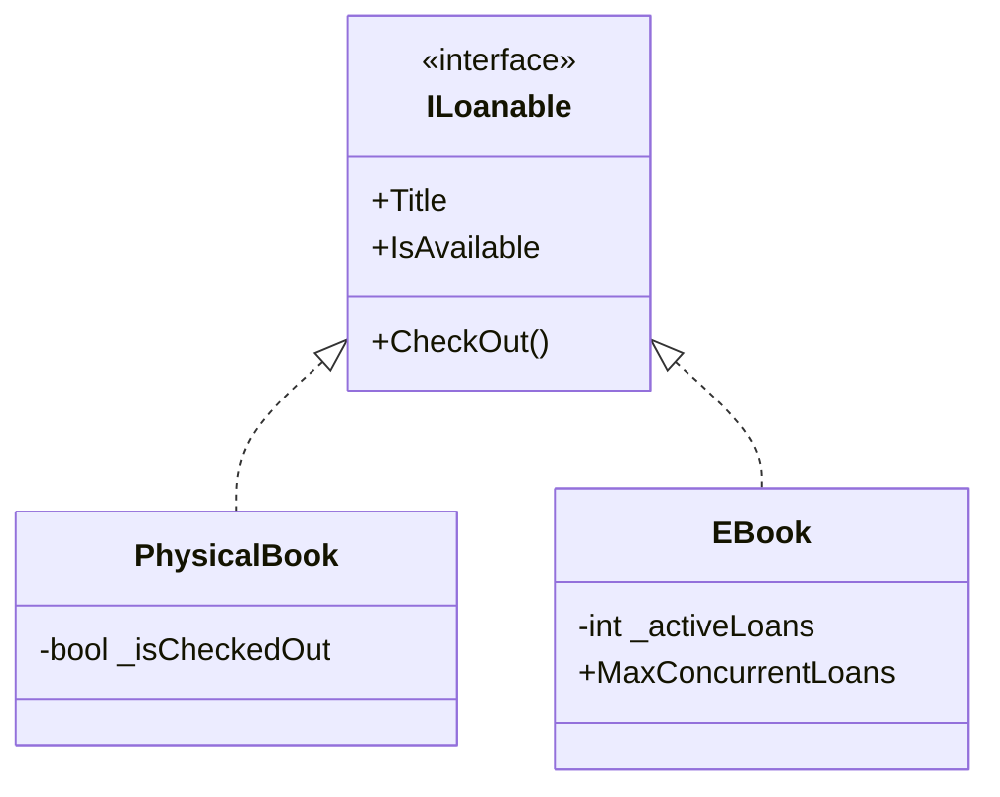
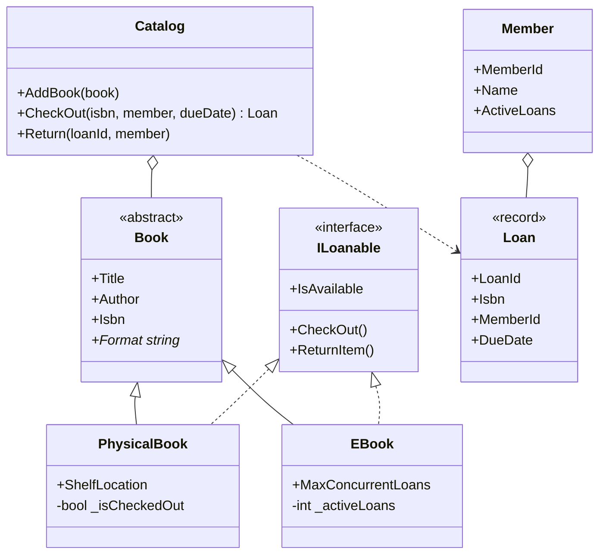
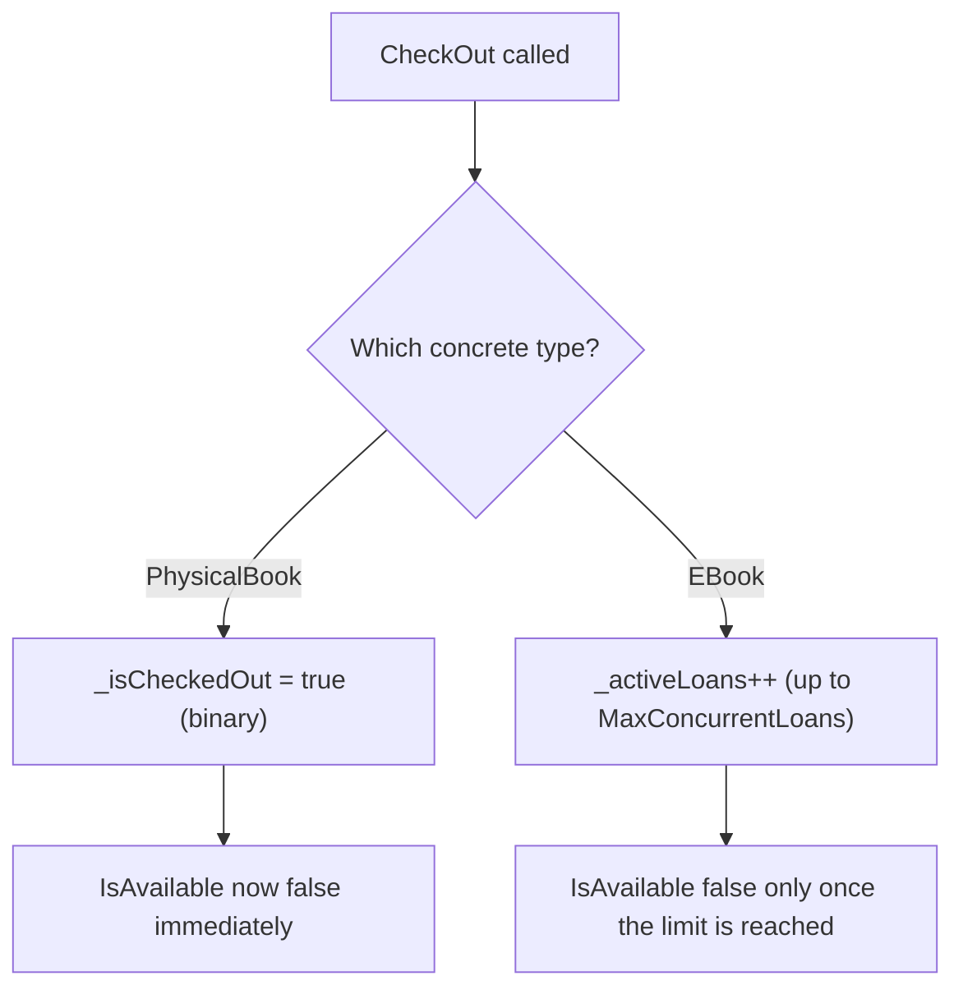

# Real-Time OOP Design: Modeling the Library Catalog

## Introduction

Before reading this lesson, you should already be comfortable with **[OOP in C# — Putting the Four Pillars Together](../02-oop/02-37-oop-four-pillars-together.md)** and, really, with the entire arc of Module 02: classes and objects, constructors, fields and properties, encapsulation, abstraction, inheritance, polymorphism, interfaces, records, and equality. This lesson is the module's capstone — instead of one more isolated concept, it designs a fuller, more realistic slice of the Library/Inventory Management case study, composing at least eight of those concepts into a single working domain model: `Book`, its `PhysicalBook`/`EBook` subtypes, an `ILoanable` interface, an immutable `Loan` record, and a `Catalog` that ties it all together.

By the end of this lesson, you will be able to:

- Design an abstract base class (`Book`) shared by two concrete subtypes with genuinely different behavior
- Use an interface (`ILoanable`) to express a capability that both subtypes implement differently
- Model an immutable transaction (`Loan`) as a `record`, appropriate for something that should never change after it's created
- Encapsulate mutable checkout state so it can only change through validated methods, never directly
- Coordinate multiple domain types (`Catalog`, `Member`, `Book`, `Loan`) the way a real small system would
- Recognize how everything from Module 02 composes into one coherent design, setting up Module 03's collections

## Modeling the Library Catalog — A Layman's Perspective

Think about how an actual public library runs, without any computers involved at all. The building has physical shelves holding physical books — each one a single object that can only be in one reader's hands at a time. If you check out the library's only copy of a book, the next person who wants it has to wait until you bring it back; there's no way around that, because there's only one physical copy. A library card is what identifies you as a member — it tracks which books you currently have out and when each one is due, so the front desk can look up your card and immediately see your whole borrowing history without re-asking you a single question.

Now imagine that same library also offers e-books through an app. An e-book isn't a single physical object sitting on a shelf — the library has licensed, say, two simultaneous "seats" for a popular title, so up to two members can be reading it digitally at the same time, and a third member has to wait not because a physical copy is missing, but because both licensed seats are currently in use. That's a meaningfully different kind of "out of stock" than the physical shelf case, even though from a reader's point of view, both simply say "not available right now."

Whenever a physical book or an e-book seat is checked out, the front desk doesn't scribble a note that gets erased and overwritten later — it creates a small, permanent slip recording exactly who borrowed what and when it's due. That slip is never edited afterward; if the loan needs to change, the desk creates a *new* slip for the *return*, rather than altering the original checkout slip's ink. And crucially, none of this requires the front desk staff to personally inspect every shelf or personally know every member by memory — the catalog system they consult exposes exactly the operations they need (check something out, return something, check availability) without exposing exactly how a shelf book's status differs from an e-book seat's status underneath.

The bridge back to programming: a physical book and an e-book need to share a common identity (title, author) while genuinely differing in what "available" means; a loan transaction should behave like an unchangeable slip once created; and the desk staff — like calling code — should be able to work through one shared interface without caring which specific kind of "loanable" item they're handling. That's precisely the model this lesson builds.

## Modeling the Library Catalog — A Programming Language Perspective

The model built in this lesson layers Module 02's concepts onto one coherent design. `Book` is an `abstract class` supplying shared state (`Title`, `Author`, `Isbn`) and one abstraction point, an abstract `Format` property, that every concrete subtype must supply. `PhysicalBook` and `EBook` both inherit from `Book`, giving each a genuinely different implementation of `Format` — pure polymorphism. Both also implement `ILoanable`, an interface expressing the cross-cutting *capability* of being checked out and returned, independent of which concrete book type is involved; each type's `IsAvailable` logic differs (a single boolean flag vs. a concurrent-loan counter), yet calling code interacts with either through the same interface members. `Loan` is a `record`, appropriate because a loan transaction, once created, should never be mutated — only ever superseded by a new event like a return. `Member` and `Catalog` both encapsulate their mutable collections behind private fields, exposing only validated, intention-revealing methods (`AddLoan`, `CheckOut`, `Return`) rather than raw list access.

## How to Model a Loanable Item in C#

Before building the full catalog, start with the smallest useful piece: an `ILoanable` interface and two types that each implement it differently. This is the abstraction that lets a `Catalog` treat every kind of book uniformly later on.


*Figure 1: `PhysicalBook` and `EBook` implement the same `ILoanable` interface with two different availability rules.*

```csharp
// Program.cs — .NET 10 / C# 14

ILoanable[] items =
[
    new PhysicalBook("Clean Code", "Shelf B-4"),
    new EBook("Refactoring", maxConcurrentLoans: 2)
];

foreach (ILoanable item in items)
{
    Console.WriteLine($"{item.Title}: available? {item.IsAvailable}");
    item.CheckOut();
    Console.WriteLine($"{item.Title}: available after checkout? {item.IsAvailable}");
}

interface ILoanable
{
    string Title { get; }
    bool IsAvailable { get; }
    void CheckOut();
}

class PhysicalBook(string title, string shelfLocation) : ILoanable
{
    public string Title { get; } = title;
    public string ShelfLocation { get; } = shelfLocation;
    private bool _isCheckedOut;

    public bool IsAvailable => !_isCheckedOut;

    public void CheckOut() => _isCheckedOut = true;
}

class EBook(string title, int maxConcurrentLoans) : ILoanable
{
    public string Title { get; } = title;
    public int MaxConcurrentLoans { get; } = maxConcurrentLoans;
    private int _activeLoans;

    public bool IsAvailable => _activeLoans < MaxConcurrentLoans;

    public void CheckOut() => _activeLoans++;
}
```

**Console Output:**

```text
Clean Code: available? True
Clean Code: available after checkout? False
Refactoring: available? True
Refactoring: available after checkout? True
```

`PhysicalBook` becomes unavailable the instant it's checked out once, while `EBook` stays available after its first checkout because only one of its two concurrent-loan seats is in use — the same `CheckOut()` call, on the same `ILoanable` interface, produces two different outcomes depending on the concrete type behind it.

## Real-Time Example: The Full Library/Inventory Catalog

This is the module's capstone example. We extend `Book`, `ILoanable`, `PhysicalBook`, and `EBook` into a complete, coordinated system: an immutable `Loan` record, a `Member` who tracks their own active loans, and a `Catalog` that validates every checkout and return.


*Figure 2: `Book`'s two subtypes both implement `ILoanable`; `Catalog` coordinates checkouts and produces immutable `Loan` records; each `Member` tracks their own active loans.*

```csharp
// Program.cs — .NET 10 / C# 14 — Real-Time Example
// The Module 02 capstone: a fuller Book/Member/Loan/Catalog design for the
// Library/Inventory Management case study, composing nearly every concept
// from across this module into one working system.

var catalog = new Catalog();
catalog.AddBook(new PhysicalBook("Clean Code", "Robert C. Martin", "978-0132350884", "Shelf B-4"));
catalog.AddBook(new EBook("Refactoring", "Martin Fowler", "978-0134757599", maxConcurrentLoans: 2));

var grace = new Member("M-001", "Grace Hopper");
var ada = new Member("M-002", "Ada Lovelace");
var dueDate = new DateOnly(2026, 9, 6);

Loan loan1 = catalog.CheckOut("978-0132350884", grace, dueDate);
Console.WriteLine($"{grace.Name} checked out {loan1.Isbn}, loan {loan1.LoanId}, due {loan1.DueDate:yyyy-MM-dd}");

Loan loan2 = catalog.CheckOut("978-0134757599", ada, dueDate);
Console.WriteLine($"{ada.Name} checked out {loan2.Isbn}, loan {loan2.LoanId}, due {loan2.DueDate:yyyy-MM-dd}");

Loan loan3 = catalog.CheckOut("978-0134757599", grace, dueDate);
Console.WriteLine($"{grace.Name} checked out {loan3.Isbn}, loan {loan3.LoanId}, due {loan3.DueDate:yyyy-MM-dd}");

try
{
    catalog.CheckOut("978-0132350884", ada, dueDate);
}
catch (InvalidOperationException ex)
{
    Console.WriteLine($"Checkout failed: {ex.Message}");
}

Console.WriteLine($"{grace.Name} active loans: {grace.ActiveLoans.Count}");

catalog.Return(loan1.LoanId, grace);
Console.WriteLine($"{grace.Name} returned loan {loan1.LoanId}");

Loan loan4 = catalog.CheckOut("978-0132350884", ada, dueDate);
Console.WriteLine($"{ada.Name} checked out {loan4.Isbn}, loan {loan4.LoanId}, due {loan4.DueDate:yyyy-MM-dd}");

foreach (Book book in catalog.AllBooks)
{
    Console.WriteLine($"{book.Title} ({book.Format}) — available: {((ILoanable)book).IsAvailable}");
}

// --- Domain model ---

// Abstraction + Inheritance: Book is the shared template both catalog item types extend.
abstract class Book
{
    public string Title { get; }
    public string Author { get; }
    public string Isbn { get; }

    protected Book(string title, string author, string isbn)
    {
        Title = title;
        Author = author;
        Isbn = isbn;
    }

    // Polymorphism: each derived type reports its own format.
    public abstract string Format { get; }
}

// Abstraction: ILoanable is the capability Catalog depends on, independent of
// whether a book is physical or digital.
interface ILoanable
{
    bool IsAvailable { get; }
    void CheckOut();
    void ReturnItem();
}

// Inheritance + Polymorphism: PhysicalBook extends Book and implements ILoanable
// with single-copy availability.
class PhysicalBook : Book, ILoanable
{
    public string ShelfLocation { get; }
    private bool _isCheckedOut; // Encapsulation: checkout state is private.

    public PhysicalBook(string title, string author, string isbn, string shelfLocation)
        : base(title, author, isbn)
    {
        ShelfLocation = shelfLocation;
    }

    public override string Format => "Physical";

    public bool IsAvailable => !_isCheckedOut;

    public void CheckOut() => _isCheckedOut = true;

    public void ReturnItem() => _isCheckedOut = false;
}

// Inheritance + Polymorphism: EBook extends Book and implements ILoanable with
// concurrent-loan-limit availability instead of a single copy flag.
class EBook : Book, ILoanable
{
    public int MaxConcurrentLoans { get; }
    private int _activeLoans; // Encapsulation: active loan count is private.

    public EBook(string title, string author, string isbn, int maxConcurrentLoans)
        : base(title, author, isbn)
    {
        MaxConcurrentLoans = maxConcurrentLoans;
    }

    public override string Format => "EBook";

    public bool IsAvailable => _activeLoans < MaxConcurrentLoans;

    public void CheckOut() => _activeLoans++;

    public void ReturnItem() => _activeLoans--;
}

// A record: an immutable snapshot of one loan transaction — never edited after creation.
record Loan(string LoanId, string Isbn, string MemberId, DateOnly DueDate);

class Member
{
    public string MemberId { get; }
    public string Name { get; }

    private readonly List<Loan> _activeLoans = new(); // Encapsulation: backing list is private.
    public IReadOnlyList<Loan> ActiveLoans => _activeLoans;

    public Member(string memberId, string name)
    {
        MemberId = memberId;
        Name = name;
    }

    public void AddLoan(Loan loan) => _activeLoans.Add(loan);

    public void RemoveLoan(string loanId) => _activeLoans.RemoveAll(l => l.LoanId == loanId);
}

class Catalog
{
    private readonly Dictionary<string, Book> _books = new();
    private readonly List<Loan> _allLoans = new();
    private int _nextLoanId = 1;

    public IEnumerable<Book> AllBooks => _books.Values;

    public void AddBook(Book book) => _books[book.Isbn] = book;

    public Loan CheckOut(string isbn, Member member, DateOnly dueDate)
    {
        if (!_books.TryGetValue(isbn, out Book? book))
        {
            throw new InvalidOperationException($"No book with ISBN {isbn} in catalog.");
        }

        var loanable = (ILoanable)book; // Polymorphism: every Book here is also ILoanable.
        if (!loanable.IsAvailable)
        {
            throw new InvalidOperationException($"{book.Title} is not currently available.");
        }

        loanable.CheckOut();
        var loan = new Loan($"L{_nextLoanId++:D4}", isbn, member.MemberId, dueDate);
        _allLoans.Add(loan);
        member.AddLoan(loan);
        return loan;
    }

    public void Return(string loanId, Member member)
    {
        Loan? loan = _allLoans.Find(l => l.LoanId == loanId);
        if (loan is null)
        {
            throw new InvalidOperationException($"Loan {loanId} not found.");
        }

        ((ILoanable)_books[loan.Isbn]).ReturnItem();
        member.RemoveLoan(loanId);
    }
}
```

**Console Output:**

```text
Grace Hopper checked out 978-0132350884, loan L0001, due 2026-09-06
Ada Lovelace checked out 978-0134757599, loan L0002, due 2026-09-06
Grace Hopper checked out 978-0134757599, loan L0003, due 2026-09-06
Checkout failed: Clean Code is not currently available.
Grace Hopper active loans: 2
Grace Hopper returned loan L0001
Ada Lovelace checked out 978-0132350884, loan L0004, due 2026-09-06
Clean Code (Physical) — available: False
Refactoring (EBook) — available: False
```

Trace what happened: Grace takes the only copy of *Clean Code*, so when Ada later tries to check out the same ISBN, `Catalog.CheckOut` throws — the exception is caught and reported, not left to crash the program. Meanwhile *Refactoring* accepts two simultaneous loans (Ada, then Grace) before its two-seat limit is reached. After Grace returns *Clean Code*, its single copy becomes available again, and Ada immediately checks it out as `loan4` — proving `ReturnItem()` genuinely resets `PhysicalBook`'s availability. By the end, both books report `available: False`: *Clean Code* because Ada now holds it, *Refactoring* because both of its licensed seats are in use. Every rule enforced here — one-copy vs. two-seat availability, rejecting an unavailable checkout, keeping each `Member`'s loan list in sync — came from encapsulated state and a shared `ILoanable` interface, not from `if`/`switch` logic scattered through `Catalog`.

## PhysicalBook vs EBook — Two Availability Models

`PhysicalBook` and `EBook` are the clearest illustration in this lesson of why an interface, rather than a single shared implementation, was the right call for "loanable." Both types answer the exact same question — "can this be checked out right now?" — but compute that answer from entirely different state: a single boolean flag for a physical copy that either exists on the shelf or doesn't, versus a running count compared against a licensed seat limit for a digital title that can legitimately serve several readers at once. Trying to force both into one shared `IsAvailable` formula would mean either fabricating a fake "max copies" concept for physical books (always 1) or fabricating a fake "checked out" flag for e-books (meaningless once more than one seat exists) — both are the kind of awkward compromise a well-chosen interface avoids entirely.


*Figure 3: The same `CheckOut()` call updates two structurally different pieces of private state, each with its own definition of "available."*

| Aspect | `PhysicalBook` | `EBook` |
|---|---|---|
| Availability rule | Exactly one copy can be out at a time | Up to `MaxConcurrentLoans` simultaneous checkouts |
| Backing state | `bool _isCheckedOut` | `int _activeLoans` compared to `MaxConcurrentLoans` |
| Real-world mapping | A single shelf copy | A digital license shared across several readers |
| Effect of `CheckOut()` | Flips a flag to `true` | Increments a counter |
| Effect of `ReturnItem()` | Clears the flag to `false` | Decrements the counter |

## Types and Concepts This Capstone Draws On

This lesson composed concepts spread across the whole module — several are worth revisiting individually if any part of this design felt unfamiliar:

1. **[Interfaces in C#](../02-oop/02-15-interfaces-in-csharp.md)** — the mechanism behind `ILoanable`, letting unrelated book types share one capability.
2. **[Records in C#](../02-oop/02-19-records-in-csharp.md)** — why `Loan` was modeled as an immutable record rather than a mutable class.
3. **[Inheritance — The Third Pillar of OOP](../02-oop/02-11-inheritance-pillar-of-oop.md)** — the mechanism behind `PhysicalBook` and `EBook` extending `Book`.
4. **[Encapsulation — The First Pillar of OOP](../02-oop/02-07-encapsulation-pillar-of-oop.md)** — why `_isCheckedOut`, `_activeLoans`, and each backing list stayed private.
5. **[Introduction to SOLID Principles](../02-oop/02-34-introduction-to-solid-principles.md)** — `Catalog` depending on `ILoanable` rather than on `PhysicalBook`/`EBook` directly is the Dependency Inversion Principle in action.
6. **[Introduction to Collections in .NET](../03-collections-generics/03-01-introduction-to-collections.md)** — the `List<T>` and `Dictionary<TKey, TValue>` this lesson used informally get their own proper treatment next.

## What You've Learned & What's Next

This capstone brought together nearly everything Module 02 taught: an abstract base class and inheritance for `Book`'s two formats, an interface for the cross-cutting `ILoanable` capability, a record for an immutable `Loan`, and encapsulated private state everywhere a real system needs to guard against invalid changes. None of these ideas needed to be reintroduced — they simply composed, the way real production code actually uses OOP, into a small but genuinely working library system.

That closes out Module 02. Continue your learning journey with **[Introduction to Collections in .NET](../03-collections-generics/03-01-introduction-to-collections.md)**, the first lesson of Module 03, where the `List<T>` and `Dictionary<TKey, TValue>` used informally throughout this capstone get a proper, in-depth treatment of their own.

---
*Applies to: .NET 10 / C# 14. Last reviewed 2026-08-16.*
