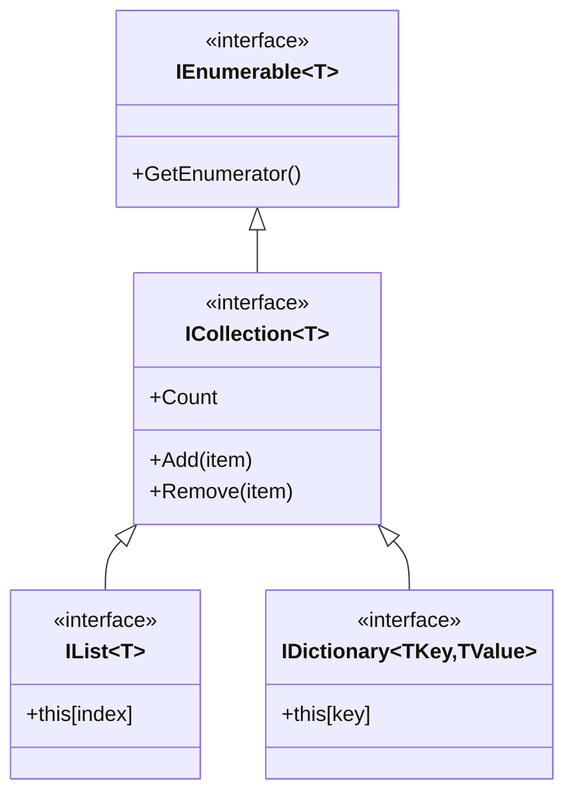
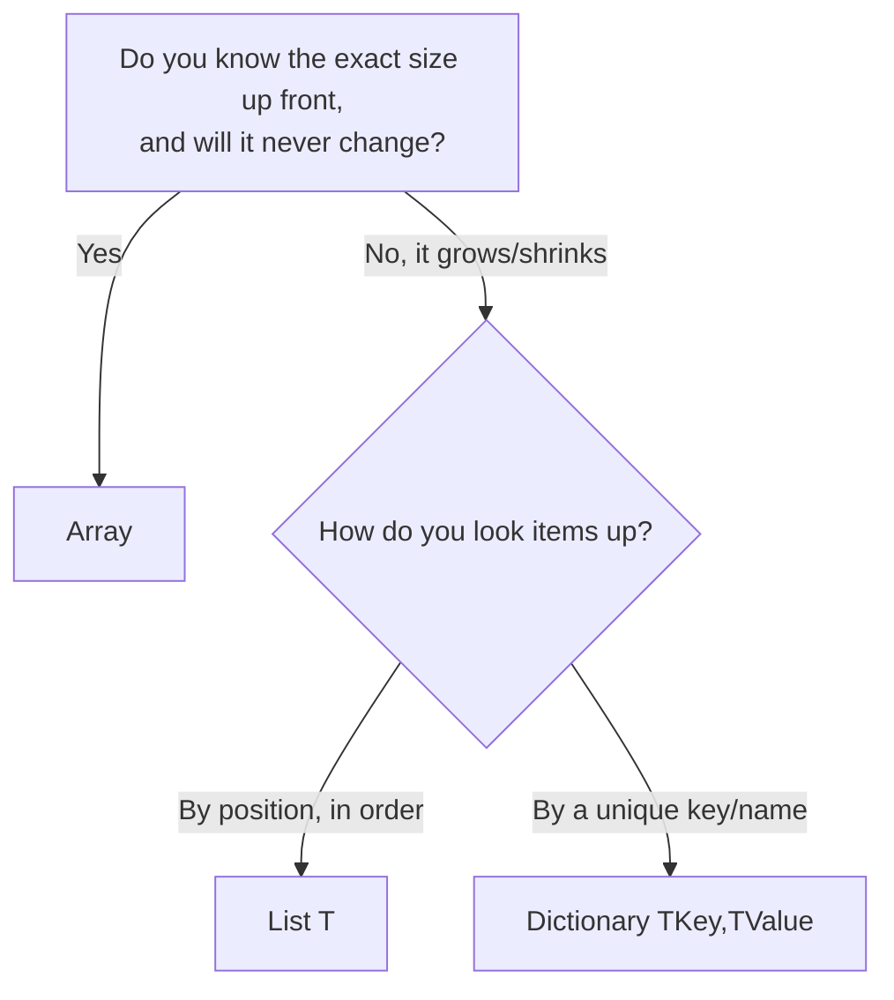

# Introduction to Collections in .NET

## Introduction

Before reading this lesson, you should already be comfortable with **[Real-Time OOP Design: Modeling the Library Catalog](../02-oop/02-38-real-time-oop-library-catalog.md)**, where the `Catalog` and `Member` classes leaned on `Dictionary<string, Book>` and `List<Loan>` without stopping to explain them. This lesson stops to explain them — it introduces **collections**, the family of types .NET provides for storing, organizing, and retrieving groups of objects, and maps out the rest of Module 03, which gives each major collection type its own in-depth treatment.

By the end of this lesson, you will be able to:

- Explain why C# needs collection types at all, beyond the arrays you already know
- Describe the problem a fixed-size array creates once your data starts changing shape
- Name the core interfaces that tie every collection type together (`IEnumerable<T>`, `ICollection<T>`, `IList<T>`, `IDictionary<TKey, TValue>`)
- Locate the main collection types inside the `System.Collections.Generic` namespace
- Identify which upcoming lesson covers which collection type, so you know where to look for depth on any one of them

## Collections — A Layman's Perspective

Imagine you're setting up storage for a small retail shop's stockroom, and all you're allowed to use is a single wooden shelf with exactly twelve fixed slots, each slot sized for one specific product box. That works fine on day one, when you happen to stock exactly twelve products. But the moment a thirteenth product arrives, you have a real problem: there's no thirteenth slot to put it in. You can't simply nail on an extra slot at the end, because the shelf was built as one solid unit — to add capacity, you'd have to build an entirely new, bigger shelf and move every single box across to it, one at a time, in the right order. And that's just the *growing* problem. If a product gets discontinued and needs to be pulled from slot five, every box after it either has to shuffle down one slot, or you live with a permanent gap sitting in the middle of your shelf.

Now imagine instead that the shop invests in a proper modular storage system: a rack of bins that snaps additional bins onto the end as needed, expanding capacity automatically as more stock arrives, and closing a gap automatically when a bin is emptied and removed. Better still, imagine a completely different kind of storage for a different job entirely — instead of bins in a row, a card-catalog-style lookup where you don't care about "slot five" or "slot twelve" at all; you care about finding "the blue widescreen widget" instantly by its label, without ever scanning past the other eleven products to get there. Different jobs call for different storage shapes, and a well-run stockroom keeps more than one style of storage on hand, choosing whichever shape actually fits what's being stored and how it needs to be found again.

That's the exact tension collections resolve in code. A raw array is that fixed twelve-slot shelf — perfectly fast, but rigid about size and rigid about where things sit. A resizable list is the modular bin rack — it grows and shrinks as your data grows and shrinks, without you manually building a bigger shelf every time. A dictionary is the card-catalog lookup — it trades "slot by position" for "value by label," so you can ask for something by name instead of remembering exactly where you put it. Neither replaces the other; a real system, like a real stockroom, keeps several storage shapes on hand and reaches for whichever one actually matches the job in front of it. That's exactly what the rest of this module walks through, one storage shape at a time.

## Collections — A Programming Language Perspective

A **collection** is any type whose entire purpose is to hold a group of other values and expose operations for adding, removing, iterating, or looking them up. .NET's modern collection types live primarily in the `System.Collections.Generic` namespace, and nearly all of them implement a small set of shared interfaces: `IEnumerable<T>` (can be iterated with `foreach`), `ICollection<T>` (adds `Count`, `Add`, `Remove`, `Contains`), `IList<T>` (adds positional indexing, `list[i]`), and `IDictionary<TKey, TValue>` (adds key-based lookup). Because these interfaces are shared, code written against `IEnumerable<T>` or `ICollection<T>` works unchanged whether the concrete type behind it is a `List<T>`, a `HashSet<T>`, or a `Dictionary<TKey, TValue>` — this is the same interface-based polymorphism from Module 02, applied to storage. "Generic" here means these types are parameterized over a type argument (`List<Book>`, `Dictionary<string, Member>`), giving compile-time type safety and avoiding the boxing and casting that the older, non-generic `System.Collections` namespace (`ArrayList`, `Hashtable`) required.

## How to Explore the Collection Landscape in C#

Rather than introduce one collection type in isolation, it helps to see several of them side by side, doing the same job — holding a set of book titles — so their differences in behavior become visible immediately. The example below stores the same five titles in an array, a `List<string>`, and a `HashSet<string>`, and shows where their behavior diverges.


*Figure 1: Every major generic collection builds on `IEnumerable<T>`, with `IList<T>` adding positional access and `IDictionary<TKey, TValue>` adding key-based access.*

```csharp
// Program.cs — .NET 10 / C# 14

string[] titlesArray = ["Clean Code", "Refactoring", "The Pragmatic Programmer"];
List<string> titlesList = new(titlesArray);
HashSet<string> titlesSet = new(titlesArray);

titlesList.Add("Domain-Driven Design"); // Arrays cannot do this — size is fixed.
titlesSet.Add("Clean Code");            // Duplicate is silently ignored — a set enforces uniqueness.

Console.WriteLine($"Array length: {titlesArray.Length}");
Console.WriteLine($"List count: {titlesList.Count}");
Console.WriteLine($"Set count: {titlesSet.Count}");

foreach (string title in titlesList)
{
    Console.WriteLine($"- {title}");
}
```

**Console Output:**

```text
Array length: 3
List count: 4
Set count: 3
- Clean Code
- Refactoring
- The Pragmatic Programmer
- Domain-Driven Design
```

The array stays fixed at 3 items forever — it was never asked to grow, and it couldn't have if it had been. The `List<string>` grows to 4 the moment `Add` is called, no manual resizing required. The `HashSet<string>` stays at 3 because it silently refused a duplicate "Clean Code" — a rule an array or a list would never enforce on its own. Same five lines of input data, three different behaviors, because each type solves a different problem.

## Real-Time Example: Auditing the Library Catalog's Storage Choices

We continue building on the `Catalog` and `Member` classes from the [Module 02 capstone](../02-oop/02-38-real-time-oop-library-catalog.md). That lesson used `Dictionary<string, Book>` to store books by ISBN and `List<Loan>` to track a member's active loans, without explaining why those specific types were chosen over, say, two parallel arrays. This example makes that reasoning explicit by asking the catalog's real, current data three questions a fixed-size array structurally cannot answer well: "how many books are in stock right now," "can I add one more without rebuilding anything," and "can I find a book instantly by its ISBN instead of scanning every entry."

```csharp
// Program.cs — .NET 10 / C# 14 — Real-Time Example

Dictionary<string, string> catalogByIsbn = new()
{
    ["978-0132350884"] = "Clean Code",
    ["978-0134757599"] = "Refactoring"
};

List<string> waitlist = new();

Console.WriteLine($"Books currently cataloged: {catalogByIsbn.Count}");

// A new title arrives — no resizing ceremony, the dictionary just grows.
catalogByIsbn["978-0201616224"] = "The Pragmatic Programmer";
Console.WriteLine($"Books after intake: {catalogByIsbn.Count}");

// Instant lookup by ISBN — no scanning required.
if (catalogByIsbn.TryGetValue("978-0134757599", out string? found))
{
    Console.WriteLine($"Found by ISBN: {found}");
}

// A member joins a waitlist for a book that's out — a list just appends.
waitlist.Add("Ada Lovelace");
waitlist.Add("Grace Hopper");
Console.WriteLine($"Waitlist length: {waitlist.Count}");

// The first waitlisted member is served and leaves the front of the queue.
string served = waitlist[0];
waitlist.RemoveAt(0);
Console.WriteLine($"Served: {served}. Waitlist now: {waitlist.Count}");
```

**Console Output:**

```text
Books currently cataloged: 2
Books after intake: 3
Found by ISBN: Refactoring
Waitlist length: 2
Served: Ada Lovelace. Waitlist now: 1
```

Notice what never happened anywhere in this code: no manual array-resizing logic, no loop scanning every book to find one by ISBN, no shifting every remaining waitlist entry down by one slot after removing the first. `Dictionary<string, string>` and `List<string>` absorbed all of that bookkeeping internally. A real catalog system with thousands of titles and a constantly changing membership couldn't tolerate hand-rolled array management — this is precisely why production .NET code defaults to `System.Collections.Generic` types rather than raw arrays for anything that changes shape at runtime.

## Arrays vs. Generic Collections — The Core Trade-Off

An array and a generic collection like `List<T>` aren't rivals so much as tools built for different constraints. An array is a single, contiguous, fixed-length block of memory — that rigidity is exactly what makes it the fastest possible option when the size truly never changes and you only ever need positional access. `List<T>`, `Dictionary<TKey, TValue>`, and the rest of `System.Collections.Generic` sacrifice a small amount of that raw speed in exchange for flexibility: growing on demand, removing without leaving a gap, or looking things up by key instead of position. Choosing between them isn't about which one is "better" — it's about whether your data's *size* and *access pattern* are known and fixed, or dynamic and lookup-driven.


*Figure 2: A quick decision path for picking a starting collection type — the rest of this module refines each branch.*

| Aspect | Array | Generic Collection (e.g. `List<T>`) |
|---|---|---|
| Size | Fixed at creation | Grows and shrinks dynamically |
| Namespace | Part of the CLR / language itself | `System.Collections.Generic` |
| Typical access | By index, `arr[i]` | By index, key, or iteration, depending on type |
| Resizing cost | Requires manual rebuild (`Array.Resize`) | Handled internally, amortized automatically |
| Best fit | Fixed, performance-critical buffers | Data whose size or shape isn't known in advance |

## Types of Collections in .NET

`System.Collections.Generic` offers several collection shapes, each suited to a different access pattern. This module covers the most important ones in depth:

1. **[Arrays Revisited: Performance and Pitfalls](../03-collections-generics/03-02-arrays-revisited.md)** — why the fixed-size array is still the fastest option, and exactly when that fixed size becomes a liability.
2. **[List<T> in Depth](../03-collections-generics/03-03-list-t-in-depth.md)** — the general-purpose, dynamically resizing sequence that most code reaches for by default.
3. **[LinkedList<T> in Depth](../03-collections-generics/03-04-linkedlist-t-in-depth.md)** — a doubly-linked sequence built for cheap insertion and removal at known positions.
4. **[Dictionary<TKey, TValue> in Depth](../03-collections-generics/03-05-dictionary-in-depth.md)** — hash-table-backed key/value storage for near-instant lookup by key.
5. **[SortedDictionary<TKey, TValue> and SortedList<TKey, TValue>](../03-collections-generics/03-06-sorteddictionary-and-sortedlist.md)** — key/value storage that keeps its keys in order automatically.

## What You've Learned & What's Next

Collections exist because real data changes shape at runtime in ways a fixed-size array can't accommodate gracefully — growing, shrinking, or needing lookup by key instead of position. `System.Collections.Generic` provides a family of types, all built on the same handful of shared interfaces, so you can pick the storage shape that matches your access pattern rather than forcing every problem through one rigid structure.

Continue your learning journey with **[Arrays Revisited: Performance and Pitfalls](../03-collections-generics/03-02-arrays-revisited.md)**, where we take a closer, more rigorous look at the type this lesson used only as a contrast — including exactly how expensive `Array.Resize` really is, and the specific situations where an array still legitimately beats every collection type in this module.

---
*Applies to: .NET 10 / C# 14. Last reviewed 2026-08-16.*
