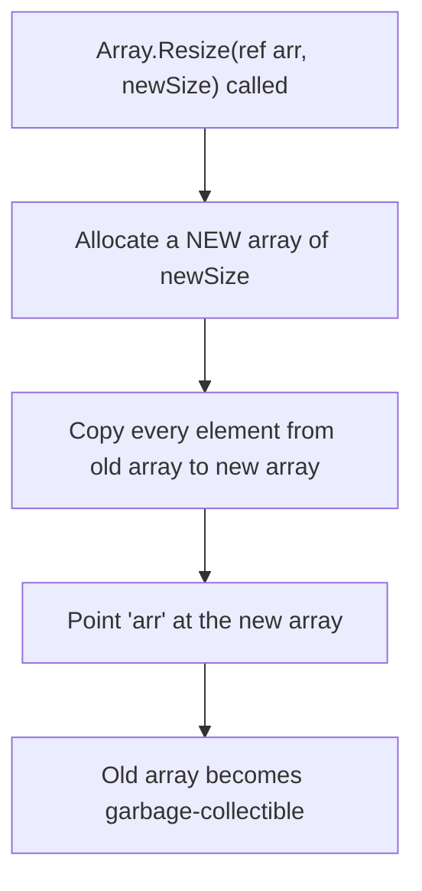
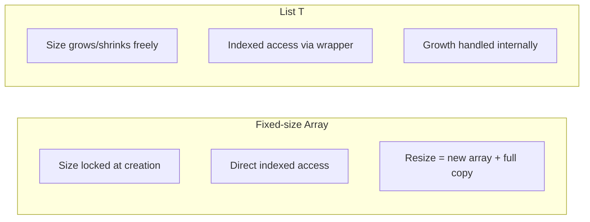

# Arrays Revisited: Performance and Pitfalls

## Introduction

Before reading this lesson, you should already be comfortable with **[Introduction to Collections in .NET](../03-collections-generics/03-01-introduction-to-collections.md)**, which contrasted arrays against `List<T>` and `HashSet<T>` only briefly, as a way of motivating collections in general. This lesson comes back to the array specifically — the most primitive collection type in .NET — and takes it seriously on its own terms: what makes it fast, exactly why its fixed size is a real constraint rather than a minor inconvenience, and the genuine situations where reaching for an array is still the right engineering call.

By the end of this lesson, you will be able to:

- Explain why an array is the fastest general-purpose collection type available in C#
- Describe precisely what "fixed size" means at the memory level, and why it can't simply be changed after creation
- Trace what `Array.Resize` actually does under the hood, and why it isn't free
- Use collection expressions (`[1, 2, 3]`) and the spread operator (`..`) to build arrays concisely
- Identify at least three concrete scenarios where an array is still the better choice over `List<T>`

## Arrays — A Layman's Perspective

Picture a parking garage built the traditional way: poured concrete, load-bearing pillars, a fixed number of marked spaces on each level. That rigidity is precisely what makes it efficient — because the garage's layout is locked in at construction time, every car has a predictable, direct path to its assigned space, no detours, no uncertainty about whether there's room. Attendants can quote you "space 47" and you drive straight there without ever wondering if space 47 might not exist today. That's the appeal of committing to a fixed structure: nothing about it is negotiable at runtime, and that lack of negotiation is exactly what removes overhead.

Now suppose the garage owner decides, after the fact, that a 47-space garage should really have been built for 60 cars. There's no way to bolt ten more spaces onto the side of a finished concrete structure — the building was poured as one solid unit. The only real option is to build an entirely new, larger garage elsewhere and physically drive every single car over to it, one at a time, parking each in its new assigned spot. That's expensive, disruptive, and it has to happen all at once — you can't grow the garage two spaces at a time without repeating that whole rebuild-and-relocate process again and again.

This is also why a fixed garage stops making sense the moment your car count genuinely varies day to day — a business that reliably has anywhere from 20 to 200 cars needs a different kind of facility altogether, one designed from the outset to add and remove capacity without a full rebuild each time. But for a facility whose capacity truly is fixed and known in advance — say, a private garage built for exactly one household's four cars, forever — the traditional poured-concrete approach isn't a limitation at all; it's simply the right, most efficient tool for a problem that was never going to change shape.

The bridge to programming: an array is that poured-concrete garage. Its size is locked in the moment it's created, which is exactly what lets the runtime lay every element out contiguously in memory and hand you direct, immediate access to any slot by its number. When the size genuinely never needs to change, that rigidity costs you nothing and buys you real speed. When it does need to change, growing it means building an entirely new array and copying every element across — there's no partial, in-place expansion, just as there's no bolting extra levels onto a finished garage.

## Arrays — A Programming Language Perspective

An **array** in C# (`T[]`) is a fixed-length, contiguous block of memory holding elements of a single type, allocated on the managed heap and indexed from zero. Because its length is fixed at creation and its elements sit contiguously, the runtime can compute the memory address of any element with simple arithmetic (`base address + index * element size`), giving O(1) indexed access with minimal overhead — no other collection type in .NET beats an array's raw indexing and iteration speed. Arrays implement `IEnumerable<T>`, `ICollection` (non-generic), and `IList` (non-generic), so they interoperate with LINQ and `foreach`, but they do not implement `IList<T>`'s `Add`/`Remove` members in a way that changes length — those operations simply aren't supported. Since C# 12, **collection expressions** (`[1, 2, 3]`) provide a concise, target-typed syntax for array literals, and the **spread operator** (`..`) lets one array's elements be inlined into another's literal — both remain fully current in C# 14.

## How to Work with Arrays and Understand Their Cost in C#

Declaring and filling an array is straightforward; the part worth walking through carefully is what happens when you outgrow one. `Array.Resize` doesn't resize anything in place — it allocates a brand-new array and copies every existing element into it, then repoints your variable at the new array. The example below makes that cost visible by tracking object identity before and after a resize.


*Figure 1: `Array.Resize` is really "allocate new, copy everything, discard old" — never an in-place expansion.*

```csharp
// Program.cs — .NET 10 / C# 14

int[] scores = [90, 85, 78]; // Collection expression — array literal.
Console.WriteLine($"Original length: {scores.Length}");

int[] originalReference = scores;

Array.Resize(ref scores, 5);
scores[3] = 88;
scores[4] = 95;

Console.WriteLine($"New length: {scores.Length}");
Console.WriteLine($"Same array instance? {ReferenceEquals(originalReference, scores)}");

int[] extended = [.. scores, 100]; // Spread operator — copies scores, appends 100.
Console.WriteLine($"Extended length: {extended.Length}, last value: {extended[^1]}");
```

**Console Output:**

```text
Original length: 3
New length: 5
Same array instance? False
Extended length: 6, last value: 100
```

`ReferenceEquals` returns `false` after the resize — proof that `Array.Resize` handed back a completely different array object, not the original one grown in place. The spread operator (`..`) in the final line builds yet another brand-new array by copying every element of `scores` plus one extra value; it's syntactic sugar for the same "allocate and copy" cost, just without the intermediate `Array.Resize` call.

## Real-Time Example: Fixed-Size Buffers in E-Commerce Order Processing

We introduce the E-Commerce Order Processing case study here, starting with a scenario arrays are genuinely well suited for: a warehouse pick-station with a fixed number of physical bins, each holding one item from an order about to be packed. The bin count per station is a hardware constraint — exactly 8 bins, permanently — which is precisely the kind of "size known in advance and never changing" situation an array is built for.

```csharp
// Program.cs — .NET 10 / C# 14 — Real-Time Example

const int BinsPerStation = 8;
string?[] pickStation = new string[BinsPerStation];

string[] orderItems = ["USB-C Cable", "Wireless Mouse", "Laptop Stand", "HDMI Adapter"];

if (orderItems.Length > pickStation.Length)
{
    throw new InvalidOperationException(
        $"Order has {orderItems.Length} items but station only has {pickStation.Length} bins.");
}

for (int i = 0; i < orderItems.Length; i++)
{
    pickStation[i] = orderItems[i];
}

Console.WriteLine("Pick station layout:");
for (int bin = 0; bin < pickStation.Length; bin++)
{
    string label = pickStation[bin] ?? "(empty)";
    Console.WriteLine($"  Bin {bin}: {label}");
}

int filledBins = Array.FindAll(pickStation, item => item is not null).Length;
Console.WriteLine($"Bins in use: {filledBins}/{pickStation.Length}");
```

**Console Output:**

```text
Pick station layout:
  Bin 0: USB-C Cable
  Bin 1: Wireless Mouse
  Bin 2: Laptop Stand
  Bin 3: HDMI Adapter
  Bin 4: (empty)
  Bin 5: (empty)
  Bin 6: (empty)
  Bin 7: (empty)
Bins in use: 4/8
```

Every bin index from 0 through 7 is accounted for — exactly 8 bins, no more, no less — because `pickStation.Length` is fixed the instant the array is created. Notice, too, that nothing here silently protects you from an index mistake beyond throwing `IndexOutOfRangeException`; unlike higher-level collections that manage their own bounds internally, an array simply trusts you to stay within `0..Length-1`. Choosing `string?[]` here — rather than a `List<string>` — reflects a real constraint: the station physically has 8 bins, full stop, and every bin's index corresponds to a real, fixed physical slot the warehouse worker can see. An array communicates that fixed-capacity guarantee directly in the type; a resizable list would imply a flexibility the hardware simply doesn't have.

## Array vs. List<T> — Choosing the Right Default

The comparison boils down to one question: is the size of this collection genuinely fixed and known up front, or does it change over the collection's lifetime? Arrays win decisively on raw indexing speed and memory compactness because there's no growth bookkeeping to maintain — every byte is just the data itself, laid out contiguously. `List<T>` wins the moment your data's size is unpredictable, because it absorbs the cost of growing internally (as the next lesson covers, via capacity doubling) instead of forcing you to call `Array.Resize` by hand every time.


*Figure 2: An array commits to its size once; `List<T>` defers that decision and manages it for you.*

| Aspect | Array (`T[]`) | `List<T>` |
|---|---|---|
| Size | Fixed at creation, never changes | Grows and shrinks dynamically |
| Growing | `Array.Resize` — new array, full copy | `Add` — internal doubling, amortized O(1) |
| Memory overhead | None beyond the elements themselves | Small overhead for unused capacity |
| Raw indexing speed | Fastest possible | Slightly slower (extra indirection) |
| Best fit | Fixed, hardware- or protocol-bound sizes | Data whose size isn't known in advance |

## Types and Related Array Concepts in C#

Arrays connect to several other concepts worth knowing, some covered elsewhere in this curriculum:

1. **[List<T> in Depth](../03-collections-generics/03-03-list-t-in-depth.md)** — the dynamically resizing collection that wraps an internal array and manages its growth for you.
2. **Jagged arrays (`T[][]`)** — arrays of arrays, where each inner array can have its own independent length.
3. **Multidimensional arrays (`T[,]`)** — a single rectangular block addressed by more than one index, useful for grid- or matrix-shaped data.
4. **`Span<T>` and `Memory<T>`** — lightweight, allocation-free views over contiguous array memory, common in high-performance code.
5. **`Array.Sort` and `Array.BinarySearch`** — the static array methods that `List<T>`'s own `Sort`/`BinarySearch` methods (covered next lesson) are modeled on.

## What You've Learned & What's Next

Arrays remain the fastest, most primitive collection C# offers precisely because their size is locked in at creation, letting the runtime lay elements out contiguously with no growth bookkeeping at all. That same fixed size is a real liability the moment your data's shape is unpredictable — growing an array always means allocating a new one and copying everything across, never a cheap in-place expansion.

Continue your learning journey with **[List<T> in Depth](../03-collections-generics/03-03-list-t-in-depth.md)**, where we look at the collection type that wraps exactly this array-resizing problem inside a clean, general-purpose API — and see precisely how its capacity-doubling strategy keeps that cost from biting you on every single `Add`.

---
*Applies to: .NET 10 / C# 14. Last reviewed 2026-08-16.*
