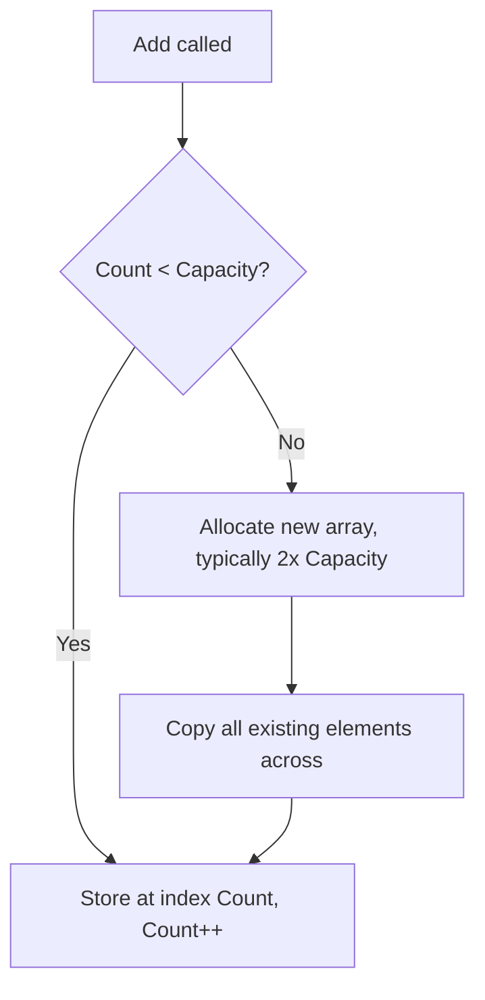
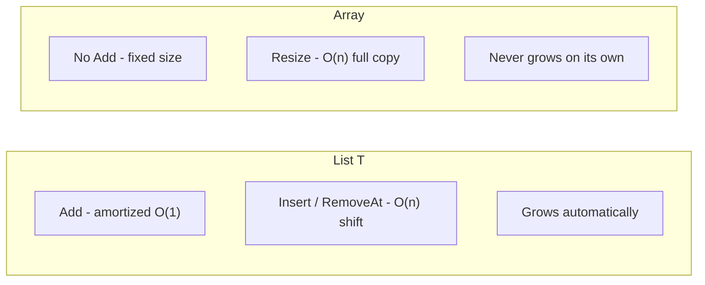

# List<T> in Depth

## Introduction

Before reading this lesson, you should already be comfortable with **[Arrays Revisited: Performance and Pitfalls](../03-collections-generics/03-02-arrays-revisited.md)**, which established that growing an array always means allocating a new one and copying every element across. `List<T>` exists precisely to absorb that cost so you never have to think about it on every single `Add` call. This lesson looks under the hood at how it does that — its internal capacity-doubling strategy — and tours the methods that make `List<T>` the collection most C# code reaches for by default.

By the end of this lesson, you will be able to:

- Explain the difference between a `List<T>`'s `Count` and its `Capacity`
- Describe how capacity doubling keeps repeated `Add` calls cheap on average
- Use the core `List<T>` methods: `Add`, `Insert`, `Remove`, `Sort`, and `BinarySearch`
- Explain why `BinarySearch` requires a sorted list to behave correctly
- Justify why `List<T>` is the right default collection for most general-purpose, ordered data

## List<T> — A Layman's Perspective

Think about how a growing café handles seating on a busy Saturday. Rather than building the dining room to hold exactly today's expected crowd, a well-run café keeps a stack of a few extra folding tables in the back room. When more guests arrive than the current floor can seat, staff don't tear out the walls and rebuild the whole dining room — they simply unfold another table from the stack and add it to the floor. Most of the time, this is fast and unremarkable: grab a table, unfold it, done. But every so often — say, when the back-room stack of spare tables runs completely out — the café has to do something bigger: order and bring in a whole new batch of tables at once, say a dozen more, so they're not caught making one urgent trip to storage per single new guest. That occasional bulk restock is more work than an ordinary "unfold one table," but it means the café can go a long stretch afterward adding guests one at a time without needing another restock trip.

This is also why a café keeps a habit of glancing at how many spare tables are left versus how many guests are actually seated right now — two different numbers worth tracking separately. "How many guests are seated" tells you what's actually being used today. "How many tables the back room could seat if fully unfolded" tells you how much room to grow before the next bulk restock is needed. A savvy manager watches both, because a dining room that's nowhere near its unfolded capacity doesn't need to worry about running out mid-service, while one that's nearly maxed out should expect a restock trip soon.

And crucially, none of this restocking logic is something the guests being seated ever have to think about. A guest just wants a seat; whether that seat came from the existing floor or a freshly unfolded table from the back room is entirely the staff's problem to manage, invisibly, behind the scenes.

The bridge to programming: `List<T>` is that café's seating system. Its `Count` is the guests currently seated; its `Capacity` is how many it could seat right now without a restock. Most `Add` calls are as cheap as unfolding one spare table. Occasionally, when capacity runs out, `List<T>` performs its own version of a bulk restock — allocating a larger internal array and copying everything across — but it does this automatically, invisibly, and (importantly) by over-provisioning enough that it won't need to repeat the trick again for a good while.

## List<T> — A Programming Language Perspective

`List<T>` is a generic, dynamically resizing sequence backed internally by a single array. It exposes two distinct properties: `Count`, the number of elements actually stored, and `Capacity`, the size of the internal backing array — the two are frequently different, since `List<T>` deliberately over-allocates. When an `Add` call would exceed the current `Capacity`, `List<T>` allocates a new internal array — typically **double** the current capacity — and copies every existing element into it, exactly once, before completing the `Add`. Because this doubling happens only occasionally and each doubling roughly halves the frequency of the next one, the *amortized* cost of `Add` across many calls averages out to O(1), even though any single `Add` that triggers a resize is O(n). `List<T>` implements `IList<T>`, `ICollection<T>`, and `IEnumerable<T>`, giving it indexer access (`list[i]`), `Count`, and full LINQ support.

## How to Use List<T>'s Core Methods in C#

`List<T>` supports adding, inserting at a specific position, removing by value or index, sorting in place, and searching a sorted list efficiently. The example below exercises each of these, and also surfaces `Capacity` directly to show doubling in action.


*Figure 1: Most `Add` calls are O(1); only the rare capacity-exhausting call pays the cost of a full copy.*

```csharp
// Program.cs — .NET 10 / C# 14

List<int> scores = new(capacity: 2);
Console.WriteLine($"Initial: Count={scores.Count}, Capacity={scores.Capacity}");

scores.Add(90);
scores.Add(85);
Console.WriteLine($"After 2 adds: Count={scores.Count}, Capacity={scores.Capacity}");

scores.Add(78); // Exceeds capacity of 2 — triggers a resize.
Console.WriteLine($"After 3rd add: Count={scores.Count}, Capacity={scores.Capacity}");

scores.Insert(1, 99); // Insert at position 1, shifting everything after it.
scores.Remove(78);    // Remove by value.

scores.Sort();
Console.WriteLine($"Sorted: {string.Join(", ", scores)}");

int index = scores.BinarySearch(90);
Console.WriteLine($"BinarySearch for 90 found at index: {index}");
```

**Console Output:**

```text
Initial: Count=0, Capacity=2
After 2 adds: Count=2, Capacity=2
After 3rd add: Count=3, Capacity=4
Sorted: 85, 90, 99
BinarySearch for 90 found at index: 1
```

The third `Add` exceeded the capacity of 2, so `List<T>` doubled its capacity to 4 rather than growing by one — that's the amortized-cost strategy paying off before it's needed again. `Insert(1, 99)` shifted every element from index 1 onward one slot to the right — an O(n) operation, unlike `Add`, which is why frequent mid-list insertion is one of `List<T>`'s weaker spots. `BinarySearch` only works correctly because `Sort()` ran first; calling it on an unsorted list gives an unreliable result.

## Real-Time Example: Managing an Order Queue in E-Commerce Order Processing

We continue the E-Commerce Order Processing case study from the [previous lesson](../03-collections-generics/03-02-arrays-revisited.md), where a warehouse pick station used a fixed-size array for its 8 physical bins. Now consider the order queue feeding that station — the number of pending orders changes constantly throughout the day, which is exactly the kind of unpredictable-size scenario `List<T>` is built for.

```csharp
// Program.cs — .NET 10 / C# 14 — Real-Time Example

record Order(int OrderId, string Customer, decimal Total);

List<Order> pendingOrders = new();

pendingOrders.Add(new Order(1001, "Priya Sharma", 129.99m));
pendingOrders.Add(new Order(1002, "Miguel Torres", 45.50m));
pendingOrders.Add(new Order(1003, "Aiko Tanaka", 302.10m));

Console.WriteLine($"Orders queued: {pendingOrders.Count}");

// A rush order arrives and must jump to the front of the queue.
pendingOrders.Insert(0, new Order(1004, "Rush: Chen Wei", 89.00m));
Console.WriteLine($"After rush insert, front of queue: {pendingOrders[0].Customer}");

// Order 1002 gets cancelled by the customer.
pendingOrders.RemoveAll(o => o.OrderId == 1002);
Console.WriteLine($"Orders remaining after cancellation: {pendingOrders.Count}");

// Fulfillment wants orders processed highest-value-first.
pendingOrders.Sort((a, b) => b.Total.CompareTo(a.Total));

Console.WriteLine("Processing order:");
foreach (Order order in pendingOrders)
{
    Console.WriteLine($"  #{order.OrderId} {order.Customer} - ${order.Total}");
}
```

**Console Output:**

```text
Orders queued: 3
After rush insert, front of queue: Rush: Chen Wei
Orders remaining after cancellation: 3
Processing order:
  #1003 Aiko Tanaka - $302.10
  #1001 Priya Sharma - $129.99
  #1004 Rush: Chen Wei - $89.00
```

None of this — inserting at the front, removing a cancelled order by predicate, or re-sorting by a custom comparison — required any manual array management. `List<T>.Insert(0, ...)` handled shifting every other order back one position; `RemoveAll` handled finding and closing the gap left by the cancelled order; `Sort` with a lambda comparer reordered the whole queue by business rule rather than insertion order. A real order-processing system fields exactly this kind of constant, unpredictable churn all day, which is why `List<T>` — not a fixed array — is the natural fit for an order queue.

## List<T> vs. Array — When the Flexibility Is Worth It

The previous lesson established that arrays win on raw speed when size is fixed. `List<T>` gives up a sliver of that raw speed — an extra layer of indirection and occasional resize overhead — in exchange for never requiring you to hand-manage growth, insertion gaps, or removal shifting yourself. For the overwhelming majority of application-level code, where collection sizes are driven by user input, database results, or business events rather than a fixed hardware constraint, that trade is clearly worth it.


*Figure 2: `List<T>` automates exactly the growth management an array leaves entirely to you.*

| Aspect | `List<T>` | Array (`T[]`) |
|---|---|---|
| Growing | Automatic, amortized O(1) via `Add` | Manual, always O(n) via `Array.Resize` |
| Mid-sequence insert/remove | Built-in (`Insert`/`RemoveAt`), O(n) shift | Not supported directly |
| Extra memory overhead | Yes — unused capacity beyond `Count` | None — exact size only |
| Sorting/searching | `Sort()`, `BinarySearch()` built in | `Array.Sort()`, `Array.BinarySearch()` (static) |
| Best fit | Size unknown or changes at runtime | Size fixed and known up front |

## Types and Related List<T> Concepts in C#

`List<T>` sits alongside several related types and members worth knowing:

1. **[LinkedList<T> in Depth](../03-collections-generics/03-04-linkedlist-t-in-depth.md)** — an alternative sequence type optimized for a different cost profile: cheap insertion/removal, expensive indexed access.
2. **`List<T>.TrimExcess()`** — reclaims unused capacity once a list's final size is known and won't grow further.
3. **`IReadOnlyList<T>`** — the interface used (as in the Module 02 capstone's `Member.ActiveLoans`) to expose a `List<T>` for reading without allowing external mutation.
4. **`List<T>.Find` / `FindAll` / `Exists`** — predicate-based search methods that pre-date LINQ but remain in everyday use.
5. **`List<T>.AsReadOnly()`** — wraps a list in a read-only view backed by the same underlying data, without copying it.

## What You've Learned & What's Next

`List<T>` earns its place as the default general-purpose collection by handling growth automatically through amortized capacity doubling, and by offering a rich, ready-made set of methods — `Add`, `Insert`, `Remove`, `Sort`, `BinarySearch` — for everyday sequence manipulation. Its one real weak spot is mid-sequence insertion and removal, which still costs an O(n) shift under the hood.

Continue your learning journey with **[LinkedList<T> in Depth](../03-collections-generics/03-04-linkedlist-t-in-depth.md)**, where we examine a collection type built specifically to make that O(n) shift disappear — at the cost of losing the fast indexed access `List<T>` provides for free.

---
*Applies to: .NET 10 / C# 14. Last reviewed 2026-08-16.*
