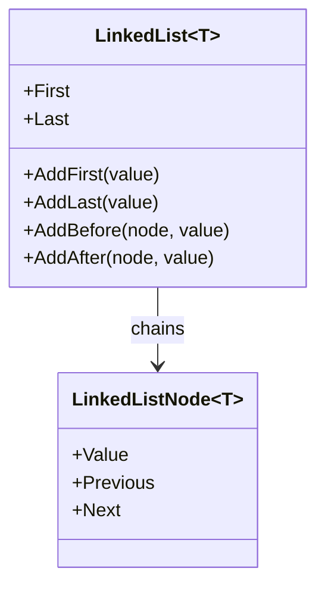
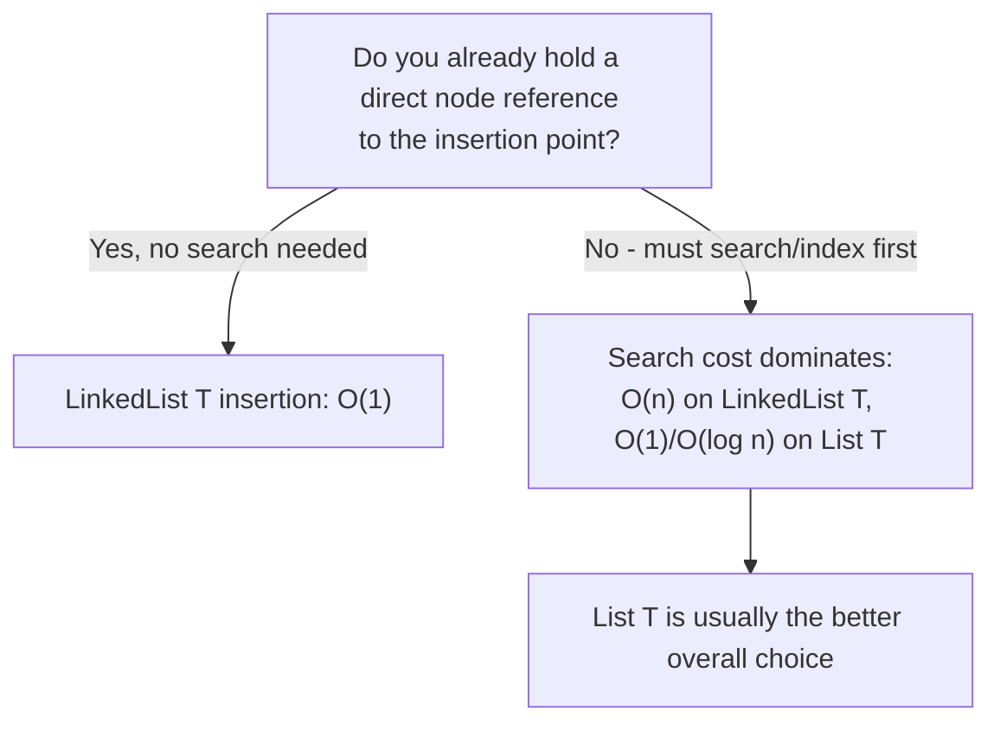

# LinkedList<T> in Depth

## Introduction

Before reading this lesson, you should already be comfortable with **[List<T> in Depth](../03-collections-generics/03-03-list-t-in-depth.md)**, where we saw that `Insert` and `RemoveAt` cost an O(n) shift because `List<T>`'s elements sit in one contiguous array. This lesson introduces `LinkedList<T>`, a collection built specifically to make that shift disappear — and, just as importantly, gives an honest account of how narrow the set of situations is where that trade actually pays off in real application code.

By the end of this lesson, you will be able to:

- Describe the doubly-linked node structure `LinkedList<T>` is built from
- Explain why inserting or removing at a known node is O(1) for `LinkedList<T>` but O(n) for `List<T>`
- Explain why indexed/positional access is O(n) for `LinkedList<T>` but O(1) for `List<T>` — the mirror-image trade-off
- Use `LinkedListNode<T>`, `AddFirst`, `AddLast`, `AddBefore`, and `AddAfter`
- Make an honest, evidence-based judgment about when `LinkedList<T>` is actually the right choice — and recognize that in most everyday C# code, it isn't

## LinkedList<T> — A Layman's Perspective

Picture a conga line at a party, where every dancer holds onto the shoulders of the person directly in front of them, and also keeps a hand resting on the shoulder of the person directly behind. Each dancer only knows two things: who's immediately ahead of them, and who's immediately behind. Now suppose a new dancer wants to join the line right between the fifth and sixth person. That's trivial — the fifth person simply lets go of the sixth person's shoulder, both of them grab onto the new dancer instead, and the whole rest of the line, everyone from the sixth dancer onward, doesn't move an inch. Nobody has to shuffle down; nobody's position number even changes, because there were no position numbers to begin with, just a chain of "who's next to whom."

Compare that to a marching band standing in a numbered grid formation, where every performer's spot is defined by an exact row and column. If someone wants to squeeze a new performer into row 3, everyone from row 3 onward has to physically step back one row to make room — a controlled, synchronized shuffle affecting a large chunk of the formation. That's more disruptive than the conga line's insert, but it buys the band something the conga line doesn't have: if the director shouts "row 3, column 4, step forward," that exact performer can walk straight to that precise spot immediately, without anyone needing to count through the chain of who's-next-to-whom to figure out who currently occupies it.

That's the core trade-off. The conga line makes inserting or pulling someone out of the middle nearly free, because nothing beyond the immediate neighbors needs to know or care. But it makes finding "the eighth dancer from the front" surprisingly annoying — you'd have to walk the chain from the very front, one dancer at a time, counting as you go, because there's no numbered grid to consult. The marching band is the exact opposite: instant lookup by position, but an insert or removal disturbs a whole block of performers who all have to physically move.

The bridge to programming: `LinkedList<T>` is the conga line — each element (each `LinkedListNode<T>`) only knows its immediate previous and next neighbor, so inserting or removing right next to a node you already have a reference to is genuinely O(1), disturbing nothing else. `List<T>` is the marching band — instant indexed lookup, but inserting or removing in the middle means shifting a whole block of elements. Whether that trade is worth it, as this lesson will argue plainly, depends entirely on how often your code actually holds a direct reference to "the node right before where I need to insert" — which, honestly, is rarer in typical application code than it might first appear.

## LinkedList<T> — A Programming Language Perspective

`LinkedList<T>` is a generic, doubly-linked list: a sequence of `LinkedListNode<T>` objects, each holding a value plus references to its `Previous` and `Next` node. Unlike `List<T>`, it has no underlying contiguous array and no `Capacity` concept — each node is its own separately heap-allocated object. This structure makes inserting or removing a node O(1) *once you already hold a reference to the relevant node* (via `AddBefore`, `AddAfter`, or `Remove(LinkedListNode<T>)`), because only that node's neighbors' `Previous`/`Next` pointers need updating. The mirror-image cost is that `LinkedList<T>` has no indexer — there is no `list[i]` — so reaching "the 8th element" requires walking node-by-node from `First` or `Last`, an O(n) traversal. `LinkedList<T>` implements `ICollection<T>` and `IEnumerable<T>`, but not `IList<T>`, precisely because it cannot offer O(1) positional indexing.

## How to Use LinkedList<T> in C#

Building a `LinkedList<T>` means working with explicit `LinkedListNode<T>` references rather than plain values, since those node references are exactly what make targeted insertion and removal O(1). The example below builds a small chain and demonstrates `AddFirst`, `AddLast`, and inserting directly next to a held node reference with `AddAfter`.


*Figure 1: `LinkedList<T>` is a chain of nodes, each aware only of its immediate neighbors — there is no indexed slot 0, 1, 2… underneath.*

```csharp
// Program.cs — .NET 10 / C# 14

LinkedList<string> songQueue = new();

songQueue.AddLast("Bohemian Rhapsody");
songQueue.AddLast("Stairway to Heaven");
LinkedListNode<string> imagineNode = songQueue.AddLast("Imagine");

songQueue.AddFirst("Hotel California"); // Jumps straight to the front.

// Insert directly after a node we already hold a reference to — O(1), no shifting.
songQueue.AddAfter(imagineNode, "Hey Jude");

Console.WriteLine("Queue order:");
foreach (string song in songQueue)
{
    Console.WriteLine($"  {song}");
}

Console.WriteLine($"First: {songQueue.First!.Value}");
Console.WriteLine($"Last: {songQueue.Last!.Value}");
```

**Console Output:**

```text
Queue order:
  Hotel California
  Bohemian Rhapsody
  Stairway to Heaven
  Imagine
  Hey Jude
First: Hotel California
Last: Hey Jude
```

`AddFirst` placed "Hotel California" at the front without touching any other node. `AddAfter(imagineNode, "Hey Jude")` inserted directly next to the node we already had a reference to (`imagineNode`), which is precisely why it's O(1) here — no traversal was needed to find where "Imagine" was, because we already held that exact node. Contrast that with `List<T>.Insert(index, value)`, which requires knowing a numeric index and then shifts every later element down.

## Real-Time Example: A Transaction History Chain in Banking/ATM

We introduce the Banking/ATM case study here, modeling an account's transaction history as a `LinkedList<Transaction>`. A transaction ledger is a reasonable fit for a linked structure because new entries are almost always appended at one end (`AddLast`), and — the scenario this example focuses on — a bank sometimes needs to insert a correcting entry immediately after a specific transaction it already has a direct reference to, such as reversing a disputed charge right where it occurred in the sequence.

```csharp
// Program.cs — .NET 10 / C# 14 — Real-Time Example

record Transaction(string Description, decimal Amount);

LinkedList<Transaction> ledger = new();

ledger.AddLast(new Transaction("Opening Deposit", 500.00m));
ledger.AddLast(new Transaction("Grocery Store", -45.20m));
LinkedListNode<Transaction> disputedCharge = ledger.AddLast(new Transaction("Unknown Merchant Charge", -89.99m));
ledger.AddLast(new Transaction("Salary Credit", 2000.00m));

Console.WriteLine("Ledger before dispute resolution:");
foreach (Transaction t in ledger)
{
    Console.WriteLine($"  {t.Description}: {t.Amount:C}");
}

// The disputed charge is confirmed fraudulent — insert a reversal right after it,
// preserving chronological order without touching any other node.
ledger.AddAfter(disputedCharge, new Transaction("Fraud Reversal", 89.99m));

Console.WriteLine("\nLedger after fraud reversal posted:");
foreach (Transaction t in ledger)
{
    Console.WriteLine($"  {t.Description}: {t.Amount:C}");
}

decimal balance = 0m;
foreach (Transaction t in ledger)
{
    balance += t.Amount;
}
Console.WriteLine($"\nFinal balance: {balance:C}");
```

**Console Output:**

```text
Ledger before dispute resolution:
  Opening Deposit: $500.00
  Grocery Store: ($45.20)
  Unknown Merchant Charge: ($89.99)
  Salary Credit: $2,000.00

Ledger after fraud reversal posted:
  Opening Deposit: $500.00
  Grocery Store: ($45.20)
  Unknown Merchant Charge: ($89.99)
  Fraud Reversal: $89.99
  Salary Credit: $2,000.00

Final balance: $2,454.80
```

The `Fraud Reversal` entry lands exactly where it belongs chronologically — right after the disputed charge it corrects — without disturbing the `Salary Credit` entry that follows it, or requiring any index arithmetic to compute where "right after that node" was. This is the honest, narrow case where `LinkedList<T>` earns its place over `List<T>`: the code already held a direct node reference (`disputedCharge`) from when that transaction was first posted, so the insertion truly was O(1). Had the bank instead needed to find that transaction by scanning for it — "the charge from Unknown Merchant" — the search itself would already have cost O(n), erasing most of the advantage.

## LinkedList<T> vs. List<T> — Being Honest About When It's Worth It

This is the trade-off worth stating plainly: `LinkedList<T>` only wins when your code already holds a direct `LinkedListNode<T>` reference to the exact insertion point, avoiding a search entirely. In the far more common case where you first have to *find* the right spot — by index, by value, or by any search — that search is O(n) on a `LinkedList<T>` (no indexer, no binary search), while `List<T>` at least offers O(1) indexed access and, once sorted, O(log n) `BinarySearch`. In practice, most application code either appends/removes at the ends (which `List<T>` also handles cheaply enough) or needs to search before it can insert — which is exactly why `List<T>`, not `LinkedList<T>`, is the default general-purpose choice, and why `LinkedList<T>` shows up rarely in production C# outside of specific patterns like LRU-cache internals or the queue-like scenario above.


*Figure 2: `LinkedList<T>`'s O(1) insertion advantage only materializes when the search to find the insertion point is already avoided.*

| Aspect | `LinkedList<T>` | `List<T>` |
|---|---|---|
| Structure | Doubly-linked nodes, scattered on heap | Single contiguous backing array |
| Insert/remove at a *held* reference | O(1) | O(n) — requires shifting |
| Indexed access (`list[i]`) | Not supported — O(n) traversal via `First`/`Next` | O(1) |
| Searching for a value | O(n), no binary search available | O(n) unsorted, O(log n) via `BinarySearch` if sorted |
| Typical real-world use | Rare — LRU caches, manual queue/deque patterns | Default choice for almost everything else |

## Types and Related Sequence Concepts in C#

`LinkedList<T>` sits among several related sequence types and concepts:

1. **[List<T> in Depth](../03-collections-generics/03-03-list-t-in-depth.md)** — the far more commonly used general-purpose sequence, contrasted throughout this lesson.
2. **`Queue<T>`** — a first-in-first-out sequence, often a better fit than `LinkedList<T>` for pure append/dequeue patterns.
3. **`Stack<T>`** — a last-in-first-out sequence, similarly array-backed and usually preferable to manually using `LinkedList<T>` as a stack.
4. **`LinkedListNode<T>`** — the node type this lesson worked with directly; understanding it is key to using `LinkedList<T>` correctly at all.
5. **`System.Collections.Generic.PriorityQueue<TElement,TPriority>`** — a heap-backed collection for priority-ordered processing, another node/array-based alternative worth knowing.

## What You've Learned & What's Next

`LinkedList<T>`'s doubly-linked node structure makes insertion and removal at a *known* node genuinely O(1), a real advantage `List<T>` cannot match. But that advantage only pays off when your code already holds a direct node reference and skips searching entirely — in the much more common case of needing to find a position first, `List<T>`'s O(1) indexing and O(log n) sorted search make it the stronger overall default, which is exactly why `LinkedList<T>` remains a specialist tool rather than an everyday one.

Continue your learning journey with **[Dictionary<TKey,TValue> in Depth](../03-collections-generics/03-05-dictionary-in-depth.md)**, where we move away from position-based sequences entirely and look at a collection built for near-instant lookup by key instead.

---
*Applies to: .NET 10 / C# 14. Last reviewed 2026-08-16.*
