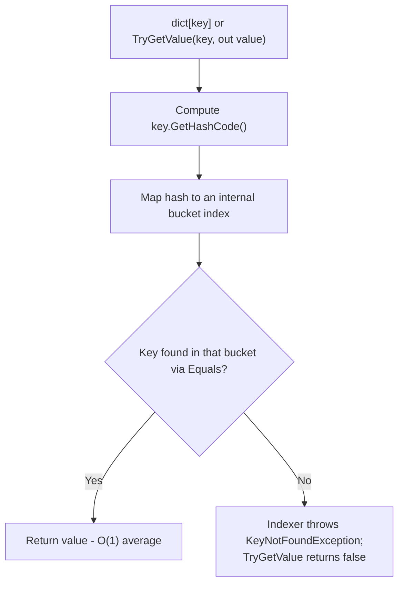
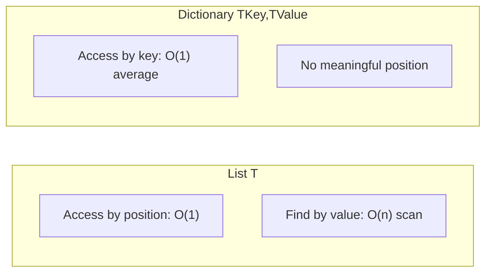

# Dictionary<TKey,TValue> in Depth

## Introduction

Before reading this lesson, you should already be comfortable with **[LinkedList<T> in Depth](../03-collections-generics/03-04-linkedlist-t-in-depth.md)** and, more broadly, with every sequence type covered so far in this module — arrays, `List<T>`, and `LinkedList<T>` — all of which locate their elements either by position or by walking a chain. This lesson introduces a fundamentally different access pattern: `Dictionary<TKey, TValue>`, which locates a value not by position at all, but by a key, in close to constant time regardless of how many entries it holds.

By the end of this lesson, you will be able to:

- Explain how a hash table backs `Dictionary<TKey, TValue>` and why that gives O(1) average-case lookup
- Use the indexer (`dict[key]`) and explain exactly when it throws
- Use `TryGetValue` to look up a key safely, without a try/catch
- State the contract between `GetHashCode` and `Equals` that a dictionary key type must honor
- Diagnose what goes wrong when a custom key type violates that contract

## Dictionary<TKey,TValue> — A Layman's Perspective

Picture a hotel's key-card system versus its old-fashioned pigeonhole mail rack. The mail rack assigns each room a numbered slot in a fixed grid — room 214's mail always goes in the slot physically labeled 214, and to find it, staff walk to that exact, predictable spot. That's fine, but it means the rack's layout is tied to room numbers specifically; if the hotel wanted to look mail up by *guest name* instead, staff would have to scan every single slot's mail, reading names, until they found the right one.

A key-card system works completely differently. When you check in, the front desk doesn't hunt for "your" pre-assigned physical slot — it runs your reservation code through the system, which instantly computes exactly where your key-card record lives, and encodes your room and checkout date into a new card on the spot. When you tap your key card at your door, the lock doesn't scan through every guest who's ever stayed at the hotel; it performs the same instant computation the front desk did, arrives directly at your record, and checks it in a single step. It doesn't matter whether the hotel has 50 rooms or 5,000 — the time it takes to check one key card is roughly the same either way, because the system never has to search past irrelevant records to get there.

Now, this system only works because of one strict rule the hotel enforces without exception: two guests who are, for all practical purposes, "the same guest" — same reservation code — must always compute to the same record, and two genuinely different guests must (almost always) compute to different ones. If the front desk's computation were sloppy and occasionally produced the same result for two totally different guests, the system would start handing out the wrong room's key, or worse, silently overwrite one guest's record with another's. The computation has to be trustworthy and consistent, every single time, for the entire instant-lookup promise to hold.

The bridge to programming: `Dictionary<TKey, TValue>` is that key-card system. Instead of scanning a fixed grid of slots (an array) or walking a chain (a linked list), it runs each key through a hashing computation that lands almost directly on the right internal slot, giving lookups that stay fast no matter how large the dictionary grows. And just like the hotel's strict rule about guest records, a dictionary depends entirely on its key type computing that "instant location" — via `GetHashCode` — consistently and correctly, with `Equals` agreeing on which keys actually count as the same. Get that contract wrong, and the dictionary's lookups quietly misbehave, exactly like a key-card system handing out the wrong door.

## Dictionary<TKey,TValue> — A Programming Language Perspective

`Dictionary<TKey, TValue>` is a generic collection backed by a **hash table**: an internal array of "buckets," where each key's bucket is chosen by computing `key.GetHashCode()` and reducing that hash to an index within the array's current size. Looking up a key means computing its hash once, jumping directly to the corresponding bucket, and confirming a match with `Equals` — no scanning of unrelated entries — giving **O(1) average-case** lookup, insertion, and removal, independent of how many entries the dictionary holds (worst case degrades to O(n) only under pathological hash collisions). `Dictionary<TKey, TValue>` implements `IDictionary<TKey, TValue>`, `ICollection<KeyValuePair<TKey, TValue>>`, and `IEnumerable<KeyValuePair<TKey, TValue>>`. Correct behavior depends entirely on the key type upholding the **`GetHashCode`/`Equals` contract**: any two keys considered equal by `Equals` *must* return the same value from `GetHashCode` (the reverse isn't required — different keys may share a hash, which is a normal "collision," just not an equality violation).

## How to Use Dictionary<TKey,TValue> in C#

Reading a key that might not exist should almost never be done through the indexer directly, since a missing key throws. `TryGetValue` is the idiomatic way to check and retrieve in one step, without exceptions driving normal control flow. The example below contrasts both approaches.


*Figure 1: Both the indexer and `TryGetValue` follow the same hash-then-confirm path; they only differ in how a miss is reported.*

```csharp
// Program.cs — .NET 10 / C# 14

Dictionary<string, decimal> prices = new()
{
    ["USB-C Cable"] = 12.99m,
    ["Wireless Mouse"] = 24.50m
};

// The indexer is convenient but throws if the key is missing.
decimal mousePrice = prices["Wireless Mouse"];
Console.WriteLine($"Wireless Mouse: {mousePrice:C}");

// TryGetValue is the safe, idiomatic way to check for a possibly-missing key.
if (prices.TryGetValue("HDMI Adapter", out decimal adapterPrice))
{
    Console.WriteLine($"HDMI Adapter: {adapterPrice:C}");
}
else
{
    Console.WriteLine("HDMI Adapter: not in catalog.");
}

try
{
    decimal missing = prices["HDMI Adapter"];
    Console.WriteLine(missing);
}
catch (KeyNotFoundException)
{
    Console.WriteLine("Indexer threw KeyNotFoundException for a missing key.");
}
```

**Console Output:**

```text
Wireless Mouse: $24.50
HDMI Adapter: not in catalog.
Indexer threw KeyNotFoundException for a missing key.
```

`TryGetValue` returned `false` for the missing "HDMI Adapter" key cleanly, letting the `if`/`else` handle it as ordinary control flow. The indexer, by contrast, threw `KeyNotFoundException` the moment it was asked for that same missing key — which is exactly why production code almost always prefers `TryGetValue` for lookups that might miss, reserving the indexer for keys already known to exist (or for writes, where the indexer both inserts and updates).

## Real-Time Example: Member Lookup in Library/Inventory Management, and a Broken Key Type

We return to the Library/Inventory Management case study, extending the `Member` type from the [Module 02 capstone](../02-oop/02-38-real-time-oop-library-catalog.md). A real library needs to look members up by their member card instantly, not by scanning every member on file — exactly the job `Dictionary<TKey, TValue>` is built for. This example deliberately shows both a correct key type and a broken one, tying back to [Module 02's equality lesson](../02-oop/02-38-real-time-oop-library-catalog.md), because the difference is the single most common source of silent dictionary bugs.

```csharp
// Program.cs — .NET 10 / C# 14 — Real-Time Example

// Correct: a record's compiler-generated Equals/GetHashCode are automatically
// consistent with each other, based on MemberId.
record MemberCard(string MemberId);

// Broken on purpose: a plain class with a custom Equals but no matching GetHashCode
// override violates the contract — this is what NOT to do.
class BrokenMemberCard(string memberId)
{
    public string MemberId { get; } = memberId;

    public override bool Equals(object? obj) =>
        obj is BrokenMemberCard other && MemberId == other.MemberId;
    // No GetHashCode override: two "equal" cards can hash differently!
}

Dictionary<MemberCard, string> membersByCard = new()
{
    [new MemberCard("M-001")] = "Grace Hopper",
    [new MemberCard("M-002")] = "Ada Lovelace"
};

// A brand-new MemberCard instance, but with the same MemberId, still finds the entry.
bool foundCorrect = membersByCard.TryGetValue(new MemberCard("M-001"), out string? name);
Console.WriteLine($"Correct key type lookup found: {foundCorrect}, name: {name}");

Dictionary<BrokenMemberCard, string> brokenByCard = new()
{
    [new BrokenMemberCard("M-001")] = "Grace Hopper"
};

// A brand-new BrokenMemberCard with the same MemberId is "Equals" but hashes
// differently by default, so the dictionary looks in the wrong bucket entirely.
bool foundBroken = brokenByCard.TryGetValue(new BrokenMemberCard("M-001"), out string? brokenName);
Console.WriteLine($"Broken key type lookup found: {foundBroken}, name: {brokenName ?? "(none)"}");
```

**Console Output:**

```text
Correct key type lookup found: True, name: Grace Hopper
Broken key type lookup found: False, name: (none)
```

The `record`-based `MemberCard` works exactly as expected: even though the lookup uses a *different object instance* than the one used to insert, its compiler-generated `GetHashCode` and `Equals` are automatically consistent with each other, so the dictionary finds the right bucket. `BrokenMemberCard` overrides `Equals` to compare by `MemberId` but never overrides `GetHashCode` — so it silently falls back to the default reference-based hash, meaning two "equal" cards land in *different* buckets and the lookup fails despite `Equals` saying they should match. This is precisely the [`GetHashCode`/`Equals` correctness](../02-oop/02-38-real-time-oop-library-catalog.md) rule from Module 02: override one, you must override both, consistently, or dictionary lookups become unreliable in exactly this quiet, hard-to-debug way.

## Dictionary<TKey,TValue> vs. List<T> — Lookup by Key vs. Lookup by Position

`List<T>` and `Dictionary<TKey, TValue>` answer fundamentally different questions. A `List<T>` answers "what's at position 3," in O(1), or "does this value exist anywhere," in O(n) — it has no concept of a key distinct from a value. A `Dictionary<TKey, TValue>` answers "what value is associated with this key," in O(1) average case, but has no meaningful concept of "position 3" at all — iteration order is not guaranteed and should never be relied on. Choosing between them is really choosing *what question your code needs to ask most often*.


*Figure 2: `List<T>` is fast by position and slow by value; `Dictionary<TKey, TValue>` is fast by key and has no position at all.*

| Aspect | `Dictionary<TKey, TValue>` | `List<T>` |
|---|---|---|
| Backing structure | Hash table (buckets) | Contiguous array |
| Lookup by key/value | O(1) average, by key | O(n) scan, by value |
| Positional access | Not meaningful | O(1), by index |
| Iteration order | Not guaranteed | Insertion order, stable |
| Key requirements | Must implement `GetHashCode`/`Equals` consistently | No key concept at all |

## Types and Related Key/Value Concepts in C#

`Dictionary<TKey, TValue>` connects to several related types worth knowing:

1. **[SortedDictionary<TKey,TValue> and SortedList<TKey,TValue>](../03-collections-generics/03-06-sorteddictionary-and-sortedlist.md)** — key/value collections that keep keys in sorted order, at some lookup-speed cost.
2. **`FrozenDictionary<TKey, TValue>`** — introduced in .NET 8, an immutable dictionary optimized for read-heavy scenarios where the key set never changes after construction.
3. **`HashSet<T>`** — conceptually a `Dictionary<TKey, TValue>` with no associated value, used purely for fast membership testing and uniqueness.
4. **`ConcurrentDictionary<TKey, TValue>`** — a thread-safe dictionary variant for multi-threaded read/write scenarios.
5. **`KeyNotFoundException`** — the specific exception the indexer throws on a missing key, seen directly in this lesson's first example.

## What You've Learned & What's Next

`Dictionary<TKey, TValue>` trades position-based access for key-based access, using a hash table to deliver O(1) average-case lookup regardless of size. `TryGetValue` is the safe, idiomatic way to probe for a possibly-missing key, while the indexer is best reserved for keys already known to exist. None of this works correctly, though, unless your key type honors the `GetHashCode`/`Equals` contract — override one without the other, and lookups fail silently rather than loudly, exactly as this lesson's `BrokenMemberCard` demonstrated.

Continue your learning journey with **[SortedDictionary<TKey,TValue> and SortedList<TKey,TValue>](../03-collections-generics/03-06-sorteddictionary-and-sortedlist.md)**, where we look at two collections that keep their keys in sorted order automatically — trading away some of `Dictionary<TKey, TValue>`'s raw lookup speed for the ability to iterate keys in a predictable, ordered sequence.

---
*Applies to: .NET 10 / C# 14. Last reviewed 2026-08-16.*
