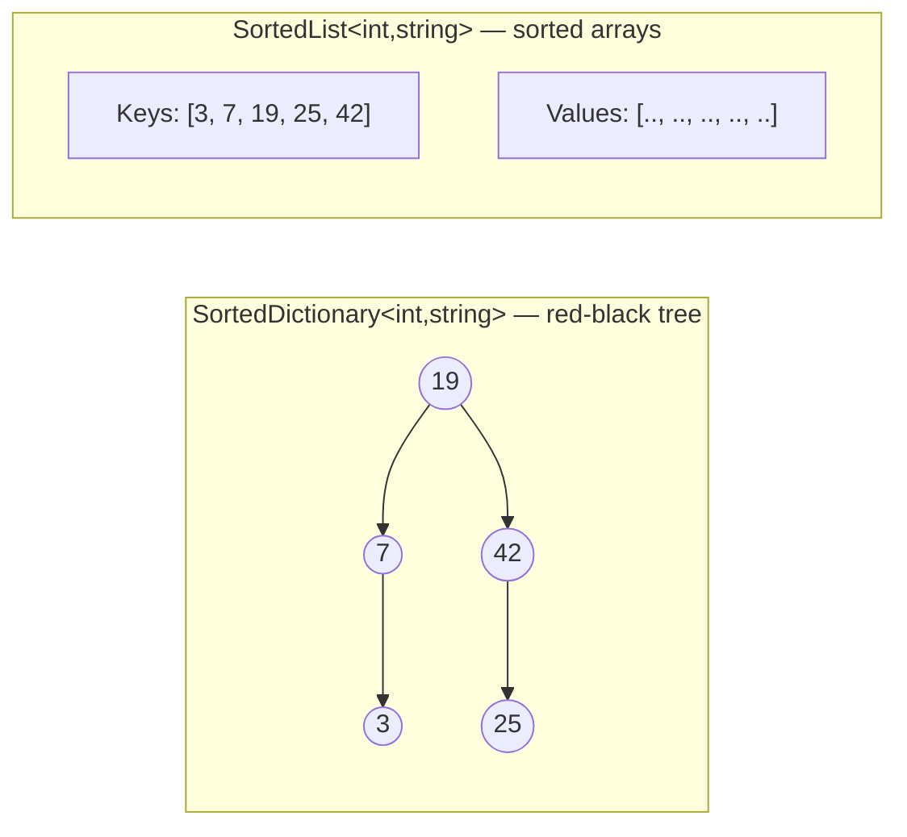
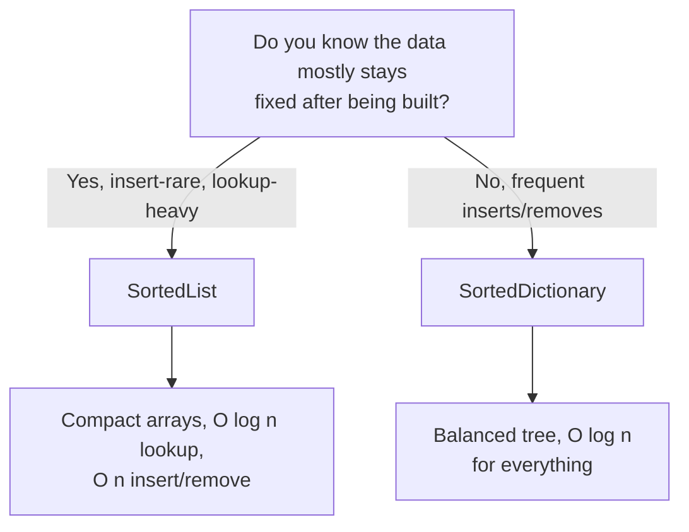

# SortedDictionary<TKey,TValue> and SortedList<TKey,TValue>

## Introduction

Before reading this lesson, you should already be comfortable with **[Dictionary<TKey,TValue> in Depth](../03-collections-generics/03-05-dictionary-in-depth.md)** — its O(1) average lookup, and the fact that enumerating it gives you keys in no guaranteed order at all. That last point is exactly what this lesson fixes. `SortedDictionary<TKey,TValue>` and `SortedList<TKey,TValue>` are both key/value collections that keep their keys continuously sorted, so enumeration always walks them in ascending key order — but they earn that guarantee through two completely different internal structures, with real performance consequences.

By the end of this lesson, you will be able to:

- Explain why `SortedDictionary` and `SortedList` enumerate in sorted key order while `Dictionary` does not
- Describe the internal structure of each — a red-black tree versus a sorted array pair — and why that difference matters
- State the Big-O cost of `Add`, `Remove`, and lookup for both types
- Choose `SortedDictionary` for insert/remove-heavy workloads and `SortedList` for lookup-heavy, rarely-modified, memory-conscious workloads
- Build and query both types in a real banking ledger and interest-tier scenario

## SortedDictionary and SortedList — A Layman's Perspective

Picture two different ways a small business keeps a customer directory in alphabetical order. The first business uses a printed, bound reference book: every customer has a numbered page, the pages are glued into the book strictly in alphabetical order, and there's a table of contents at the front. Looking someone up is fast — you can jump straight to roughly the right section the same way you'd flip a dictionary open near the letter "M" and narrow in from there, needing only a handful of flips to find any name. But if a brand-new customer named "Baker" needs to be added between existing customers "Adams" and "Carter," there's a real problem: every page from "Baker" onward has to be physically reprinted and reglued one position later to make room. Adding one entry near the front of a large book means shuffling almost the whole book.

The second business uses a very different system: a card-catalog binder with alphabetical tab dividers, where each tab points into a nested set of smaller tabs. Adding "Baker" here is easy — you find the right tab section and slide a new card into its slot, without touching any of the other cards at all; no physical reshuffling ever happens. The tradeoff is that finding any given name takes a few more steps than the printed book's direct jump, because you're following tabs into sub-tabs into sub-tabs rather than flipping straight to a page number.

Both systems produce the exact same end result if you read them front to back — a fully alphabetized directory. They differ only in *how* they get there and *what they're good at*: the printed book is genuinely faster to search once it's built and takes less shelf space, but painful to insert into; the tabbed binder is slightly slower to search but trivially easy to insert into or remove from at any point, no matter how large it gets.

That's precisely the tradeoff between `SortedList<TKey,TValue>` (the printed book — a sorted array, fast binary-search lookups, expensive inserts that must shift elements) and `SortedDictionary<TKey,TValue>` (the tabbed binder — a red-black tree, slightly slower lookups, but cheap inserts and removals anywhere in the sequence). Neither is "better" outright; the right choice depends on whether your data changes constantly or barely changes at all after it's built.

## SortedDictionary and SortedList — A Programming Language Perspective

`SortedDictionary<TKey,TValue>` is implemented internally as a self-balancing binary search tree (a red-black tree). Every `Add`, `Remove`, `ContainsKey`, and indexer lookup runs in O(log n) time, because the tree stays balanced as it grows — no operation ever needs to touch more than a logarithmic slice of the collection. `SortedList<TKey,TValue>` is implemented as two parallel internal arrays — one for keys, one for values — kept continuously sorted by key. Lookups use binary search over the key array, also O(log n), but `Add` and `Remove` are O(n) in the general case, because inserting or deleting anywhere except the very end requires shifting every subsequent array element over by one slot. `SortedList` uses noticeably less memory per entry than `SortedDictionary`, since it avoids the per-node object overhead a tree requires, and it uniquely supports positional indexing — `Keys[i]` and `Values[i]` — which `SortedDictionary` does not offer. Both types implement `IDictionary<TKey,TValue>` and accept an optional `IComparer<TKey>` to override the default ascending sort.

## How to Use SortedDictionary and SortedList in C#

Both types are constructed and indexed exactly like `Dictionary<TKey,TValue>` — the difference only shows up in *enumeration order* and *performance characteristics*, not in the syntax you write day to day. Add entries out of order and both collections will hand them back sorted.


*Figure 1: `SortedDictionary` balances entries across a tree; `SortedList` keeps them in two parallel sorted arrays.*

```csharp
// Program.cs — .NET 10 / C# 14

var sortedDict = new SortedDictionary<int, string>();
var sortedList = new SortedList<int, string>();

int[] ticketNumbers = [42, 7, 19, 3, 25];

foreach (int number in ticketNumbers)
{
    sortedDict[number] = $"Ticket-{number}";
    sortedList[number] = $"Ticket-{number}";
}

Console.WriteLine("SortedDictionary keys: " + string.Join(", ", sortedDict.Keys));
Console.WriteLine("SortedList keys:       " + string.Join(", ", sortedList.Keys));
Console.WriteLine($"SortedList lookup by index 0:  {sortedList.Values[0]}");
Console.WriteLine($"SortedDictionary lookup by key 3: {sortedDict[3]}");
```

**Console Output:**

```text
SortedDictionary keys: 3, 7, 19, 25, 42
SortedList keys:       3, 7, 19, 25, 42
SortedList lookup by index 0:  Ticket-3
SortedDictionary lookup by key 3: Ticket-3
```

Even though `42, 7, 19, 3, 25` were inserted in a scrambled order, both collections report their keys back sorted ascending — `3, 7, 19, 25, 42` — with zero manual sorting code required. `SortedList` additionally lets you reach the smallest entry by numeric position (`Values[0]`), something `SortedDictionary`'s tree structure has no efficient way to support.

## Real-Time Example: A Banking Ledger and Interest-Tier Table

We continue the Banking/ATM case study, modeling two genuinely different sorted needs on the same account: a **transaction ledger** that grows constantly as new transactions arrive (a good fit for `SortedDictionary`, since inserts must stay cheap), and an **interest-rate tier table** that's configured once and rarely changes but gets checked on every balance calculation (a good fit for `SortedList`, since lookups dominate and memory should stay lean).

```csharp
// Program.cs — .NET 10 / C# 14 — Real-Time Example
// Banking/ATM case study: a chronological transaction ledger (SortedDictionary)
// and a rarely-changed interest-rate tier table (SortedList).

var ledger = new SortedDictionary<long, Transaction>();
long sequence = 0;

void Record(string description, decimal amount)
{
    sequence++;
    ledger[sequence] = new Transaction(sequence, description, amount);
}

Record("Opening deposit", 5000m);
Record("Grocery store debit", -120.50m);
Record("Salary credit", 3200m);
Record("ATM withdrawal", -200m);

Console.WriteLine("--- Ledger (chronological order) ---");
foreach (KeyValuePair<long, Transaction> entry in ledger)
{
    Transaction t = entry.Value;
    Console.WriteLine($"#{t.SequenceId}: {t.Description,-20} {t.Amount,10:C}");
}

decimal balance = 0m;
foreach (Transaction t in ledger.Values)
{
    balance += t.Amount;
}
Console.WriteLine($"Current balance: {balance:C}");

// Interest tiers are configured once and rarely change -> SortedList wins here:
// lookup-heavy, insert-rare, and lighter on memory than a tree.
var interestTiers = new SortedList<decimal, string>
{
    [0m] = "0.10% APY",
    [1000m] = "0.35% APY",
    [5000m] = "0.75% APY",
    [25000m] = "1.10% APY"
};

string ApplicableTier(decimal accountBalance)
{
    string tier = interestTiers.Values[0];
    foreach (KeyValuePair<decimal, string> entry in interestTiers)
    {
        if (accountBalance >= entry.Key)
        {
            tier = entry.Value;
        }
        else
        {
            break;
        }
    }
    return tier;
}

Console.WriteLine($"Interest tier for balance {balance:C}: {ApplicableTier(balance)}");

record Transaction(long SequenceId, string Description, decimal Amount);
```

**Console Output:**

```text
--- Ledger (chronological order) ---
#1: Opening deposit       $5,000.00
#2: Grocery store debit    -$120.50
#3: Salary credit         $3,200.00
#4: ATM withdrawal         -$200.00
Current balance: $7,879.50
Interest tier for balance $7,879.50: 0.75% APY
```

The ledger inserts each new transaction by an ever-increasing sequence number, and `SortedDictionary` keeps every insert at O(log n) regardless of how large the ledger grows — exactly what a live, constantly-appended-to account history needs. The interest-tier table, by contrast, is built once at startup and only ever read from afterward; `SortedList`'s binary-search lookups and compact array storage make it the leaner choice for that kind of mostly-static reference data. Picking the wrong one wouldn't break correctness — both types would still return the right answer — it would just mean paying for tree overhead on data that never needed it, or paying for array-shifting costs on data that changes every second.

## SortedDictionary vs SortedList

The core tradeoff is *insert/remove cost* versus *lookup cost and memory footprint*. `SortedDictionary` is the safer default when you don't know in advance how much the collection will grow or shrink, because every mutation stays cheap no matter the collection's size. `SortedList` pulls ahead when the data set is built once (or grows only by appending at the end) and then queried heavily afterward — bulk-loading a `SortedList` from already-sorted data, or appending in increasing key order, avoids the shifting penalty entirely and gives you a compact, fast-to-search structure.


*Figure 2: The deciding question — how often does the collection change after it's built?*

| Aspect | `SortedDictionary<TKey,TValue>` | `SortedList<TKey,TValue>` |
|---|---|---|
| Underlying structure | Red-black tree (balanced binary search tree) | Two parallel sorted arrays (keys, values) |
| Add / Remove | O(log n) | O(n) — shifting required (O(1) amortized if appending in order) |
| Key lookup | O(log n) | O(log n) via binary search |
| Index-based access (`Keys[i]`, `Values[i]`) | Not supported | Supported |
| Memory overhead | Higher — per-node tree objects | Lower — flat arrays, no node objects |
| Best fit | Frequent inserts/removes at arbitrary keys | Built once (or append-only), queried often |

## Related Ordered Collections and Comparison Tools

Sorted key/value collections are one piece of a broader family of ordered and comparison-driven types covered elsewhere in this module:

1. **[Dictionary<TKey,TValue> in Depth](../03-collections-generics/03-05-dictionary-in-depth.md)** — the unordered, hash-based baseline both sorted types trade insert speed for.
2. **[HashSet<T> and SortedSet<T>](../03-collections-generics/03-07-hashset-and-sortedset.md)** — the same hashed-vs-sorted tradeoff applied to unique values with no associated key.
3. **[IComparable<T> and IComparer<T>](../03-collections-generics/03-20-icomparable-and-icomparer.md)** — how to control the sort order these two types use instead of the default comparer.
4. **[Immutable Collections (ImmutableList<T>, etc.)](../03-collections-generics/03-11-immutable-collections.md)** — includes `ImmutableSortedDictionary<TKey,TValue>`, a thread-safe, snapshot-style alternative for concurrent scenarios.
5. **[Choosing the Right Collection — Comparison Guide](../03-collections-generics/03-22-choosing-the-right-collection.md)** — the module capstone decision matrix these two types fit into.

## What You've Learned & What's Next

`SortedDictionary` and `SortedList` both guarantee ascending key order on enumeration, but they earn that guarantee through opposite tradeoffs: a tree that keeps every mutation cheap, versus sorted arrays that keep every lookup cheap and compact. Reach for `SortedDictionary` when your data changes constantly; reach for `SortedList` when it's built once and queried repeatedly.

Continue your learning journey with **[HashSet<T> and SortedSet<T>](../03-collections-generics/03-07-hashset-and-sortedset.md)**, where the same hashed-versus-sorted tradeoff reappears — this time for collections that store unique values with no associated key at all.

---
*Applies to: .NET 10 / C# 14. Last reviewed 2026-08-16.*
