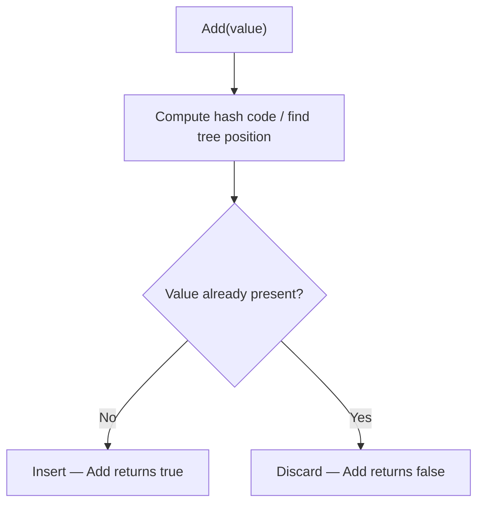
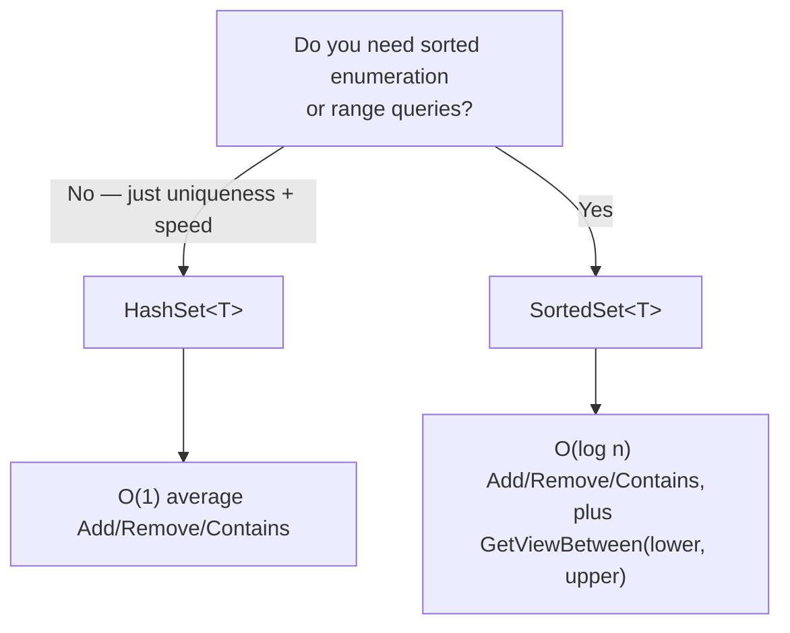

# HashSet<T> and SortedSet<T>

## Introduction

Before reading this lesson, you should already be comfortable with **[SortedDictionary<TKey,TValue> and SortedList<TKey,TValue>](../03-collections-generics/03-06-sorteddictionary-and-sortedlist.md)** — specifically, the tradeoff between a hash-like structure's raw speed and a sorted structure's ordered enumeration. This lesson applies that exact same tradeoff to a simpler shape of collection: one that stores only *values*, with no associated key at all, and guarantees every value in it is unique. `HashSet<T>` and `SortedSet<T>` are C#'s two implementations of that idea, and both come with a full vocabulary of set algebra — union, intersection, and difference — built in.

By the end of this lesson, you will be able to:

- Explain the uniqueness guarantee both `HashSet<T>` and `SortedSet<T>` enforce on `Add`
- State why `HashSet<T>.Contains` runs in O(1) average time, backed by a hash table
- Combine sets using `UnionWith`, `IntersectWith`, and `ExceptWith`
- Explain when `SortedSet<T>`'s O(log n) tree-based operations are worth it for sorted enumeration
- Recognize `SortedSet<T>`'s `GetViewBetween` as a range-query capability `HashSet<T>` cannot offer
- Apply set operations to a real customer-recommendation scenario in an e-commerce system

## HashSet and SortedSet — A Layman's Perspective

Imagine a nightclub with two very different approaches to keeping a guest list free of duplicates. The first club uses a wall of a thousand numbered lockers. When someone arrives, the bouncer runs their name through a quick formula that always produces the same locker number for that exact name, walks straight to that one locker, and checks whether a card with that name is already sitting inside. If the locker is empty, the card goes in and the guest is admitted for the first time. If an identical name is already sitting in that locker, the guest is turned away as a duplicate. Critically, the bouncer never has to scan all thousand lockers — the formula tells them exactly which one locker to check, every single time, whether there are ten guests on the list or ten thousand. That's blazingly fast, but the lockers themselves aren't arranged in any readable order; locker 342 might hold "Zara" while locker 12 holds "Aaron."

The second club instead keeps a single physical sign-in sheet, permanently maintained in alphabetical order through a system of tabbed dividers — much like the tabbed binder from the previous lesson. Checking whether "Baker" is already signed in means following the tabs down to roughly the right section, a few more steps than the locker club's one direct glance, but the payoff is that the sheet can always be read start to finish in perfect alphabetical order — useful the moment the fire marshal asks for a complete, orderly list of everyone currently inside.

Now suppose two clubs under the same ownership want to compare their guest lists for a joint event. "Who's on both lists?" is an *intersection* — the overlap between the two rosters. "Who's on either list?" is a *union* — everyone from both combined, still with no duplicates. "Who's only on our list and not theirs?" is a *difference* — subtracting one roster from the other. None of these questions require re-scanning every name by hand; they're standard operations any well-run guest-list system supports directly.

The bridge to programming: the locker wall is `HashSet<T>` — blistering-fast membership checks, no guaranteed order. The alphabetized sign-in sheet is `SortedSet<T>` — slightly slower checks, but always walkable in sorted order. And the joint-event comparisons are exactly `UnionWith`, `IntersectWith`, and `ExceptWith` — the set algebra this lesson builds on both types.

## HashSet and SortedSet — A Programming Language Perspective

`HashSet<T>` is backed by a hash table, the same underlying idea as `Dictionary<TKey,TValue>` but storing only values with no separate key — `Add`, `Remove`, and `Contains` all run in O(1) average time, using `T`'s `GetHashCode`/`Equals` (or a supplied `IEqualityComparer<T>`) to detect duplicates. `SortedSet<T>` is backed by a red-black tree, the same structure `SortedDictionary<TKey,TValue>` uses — `Add`, `Remove`, and `Contains` run in O(log n), but enumeration always proceeds in ascending order, using `T`'s `IComparable<T>` (or a supplied `IComparer<T>`). Both implement `ISet<T>`, which is where `UnionWith`, `IntersectWith`, `ExceptWith`, `SymmetricExceptWith`, and the query methods `IsSubsetOf`, `IsSupersetOf`, and `Overlaps` all come from — every `With` method mutates the set it's called on in place. `SortedSet<T>` additionally exposes `GetViewBetween(lower, upper)`, a live, range-bounded view with no equivalent on `HashSet<T>`.

## How to Use HashSet and SortedSet in C#

Both types expose the same `Add`, `Remove`, and `Contains` members you'd expect from any collection — the difference is what `Add` returns (`bool`, `true` only for a genuinely new value) and what order enumeration produces.


*Figure 1: `Add` on either type reports whether the value was genuinely new, discarding silent duplicates instead of throwing.*

```csharp
// Program.cs — .NET 10 / C# 14

var visitedPages = new HashSet<string>();
string[] pageViews = ["home", "products", "cart", "home", "checkout", "products"];

foreach (string page in pageViews)
{
    bool wasNew = visitedPages.Add(page);
    Console.WriteLine($"{page}: {(wasNew ? "first visit" : "already seen")}");
}

Console.WriteLine($"Unique pages visited: {visitedPages.Count}");
Console.WriteLine($"Contains 'cart'? {visitedPages.Contains("cart")}");

var sortedPages = new SortedSet<string>(visitedPages);
Console.WriteLine("Sorted page list: " + string.Join(", ", sortedPages));
```

**Console Output:**

```text
home: first visit
products: first visit
cart: first visit
home: already seen
checkout: first visit
products: already seen
Unique pages visited: 4
Contains 'cart'? True
Sorted page list: cart, checkout, home, products
```

Of six page views, only four distinct pages ever registered — repeats of `"home"` and `"products"` were silently discarded by `Add`, which is exactly the uniqueness guarantee at work. Wrapping the resulting `HashSet<string>` in a `SortedSet<string>` produces the same four pages, now in alphabetical order, without any manual sorting step.

## Real-Time Example: Interest-Set Recommendations in E-Commerce

We continue the E-Commerce Order Processing case study, modeling each customer's shopping interests as a `HashSet<string>` and combining two customers' sets to power a simple "customers like you" recommendation, plus a `SortedSet<string>` for a flash-sale board that must display product SKUs uniquely and in order.

```csharp
// Program.cs — .NET 10 / C# 14 — Real-Time Example
// E-Commerce Order Processing case study: customer interest tags for
// recommendations, and a flash-sale SKU board that must stay sorted and unique.

var aliceInterests = new HashSet<string> { "electronics", "books", "fitness" };
var bobInterests = new HashSet<string> { "books", "gardening", "electronics" };

var sharedInterests = new HashSet<string>(aliceInterests);
sharedInterests.IntersectWith(bobInterests);
Console.WriteLine("Shared interests (recommend to both): " + string.Join(", ", sharedInterests.OrderBy(tag => tag)));

var combinedInterests = new HashSet<string>(aliceInterests);
combinedInterests.UnionWith(bobInterests);
Console.WriteLine("Combined interest pool: " + string.Join(", ", combinedInterests.OrderBy(tag => tag)));

var aliceOnlyInterests = new HashSet<string>(aliceInterests);
aliceOnlyInterests.ExceptWith(bobInterests);
Console.WriteLine("Interests unique to Alice: " + string.Join(", ", aliceOnlyInterests.OrderBy(tag => tag)));

bool wasNewInterest = aliceInterests.Add("books");
Console.WriteLine($"Re-adding 'books' to Alice's interests counted as new: {wasNewInterest}");

var flashSaleSkus = new SortedSet<string> { "SKU-4021", "SKU-1187", "SKU-4021", "SKU-2790" };
Console.WriteLine("Flash-sale board (sorted, duplicates removed): " + string.Join(", ", flashSaleSkus));
```

**Console Output:**

```text
Shared interests (recommend to both): books, electronics
Combined interest pool: books, electronics, fitness, gardening
Interests unique to Alice: fitness
Re-adding 'books' to Alice's interests counted as new: False
Flash-sale board (sorted, duplicates removed): SKU-1187, SKU-2790, SKU-4021
```

`IntersectWith` reveals that Alice and Bob share `books` and `electronics` — exactly the tags a recommendation engine would use to say "customers with similar interests also viewed." `UnionWith` combines both customers' interests into one deduplicated pool a marketing segment could target. `ExceptWith` isolates what makes Alice distinct: `fitness`, the one interest Bob doesn't share. Re-adding `"books"` to Alice's original set returns `false` because it was already present — no duplicate is created. The `SortedSet<string>` flash-sale board was seeded with a repeated SKU, `"SKU-4021"`, and it silently collapses to one entry while keeping the whole board in sorted display order, exactly what a storefront listing needs without any extra sorting code.

## HashSet vs SortedSet

The deciding factor is the same one from the previous lesson: does enumeration order matter? If all you need is "is this value already in the set" as fast as possible, `HashSet<T>` is the right default — its O(1) average operations make it the natural choice for deduplication, membership checks, and the set-algebra operations this lesson covered. Reach for `SortedSet<T>` only when you specifically need the set to always be walkable in ascending order, or when you need `GetViewBetween` to efficiently pull a contiguous range of values — capabilities worth the O(log n) tradeoff.


*Figure 2: Choosing between the two comes down to whether sorted order or range queries are actually needed.*

| Aspect | `HashSet<T>` | `SortedSet<T>` |
|---|---|---|
| Underlying structure | Hash table | Red-black tree |
| Add / Remove / Contains | O(1) average | O(log n) |
| Enumeration order | Unspecified | Always ascending |
| Equality/order requirement | `GetHashCode`/`Equals` or `IEqualityComparer<T>` | `IComparable<T>` or `IComparer<T>` |
| Unique capability | Fastest possible membership checks | `GetViewBetween(lower, upper)` range queries |
| Typical use case | Deduplication, fast "have we seen this?" checks | Leaderboards, sorted unique displays, range lookups |

## Related Set and Sorted-Order Types

Sets are one branch of the same ordered-vs-hashed family this module keeps revisiting:

1. **[SortedDictionary<TKey,TValue> and SortedList<TKey,TValue>](../03-collections-generics/03-06-sorteddictionary-and-sortedlist.md)** — the same tradeoff applied to key/value pairs instead of standalone values.
2. **[Dictionary<TKey,TValue> in Depth](../03-collections-generics/03-05-dictionary-in-depth.md)** — `HashSet<T>`'s key/value cousin, for when you need a value attached to each unique key.
3. **[IComparable<T> and IComparer<T>](../03-collections-generics/03-20-icomparable-and-icomparer.md)** — how to control the ordering `SortedSet<T>` uses instead of the default comparer.
4. **[Immutable Collections (ImmutableList<T>, etc.)](../03-collections-generics/03-11-immutable-collections.md)** — includes `ImmutableHashSet<T>` and `ImmutableSortedSet<T>` for thread-safe, snapshot-style sets.
5. **[Choosing the Right Collection — Comparison Guide](../03-collections-generics/03-22-choosing-the-right-collection.md)** — the module capstone decision matrix these two types fit into.

## What You've Learned & What's Next

`HashSet<T>` and `SortedSet<T>` both guarantee every value is unique, but they differ exactly like their key/value counterparts from the previous lesson: a hash table trading order for raw speed, versus a tree trading a little speed for guaranteed sorted enumeration and range queries. The set-algebra methods — `UnionWith`, `IntersectWith`, `ExceptWith` — work identically on both, making them a genuinely reusable vocabulary for comparing collections of data.

Continue your learning journey with **[Stack<T> in Depth](../03-collections-generics/03-08-stack-t-in-depth.md)**, where we leave key/value and uniqueness behind entirely and look at a collection defined purely by the *order* items come out in: last in, first out.

---
*Applies to: .NET 10 / C# 14. Last reviewed 2026-08-16.*
