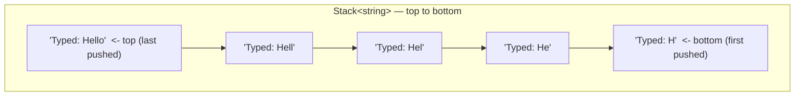
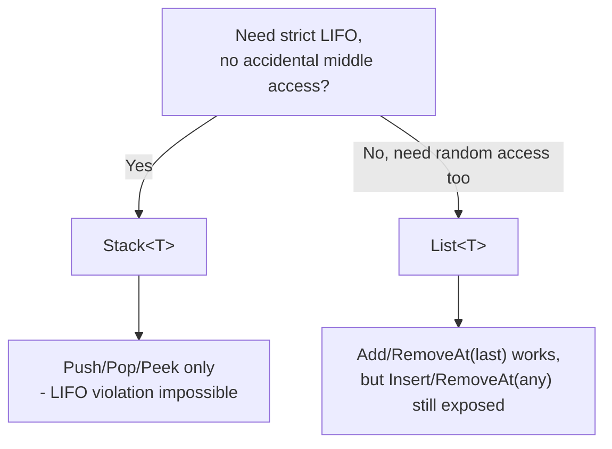

# Stack<T> in Depth

## Introduction

Before reading this lesson, you should already be comfortable with **[HashSet<T> and SortedSet<T>](../03-collections-generics/03-07-hashset-and-sortedset.md)**. Those collections were defined by a guarantee about *content* — every value unique. `Stack<T>` is defined instead by a guarantee about *order*: the last item you put in is always the first one that comes back out. That single rule — last in, first out, or LIFO — turns out to be exactly the right shape for problems ranging from an editor's undo history to how a compiler evaluates a mathematical expression.

By the end of this lesson, you will be able to:

- Explain LIFO ordering and how it differs fundamentally from a first-in-first-out queue
- Use `Push`, `Pop`, and `Peek` to add, remove, and inspect the top of a stack
- Use `TryPop`/`TryPeek` to avoid `InvalidOperationException` on an empty stack
- Recognize real use cases for `Stack<T>`: undo history, expression evaluation, and depth-first traversal
- Apply `Stack<T>` to a real ATM pending-transaction scenario, including a subtlety around re-applying staged items in original order
- Explain why `Stack<T>`'s narrow API is a deliberate safeguard, not a missing feature, compared to using `List<T>` as an ad-hoc stack

## Stack — A Layman's Perspective

Picture the tray dispenser at a busy cafeteria. Clean trays get stacked one on top of another as they come out of the dishwasher, and the very last tray placed on top is, without exception, the very first tray the next customer picks up. Nobody reaches into the middle of the stack to grab tray number seven from the bottom — physically, the trays above it are in the way, and the whole point of stacking them is that you only ever interact with whatever's currently on top. If the dispenser is empty, there's simply no tray to hand over, and a customer who tries anyway gets nothing.

This is a genuinely restrictive design, and that restriction is the entire feature. A cafeteria *could* instead lay trays out on a long shelf where any tray is reachable at any time, but that would defeat the purpose — the stack's rule (top only, always) is exactly what keeps a tall pile of trays stable and makes "which tray is next" a question with one unambiguous answer, computed instantly, without scanning anything.

Now think about a text editor's undo button. Every edit you make gets recorded, one on top of the last, the same way a tray gets added to the dispenser. Pressing undo doesn't ask you which of your last fifty edits to reverse — it always reverses the single most recent one, then the one before that, and so on. That's not an arbitrary design choice; it's the only ordering that makes sense for "undo," because reversing edit #12 while edit #15 is still in effect would leave the document in a state that never actually existed. The most recent action has to be the first one undone, every time — LIFO, expressed as a feature real software users rely on daily.

Or picture someone exploring a maze by always plunging as deep as possible down one path before backtracking: at every dead end, they retrace their steps to the most recent branching point they haven't fully explored yet — never an older one first. That "always go back to the most recent unexplored choice" instinct is precisely how depth-first search works, and it's exactly the LIFO discipline of a stack.

The bridge to programming: whenever "reverse my most recent action first" or "backtrack to where I most recently branched" describes the behavior you need, you want a `Stack<T>` — a collection that physically cannot let you skip the top.

## Stack — A Programming Language Perspective

`System.Collections.Generic.Stack<T>` is a generic, dynamically-resized collection that exposes only LIFO-oriented operations: `Push(T item)` adds to the top in O(1) amortized time, `Pop()` removes and returns the top item in O(1) time, and `Peek()` returns the top item without removing it, also in O(1) time. Calling `Pop()` or `Peek()` on an empty stack throws `InvalidOperationException`; the non-throwing alternatives `TryPop(out T result)` and `TryPeek(out T result)` return `false` instead, letting calling code handle an empty stack without a `try`/`catch`. `Stack<T>` implements `IEnumerable<T>` and `ICollection`, but deliberately *not* `IList<T>` — there is no indexer, and no `Insert`-at-an-arbitrary-position method, because allowing either would undermine the LIFO guarantee that is the whole reason to reach for this type. Enumerating a `Stack<T>` with `foreach` yields items in LIFO order, from the current top down to the bottom, without removing anything. `Stack<T>` is not thread-safe for concurrent Push/Pop from multiple threads; `System.Collections.Concurrent.ConcurrentStack<T>` exists for that scenario.

## How to Use Stack<T> in C#

Constructing a stack and pushing onto it looks like building up a `List<T>`, but the only ways to get data back out are `Pop`, `Peek`, and enumeration — nothing lets you jump to the middle.


*Figure 1: `Push` always adds to the top; `Pop` and `Peek` only ever touch the top — the bottom four entries stay untouched until every entry above them is gone.*

```csharp
// Program.cs — .NET 10 / C# 14

var undoStack = new Stack<string>();

undoStack.Push("Typed: H");
undoStack.Push("Typed: He");
undoStack.Push("Typed: Hel");
undoStack.Push("Typed: Hell");
undoStack.Push("Typed: Hello");

Console.WriteLine($"Current state: {undoStack.Peek()}");
Console.WriteLine($"Stack depth: {undoStack.Count}");

string undone = undoStack.Pop();
Console.WriteLine($"Undid: {undone}");
Console.WriteLine($"Current state after undo: {undoStack.Peek()}");

if (undoStack.TryPop(out string? previous))
{
    Console.WriteLine($"Undid again: {previous}");
}

Console.WriteLine($"Current state: {undoStack.Peek()}");
Console.WriteLine($"Remaining depth: {undoStack.Count}");
```

**Console Output:**

```text
Current state: Typed: Hello
Stack depth: 5
Undid: Typed: Hello
Current state after undo: Typed: Hell
Undid again: Typed: Hell
Current state: Typed: Hel
Remaining depth: 3
```

Five keystrokes were pushed as five progressively longer snapshots, and `Peek()` always shows the most recent one without removing it. Each `Pop()` — first the explicit call, then the safe `TryPop` — peels off exactly one snapshot from the top, walking the undo history backward one step at a time, exactly the way a real editor's undo command behaves.

## Real-Time Example: A Pending-Transaction Stack in Banking

We continue the Banking/ATM case study. Before a customer confirms a batch of ATM actions, each staged deposit or withdrawal is pushed onto a `Stack<PendingAction>` so the customer can undo the single most recent entry if they made a mistake — exactly the LIFO behavior a "cancel my last entry" button needs.

```csharp
// Program.cs — .NET 10 / C# 14 — Real-Time Example
// Banking/ATM case study: a pending-transaction stack that lets a customer
// undo the most recently staged action before confirming the whole batch.

var pendingActions = new Stack<PendingAction>();
decimal balance = 1000m;

void Stage(string description, decimal amount)
{
    pendingActions.Push(new PendingAction(description, amount));
    Console.WriteLine($"Staged: {description} ({amount:C})");
}

Stage("Deposit — paycheck", 1500m);
Stage("Withdrawal — rent", -900m);
Stage("Withdrawal — groceries", -85.25m);

Console.WriteLine($"Pending actions staged: {pendingActions.Count}");

// The customer realizes the last entry (groceries) was a mistake — undo it.
if (pendingActions.TryPop(out PendingAction? undone))
{
    Console.WriteLine($"Undid last action: {undone.Description} ({undone.Amount:C})");
}

Console.WriteLine($"Pending actions remaining: {pendingActions.Count}");

// Confirm: apply everything in the ORIGINAL staging order, not LIFO order —
// a Stack<T> enumerates top-first, so it must be reversed before applying,
// or "rent" would post before "paycheck" ever did.
PendingAction[] toApply = pendingActions.Reverse().ToArray();
foreach (PendingAction action in toApply)
{
    balance += action.Amount;
    Console.WriteLine($"Applied: {action.Description}, new balance {balance:C}");
}

record PendingAction(string Description, decimal Amount);
```

**Console Output:**

```text
Staged: Deposit — paycheck ($1,500.00)
Staged: Withdrawal — rent (-$900.00)
Staged: Withdrawal — groceries (-$85.25)
Pending actions staged: 3
Undid last action: Withdrawal — groceries (-$85.25)
Pending actions remaining: 2
Applied: Deposit — paycheck, new balance $2,500.00
Applied: Withdrawal — rent, new balance $1,600.00
```

Undoing the groceries withdrawal is a one-line `TryPop` because that was genuinely the most recent action staged — LIFO is exactly the semantics "undo my last entry" needs. But notice the second half: confirming the *remaining* actions has to happen in the order they were originally staged (paycheck, then rent), not the order a raw `Pop` loop would produce (rent, then paycheck) — which is why the code calls `.Reverse()` on the stack's own top-first enumeration before applying anything. This is a genuinely common real-world trap: a stack is the right tool for undo, but the wrong tool to enumerate straight through when downstream logic depends on original chronological order.

## Stack<T> vs Using List<T> as a Stack

Because `List<T>.Add` and `List<T>.RemoveAt(list.Count - 1)` can technically emulate `Push` and `Pop` with the same O(1) amortized performance, it's tempting to skip `Stack<T>` entirely and just use a `List<T>`. The performance argument for `Stack<T>` is weak — both are fast. The real argument is intent and safety: a `List<T>` exposes an indexer, `Insert(index, item)`, and `RemoveAt(index)` for *any* index, so nothing stops a future maintainer (or a rushed version of yourself) from reaching into the middle of what was supposed to be a strict LIFO structure and quietly breaking the ordering guarantee the rest of the code depends on. `Stack<T>`'s narrower API makes that mistake impossible to write by accident — there is no method that could violate LIFO order, because none of those methods exist on the type.


*Figure 2: `Stack<T>` and `List<T>` can both emulate push/pop with the same performance — the difference is what each API still lets you do.*

| Aspect | `Stack<T>` | `List<T>` used as a stack |
|---|---|---|
| Push equivalent | `Push(item)` | `Add(item)` |
| Pop equivalent | `Pop()` | `RemoveAt(list.Count - 1)` + read the value first |
| Peek equivalent | `Peek()` | `list[list.Count - 1]` |
| Random/middle access | Not possible — no indexer | Fully possible — `Insert`, `RemoveAt`, indexer all remain |
| Performance | O(1) amortized for all three | O(1) amortized, identical |
| Communicates intent | Explicitly LIFO-only to every reader | Ambiguous — looks like a general-purpose list |

## Related Order-Driven Collection Types

`Stack<T>`'s LIFO discipline is one half of a pair of order-driven collections this module covers, alongside thread-safe and priority-aware variants elsewhere in the curriculum:

1. **[HashSet<T> and SortedSet<T>](../03-collections-generics/03-07-hashset-and-sortedset.md)** — collections defined by uniqueness rather than ordering discipline.
2. **[Queue<T> in Depth](../03-collections-generics/03-09-queue-t-in-depth.md)** — the FIFO mirror image of everything covered in this lesson.
3. **[List<T> in Depth](../03-collections-generics/03-03-list-t-in-depth.md)** — the general-purpose list `Stack<T>` deliberately restricts to keep LIFO order safe.
4. **[Concurrent Collections (ConcurrentDictionary, Queue, Stack, Bag)](../07-concurrency-parallel-async/07-26-concurrent-collections.md)** — `ConcurrentStack<T>`, the thread-safe counterpart for multi-threaded producers and consumers.
5. **[Choosing the Right Collection — Comparison Guide](../03-collections-generics/03-22-choosing-the-right-collection.md)** — where `Stack<T>` fits into the module's full decision matrix.

## What You've Learned & What's Next

`Stack<T>` guarantees the last item pushed is always the first one popped, and its deliberately narrow API — `Push`, `Pop`, `Peek`, and their `Try` variants — makes that guarantee impossible to violate by accident, unlike a `List<T>` pressed into the same role. That LIFO discipline is exactly what undo history, expression evaluation, and depth-first traversal all need.

Continue your learning journey with **[Queue<T> in Depth](../03-collections-generics/03-09-queue-t-in-depth.md)**, where the same idea gets flipped: first in, first out, the ordering discipline behind task processing and breadth-first traversal.

---
*Applies to: .NET 10 / C# 14. Last reviewed 2026-08-16.*
