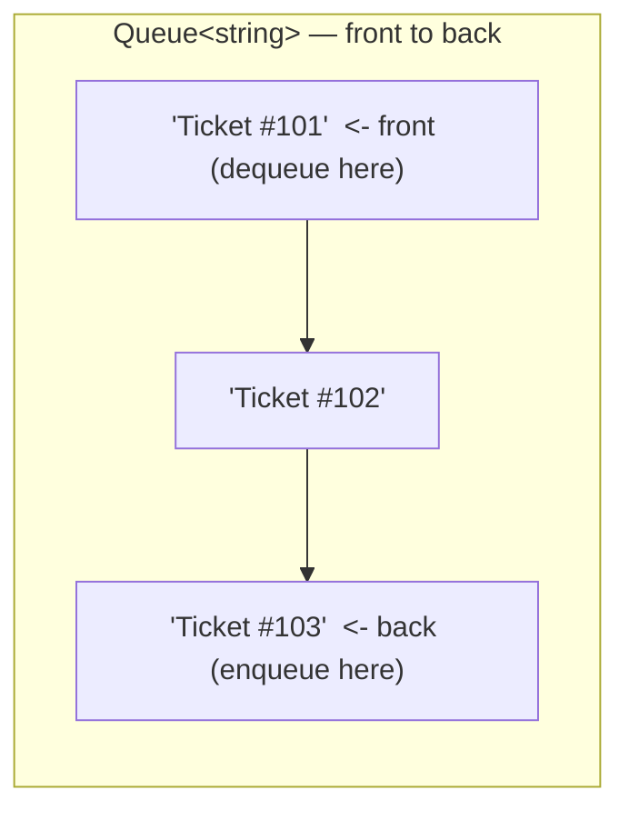
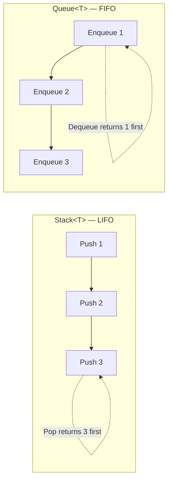

# Queue<T> in Depth

## Introduction

Before reading this lesson, you should already be comfortable with **[Stack<T> in Depth](../03-collections-generics/03-08-stack-t-in-depth.md)** and its last-in-first-out discipline. `Queue<T>` enforces the exact opposite ordering rule: the first item you put in is always the first one that comes back out — first in, first out, or FIFO. Where a stack is the right shape for "undo my last action," a queue is the right shape for "serve everyone in the order they arrived," which makes it the natural fit for task processing pipelines and fair scheduling of any kind.

By the end of this lesson, you will be able to:

- Explain FIFO ordering and how it's the mirror image of `Stack<T>`'s LIFO ordering
- Use `Enqueue`, `Dequeue`, and `Peek` to add, remove, and inspect the front of a queue
- Use `TryDequeue`/`TryPeek` to avoid `InvalidOperationException` on an empty queue
- Recognize real use cases for `Queue<T>`: task/job processing pipelines and breadth-first traversal
- Apply `Queue<T>` to a real order-fulfillment pipeline in an e-commerce system
- Recognize when strict arrival order isn't enough, and reach for `PriorityQueue<TElement,TPriority>` instead

## Queue — A Layman's Perspective

Picture the deli counter at a busy grocery store, the kind with a take-a-number machine by the door. Customer number 41 pulls a ticket, then customer 42, then 43. The person behind the counter calls "now serving 41" first, then 42, then 43 — always in the exact order the tickets were pulled, with no exceptions for who's been standing there the longest or who looks the most impatient. That's the entire point of the number system: it makes "who's next" a completely mechanical question with one right answer, and it guarantees fairness in a very specific sense — nobody who arrived later gets served before someone who arrived earlier.

Compare that to the cafeteria tray stack from the previous lesson, where the newest tray was always the first one taken. A take-a-number line works in precisely the opposite direction: the oldest waiting request is always the next one served. Both systems are about strict, predictable ordering, but they encode two different real-world guarantees — "most recent first" for the tray stack, "first arrived, first served" for the deli line — and mixing them up would break whichever guarantee the situation actually needs. Handing tray-stack service to deli customers would mean someone who just walked in gets served before someone who's been waiting twenty minutes; nobody would accept that at a deli counter.

Now imagine that same deli also offers a "express lane" for catering orders that were pre-paid and need to ship out on a tight schedule — those don't necessarily follow the plain numbered line at all. An express order might jump ahead of regular numbered tickets, not because it arrived first, but because it carries a higher urgency. That's a genuinely different rule from plain FIFO: order isn't just about arrival time anymore, it's about a priority the deli assigns to each ticket.

The bridge to programming: whenever "serve everyone in the exact order they arrived" describes what you need, reach for `Queue<T>`. The moment "some arrivals matter more than others, regardless of when they showed up" becomes true instead, plain FIFO is no longer enough, and that's exactly the gap `PriorityQueue<TElement,TPriority>` fills.

## Queue — A Programming Language Perspective

`System.Collections.Generic.Queue<T>` is a generic, dynamically-resized collection exposing FIFO-oriented operations: `Enqueue(T item)` adds to the back in O(1) amortized time, `Dequeue()` removes and returns the item at the front in O(1) time, and `Peek()` returns the front item without removing it, also O(1). Like `Stack<T>`, calling `Dequeue()` or `Peek()` on an empty queue throws `InvalidOperationException`, while `TryDequeue(out T result)` and `TryPeek(out T result)` return `false` instead of throwing. `Queue<T>` implements `IEnumerable<T>` and `ICollection` but not `IList<T>` — no indexer, no arbitrary insertion — for the same reason `Stack<T>` restricts its API: it protects the ordering guarantee that makes the type worth using. Enumerating a `Queue<T>` with `foreach` walks front-to-back without dequeuing anything. `System.Collections.Generic.PriorityQueue<TElement, TPriority>`, available since .NET 6, is a related but distinct type: it dequeues the element with the lowest priority value first, regardless of insertion order, making it the tool of choice once "arrival order" and "processing order" genuinely diverge.

## How to Use Queue<T> in C#

`Enqueue` always adds at the back; `Dequeue` and `Peek` only ever look at the front — the two ends of the collection are simply not symmetric, which is exactly what "first in, first out" requires.


*Figure 1: New tickets join at the back; only the front ticket is ever dequeued — the middle and back stay untouched until their turn comes.*

```csharp
// Program.cs — .NET 10 / C# 14

var supportQueue = new Queue<string>();

supportQueue.Enqueue("Ticket #101");
supportQueue.Enqueue("Ticket #102");
supportQueue.Enqueue("Ticket #103");

Console.WriteLine($"Next up: {supportQueue.Peek()}");
Console.WriteLine($"Tickets waiting: {supportQueue.Count}");

string handled = supportQueue.Dequeue();
Console.WriteLine($"Now handling: {handled}");
Console.WriteLine($"Next up: {supportQueue.Peek()}");

supportQueue.Enqueue("Ticket #104");

while (supportQueue.TryDequeue(out string? next))
{
    Console.WriteLine($"Now handling: {next}");
}

Console.WriteLine($"Tickets waiting: {supportQueue.Count}");
```

**Console Output:**

```text
Next up: Ticket #101
Tickets waiting: 3
Now handling: Ticket #101
Next up: Ticket #102
Now handling: Ticket #102
Now handling: Ticket #103
Now handling: Ticket #104
Tickets waiting: 0
```

Ticket #101 was the first one enqueued, and it's the first one both `Peek()` reports and `Dequeue()` removes — no other ticket can jump ahead of it. Enqueuing ticket #104 partway through doesn't disturb #102 or #103's place in line; the `while (TryDequeue(...))` loop simply keeps draining the queue front-to-back until nothing is left, ending with `Count` back at zero.

## Real-Time Example: Order Fulfillment in E-Commerce

We continue the E-Commerce Order Processing case study. Standard orders are packed strictly in the order they were placed — a textbook `Queue<Order>`. Rush orders, however, don't follow plain arrival order: a customer who paid for overnight shipping needs their order packed before an earlier standard order, which is exactly the scenario `PriorityQueue<TElement,TPriority>` is built for.

```csharp
// Program.cs — .NET 10 / C# 14 — Real-Time Example
// E-Commerce Order Processing case study: a FIFO fulfillment queue for
// standard orders, plus a PriorityQueue for rush orders that must jump ahead.

var standardQueue = new Queue<Order>();

standardQueue.Enqueue(new Order("ORD-3001", "Wireless Mouse"));
standardQueue.Enqueue(new Order("ORD-3002", "Mechanical Keyboard"));
standardQueue.Enqueue(new Order("ORD-3003", "USB-C Hub"));

Console.WriteLine("--- Standard fulfillment (FIFO) ---");
while (standardQueue.TryDequeue(out Order? order))
{
    Console.WriteLine($"Packing {order.OrderId}: {order.Item}");
}

// Rush orders aren't packed in arrival order — shipping tier decides priority,
// so a PriorityQueue<TElement, TPriority> replaces the plain FIFO queue here.
// Lower priority value = packed sooner (0 = overnight, 1 = two-day, 2 = standard).
var rushQueue = new PriorityQueue<Order, int>();

rushQueue.Enqueue(new Order("ORD-4001", "Phone Case"), 2);
rushQueue.Enqueue(new Order("ORD-4002", "Laptop Stand"), 0);
rushQueue.Enqueue(new Order("ORD-4003", "Charging Cable"), 1);

Console.WriteLine("--- Rush fulfillment (priority order) ---");
while (rushQueue.TryDequeue(out Order? order, out int priority))
{
    Console.WriteLine($"Packing {order.OrderId}: {order.Item} (priority {priority})");
}

record Order(string OrderId, string Item);
```

**Console Output:**

```text
--- Standard fulfillment (FIFO) ---
Packing ORD-3001: Wireless Mouse
Packing ORD-3002: Mechanical Keyboard
Packing ORD-3003: USB-C Hub
--- Rush fulfillment (priority order) ---
Packing ORD-4002: Laptop Stand (priority 0)
Packing ORD-4003: Charging Cable (priority 1)
Packing ORD-4001: Phone Case (priority 2)
```

The standard queue packs orders in exactly the sequence they were placed — ORD-3001 first, no matter what. The rush queue tells a different story: `ORD-4002` was enqueued *second*, but it's packed *first*, because it carries the highest urgency (priority `0`, overnight). `ORD-4001`, enqueued *first*, is packed *last* because its priority (`2`, standard) is the lowest urgency of the three. This is the precise moment a warehouse system needs `PriorityQueue<TElement,TPriority>` instead of `Queue<T>` — the packing order genuinely depends on something other than when the order arrived.

## Queue<T> vs Stack<T> — FIFO vs LIFO

`Queue<T>` and `Stack<T>` share almost the same API shape — add one item, remove one item, peek without removing — but the direction each retrieves from is exactly reversed, and that single difference changes which real-world processes each one models correctly. A stack answers "what's the most recent thing that happened?"; a queue answers "what's been waiting the longest?" Choosing the wrong one doesn't just produce a performance difference — it produces a program that processes things in the wrong order entirely, which is precisely why `Stack<T>.Push`/`Pop` and `Queue<T>.Enqueue`/`Dequeue` are named differently rather than sharing method names: the names themselves are a reminder of which end of the collection each operation touches.


*Figure 2: The same three inserts, in the same order, come back out in opposite sequences — that's the entire difference between the two types.*

| Aspect | `Stack<T>` | `Queue<T>` |
|---|---|---|
| Ordering rule | Last in, first out (LIFO) | First in, first out (FIFO) |
| Insert operation | `Push` (top) | `Enqueue` (back) |
| Remove operation | `Pop` (top) | `Dequeue` (front) |
| Traversal algorithm it powers | Depth-first search | Breadth-first search |
| Typical real use case | Undo history, expression evaluation | Task/job processing, fair scheduling |
| Priority-aware variant | — | `PriorityQueue<TElement, TPriority>` |

## Related Order-Driven Collection Types

`Queue<T>`'s FIFO discipline completes the pair of ordering-driven collections this module covers, alongside the priority-aware and thread-safe variants elsewhere in the curriculum:

1. **[Stack<T> in Depth](../03-collections-generics/03-08-stack-t-in-depth.md)** — the LIFO mirror image of everything in this lesson.
2. **`PriorityQueue<TElement, TPriority>`** — a related BCL type (no separate lesson) that dequeues by priority value instead of arrival order, exactly as this lesson's rush-order example used it.
3. **[ReadOnlyCollection<T> and Read-Only Wrappers](../03-collections-generics/03-10-readonlycollection-and-wrappers.md)** — how a fulfillment queue's contents can be exposed for safe, read-only external inspection.
4. **[Concurrent Collections (ConcurrentDictionary, Queue, Stack, Bag)](../07-concurrency-parallel-async/07-26-concurrent-collections.md)** — `ConcurrentQueue<T>`, the thread-safe counterpart for multi-producer, multi-consumer pipelines.
5. **[Choosing the Right Collection — Comparison Guide](../03-collections-generics/03-22-choosing-the-right-collection.md)** — where `Queue<T>` fits into the module's full decision matrix.

## What You've Learned & What's Next

`Queue<T>` guarantees the first item enqueued is always the first one dequeued, making it the natural fit for fair processing pipelines and breadth-first traversal — the exact mirror of `Stack<T>`'s LIFO guarantee from the previous lesson. When arrival order alone isn't a good enough proxy for processing order, `PriorityQueue<TElement,TPriority>` steps in to dequeue by explicit priority instead.

Continue your learning journey with **[ReadOnlyCollection<T> and Read-Only Wrappers](../03-collections-generics/03-10-readonlycollection-and-wrappers.md)**, where we look at how to expose any of these collections — lists, dictionaries, sets, queues — to outside code without letting that code mutate them.

---
*Applies to: .NET 10 / C# 14. Last reviewed 2026-08-16.*
