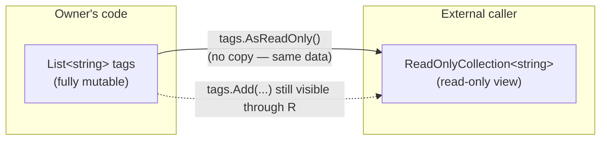
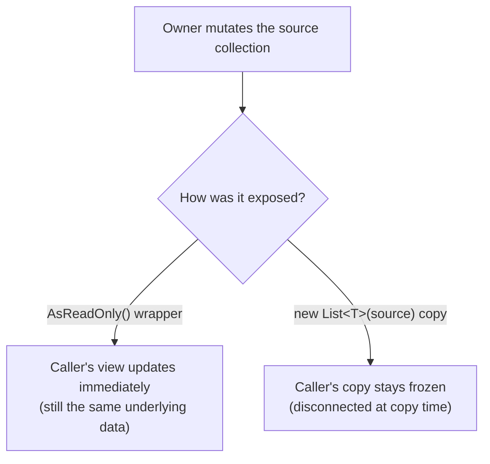

# ReadOnlyCollection<T> and Read-Only Wrappers

## Introduction

Before reading this lesson, you should already be comfortable with **[Queue<T> in Depth](../03-collections-generics/03-09-queue-t-in-depth.md)** and, more broadly, with every mutable collection covered so far in this module — `List<T>`, `Dictionary<TKey,TValue>`, `HashSet<T>`, `Stack<T>`, `Queue<T>`. All of them share a problem the moment you want to expose one as a public property: handing out the collection itself hands out full mutation rights along with it. `ReadOnlyCollection<T>`, `AsReadOnly()`, and the `IReadOnlyList<T>`/`IReadOnlyCollection<T>` interfaces solve that — but they solve it with a *view* over the original collection, not a copy, and that distinction has real consequences this lesson makes concrete.

By the end of this lesson, you will be able to:

- Explain what `List<T>.AsReadOnly()` returns and why it wraps rather than copies
- Distinguish the `IReadOnlyList<T>`/`IReadOnlyCollection<T>` interfaces from `IList<T>`/`ICollection<T>`
- Demonstrate that a read-only wrapper is a *live view*: changes made through the original mutable reference are visible through it
- Explain why that live-view behavior is not the same protection a genuine defensive copy provides
- Expose a Library/Inventory catalog's contents safely to external callers using a read-only wrapper
- Recognize when a live read-only view isn't enough, setting up the next lesson's true immutable collections

## Read-Only Wrappers — A Layman's Perspective

Picture a museum that owns a rare, valuable manuscript. The museum doesn't want visitors physically handling the pages — turning them, marking them, tearing one out — but it absolutely does want visitors to be able to see every page, including any page the curators add or rearrange after the exhibit opens. Their solution is a sealed glass display case with the manuscript mounted inside on a slowly rotating pedestal. Visitors pressed up against the glass can read every word, but there is no way for them to reach in and change so much as a comma — the case physically prevents it, no matter how determined a visitor is. That's the essence of a read-only wrapper: full visibility, zero write access, enforced by the container rather than by trusting the visitor to behave.

Here's the detail that trips people up, though: the manuscript inside that glass case is still the exact same physical, editable object the museum's own conservators work on in the back room. If a conservator carefully adds a newly authenticated page to the manuscript overnight, that page appears inside the display case the very next morning — visitors see it appear as if by magic, because they were always looking at the *real, current* manuscript, just through glass that only the museum's own staff can open. The glass protects the manuscript from *visitors*; it does nothing at all to stop the *museum itself* from continuing to edit the very thing on display.

Now compare that to a completely different approach: instead of a display case, the museum could photocopy every page and hand a bound photocopy to each visitor to take home. That photocopy is now entirely disconnected from the original — if a conservator adds a page to the real manuscript next week, every photocopy already handed out is permanently, silently out of date. Nobody holding one would ever know a new page exists unless the museum reprints and redistributes.

Both approaches genuinely stop a visitor from marking up the real manuscript. But they answer a very different question: does the person looking at it see updates as they happen, or do they see a frozen snapshot from the moment they received it? A read-only wrapper is the display case — a live view over something that can still change behind the scenes. A defensive copy is the photocopy — a snapshot, disconnected the instant it's made. Confusing the two is exactly the kind of subtle bug this lesson exists to prevent.

## Read-Only Wrappers — A Programming Language Perspective

`List<T>.AsReadOnly()` returns a `System.Collections.ObjectModel.ReadOnlyCollection<T>` — a thin wrapper that stores a reference to the original list and delegates every read operation (`this[int]`, `Count`, enumeration) straight through to it, at O(1) construction cost, with no element copying whatsoever. Every mutating member `ReadOnlyCollection<T>` exposes through `IList<T>` — `Add`, `Remove`, `Clear`, the indexer setter — is implemented explicitly to throw `NotSupportedException` immediately, rather than silently doing nothing. Because the wrapper holds a live reference rather than a copy, any change made to the original list through the original variable is immediately visible when reading through the wrapper — it is a read-only *view* over a collection that is still fully mutable from the owner's side, not an immutable snapshot. `IReadOnlyList<T>` and `IReadOnlyCollection<T>` (available since .NET 4.5) are the interfaces a well-designed API should return instead of a concrete `List<T>` or `ReadOnlyCollection<T>` — they express "callers may only read this" as a compile-time contract, independent of whichever concrete type actually implements it. A genuinely defensive copy — one that protects against upstream mutation too — requires actually duplicating the elements, e.g. `new List<T>(source)` or an immutable collection type, the subject of the next lesson.

## How to Create and Use a Read-Only Wrapper in C#

Wrapping a `List<T>` costs nothing beyond a single method call, but it's essential to see what that wrapper does — and does not — protect against before relying on one.


*Figure 1: `AsReadOnly()` wraps the original list by reference — the caller can read it, but any change the owner makes is still visible through the wrapper.*

```csharp
// Program.cs — .NET 10 / C# 14

List<string> tags = ["news", "sports"];
var readOnlyTags = tags.AsReadOnly();

Console.WriteLine("Read-only view: " + string.Join(", ", readOnlyTags));

tags.Add("weather"); // Mutating the ORIGINAL list, not the wrapper.

Console.WriteLine("Read-only view after mutating original: " + string.Join(", ", readOnlyTags));

try
{
    ((IList<string>)readOnlyTags).Add("politics");
}
catch (NotSupportedException ex)
{
    Console.WriteLine($"Mutation blocked: {ex.Message}");
}
```

**Console Output:**

```text
Read-only view: news, sports
Read-only view after mutating original: news, sports, weather
Mutation blocked: Collection is read-only.
```

Two things happened here that are easy to miss if you assume `AsReadOnly()` produces a snapshot. First, adding `"weather"` to the *original* `tags` list made it appear in `readOnlyTags` immediately, with zero extra code — proof this is a live view, not a copy. Second, attempting to mutate `readOnlyTags` *directly*, by casting it to `IList<string>` and calling `Add`, throws `NotSupportedException` — the wrapper genuinely blocks writes coming through itself, it just can't (and isn't meant to) block writes coming through the original reference.

## Real-Time Example: Exposing a Library Catalog Safely

We continue the Library/Inventory Management case study. `Catalog` keeps its books in a private, fully mutable `List<string>`, but exposes them to external callers — the front-desk checkout screen, a reporting dashboard, anything outside the class — only as `IReadOnlyList<string>`. The catalog itself can keep adding books at any time, and every caller holding the read-only view sees each new book the instant it's added, without ever being able to add one directly.

```csharp
// Program.cs — .NET 10 / C# 14 — Real-Time Example
// Library/Inventory Management case study: Catalog exposes its book list as a
// read-only VIEW so external code can inspect but never directly mutate it,
// while still seeing every update the Catalog itself makes in real time.

var catalog = new Catalog();
catalog.AddBook("Clean Code");
catalog.AddBook("The Pragmatic Programmer");

IReadOnlyList<string> visibleBooks = catalog.Books;
Console.WriteLine("Catalog view: " + string.Join(", ", visibleBooks));

// The front desk (external code) can only read — the compiler won't even let
// this line be written against an IReadOnlyList<string>:
// visibleBooks.Add("Refactoring"); // <- would not compile, no Add exists here

catalog.AddBook("Refactoring"); // Only Catalog itself can add.
Console.WriteLine("Catalog view after Catalog.AddBook: " + string.Join(", ", visibleBooks));

try
{
    ((IList<string>)visibleBooks).Add("Domain-Driven Design");
}
catch (NotSupportedException ex)
{
    Console.WriteLine($"Direct mutation attempt blocked: {ex.Message}");
}

Console.WriteLine($"Final catalog count: {visibleBooks.Count}");

class Catalog
{
    private readonly List<string> _books = [];
    private readonly IReadOnlyList<string> _readOnlyView;

    public Catalog()
    {
        _readOnlyView = _books.AsReadOnly();
    }

    public IReadOnlyList<string> Books => _readOnlyView;

    public void AddBook(string title) => _books.Add(title);
}
```

**Console Output:**

```text
Catalog view: Clean Code, The Pragmatic Programmer
Catalog view after Catalog.AddBook: Clean Code, The Pragmatic Programmer, Refactoring
Direct mutation attempt blocked: Collection is read-only.
Final catalog count: 3
```

The compiler itself already refuses to compile `visibleBooks.Add(...)`, because `IReadOnlyList<T>` simply has no such member — the safest kind of protection, since it's caught before the program ever runs. Casting around that (`(IList<string>)visibleBooks`) is still possible, since `ReadOnlyCollection<T>` implements `IList<T>` under the hood, but doing so only proves the wrapper still throws at runtime rather than quietly succeeding. Meanwhile `catalog.AddBook("Refactoring")`, called entirely from inside `Catalog`, shows up in `visibleBooks` immediately — exactly the live-view behavior this lesson is about, and exactly what a real catalog needs: outside code should always see the current state, never a stale copy, while never being trusted to change that state directly.

## Read-Only View vs Defensive Copy

A read-only wrapper and a defensive copy both stop a caller from mutating what they receive directly, but they diverge completely on one question: does the caller see later changes the owner makes? A wrapper says yes — it's still the same underlying data, just viewed through a restricted interface. A copy says no — the moment it's made, it's a frozen, disconnected snapshot that will never reflect anything that happens to the original afterward. Neither one is universally "more correct"; a live view is exactly right when callers should track ongoing state (like a catalog's current contents), while a copy is exactly right when callers need a stable snapshot immune to concurrent or later changes (like a receipt of what was in a cart at checkout time).


*Figure 2: The same mutation by the owner produces two very different outcomes depending on whether the caller was handed a view or a copy.*

| Aspect | Read-only wrapper (`AsReadOnly()`) | Defensive copy (`new List<T>(source)`) |
|---|---|---|
| Underlying storage | Same collection, referenced, not duplicated | Brand-new collection with duplicated elements |
| Reflects the owner's later changes? | Yes — it's a live view | No — frozen at the moment of copying |
| Blocks mutation via the wrapper/copy itself | Yes — throws `NotSupportedException` | Yes — but only because it's a separate object anyway |
| Blocks mutation via the original reference | No — the owner can still mutate freely | N/A — no longer connected to the original |
| Cost to create | O(1) — no copying | O(n) — every element is copied |
| Best fit | Exposing "current state" that should stay live | Exposing "a snapshot at this moment," e.g. an audit record |

## Related Encapsulation and Immutability Types

Read-only wrappers are one piece of a broader spectrum of tools for controlling how much a caller can do to a collection they've been handed:

1. **[Immutable Collections (ImmutableList<T>, etc.)](../03-collections-generics/03-11-immutable-collections.md)** — genuinely immutable snapshots, the next step up from a live read-only view, covered next.
2. **`ReadOnlyDictionary<TKey,TValue>`** — the same wrapper pattern this lesson covered, applied to `Dictionary<TKey,TValue>` instead of `List<T>` (a sibling BCL type with no dedicated lesson).
3. **[List<T> in Depth](../03-collections-generics/03-03-list-t-in-depth.md)** — the mutable collection `AsReadOnly()` wraps without copying.
4. **[IEnumerable<T> and IEnumerator<T>](../03-collections-generics/03-13-ienumerable-and-ienumerator.md)** — the most restrictive read-only contract of all: forward-only enumeration, no indexing, no `Count`.
5. **[Choosing the Right Collection — Comparison Guide](../03-collections-generics/03-22-choosing-the-right-collection.md)** — where read-only wrappers fit into the module's full decision matrix.

## What You've Learned & What's Next

`AsReadOnly()` and the `IReadOnlyList<T>`/`IReadOnlyCollection<T>` interfaces let you expose a collection's contents without handing out mutation rights, at essentially zero cost — but the wrapper is a live view over the original data, not a snapshot, so the owner can still change it freely and every caller holding the view will see that change immediately. That's often exactly the right behavior, but it is not the same guarantee as true immutability.

Continue your learning journey with **[Immutable Collections (ImmutableList<T>, etc.)](../03-collections-generics/03-11-immutable-collections.md)**, where we cover collections that genuinely cannot change after creation — snapshots in the fullest sense, with no back door for the owner to mutate them either.

---
*Applies to: .NET 10 / C# 14. Last reviewed 2026-08-16.*
