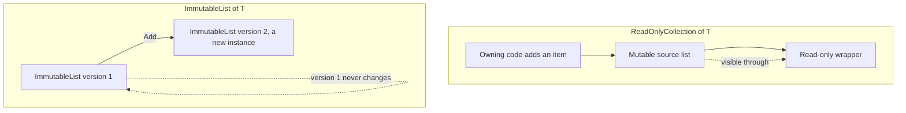

# Immutable Collections (ImmutableList<T>, etc.)

## Introduction

Before reading this lesson, you should already be comfortable with **[ReadOnlyCollection<T> and Read-Only Wrappers](../03-collections-generics/03-10-readonlycollection-and-wrappers.md)**. That lesson showed how to expose a collection so callers can't add or remove items through the reference they hold — but the underlying list can still change if the *owning* code mutates it, and the wrapper reflects that change instantly. This lesson introduces something stronger: collections from `System.Collections.Immutable` that genuinely cannot change after they're created, by anyone, ever — while still avoiding the cost of copying the whole collection on every edit.

By the end of this lesson, you will be able to:

- Explain the difference between a read-only *view* and true immutability backed by structural sharing
- Create and query `ImmutableList<T>` and `ImmutableDictionary<TKey, TValue>` from `System.Collections.Immutable`
- Produce a modified immutable collection with `Add`/`Remove` without ever mutating the original
- Use the builder pattern (`ToBuilder()` / `ImmutableList.CreateBuilder<T>()`) to construct a large immutable collection efficiently
- Recognize the scenarios — thread safety, audit trails, defensive snapshots — where immutability is worth its allocation cost

## Immutable Collections — A Layman's Perspective

Picture a whiteboard in a shared office. Anyone can walk up and add a note, erase a line, or rearrange the diagram. If you photograph that whiteboard through a picture frame hung on the wall next to it — a frame with glass but no shelf to write on — you can look at the whiteboard's current content through the glass, but you can't touch the marker ink yourself. That's genuinely useful: it stops *you* from scribbling on it. But it doesn't stop your coworker from walking up to the actual whiteboard and changing what's behind the glass. Look through the frame again five minutes later and the content may be completely different, because the frame was only ever a window onto something that kept changing underneath.

Now picture something different: instead of a frame, someone takes an actual photograph of the whiteboard and prints it. That photograph is finished. No one can add a note to it, because there's no whiteboard behind the paper anymore — just a fixed image of what things looked like at 2:14 PM. If you want to show the whiteboard's content with one new note added, you don't reach for a marker at all — you take a *new* photograph, one that happens to reuse the exact same background as the old one (because most of the whiteboard didn't change) with just your new note layered on top. The old photograph still exists, still shows exactly what it showed a moment ago, and nothing you do to the new photograph can reach backward and alter it.

That second scenario is quietly clever in one respect a photocopier's brute-force "print the whole whiteboard again" approach wouldn't be: rather than redrawing the entire image from scratch for every single new note, the new photograph is built by keeping almost all of the previous photograph's content exactly as-is and only rendering the small new part. Ninety-nine percent of the picture is shared, reused material; only the tiny sliver that actually changed is new. You get the safety of "this can never be edited after being created" without paying the full cost of "duplicate everything, every single time."

This is precisely the trade a bank makes with a transaction ledger. Once a transaction has posted, it's a fact of history — no one photographs over it or edits the old snapshot. Every new snapshot of the ledger, after a new transaction posts, is really "the old snapshot, unchanged, plus one new entry" — not a hand-copied duplicate of every prior entry. A read-only picture frame protects you from your *own* marker; a photograph protects everyone from every marker, forever, while still being cheap to produce again and again as new events happen. The bridge back to code: a `ReadOnlyCollection<T>` is the picture frame — a view over something that can still change underneath. An `ImmutableList<T>` is the photograph — a value that, once it exists, is permanently and truly fixed, and a "changed" version is always a *new* photograph that reuses almost all of the old one's internal structure.

## Immutable Collections — A Programming Language Perspective

The `System.Collections.Immutable` namespace provides collection types — `ImmutableList<T>`, `ImmutableArray<T>`, `ImmutableDictionary<TKey, TValue>`, `ImmutableHashSet<T>`, and others — that are *persistent data structures*: once constructed, their contents can never change. Operations that look like mutation — `Add`, `Remove`, `SetItem` — don't modify the instance at all; each one returns a **new** immutable collection instance and leaves the original completely untouched. Internally, these types use structural sharing (typically balanced tree structures rather than a single contiguous array), so producing a new version after one small change is close to O(log n), not a full O(n) copy of every element. Since .NET 5, the `System.Collections.Immutable` assembly ships as part of the shared framework, so a .NET 10 console or web project needs only a `using System.Collections.Immutable;` statement — no separate NuGet package reference is required. This is meaningfully different from a `ReadOnlyCollection<T>`, which is a thin wrapper that delegates reads to an underlying mutable list it does not own.

## How to Use Immutable Collections in C#

Static factory methods on the non-generic helper classes (`ImmutableList`, `ImmutableDictionary`, and so on) are the usual entry point, since C# can infer the type argument from the values you pass. Every "mutating" method — `Add`, `Remove`, `SetItem` — returns a new collection value rather than changing the one you called it on, so you must capture the result to see the effect.


*Figure 1: `Add` never changes `original` — it produces a distinct new list that internally reuses most of `original`'s structure.*

```csharp
// Program.cs — .NET 10 / C# 14
using System.Collections.Immutable;

ImmutableList<string> original = ImmutableList.Create("Alice", "Bob", "Carol");
ImmutableList<string> withDave = original.Add("Dave");

Console.WriteLine($"Original: {string.Join(", ", original)}");
Console.WriteLine($"With Dave: {string.Join(", ", withDave)}");
Console.WriteLine($"Same reference? {ReferenceEquals(original, withDave)}");
```

**Console Output:**

```text
Original: Alice, Bob, Carol
With Dave: Alice, Bob, Carol, Dave
Same reference? False
```

`original` is untouched after the call to `Add` — it still reports three names. `withDave` is a genuinely separate `ImmutableList<string>` instance, which is why `ReferenceEquals` reports `False`. If `original` had been a `List<string>`, calling an equivalent mutating method would have changed `original` itself and there would be nothing new to assign to `withDave`.

## Real-Time Example: An Immutable Transaction Ledger in Banking/ATM

We extend the Banking/ATM case study with an `Account` that keeps its transaction history as an `ImmutableList<Transaction>`. A posted transaction is a fact of history — a completed banking system never edits an old entry, it only appends new ones — which makes `ImmutableList<T>` a natural fit. Bulk-loading historical transactions uses the **builder pattern**, so importing hundreds of records doesn't allocate a new tree structure after every single one.

```csharp
// Program.cs — .NET 10 / C# 14 — Real-Time Example
using System.Collections.Immutable;
using System.Linq;

// A posted transaction is a fact of history: it should never be edited after the fact.
record Transaction(string TransactionId, decimal Amount, string Description);

class Account
{
    public string AccountNumber { get; }
    public ImmutableList<Transaction> Ledger { get; private set; } = ImmutableList<Transaction>.Empty;

    public Account(string accountNumber) => AccountNumber = accountNumber;

    // Bulk-load historical transactions with a builder instead of calling Add() once per
    // transaction, which would otherwise rebuild the immutable tree on every single entry.
    public void ImportHistory(IEnumerable<Transaction> history)
    {
        ImmutableList<Transaction>.Builder builder = Ledger.ToBuilder();
        foreach (Transaction t in history)
        {
            builder.Add(t);
        }
        Ledger = builder.ToImmutable();
    }

    // Posting one new transaction: Ledger is reassigned to a *new* immutable list;
    // any reference someone else is holding to the old Ledger value is unaffected.
    public void Post(Transaction transaction) => Ledger = Ledger.Add(transaction);

    public decimal Balance => Ledger.Sum(t => t.Amount);
}

var account = new Account("ACC-1001");

Transaction[] historicalTransactions =
[
    new("T-001", 500.00m, "Opening deposit"),
    new("T-002", -120.50m, "ATM withdrawal"),
    new("T-003", 75.25m, "Interest credit")
];

account.ImportHistory(historicalTransactions);
Console.WriteLine($"After import - balance: ${account.Balance:F2}, transaction count: {account.Ledger.Count}");

ImmutableList<Transaction> snapshotBeforePost = account.Ledger;

account.Post(new Transaction("T-004", -40.00m, "Grocery store purchase"));
Console.WriteLine($"After posting - balance: ${account.Balance:F2}, transaction count: {account.Ledger.Count}");

Console.WriteLine($"Snapshot taken before posting still has {snapshotBeforePost.Count} transactions");
Console.WriteLine($"Snapshot balance frozen at: ${snapshotBeforePost.Sum(t => t.Amount):F2}");
```

**Console Output:**

```text
After import - balance: $454.75, transaction count: 3
After posting - balance: $414.75, transaction count: 4
Snapshot taken before posting still has 3 transactions
Snapshot balance frozen at: $454.75
```

`snapshotBeforePost` is captured as a plain reference to `account.Ledger` before `Post` runs. Because `ImmutableList<T>.Add` never mutates the list it's called on, that captured reference keeps reporting three transactions and a balance of `$454.75` forever, even after `account.Ledger` itself has moved on to four transactions and `$414.75`. In a real banking system, this is exactly the guarantee an auditor needs: a snapshot of the ledger handed to a reporting process at 9:00 AM cannot be silently altered by a transaction posted at 9:01 AM, without anyone having to defensively `.ToList()`-copy anything.

## Immutable Collections vs. ReadOnlyCollection<T>

Both types stop the *caller holding the reference* from adding or removing items directly — but they solve fundamentally different problems. A `ReadOnlyCollection<T>` is a thin, nearly-free wrapper: it holds a reference to an existing mutable list and simply declines to expose `Add`/`Remove` on itself. If the code that owns the underlying list mutates it, every `ReadOnlyCollection<T>` wrapping that list reflects the change on the next read, because there was never a second copy — just one list and a view onto it. An `ImmutableList<T>` has no "underlying mutable list" to point to at all; the moment you call `Add`, you get back a distinct, fully independent value, and the original is guaranteed to read exactly the same forever, regardless of what any other code does anywhere in the program.


*Figure 2: A `ReadOnlyCollection<T>` reflects changes to the list it wraps; an `ImmutableList<T>` never changes — `Add` always produces a separate new version.*

| Aspect | `ReadOnlyCollection<T>` | `ImmutableList<T>` |
|---|---|---|
| True immutability? | No — a view over a still-mutable list | Yes — the instance itself can never change |
| Underlying storage | Wraps the same `List<T>` the owner mutates | Persistent tree structure with internal sharing |
| Effect of an external mutation | Visible instantly through the wrapper | Impossible — there's no "external list" to mutate |
| "Add" semantics | Not exposed at all | Returns a brand-new `ImmutableList<T>` |
| Allocation cost | Near zero (just a wrapper object) | Small allocation per change, shared structure otherwise |
| Typical use case | Exposing a private field read-only to callers | Snapshots shared across threads, audit trails, undo history |

## Types of Immutable Collections in C#

`System.Collections.Immutable` mirrors most of the mutable collection shapes you already know, each with the same "operations return a new instance" contract:

1. **`ImmutableList<T>` / `ImmutableArray<T>`** — sequential collections; `ImmutableArray<T>` trades slower updates for the fastest possible reads, backed by a plain array.
2. **`ImmutableDictionary<TKey, TValue>` / `ImmutableSortedDictionary<TKey, TValue>`** — immutable key/value lookups, the immutable counterpart to `Dictionary<TKey, TValue>`.
3. **`ImmutableHashSet<T>` / `ImmutableSortedSet<T>`** — immutable collections of unique values, mirroring `HashSet<T>` and `SortedSet<T>`.
4. **`ImmutableQueue<T>` / `ImmutableStack<T>`** — immutable FIFO and LIFO structures, useful for functional-style algorithms that pass state forward rather than mutate it.
5. **[Frozen* Collections](../03-collections-generics/03-12-frozen-collections.md)** — a specialized, read-optimized alternative covered next, trading expensive one-time construction for the fastest possible repeated lookups.
6. **[ReadOnlyCollection<T> and Read-Only Wrappers](../03-collections-generics/03-10-readonlycollection-and-wrappers.md)** — the lighter-weight read-only view this lesson contrasted true immutability against.

## What You've Learned & What's Next

You've now seen the real difference between a read-only *view* and true immutability: `ImmutableList<T>` and its siblings can never change after construction, "mutating" operations always return a new value, and the builder pattern makes bulk construction efficient rather than allocation-heavy. This is the foundation for safely sharing snapshots of data across threads or time without a single defensive copy.

Continue your learning journey with **[Frozen* Collections for Read-Heavy Scenarios](../03-collections-generics/03-12-frozen-collections.md)**, where we look at a specialized sibling optimized for a narrower job: build the collection once, then read from it extremely fast, over and over, without ever changing it again.

---
*Applies to: .NET 10 / C# 14. Last reviewed 2026-08-16.*
