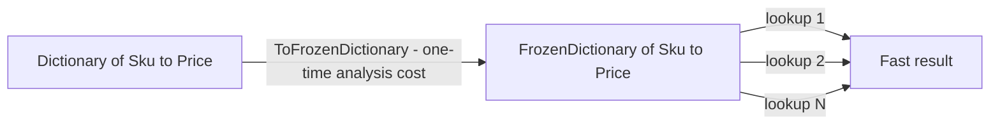
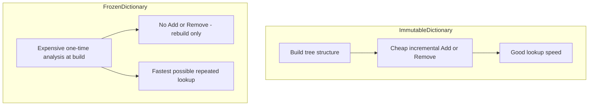

# Frozen* Collections for Read-Heavy Scenarios

## Introduction

Before reading this lesson, you should already be comfortable with **[Immutable Collections (ImmutableList<T>, etc.)](../03-collections-generics/03-11-immutable-collections.md)**, which introduced true immutability through structural sharing: `Add` and `Remove` never mutate an existing collection, they produce a new one. `FrozenDictionary<TKey, TValue>` and `FrozenSet<T>` push that same idea of "never changes after creation" one step further, for one specific job: when a collection is built exactly once and then read from an enormous number of times without ever changing again, it's worth spending extra time at construction to make every single lookup afterward as fast as physically possible.

By the end of this lesson, you will be able to:

- Explain what problem `FrozenDictionary`/`FrozenSet` solve that `ImmutableDictionary`/`ImmutableHashSet` don't already solve
- State that Frozen* collections are a **.NET 8** addition — genuinely new relative to tutorials written before 2023, unlike most collection types in this module
- Build a `FrozenDictionary<TKey, TValue>` from an existing sequence using `ToFrozenDictionary()`
- Describe the tradeoff Frozen* collections make: expensive, analysis-heavy construction in exchange for very fast repeated reads
- Decide between `Dictionary<TKey, TValue>`, `ImmutableDictionary<TKey, TValue>`, and `FrozenDictionary<TKey, TValue>` based on how often the data changes versus how often it's read

## Frozen Collections — A Layman's Perspective

Think about the difference between a hand-written card catalog at an old library and a professionally typeset, printed reference book. The card catalog is quick to update — a librarian can slide a new index card in between two existing ones in seconds whenever a new book arrives. But searching it means flipping through cards roughly in order, which is fine, not blazing.

A printed reference book is the opposite story. Getting it into print in the first place is a whole production: a typesetter lays out every entry, decides the exact page and column each one belongs on, cross-references everything, and sends it to a printer that binds thousands of copies. That whole process might take weeks and can't be undone cheaply — you don't "insert one new entry" into an already-printed book; you'd have to typeset and print an entirely new edition. But once that book exists, looking something up in it is about as fast as a lookup can possibly be: the layout was specifically optimized, in advance, for the exact way readers search it, at the cost of all that upfront work.

Now think about where each approach actually belongs. A card catalog that changes constantly, a few cards a day, is well served by staying a card catalog — redoing an entire typeset print run every time one book gets added would be absurd. But a phone company's annual directory, printed once a year and then consulted by millions of people for the rest of the year without a single change, is exactly the case where all that upfront typesetting expense pays for itself many times over: one expensive layout job, followed by a year of extremely fast, extremely frequent lookups.

That's the tradeoff `FrozenDictionary` and `FrozenSet` are built around. Building one is deliberately more expensive than building a plain `Dictionary` or even an `ImmutableDictionary` — the runtime analyzes the actual keys you hand it and lays out an internal structure specifically tuned for looking *those* keys up quickly. In exchange, once it's built, reading from it is about as fast as .NET can make a lookup. The catch is symmetrical to the printed book: there's no efficient way to "add one entry" to an existing `FrozenDictionary`. If the data changes, you don't update it — you build a brand-new one from scratch, the same way a new edition of a directory gets typeset from zero rather than patched. The bridge to code: reach for a Frozen* collection only when a lookup table is built once — often at application startup — and then read an enormous number of times without changing, the way a product catalog or a currency-code table typically behaves for the life of a running process.

## Frozen Collections — A Programming Language Perspective

`FrozenDictionary<TKey, TValue>` and `FrozenSet<T>` live in the `System.Collections.Frozen` namespace, part of the shared framework since **.NET 8** — genuinely the newest collection family covered in this module, and worth flagging explicitly since tutorials written before .NET 8 shipped won't mention it at all. Both are abstract base classes with no public constructor; you create one with the `ToFrozenDictionary()` or `ToFrozenSet()` extension methods, which accept any `IEnumerable<T>` source. During that call, the runtime inspects the actual data and builds whichever internal lookup strategy it determines will be fastest for that specific key set — this analysis is the "expensive" part of construction. Once built, a Frozen* collection exposes no `Add`, `Remove`, or indexer setter at all; every member is read-only, making it strictly more locked-down than `ImmutableDictionary<TKey, TValue>`, which at least supports efficient incremental "modified copy" operations that Frozen* collections deliberately don't optimize for.

## How to Build and Query a FrozenDictionary in C#

Start from any existing dictionary-like source and call `ToFrozenDictionary()`. The one-time analysis cost happens inside that call; every lookup afterward — indexer access, `ContainsKey`, `TryGetValue` — runs against the specially built, read-optimized structure.


*Figure 1: The analysis cost is paid once, during construction; every lookup after that is optimized to be as fast as possible.*

```csharp
// Program.cs — .NET 10 / C# 14
using System.Collections.Frozen;

Dictionary<string, decimal> priceBySku = new()
{
    ["SKU-1001"] = 19.99m,
    ["SKU-1002"] = 42.50m,
    ["SKU-1003"] = 8.75m
};

FrozenDictionary<string, decimal> frozenPrices = priceBySku.ToFrozenDictionary();

Console.WriteLine($"SKU-1002 price: {frozenPrices["SKU-1002"]:F2}");
Console.WriteLine($"Contains SKU-1003? {frozenPrices.ContainsKey("SKU-1003")}");
Console.WriteLine($"Contains SKU-9999? {frozenPrices.ContainsKey("SKU-9999")}");
```

**Console Output:**

```text
SKU-1002 price: 42.50
Contains SKU-1003? True
Contains SKU-9999? False
```

Notice that nothing here differs syntactically from using a regular `Dictionary<TKey, TValue>` — the indexer, `ContainsKey`, and `TryGetValue` all read the same way. The difference is entirely internal: `frozenPrices` has no `Add` or `Remove` method at all, and the specific way it stores `"SKU-1001"`, `"SKU-1002"`, and `"SKU-1003"` was chosen specifically for this exact set of keys during the `ToFrozenDictionary()` call.

## Real-Time Example: A Frozen Product Catalog in E-Commerce Order Processing

We extend the E-Commerce Order Processing case study with a `ProductCatalog` that's built exactly once — typically when the storefront application starts, from a full product feed — and then queried on every single incoming order for the rest of the process's lifetime. That build-once, read-constantly-afterward shape is precisely what `FrozenDictionary` is optimized for.

```csharp
// Program.cs — .NET 10 / C# 14 — Real-Time Example
using System.Collections.Frozen;

record Product(string Sku, string Name, decimal Price);
record OrderLine(string Sku, int Quantity);

// Built once, at startup, from the full product catalog feed - then queried on every order
// for the rest of the process's lifetime. A FrozenDictionary is worth its construction
// cost here precisely because it is built once and read an enormous number of times.
class ProductCatalog
{
    private readonly FrozenDictionary<string, Product> _productsBySku;

    public ProductCatalog(IEnumerable<Product> products)
    {
        _productsBySku = products.ToFrozenDictionary(p => p.Sku);
    }

    public bool TryGetProduct(string sku, out Product? product) =>
        _productsBySku.TryGetValue(sku, out product);
}

Product[] fullCatalog =
[
    new("SKU-1001", "Wireless Mouse", 19.99m),
    new("SKU-1002", "Mechanical Keyboard", 74.50m),
    new("SKU-1003", "USB-C Hub", 28.00m),
    new("SKU-1004", "27-inch Monitor", 249.99m)
];

var catalog = new ProductCatalog(fullCatalog);

OrderLine[] incomingOrder =
[
    new("SKU-1002", 1),
    new("SKU-1004", 2),
    new("SKU-9999", 1) // discontinued or mistyped SKU
];

decimal orderTotal = 0m;

foreach (OrderLine line in incomingOrder)
{
    if (catalog.TryGetProduct(line.Sku, out Product? product))
    {
        decimal lineTotal = product!.Price * line.Quantity;
        orderTotal += lineTotal;
        Console.WriteLine($"{line.Quantity} x {product.Name} ({line.Sku}) = ${lineTotal:F2}");
    }
    else
    {
        Console.WriteLine($"Skipped {line.Sku}: not found in catalog");
    }
}

Console.WriteLine($"Order total: ${orderTotal:F2}");
```

**Console Output:**

```text
1 x Mechanical Keyboard (SKU-1002) = $74.50
2 x 27-inch Monitor (SKU-1004) = $499.98
Skipped SKU-9999: not found in catalog
Order total: $574.48
```

`ProductCatalog` pays the cost of `ToFrozenDictionary()`'s analysis exactly once, when the storefront starts up. Every order that arrives afterward — and in a real system, that might be thousands per minute — does nothing but `TryGetValue` lookups against an already-optimized structure. `SKU-9999` demonstrates that a missing key is handled the same way it would be with any dictionary: `TryGetProduct` returns `false`, the order line is skipped and logged, and processing continues rather than crashing. If the product feed changes overnight, the fix isn't to patch the existing `FrozenDictionary` — it's to build a brand-new `ProductCatalog` from the refreshed feed the next time the application starts or reloads its catalog.

## FrozenDictionary vs. ImmutableDictionary

Both types share the same core promise — once built, neither can be changed — but they're tuned for opposite priorities. `ImmutableDictionary<TKey, TValue>` is built to make "give me a slightly modified copy" cheap: `Add`/`SetItem` reuse most of the existing tree and return quickly. `FrozenDictionary<TKey, TValue>` doesn't optimize for that operation at all — it has no `Add`, and producing a "modified" version means building an entirely new `FrozenDictionary` from scratch, paying the full analysis cost again. In exchange, its lookups are tuned to be faster than `ImmutableDictionary`'s for the specific key set it was built from.


*Figure 2: `ImmutableDictionary` balances cheap incremental changes with good reads; `FrozenDictionary` sacrifices "changeability" entirely for maximum read speed.*

| Aspect | `ImmutableDictionary<TKey, TValue>` | `FrozenDictionary<TKey, TValue>` |
|---|---|---|
| Namespace / availability | `System.Collections.Immutable`, shared framework since .NET 5 | `System.Collections.Frozen`, **new in .NET 8** |
| Construction cost | Moderate — builds a persistent tree | Deliberately higher — analyzes keys to pick an optimal layout |
| "Modify" operation | Efficient — `Add`/`SetItem` return a new version, sharing structure | Not supported — build an entirely new instance from scratch |
| Optimized for | A balance of reasonable reads and cheap incremental changes | Read speed above everything else |
| Best used when | Data changes occasionally and callers need cheap "new version" snapshots | Data is built once (e.g., at startup) and read an enormous number of times unchanged |

## Types Related to Frozen Collections in C#

1. **`FrozenDictionary<TKey, TValue>`** — the frozen counterpart to `Dictionary<TKey, TValue>`, optimized purely for repeated key lookups.
2. **`FrozenSet<T>`** — the frozen counterpart to `HashSet<T>`, optimized for repeated `Contains` checks.
3. **`ToFrozenDictionary()` / `ToFrozenSet()`** — the extension methods, in `System.Collections.Frozen`, that build a Frozen* collection from any `IEnumerable<T>` source.
4. **[Immutable Collections (ImmutableList<T>, etc.)](../03-collections-generics/03-11-immutable-collections.md)** — the more general-purpose immutable family that Frozen* collections specialize purely for lookup speed.
5. **[IEnumerable<T> and IEnumerator<T>](../03-collections-generics/03-13-ienumerable-and-ienumerator.md)** — the shared interface every collection in this module, Frozen* collections included, implements.

## What You've Learned & What's Next

`FrozenDictionary` and `FrozenSet` are a genuinely new, .NET 8-and-later tool for a narrow but common job: a lookup table built exactly once — often at startup — and then read from constantly for the rest of a process's life, where paying extra at construction time buys the fastest possible reads afterward.

Continue your learning journey with **[IEnumerable<T> and IEnumerator<T>](../03-collections-generics/03-13-ienumerable-and-ienumerator.md)**, where we step back from specific collection types to the shared interfaces — implemented by every collection covered so far in this module, Frozen* included — that make `foreach` possible in the first place.

---
*Applies to: .NET 10 / C# 14. Last reviewed 2026-08-16.*
