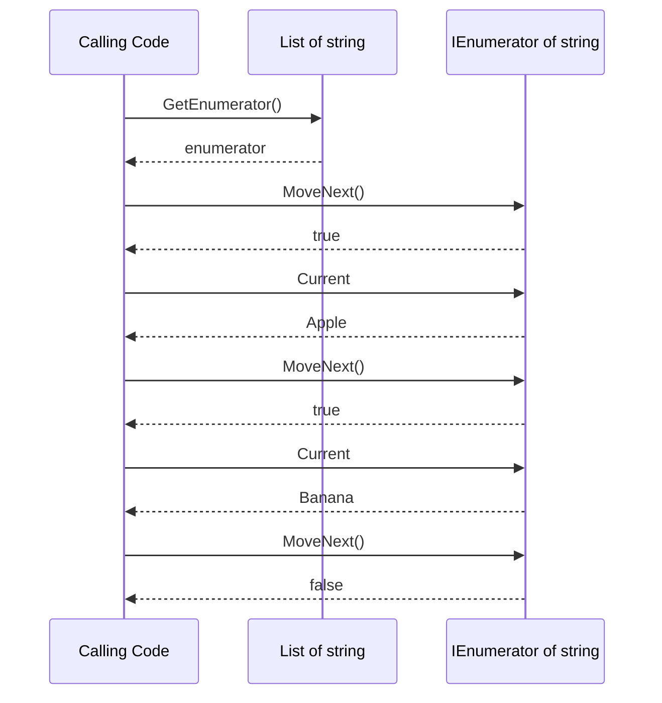
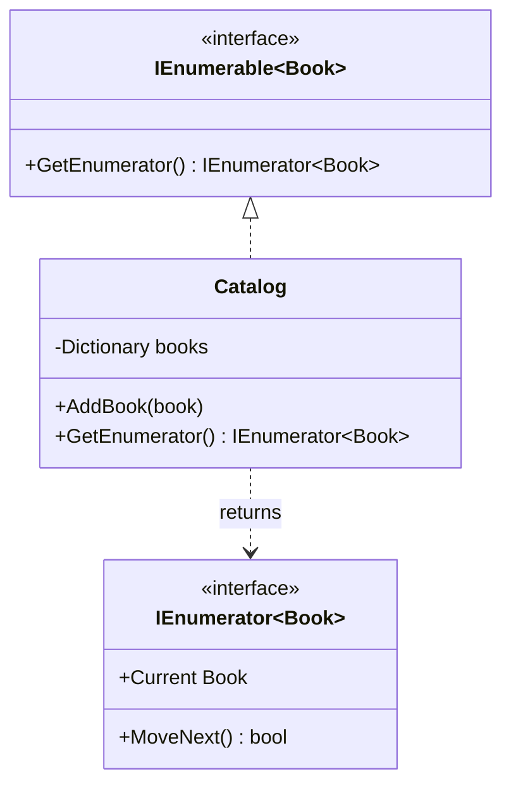
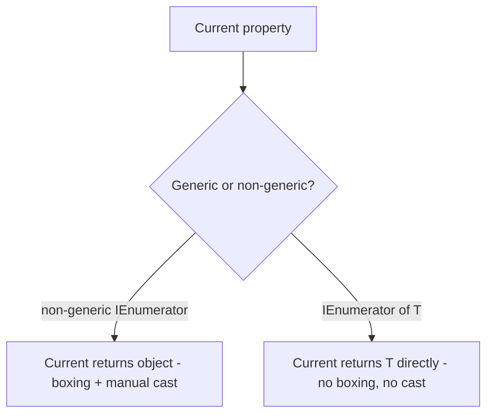

# IEnumerable<T> and IEnumerator<T>

## Introduction

Before reading this lesson, you should already be comfortable with **[Frozen* Collections for Read-Heavy Scenarios](../03-collections-generics/03-12-frozen-collections.md)**, and really with every collection type covered so far in this module — `List<T>`, `Dictionary<TKey, TValue>`, `ImmutableList<T>`, `FrozenDictionary<TKey, TValue>`, and the rest. Every one of those types can be looped over with `foreach`, and that's not a coincidence: `foreach` isn't magic built specifically into each collection type, it's a compiler feature built on top of exactly two interfaces, `IEnumerable<T>` and `IEnumerator<T>`. This lesson pulls back the curtain on what `foreach` is actually doing underneath.

By the end of this lesson, you will be able to:

- Explain the relationship between a `foreach` loop and the `IEnumerable<T>`/`IEnumerator<T>` interfaces the compiler expands it into
- Manually enumerate a collection using `GetEnumerator()`, `MoveNext()`, and `Current`
- State why every collection type covered in this module implements `IEnumerable<T>`
- Implement `IEnumerable<T>` on a custom type so it supports `foreach` directly
- Distinguish the modern generic interfaces from the non-generic `IEnumerable`/`IEnumerator` that predate generics

## IEnumerable and IEnumerator — A Layman's Perspective

Picture a museum with a single, fixed walking tour route — one specific ordered path through the exhibits, decided in advance. Two different things are going on here, and it's worth keeping them separate. First, there's the museum itself — the building, the collection of exhibits, the fact that a tour of it *can* be given. Second, there's an actual, in-progress tour — a docent currently standing in front of exhibit number four, who can tell you "yes, there's a next exhibit" and then physically walk you to it.

The museum answering "yes, I can give you a tour, here's where it starts" is one kind of capability. The docent standing at a specific exhibit, able to answer "is there a next one?" and then move to it, is a completely different, more specific kind of capability — one that only makes sense once a tour is actually underway. Critically, the museum itself can host any number of *simultaneous, independent* tours. Ten different docents can each be leading ten different groups through the same museum at the same time, each docent at a different exhibit, without any of them interfering with each other — because each docent's position is their own state, entirely separate from the museum's fixed collection of exhibits.

Now notice something else about a good docent: they don't hand you a photograph of exhibit four while simultaneously showing you exhibit five. At any given moment, a docent is standing in front of exactly *one* exhibit — the "current" one — and the only two things you can ask them are "what am I looking at right now?" and "please move to the next one." If you ask "move to the next one" once you've already reached the final exhibit, the docent simply tells you there's nothing left, rather than pointing at empty space. And when the tour ends, a considerate docent doesn't just wander off — they formally close things out, radio back to the front desk, and free themselves up for the next group.

That maps directly onto the two interfaces this lesson covers. The museum — something that can produce a fresh, independent walkthrough whenever asked — is `IEnumerable<T>`. The docent actually mid-tour, holding a "current position" and able to advance one step at a time, is `IEnumerator<T>`. A `foreach` loop is simply: ask the museum for a docent, keep asking that docent to move forward and telling you what's current, and formally end the tour once there's nothing left to see.

## IEnumerable and IEnumerator — A Programming Language Perspective

`IEnumerable<T>` declares exactly one member: `IEnumerator<T> GetEnumerator()`. It represents "a sequence that can be iterated," not the iteration itself. `IEnumerator<T>` is the type that actually performs the walk: it exposes a `T Current { get; }` property and inherits `bool MoveNext()` and `void Reset()` from the non-generic `IEnumerator`, plus `IDisposable` so cleanup (closing a file handle, releasing a database cursor) can happen deterministically when iteration ends. A `foreach (T item in source)` loop is compiler-generated syntactic sugar: it calls `source.GetEnumerator()` once, then repeatedly calls `MoveNext()` and reads `Current` inside a loop, and wraps the whole thing in a `try`/`finally` that calls `Dispose()` on the enumerator — precisely mirroring the museum-and-docent relationship above.

## How to Manually Enumerate a Collection in C#

Every `foreach` loop can be rewritten, line for line, as an explicit call to `GetEnumerator()` followed by a `while (MoveNext())` loop reading `Current`. Seeing the manual version once makes clear that `foreach` isn't adding any new capability — it's just removing boilerplate.


*Figure 1: `foreach` compiles down to exactly this sequence of `GetEnumerator()`, repeated `MoveNext()`/`Current` calls, and a final `Dispose()`.*

```csharp
// Program.cs — .NET 10 / C# 14
List<string> fruits = ["Apple", "Banana", "Cherry"];

IEnumerator<string> enumerator = fruits.GetEnumerator();
try
{
    while (enumerator.MoveNext())
    {
        string current = enumerator.Current;
        Console.WriteLine($"Manually enumerated: {current}");
    }
}
finally
{
    enumerator.Dispose();
}

Console.WriteLine("--- equivalent foreach ---");
foreach (string fruit in fruits)
{
    Console.WriteLine($"foreach enumerated: {fruit}");
}
```

**Console Output:**

```text
Manually enumerated: Apple
Manually enumerated: Banana
Manually enumerated: Cherry
--- equivalent foreach ---
foreach enumerated: Apple
foreach enumerated: Banana
foreach enumerated: Cherry
```

Both blocks produce the same three names in the same order, because they are, underneath, the exact same sequence of calls. The manual version's `try`/`finally` is not decoration — it's precisely what the compiler inserts automatically for you every time you write a `foreach` loop, which is why `IEnumerator<T>` extends `IDisposable` in the first place.

## Real-Time Example: Making the Library Catalog Directly Enumerable

We extend the Library/Inventory Management case study's `Catalog` type so it implements `IEnumerable<Book>` directly, instead of exposing a separate `AllBooks` property. Once `Catalog` implements the interface, calling code can write `foreach (Book book in catalog)` with no extra step at all.


*Figure 2: `Catalog` implements `IEnumerable<Book>` by delegating to the enumerator its internal dictionary already knows how to produce.*

```csharp
// Program.cs — .NET 10 / C# 14 — Real-Time Example
using System.Collections;

record Book(string Title, string Author, string Isbn);

class Catalog : IEnumerable<Book>
{
    private readonly Dictionary<string, Book> _books = new();

    public void AddBook(Book book) => _books[book.Isbn] = book;

    // Delegate to the underlying dictionary's Values enumerator - Catalog doesn't need
    // to hand-write its own state machine, just forward to one that already exists.
    public IEnumerator<Book> GetEnumerator() => _books.Values.GetEnumerator();

    // Required because IEnumerable<T> inherits from the non-generic IEnumerable;
    // it simply forwards to the strongly-typed version above.
    IEnumerator IEnumerable.GetEnumerator() => GetEnumerator();
}

var catalog = new Catalog();
catalog.AddBook(new Book("Clean Code", "Robert C. Martin", "978-0132350884"));
catalog.AddBook(new Book("Refactoring", "Martin Fowler", "978-0134757599"));
catalog.AddBook(new Book("The Pragmatic Programmer", "Andrew Hunt", "978-0135957059"));

// foreach works directly on catalog now - no AllBooks property needed - because
// Catalog itself implements IEnumerable<Book>.
foreach (Book book in catalog)
{
    Console.WriteLine($"{book.Title} by {book.Author} (ISBN {book.Isbn})");
}

int bookCount = 0;
IEnumerator<Book> manualEnumerator = catalog.GetEnumerator();
while (manualEnumerator.MoveNext())
{
    bookCount++;
}
manualEnumerator.Dispose();
Console.WriteLine($"Catalog holds {bookCount} books, counted via manual enumeration");
```

**Console Output:**

```text
Clean Code by Robert C. Martin (ISBN 978-0132350884)
Refactoring by Martin Fowler (ISBN 978-0134757599)
The Pragmatic Programmer by Andrew Hunt (ISBN 978-0135957059)
Catalog holds 3 books, counted via manual enumeration
```

`Catalog` doesn't hand-write an enumerator class at all — it implements `IEnumerable<Book>.GetEnumerator()` by returning `_books.Values.GetEnumerator()`, reusing the dictionary's own enumerator rather than duplicating its logic. That's enough for both the `foreach` loop and the manual `MoveNext()`/`Current` walk to work identically, and it's exactly why front-desk code, reporting code, and export code can all iterate a `Catalog` the same simple way without knowing it's backed by a `Dictionary<string, Book>` underneath.

## Generic vs. Non-Generic Enumeration

Before generics existed, .NET Framework 1.0 shipped `IEnumerable` and `IEnumerator`, whose `Current` property returns a plain `object`. That works for any type, but it means every value type — an `int`, a `DateOnly`, a custom `struct` — gets boxed on every single `Current` access, and every caller has to cast `Current` back to the real type by hand, with no compile-time safety net if they cast to the wrong one. `IEnumerable<T>` and `IEnumerator<T>`, added in .NET Framework 2.0 alongside generics, fix both problems: `Current` is typed as `T` directly, so there's no boxing for value types and no cast for reference types. `IEnumerable<T>` still inherits from the non-generic `IEnumerable`, which is why the example above had to implement both `GetEnumerator()` overloads — the generic one is what modern code actually uses.


*Figure 3: The generic interface removes both the boxing cost and the manual casting the non-generic one requires.*

| Aspect | `IEnumerable` / `IEnumerator` (non-generic) | `IEnumerable<T>` / `IEnumerator<T>` |
|---|---|---|
| Introduced | .NET Framework 1.0 (2002), before generics existed | .NET Framework 2.0 (2005), alongside generics |
| `Current` property type | `object` | `T` |
| Value types | Boxed on every `Current` access | No boxing — strongly typed throughout |
| Type safety | Caller must cast `Current` manually | Fully checked at compile time |
| Modern usage | Rarely implemented directly; required only because `IEnumerable<T>` inherits it | The interface virtually every modern collection implements |

## Types and Concepts Around Enumeration in C#

1. **`IEnumerable<T>`** — the single-method interface (`GetEnumerator()`) every enumerable collection implements.
2. **`IEnumerator<T>`** — the `Current`/`MoveNext()`/`Reset()` contract that actually walks a sequence, plus `IDisposable` for cleanup.
3. **Non-generic `IEnumerable` / `IEnumerator`** — the pre-generics ancestors from .NET Framework 1.0, still required because `IEnumerable<T>` inherits from `IEnumerable`.
4. **[Custom Iterators with yield](../03-collections-generics/03-14-custom-iterators-with-yield.md)** — how to implement `IEnumerable<T>` without hand-writing an enumerator class at all, covered next.
5. **[Frozen* Collections for Read-Heavy Scenarios](../03-collections-generics/03-12-frozen-collections.md)** — one of many collection types in this module built entirely on top of `IEnumerable<T>`.

## What You've Learned & What's Next

`foreach` isn't a special case for each collection type — it's compiler sugar over exactly two interfaces: `IEnumerable<T>`, which produces a fresh enumerator, and `IEnumerator<T>`, which walks a sequence one `MoveNext()`/`Current` step at a time and cleans up via `IDisposable` when it's done. Any type that implements `IEnumerable<T>` — like the `Catalog` built in this lesson — gets `foreach` support for free.

Continue your learning journey with **[Custom Iterators with yield](../03-collections-generics/03-14-custom-iterators-with-yield.md)**, where the `_books.Values.GetEnumerator()` delegation trick used here gives way to something more powerful: writing a custom `IEnumerable<T>` method with `yield return`, without hand-writing an enumerator class or a full state machine at all.

---
*Applies to: .NET 10 / C# 14. Last reviewed 2026-08-16.*
