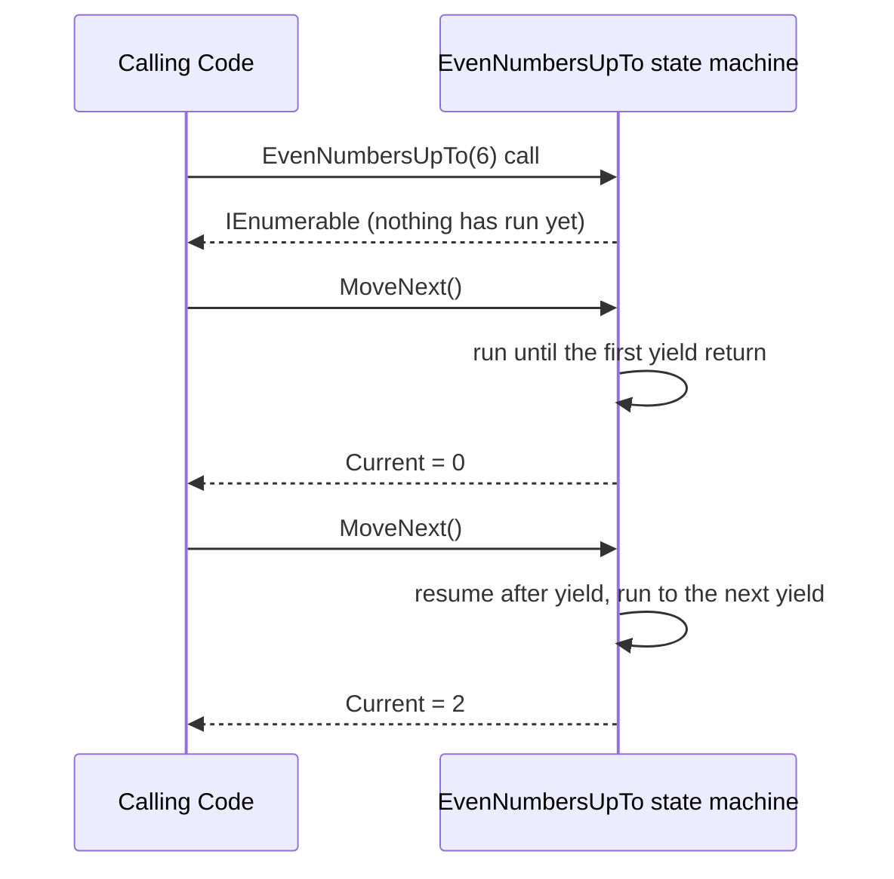
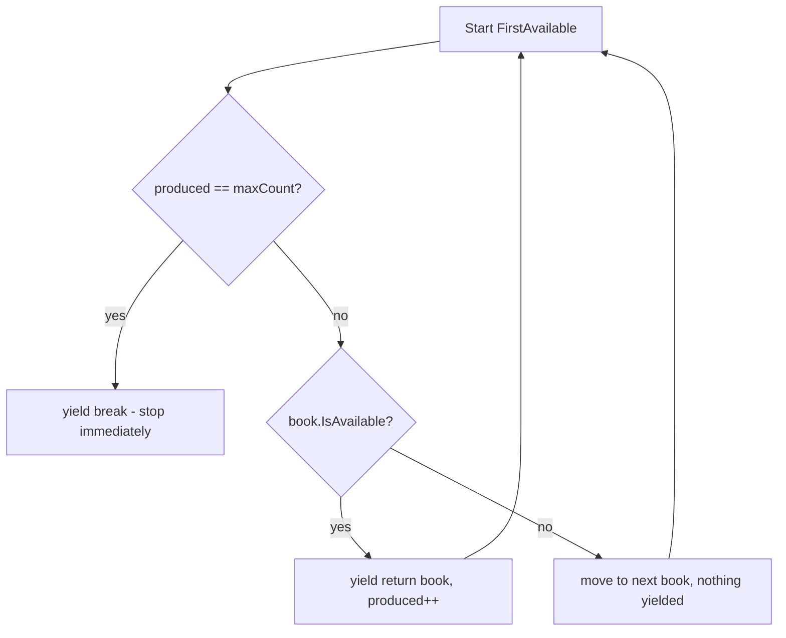
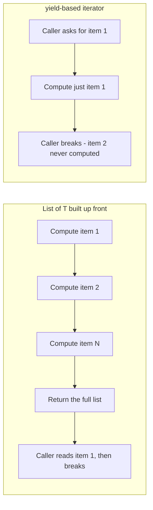

# Custom Iterators with yield

## Introduction

Before reading this lesson, you should already be comfortable with **[IEnumerable<T> and IEnumerator<T>](../03-collections-generics/03-13-ienumerable-and-ienumerator.md)**, including how `Catalog` implemented `IEnumerable<Book>` by delegating to `_books.Values.GetEnumerator()`. That worked because a `Dictionary<TKey, TValue>` already had an enumerator to hand off to. This lesson covers what to do when there's no existing enumerator to delegate to at all — when you want to write custom filtering or generation logic and still have it work with `foreach`, without first building a whole `List<T>` of results just to hand back one item at a time.

By the end of this lesson, you will be able to:

- Explain what `yield return` and `yield break` do inside an iterator method
- Describe, at a high level, the compiler-generated state machine that makes `yield` work
- Write a custom method returning `IEnumerable<T>` that produces values lazily, one at a time
- Demonstrate that an iterator method's body doesn't run at all until the caller starts enumerating
- Use `yield break` to end a sequence early without scanning or allocating for the remaining items

## Custom Iterators — A Layman's Perspective

Picture two very different ways a restaurant kitchen could handle a large catering order for two hundred guests. The first approach: the kitchen cooks and plates all two hundred meals in advance, lines every single plate up on long tables, covers them, and only then tells the servers "go ahead, start serving." Whether the event ends up needing all two hundred plates or only ends up serving fifty guests before it wraps up early, the kitchen already did all two hundred meals' worth of work — every ingredient chopped, every dish cooked, every plate arranged — before a single server ever picked one up.

The second approach: the kitchen keeps a ticket rail. A server rings a bell, the kitchen cooks exactly one meal, plates it, hands it over, and then waits — doing absolutely nothing — until the next bell rings. If the event only ends up needing fifty meals because guests leave early, the kitchen genuinely only ever cooked fifty meals; the other hundred and fifty were never even started, no ingredients wasted, no stove time spent. And crucially, the kitchen doesn't need a giant staging table to hold two hundred already-finished plates at once — at any moment, there's at most one plate in progress.

That second kitchen is also able to do something the first one fundamentally cannot: keep going indefinitely. A kitchen that must plate everything in advance has to know the total guest count ahead of time and stop there. A ticket-rail kitchen could, in principle, keep cooking one meal per bell forever, because it never commits to a fixed batch size up front — it just responds to the next request, whenever it comes.

There's one more detail worth noticing. Sometimes, partway through the evening, the head chef announces "kitchen's closing for the night — no more orders after this one," and the ticket rail simply stops, cleanly, without needing to explain why to every server individually. That's a deliberate early stop, not a shortage of ingredients — the kitchen chose to end the sequence of meals right there.

The bridge to code: a method that builds a full `List<T>` of results before returning it is the first kitchen — all the work happens up front, whether or not the caller ends up needing all of it. A `yield return`-based iterator method is the ticket-rail kitchen — it produces exactly one value per request (`MoveNext()`, in `foreach` terms), does no work at all until the first request arrives, and can even represent a sequence with no fixed end. And `yield break` is the head chef's deliberate "no more tonight" — an intentional, clean early stop.

## Custom Iterators — A Programming Language Perspective

An **iterator method** is any method whose body contains `yield return` or `yield break` and whose declared return type is `IEnumerable<T>`, `IEnumerable`, `IEnumerator<T>`, or `IEnumerator`. When the compiler sees `yield` inside such a method, it doesn't compile the method's body to run top-to-bottom in the usual way at all — instead, it generates a hidden class implementing the declared interface, whose `MoveNext()` method resumes execution exactly where the previous call left off, using compiler-generated fields to preserve local variables and position across calls. `yield return value;` suspends execution, hands `value` back as `Current`, and remembers where to resume on the next `MoveNext()`. `yield break;` ends the sequence immediately, equivalent to `MoveNext()` returning `false` from that point on. Because none of this runs until the caller actually starts enumerating, iterator methods are **lazily evaluated** — calling one only constructs the state machine object; the method body itself doesn't execute a single line until the first `MoveNext()` call.

## How to Write a Custom Iterator in C#

Any method can become an iterator simply by returning `IEnumerable<T>` and using `yield return` inside a loop instead of adding to a `List<T>`. The key thing to observe is *when* each line actually runs relative to the caller's `foreach` loop — not all at once, but interleaved with consumption.


*Figure 1: Calling the iterator method builds the state machine but runs no code; each `MoveNext()` resumes execution up to the next `yield return`.*

```csharp
// Program.cs — .NET 10 / C# 14
IEnumerable<int> EvenNumbersUpTo(int max)
{
    for (int i = 0; i <= max; i += 2)
    {
        Console.WriteLine($"  [generating {i}]");
        yield return i;
    }
}

Console.WriteLine("Calling EvenNumbersUpTo(6)...");
IEnumerable<int> evens = EvenNumbersUpTo(6);
Console.WriteLine("Call returned - nothing generated yet.");

foreach (int number in evens)
{
    Console.WriteLine($"Consumed: {number}");
}
```

**Console Output:**

```text
Calling EvenNumbersUpTo(6)...
Call returned - nothing generated yet.
  [generating 0]
Consumed: 0
  [generating 2]
Consumed: 2
  [generating 4]
Consumed: 4
  [generating 6]
Consumed: 6
```

Notice that `"Call returned - nothing generated yet."` prints *before* a single `"[generating ...]"` line — proof that calling `EvenNumbersUpTo(6)` did not run the loop at all, it only produced the state machine object. Every `"[generating N]"` line then appears immediately before its matching `"Consumed: N"` line, showing that generation and consumption are interleaved one item at a time, not batched.

## Real-Time Example: Lazy Filtering in the Library Catalog

We extend the Library/Inventory Management case study's `Catalog` with two custom iterator methods: `BooksByAuthor`, which filters lazily instead of building a `List<Book>` of matches up front, and `FirstAvailable`, which uses `yield break` to stop scanning the catalog the instant it has produced enough results.


*Figure 2: `FirstAvailable` stops the instant `maxCount` results have been produced — books after that point are never even inspected.*

```csharp
// Program.cs — .NET 10 / C# 14 — Real-Time Example

record Book(string Title, string Author, string Isbn, bool IsAvailable);

class Catalog
{
    private readonly List<Book> _books = new();

    public void AddBook(Book book) => _books.Add(book);

    // A custom iterator: filters lazily, one book at a time, without ever building
    // an intermediate List<Book> of all matches before returning anything.
    public IEnumerable<Book> BooksByAuthor(string author)
    {
        foreach (Book book in _books)
        {
            if (book.Author == author)
            {
                yield return book;
            }
        }
    }

    // yield break ends the sequence the instant maxCount available books have been
    // produced, without scanning or allocating for the rest of the catalog.
    public IEnumerable<Book> FirstAvailable(int maxCount)
    {
        int produced = 0;
        foreach (Book book in _books)
        {
            if (produced == maxCount)
            {
                yield break;
            }

            if (book.IsAvailable)
            {
                produced++;
                yield return book;
            }
        }
    }
}

var catalog = new Catalog();
catalog.AddBook(new Book("Clean Code", "Robert C. Martin", "978-0132350884", IsAvailable: true));
catalog.AddBook(new Book("The Clean Coder", "Robert C. Martin", "978-0137081073", IsAvailable: false));
catalog.AddBook(new Book("Refactoring", "Martin Fowler", "978-0134757599", IsAvailable: true));
catalog.AddBook(new Book("Clean Architecture", "Robert C. Martin", "978-0134494166", IsAvailable: true));
catalog.AddBook(new Book("Domain-Driven Design", "Eric Evans", "978-0321125217", IsAvailable: true));

Console.WriteLine("Books by Robert C. Martin:");
foreach (Book book in catalog.BooksByAuthor("Robert C. Martin"))
{
    Console.WriteLine($"  {book.Title} (available: {book.IsAvailable})");
}

Console.WriteLine("First 2 available books overall:");
foreach (Book book in catalog.FirstAvailable(maxCount: 2))
{
    Console.WriteLine($"  {book.Title}");
}
```

**Console Output:**

```text
Books by Robert C. Martin:
  Clean Code (available: True)
  The Clean Coder (available: False)
  Clean Architecture (available: True)
First 2 available books overall:
  Clean Code
  Refactoring
```

`BooksByAuthor` never allocates a `List<Book>` to collect matches in — it inspects the catalog one book at a time and hands each match straight to the `foreach` loop as it's found. `FirstAvailable` is the more telling case: it yields *Clean Code*, skips the unavailable *The Clean Coder*, then yields *Refactoring* — and the moment `produced` reaches `2`, it hits `yield break` on the very next book and stops immediately. *Clean Architecture* and *Domain-Driven Design* are never even inspected, let alone allocated for. In a catalog with five books that's a trivial saving, but the same logic against a catalog of five million books means the difference between scanning the whole collection and stopping the instant enough results exist.

## Iterator Methods vs. Materializing a List<T> First

Both approaches can produce the exact same sequence of results, but they differ in *when* the work happens and how much memory it costs along the way. A method that builds a `List<T>` and returns it does all of its work eagerly, before the caller sees a single item, and that full list has to be held in memory even if the caller only ever reads the first few entries. A `yield return`-based iterator method defers every bit of that work until the caller actually asks for the next item, and never holds more than "wherever it currently is" in memory — nothing is pre-built, so a `foreach` loop that `break`s out early genuinely saves the work of producing the remaining items, not just the work of returning them.


*Figure 3: Breaking out of a `foreach` loop early wastes no work with a lazy iterator; an eagerly built list has already paid for every item regardless.*

| Aspect | Materializing a `List<T>` first | `yield`-based iterator method |
|---|---|---|
| When the work happens | All at once, before the method returns | One item at a time, only as `MoveNext()` is called |
| Memory footprint | Storage for every produced item, all at once | No intermediate storage — only whatever the caller keeps |
| Can it represent an infinite sequence? | No — the method must finish building the list | Yes — nothing is pre-built, so it can `yield return` forever |
| Cost of an early `break` | None saved — the full list was already built | Real savings — later items are never generated at all |
| Underlying mechanism | Explicit `List<T>.Add` calls | Compiler-generated state machine implementing `IEnumerator<T>` |

## Types and Concepts Around Custom Iterators in C#

1. **`yield return`** — produces one value and suspends the iterator method until the next `MoveNext()` call.
2. **`yield break`** — ends the sequence immediately, equivalent to reaching the end of the method body.
3. **Iterator methods returning `IEnumerable<T>` vs. `IEnumerator<T>`** — the two shapes an iterator method can declare, depending on whether callers need a reusable sequence or a single in-progress walk.
4. **[IEnumerable<T> and IEnumerator<T>](../03-collections-generics/03-13-ienumerable-and-ienumerator.md)** — the interfaces the compiler-generated state machine implements automatically for you.
5. **[Introduction to Generics](../03-collections-generics/03-15-introduction-to-generics.md)** — the type-parameter mechanism that makes `IEnumerable<T>` itself possible, covered next.

## What You've Learned & What's Next

`yield return` and `yield break` let a method implement `IEnumerable<T>` without hand-writing a state machine or an enumerator class, and without building a full collection of results before the caller sees the first one. The compiler does the hard part; you just describe, step by step, what the next value should be — and lazy evaluation means none of that work happens until it's actually needed.

Continue your learning journey with **[Introduction to Generics](../03-collections-generics/03-15-introduction-to-generics.md)**, where we step back to the mechanism that has been quietly underneath every `List<T>`, `Dictionary<TKey, TValue>`, and `IEnumerable<T>` in this entire module: generics themselves.

---
*Applies to: .NET 10 / C# 14. Last reviewed 2026-08-16.*
