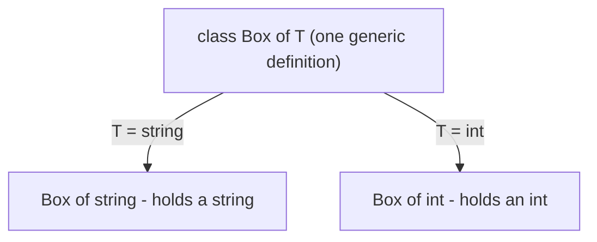
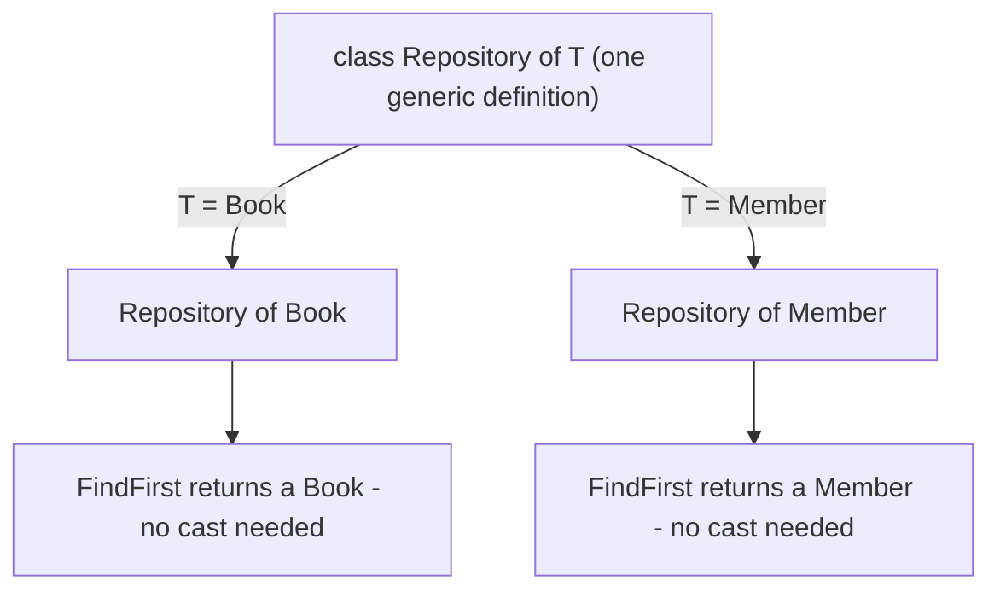
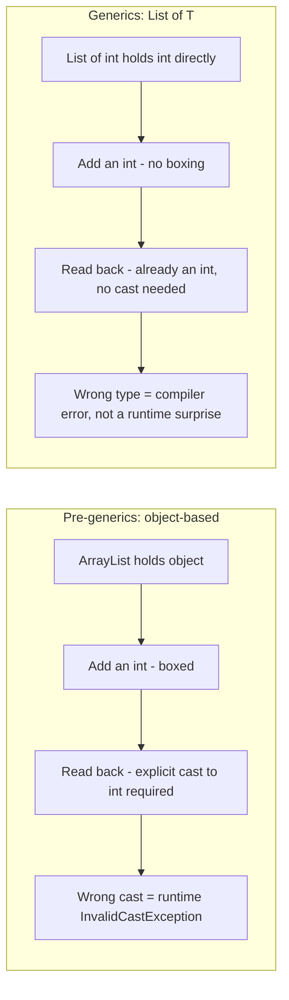

# Introduction to Generics

## Introduction

Before reading this lesson, you should already be comfortable with **[Custom Iterators with yield](../03-collections-generics/03-14-custom-iterators-with-yield.md)**, and really with everything else covered so far in this module. Here's something worth noticing now that you've used `List<T>`, `Dictionary<TKey, TValue>`, `ImmutableList<T>`, `FrozenDictionary<TKey, TValue>`, and `IEnumerable<T>` across a dozen lessons: every single one of those names has a letter in angle brackets. That's not decoration — it's the single language feature this entire module has quietly depended on the whole time. This lesson finally introduces it directly: **generics**.

By the end of this lesson, you will be able to:

- Explain why generics exist: type-safe, reusable code without runtime boxing or casting
- Write a generic class, such as `Box<T>`, that works with any type argument
- Write a generic method, such as `Swap<T>`, where only the method — not the whole class — is generic
- Recognize that `List<T>` and `Dictionary<TKey, TValue>`, used informally throughout this module, have been generic types all along
- Contrast generic code with the pre-generics, `object`-based style it replaced

## Generics — A Layman's Perspective

Imagine ordering storage boxes from a factory. The factory's original design is a single "universal" box: it's shaped to physically accept anything at all — light bulbs, screws, loose rice, a stack of paperwork. That flexibility sounds convenient, but it comes with a real cost. Because the box accepts literally anything, it never actually promises what's inside. Every time you go back to that box, you have to open it and look before you can safely do anything with the contents. And nothing stops a coworker who's in a hurry from tossing a bag of rice into the box you'd been using exclusively for light bulbs — you won't discover that mistake until you reach in expecting a light bulb and find rice instead, quite possibly at the worst possible moment.

Now imagine the factory offers a different option: a single order form with one blank to fill in. You write "light bulbs" in that blank, and the factory produces a box that, from that point on, physically only accepts light bulbs — the slot is shaped for them, nothing else fits. Order another one and write "screws" instead, and you get a differently-shaped box that only accepts screws. It's the same factory, the same design, the same manufacturing line — the *only* thing that changed between orders was what you wrote in that one blank. And critically, if someone tries to force a bag of rice into the "light bulbs only" box, it simply doesn't fit — the mistake is caught the moment it's attempted, not discovered later by surprise.

This is a strictly better deal than either extreme. You're not stuck ordering a completely separate, hand-designed box factory for light bulbs and a different one for screws and a third one for paperwork — it's genuinely one design, reused. But you're also not stuck with the universal box's constant uncertainty about what's actually inside. You fill in the blank once, per box, and from then on that specific box behaves as if it had been custom-built for exactly what you told it to hold.

That blank on the order form — the one piece of information that customizes an otherwise identical design for a specific kind of cargo — is exactly what a type parameter is in C#. `Box<T>` is the factory's single design; `T` is the blank you fill in. `Box<string>` and `Box<int>` are two boxes built from that same one design, each shaped for exactly the type you asked for, each rejecting anything else before it's ever placed inside — not after, when you reach in and get a surprise.

## Generics — A Programming Language Perspective

A **generic** type or method declares one or more **type parameters** — placeholders like `T`, `TKey`, `TValue` — in angle brackets, which the compiler substitutes with a concrete type at each point of use. `class Box<T> { public T Content; }` is a generic class definition; `Box<string>` and `Box<int>` are two different **constructed types** built from that one definition, each with `Content` typed exactly as `string` or `int` respectively, resolved entirely at compile time. Generics apply to classes, interfaces, methods, delegates, and records alike — `IEnumerable<T>` from the previous lesson is itself a generic interface. Before generics arrived in C# 2.0 (.NET Framework 2.0, 2005), collections like `ArrayList` stored everything as `object`: value types were boxed on every insert, and reading an item back required an explicit cast that the compiler couldn't verify — a wrong cast became a runtime `InvalidCastException` rather than a compile-time error. Generics remove both costs: no boxing, and no cast, because the compiler already knows the exact type at every usage site.

## How to Write a Generic Class and Method in C#

A generic class introduces its type parameter right after the class name; every member can then use that parameter as if it were a real, concrete type. A generic method can do the same thing on just the method itself, even inside an otherwise non-generic class.


*Figure 1: One generic class definition produces as many differently-typed constructed types as needed, with no code duplicated.*

```csharp
// Program.cs — .NET 10 / C# 14
class Box<T>
{
    public T Content { get; set; }

    public Box(T content) => Content = content;

    public override string ToString() => $"Box containing: {Content}";
}

static void Swap<T>(ref T first, ref T second)
{
    (first, second) = (second, first);
}

var lightBulbBox = new Box<string>("60W LED bulb");
var screwCountBox = new Box<int>(144);

Console.WriteLine(lightBulbBox);
Console.WriteLine(screwCountBox);

int a = 10;
int b = 20;
Swap(ref a, ref b);
Console.WriteLine($"After swap: a={a}, b={b}");
```

**Console Output:**

```text
Box containing: 60W LED bulb
Box containing: 144
After swap: a=20, b=10
```

`Box<T>` was written exactly once, yet `lightBulbBox.Content` is a genuine `string` and `screwCountBox.Content` is a genuine `int` — no casting was needed to read either one back out. `Swap<T>` shows the same idea applied to a method rather than a whole class: the compiler infers `T` as `int` from the arguments `a` and `b`, and the exact same method would work unchanged for `string`, `DateOnly`, or any other type, with no boxing and no runtime type check required.

## Real-Time Example: A Generic Repository in Library/Inventory Management

We extend the Library/Inventory Management case study with a generic `Repository<T>` — one class definition, written once, reused as-is to store and search both `Book` and `Member` records, two entity types with nothing in common beyond both being useful to store and look up.


*Figure 2: The same `Repository<T>` definition, instantiated twice, produces two independently and correctly typed repositories.*

```csharp
// Program.cs — .NET 10 / C# 14 — Real-Time Example

record Book(string Isbn, string Title, string Author);
record Member(int MemberId, string Name);

// One generic repository definition, reused as-is for two completely unrelated
// entity types - no casting, no boxing, and the compiler catches any attempt
// to mix the two up.
class Repository<T>
{
    private readonly List<T> _items = new();

    public void Add(T item) => _items.Add(item);

    public T? FindFirst(Func<T, bool> predicate)
    {
        foreach (T item in _items)
        {
            if (predicate(item))
            {
                return item;
            }
        }

        return default;
    }

    public int Count => _items.Count;
}

var bookRepository = new Repository<Book>();
bookRepository.Add(new Book("978-0132350884", "Clean Code", "Robert C. Martin"));
bookRepository.Add(new Book("978-0134757599", "Refactoring", "Martin Fowler"));

var memberRepository = new Repository<Member>();
memberRepository.Add(new Member(1, "Grace Hopper"));
memberRepository.Add(new Member(2, "Ada Lovelace"));

Console.WriteLine($"Book repository holds {bookRepository.Count} books");
Console.WriteLine($"Member repository holds {memberRepository.Count} members");

Book? found = bookRepository.FindFirst(b => b.Author == "Martin Fowler");
Console.WriteLine(found is not null
    ? $"Found book by Martin Fowler: {found.Title}"
    : "No matching book found");

Member? missing = memberRepository.FindFirst(m => m.Name == "Alan Turing");
Console.WriteLine(missing is not null
    ? $"Found member: {missing.Name}"
    : "No matching member found");
```

**Console Output:**

```text
Book repository holds 2 books
Member repository holds 2 members
Found book by Martin Fowler: Refactoring
No matching member found
```

Notice that `Repository<T>` was never written twice, once for `Book` and once for `Member` — it was written once, and `T` was filled in differently at each `new Repository<...>()` call. `bookRepository.FindFirst` genuinely returns a `Book?`, not an `object` that needs casting, and `memberRepository.FindFirst` genuinely returns a `Member?` — the compiler enforces that `bookRepository.Add(new Member(...))` would be a compile error, not a runtime surprise discovered weeks later. In a real system, this is exactly why a single `Repository<T>` pattern can back dozens of unrelated entity types across an application without duplicating a single line of storage or lookup logic.

## Generics vs. Pre-Generics, object-Based Code

Before C# 2.0, a general-purpose reusable collection like `ArrayList` had only one option for storing "any type": store everything as `object`. Adding an `int` to an `ArrayList` silently boxed it — allocated a heap object just to hold a value that would otherwise live on the stack — and reading it back required an explicit cast the compiler could not check in advance. If that cast targeted the wrong type, the mistake surfaced as an `InvalidCastException` at runtime, potentially far from wherever the wrong value was actually inserted. Generics close both gaps at once: a `List<int>` stores `int` values directly with no boxing, and every read is already known, at compile time, to be an `int` — there's no cast to get wrong.


*Figure 3: The same kind of mistake is a runtime exception under the old `object`-based style, and a compile-time error under generics.*

| Aspect | Pre-generics (`object`-based, e.g. `ArrayList`) | Generics (`List<T>`, `Box<T>`, etc.) |
|---|---|---|
| Type safety | Checked only at runtime, via casts | Checked at compile time |
| Value types | Boxed into `object` on every insert | Stored directly — no boxing |
| A wrong-type mistake is caught | At runtime, often far from where it happened | Immediately, at compile time |
| Code reuse | One implementation, but callers must cast everywhere | One implementation, callers get type-specific access with no cast |
| Introduced | C# 1.0 / .NET Framework 1.0 (pre-generics era) | C# 2.0 / .NET Framework 2.0 onward |

## Types and Concepts Around Generics in C#

1. **Generic classes** — like `Box<T>` and `Repository<T>` in this lesson, one definition reused for any type argument.
2. **Generic methods** — like `Swap<T>`, where only the method, not an entire class, is generic.
3. **Generic interfaces** — `IEnumerable<T>` and `IEnumerator<T>` from the previous lesson are themselves generic interfaces.
4. **Generic delegates** — `Func<T, bool>`, used by `FindFirst` in this lesson's example, is a generic delegate type from the base class library.
5. **[Generic Constraints](../03-collections-generics/03-16-generic-constraints.md)** — the `where T : ...` clauses that restrict which types a generic parameter accepts, covered next.
6. **[Custom Iterators with yield](../03-collections-generics/03-14-custom-iterators-with-yield.md)** — the iterator methods from the previous lesson, which themselves return the generic `IEnumerable<T>`.

## What You've Learned & What's Next

Generics let a single class or method definition be reused, unchanged, for any type — with the compiler enforcing correctness at every usage site instead of leaving it to a runtime cast. Every `List<T>`, `Dictionary<TKey, TValue>`, `ImmutableList<T>`, and `IEnumerable<T>` used throughout this module has been an application of exactly this one idea.

Continue your learning journey with **[Generic Constraints](../03-collections-generics/03-16-generic-constraints.md)**, where we add `where T : ...` clauses to restrict which types a generic parameter is allowed to accept — letting generic code call members that only certain types provide, instead of only the members every possible type shares.

---
*Applies to: .NET 10 / C# 14. Last reviewed 2026-08-16.*
