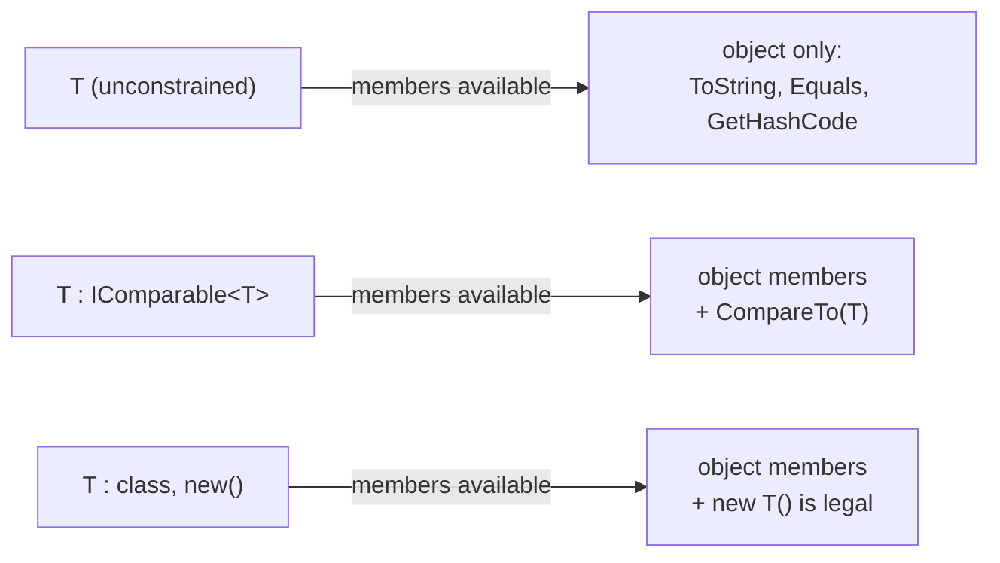
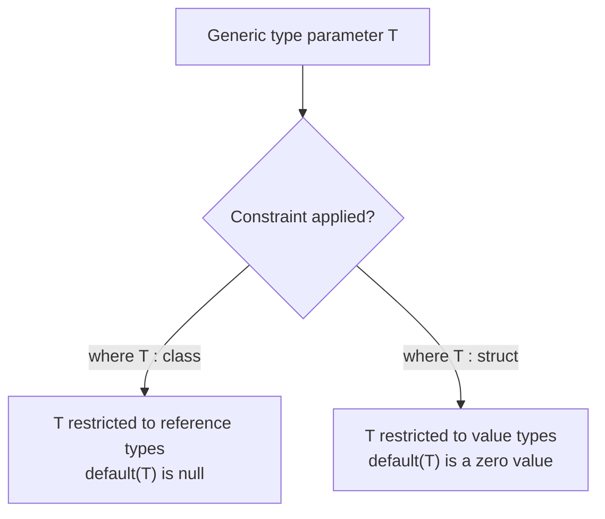

# Generic Constraints

## Introduction

Before reading this lesson, you should already be comfortable with **[Introduction to Generics](../03-collections-generics/03-15-introduction-to-generics.md)** — specifically, why a generic type parameter `T` lets one class or method work with many concrete types without duplicating code. What that lesson probably left you wondering is: if `T` could be *literally anything*, what can you actually safely do with a value of type `T` inside the generic code itself? The answer is: almost nothing, until you add a **constraint**. This lesson introduces the `where` clause and the handful of constraints that unlock real functionality on an otherwise-featureless type parameter.

By the end of this lesson, you will be able to:

- Explain why an unconstrained `T` only exposes the members every .NET type inherits from `object`
- Apply `where T : class` and `where T : struct` to restrict `T` to reference types or value types
- Apply `where T : new()` to construct a fresh `T` instance inside generic code
- Apply `where T : IComparable<T>` (and other interface/base-class constraints) to unlock specific members
- Combine multiple constraints on one type parameter following C#'s required ordering rules
- Recognize how a constraint changes what the compiler allows, not just what values are permitted

## Generic Constraints — A Layman's Perspective

Picture a staffing agency that fills temporary positions for local businesses. A business calls in and says, "Send me a temp worker" — nothing else. The agency has no idea what that temp will be asked to do, so it can only guarantee the most basic things about them: they'll show up, they have a name, they can sign in at the front desk. That's it. The agency can't promise the temp knows how to operate a forklift, file a tax form, or manage a cash register, because the request didn't say any of that was required. If the business tries to hand the temp forklift keys anyway, the agency has to refuse — nothing in the request guaranteed this person was qualified for that.

Now suppose the business is smarter about its request. It calls and says, "Send me a temp worker who holds a valid forklift license." That one added qualification changes everything the agency — and the business — can now rely on. The business can confidently hand over forklift keys on day one, because the request *guaranteed* that capability up front, rather than hoping for the best. Add a second qualification — "and they must be a full-time agency employee, not an independent contractor" — and the business also gets whatever comes bundled with that employment status: a company badge, access to the internal system, standard onboarding paperwork already on file. Add a third — "and they must be able to complete their own onboarding form with zero prior instructions, i.e., we can just say 'go create your paperwork' and walk away" — and now the business itself can spin up a brand-new hire from scratch without supplying any information at all.

Each additional qualification on the request form is a trade: the pool of temps who qualify gets smaller, but what the business is guaranteed to be able to *do* with whoever shows up gets bigger. A request with three qualifications — full-time employee, forklift-licensed, self-onboarding — narrows the field considerably, but the business now knows exactly what capabilities that person brings, without needing to interview them individually. And staffing agencies that write these request forms follow a fixed order on the paperwork: employment status first, specific skills next, "can self-onboard" always listed last, because that's simply the form's required layout.

That's precisely the deal a generic constraint makes. Writing `class Repository<T>` alone is like calling the agency and just saying "send a temp" — you get a `T` about which almost nothing is known. Adding `where T : class, new()` is the equivalent of adding qualifications to the request: now the generic code is guaranteed `T` is a reference type *and* has a public parameterless constructor, so it can confidently do things — like creating a brand-new `T` from nothing — that would have been unsafe to assume otherwise.

## Generic Constraints — A Programming Language Perspective

A **constraint** is a `where` clause attached to a type parameter that restricts which types may be substituted for it and, in exchange, tells the compiler it may treat values of that parameter as if they were of a more specific type. Without a constraint, `T` is implicitly treated as `object`, so only `object`'s members (`ToString()`, `Equals()`, `GetHashCode()`, `GetType()`) are callable on it. C# supports several constraint categories: a **reference type constraint** (`where T : class`), a **value type constraint** (`where T : struct`), a **constructor constraint** (`where T : new()`), a **base class constraint** (`where T : SomeBaseClass`), and one or more **interface constraints** (`where T : ISomeInterface`). Multiple constraints on one parameter are comma-separated and must follow a fixed order: any class or base-class constraint first, then interface constraints, with the constructor constraint `new()` always listed last, e.g. `where T : Account, IComparable<T>, new()`. These constraints have existed since generics were introduced in C# 2.0 — nothing here is version-gated to C# 14.

## How to Apply Generic Constraints in C#

Constraints go on the type parameter declaration itself, whether it belongs to a class or to a single method. Once a constraint is in place, the compiler allows you to call whatever members that constraint guarantees — an interface constraint unlocks that interface's members, and a `new()` constraint unlocks `new T()`.


*Figure 1: Each constraint added to `T` unlocks additional members the generic code is allowed to call.*

```csharp
// Program.cs — .NET 10 / C# 14

Console.WriteLine(Max(5, 9));
Console.WriteLine(Max("banana", "apple"));

var repo = new Repository<Widget>();
Widget created = repo.CreateNew();
Console.WriteLine($"Created: {created.Name}");

T Max<T>(T first, T second) where T : IComparable<T>
{
    return first.CompareTo(second) >= 0 ? first : second;
}

class Repository<T> where T : class, new()
{
    public T CreateNew() => new T();
}

class Widget
{
    public string Name { get; set; } = "Unnamed Widget";
}
```

**Console Output:**

```text
9
banana
Created: Unnamed Widget
```

Without `where T : IComparable<T>`, `first.CompareTo(second)` would not compile — an unconstrained `T` only exposes `object`'s members, and `object` has no `CompareTo`. The constraint tells the compiler "whatever `T` turns out to be, it will implement `IComparable<T>`," so calling `CompareTo` becomes safe. Likewise, `where T : class, new()` is what makes `new T()` legal inside `Repository<T>` — the compiler only permits that expression because the constraint guarantees every possible `T` has an accessible parameterless constructor.

## Real-Time Example: Constrained Account Factories in Banking/ATM

We apply generic constraints to a small slice of a Banking/ATM system: an abstract `Account` base class, two concrete account types, a generic `AccountFactory<TAccount>` that can only construct valid account types, and a generic method that can only accept types guaranteed to expose a `Balance`.

```csharp
// Program.cs — .NET 10 / C# 14 — Real-Time Example

var savingsFactory = new AccountFactory<SavingsAccount>();
SavingsAccount savings = savingsFactory.OpenAccount("ACC-1001", 500m);
Console.WriteLine($"Opened {savings.AccountNumber}: {savings.Balance}");

var checkingFactory = new AccountFactory<CheckingAccount>();
CheckingAccount checking = checkingFactory.OpenAccount("ACC-1002", 1200m);
Console.WriteLine($"Opened {checking.AccountNumber}: {checking.Balance}");

CheckingAccount lowBalanceChecking = checkingFactory.OpenAccount("ACC-1003", 75m);
Console.WriteLine($"Opened {lowBalanceChecking.AccountNumber}: {lowBalanceChecking.Balance}");

List<Account> portfolio = [savings, checking, lowBalanceChecking];
Account richest = HighestBalance(portfolio);
Console.WriteLine($"Highest balance: {richest.AccountNumber} at {richest.Balance}");

static TAccount HighestBalance<TAccount>(List<TAccount> accounts) where TAccount : Account
{
    TAccount best = accounts[0];
    foreach (TAccount account in accounts)
    {
        if (account.Balance > best.Balance)
        {
            best = account;
        }
    }
    return best;
}

// AccountFactory can only be used with account types that have a public
// parameterless constructor and derive from Account — the constraint
// combination (base class first, new() last) makes new TAccount() legal.
class AccountFactory<TAccount> where TAccount : Account, new()
{
    public TAccount OpenAccount(string accountNumber, decimal openingBalance)
    {
        var account = new TAccount();
        account.Initialize(accountNumber, openingBalance);
        return account;
    }
}

abstract class Account
{
    public string AccountNumber { get; private set; } = "";
    public decimal Balance { get; private set; }

    public void Initialize(string accountNumber, decimal openingBalance)
    {
        AccountNumber = accountNumber;
        Balance = openingBalance;
    }
}

class SavingsAccount : Account
{
}

class CheckingAccount : Account
{
}
```

**Console Output:**

```text
Opened ACC-1001: 500
Opened ACC-1002: 1200
Opened ACC-1003: 75
Highest balance: ACC-1002 at 1200
```

Notice the `Initialize` method: the `new()` constraint only guarantees a *parameterless* constructor, so `AccountFactory<TAccount>` cannot pass `accountNumber` and `openingBalance` straight into `new TAccount(...)`. This is a real, common trade-off of the `new()` constraint — factories built around it typically construct a blank instance first, then populate it through a method call. Meanwhile, `HighestBalance<TAccount>` could not compile without `where TAccount : Account` — an unconstrained `TAccount` wouldn't expose a `.Balance` property at all, since that member belongs to `Account`, not to `object`. The constraint is what turns "some type" into "definitely something with a balance I can compare."

## `where T : class` vs `where T : struct` — Two Mutually Exclusive Constraints

These two constraints sit at opposite ends of .NET's type system, and a single type parameter can never carry both at once — a type is either a reference type or a value type, never both. `where T : class` restricts `T` to reference types (classes, interfaces, delegates, arrays), which guarantees `T` can hold `null` and that `default(T)` is `null`. `where T : struct` restricts `T` to non-nullable value types (`int`, `decimal`, `DateOnly`, custom structs), which guarantees `default(T)` produces a legitimate zero-initialized value rather than `null`, and it's commonly paired with numeric-style interface constraints for math-heavy generic algorithms. Choosing the wrong one for your scenario doesn't just fail to compile the constraint — it tells callers, through the API's signature alone, what category of type they're allowed to pass in.


*Figure 2: `class` and `struct` constraints partition .NET's type system into two non-overlapping halves.*

| Aspect | `where T : class` | `where T : struct` |
|---|---|---|
| Allowed types | Reference types only | Non-nullable value types only |
| `default(T)` | `null` | Zero-initialized value (e.g. `0`, `false`) |
| Nullability | `T?` remains meaningful | `T` already can't be `null` |
| Commonly paired with | `new()`, for factories that return objects | `IComparable<T>` or arithmetic-style interfaces |
| Typical use case | Repositories, factories, DI containers | Numeric aggregation, math utilities |

## Types of Generic Constraints in C#

The `where` clause supports several distinct constraint kinds, each covered in more depth elsewhere in this module:

1. **[Generic Methods](../03-collections-generics/03-17-generic-methods.md)** — how constraints apply to a standalone generic method, independent of any generic class.
2. **[Generic Collections vs Non-Generic (Legacy) Collections](../03-collections-generics/03-18-generic-vs-non-generic-collections.md)** — how BCL collections like `List<T>` rely on constraints and type parameters instead of boxing everything as `object`.
3. **[Covariance and Contravariance in Generics](../03-collections-generics/03-19-covariance-and-contravariance.md)** — the `out`/`in` modifiers, a related but distinct way generic type parameters can be restricted.
4. **[IComparable\<T\> and IComparer\<T\>](../03-collections-generics/03-20-icomparable-and-icomparer.md)** — a closer look at the interface constraint used in this lesson's `Max<T>` example.
5. **[Introduction to Generics](../03-collections-generics/03-15-introduction-to-generics.md)** — revisit this if the basic mechanics of type parameters still feel unfamiliar.

## What You've Learned & What's Next

An unconstrained generic type parameter only gives you what every .NET type already has from `object`. Adding a `where` clause — `class`, `struct`, `new()`, a base class, or an interface like `IComparable<T>` — is a trade: you narrow which types can be substituted for `T`, and in exchange the compiler lets your generic code call the specific members that constraint guarantees, whether that's constructing a fresh instance or comparing two values.

Continue your learning journey with **[Generic Methods](../03-collections-generics/03-17-generic-methods.md)**, where we look at generic methods that live independently of any generic class, and how the compiler infers their type arguments at each call site.

---
*Applies to: .NET 10 / C# 14. Last reviewed 2026-08-16.*
