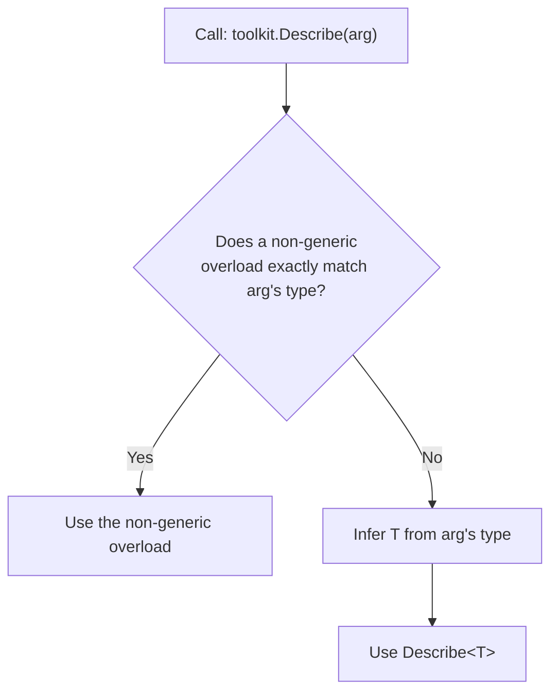
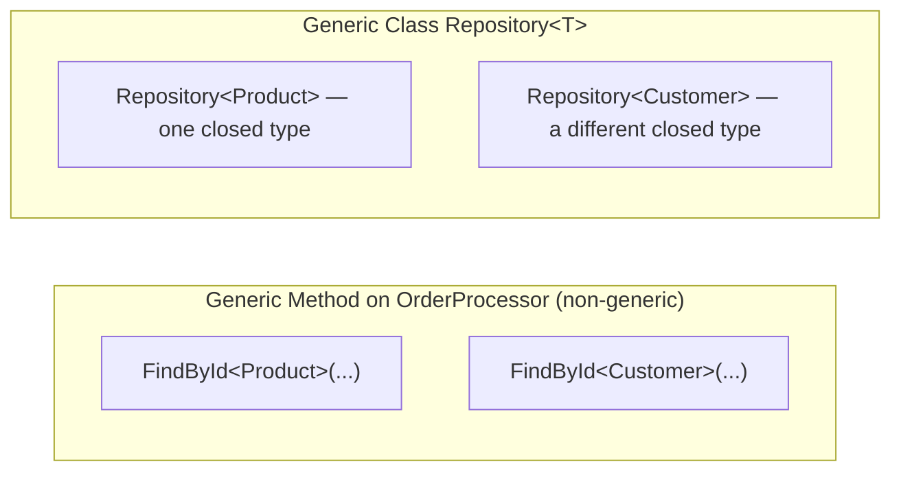

# Generic Methods

## Introduction

Before reading this lesson, you should already be comfortable with **[Generic Constraints](../03-collections-generics/03-16-generic-constraints.md)** — how a `where` clause narrows a type parameter and unlocks specific members on it. That lesson's examples already snuck in a generic *method* here and there, but didn't dwell on what makes methods special. A generic method can live on a completely ordinary, non-generic class, be called without ever writing out its type argument, and be picked over — or lose out to — other overloads following its own resolution rules. This lesson focuses squarely on the method itself.

By the end of this lesson, you will be able to:

- Declare a generic method whose type parameter is independent of its enclosing class
- Let the compiler infer a generic method's type argument from the arguments you pass
- Call a generic method with an explicit type argument when inference can't or shouldn't apply
- Explain how the compiler chooses between a generic method and a non-generic overload
- Apply a constraint to a generic method's own type parameter, separately from any class-level constraint
- Recognize when a single generic method is a better fit than making an entire class generic

## Generic Methods — A Layman's Perspective

Picture a shipping warehouse's packing station — one physical desk, staffed by one person, that isn't dedicated to any single product line. Whatever item lands on the conveyor belt in front of them — a hardcover book, a desk lamp, a folding chair — the same packer figures out the right box size and cushioning by looking at the item itself. Nobody has to shout "this one's a book!" before handing it over; the packer reads the item's shape and weight and works it out on the spot. That's the essence of a generic method: one reusable procedure that adapts to whatever specific thing you hand it, without needing to be told in advance.

Crucially, this packing station isn't glued to one aisle of the warehouse. It isn't "the book-packing station" or "the furniture-packing station" — it's just a general packing service, and any department can wheel an item over to it. The station itself doesn't need to specialize in a single product category to be useful; it just needs one flexible procedure it applies per item, each time freshly. That maps directly onto a generic method living inside an otherwise perfectly ordinary class: the *class* (the warehouse's front desk, say) doesn't need to be rebuilt around one product type just because one of its procedures happens to be flexible.

Now suppose the warehouse also has a specialized fragile-glassware station, reserved specifically for glassware, that automatically gets first pick whenever a box is labeled "glass." If an item arrives labeled glass, it goes to the glassware specialist, not the general packer, even though the general packer *could* have handled it too — the specific specialist wins whenever one is available and matches exactly. That's the warehouse's version of overload resolution: when both a specific handler and a general, adaptable one could technically do the job, the specific one is chosen first, and only when nothing specific matches does the job fall back to the general station.

And finally, imagine a supervisor occasionally insisting, for auditing purposes, "no — send this one through the general packing procedure regardless, even though I know the glass specialist could take it." That override — deliberately bypassing the automatic specific-first routing — mirrors what happens when you tell the compiler explicitly which version to use rather than letting it infer or auto-route on your behalf.

The bridge back to programming: a generic method is that adaptable packing station — reusable, unattached to any one product line, capable of figuring out what it's handling from what's put in front of it, and subject to well-defined rules about when a more specific alternative takes priority.

## Generic Methods — A Programming Language Perspective

A **generic method** declares its own type parameter list in angle brackets immediately after the method name — `T Method<T>(T value)` — independent of whatever type parameters, if any, its enclosing class declares. The enclosing type does not need to be generic at all; a perfectly ordinary class can host any number of generic methods, each with its own type parameter. At each call site, the compiler performs **type inference**: it examines the types of the arguments passed and deduces the type argument automatically, so `Describe(42)` infers `T` as `int` without writing `Describe<int>(42)`. When inference is impossible — commonly because `T` appears only in the return type, not in any parameter — you must supply the type argument explicitly, e.g. `Describe<int>()`. When a call could match both a generic method and a non-generic overload, **generic method overload resolution** applies: the compiler prefers an exact non-generic match first, falling back to the inferred generic method only when no better match exists.

## How to Declare and Call a Generic Method in C#

A generic method needs nothing from its enclosing class — it declares, uses, and resolves its own type parameter entirely at the call site. The example below puts two generic-adjacent methods on one ordinary class: a purely generic `Describe<T>` and a non-generic `Describe(string)` overload, to show inference and overload resolution together.


*Figure 1: The compiler always checks for an exact non-generic match before falling back to inferring a generic method's type argument.*

```csharp
// Program.cs — .NET 10 / C# 14

var toolkit = new Formatter();

Console.WriteLine(toolkit.Describe(42));               // T inferred as int
Console.WriteLine(toolkit.Describe("hello"));           // exact non-generic overload wins
Console.WriteLine(toolkit.Describe<string>("hello"));   // explicit type argument forces the generic method

class Formatter // a plain, non-generic class
{
    // Generic method: its own type parameter, independent of the class.
    public string Describe<T>(T value) => $"{typeof(T).Name} (generic): {value}";

    // A non-generic overload specific to string.
    public string Describe(string value) => $"String (specific overload): {value}";
}
```

**Console Output:**

```text
Int32 (generic): 42
String (specific overload): hello
String (generic): hello
```

The first call has no non-generic overload that matches `int`, so the compiler infers `T` as `int` and calls the generic method. The second call passes a `string`, and a non-generic `Describe(string)` overload matches it exactly — the compiler always prefers that exact match over inferring the generic method, even though the generic version could technically handle a `string` too. The third call supplies an explicit type argument, `Describe<string>(...)`, which can only refer to the generic method — writing a type argument list forces the generic overload regardless of what non-generic overloads exist.

## Real-Time Example: Generic Lookup in E-Commerce Order Processing

We build a small slice of an E-Commerce Order Processing system: an `OrderProcessor` class — itself entirely non-generic — that hosts one generic method for looking up any entity by ID, reused across both `Product` and `Customer` records, plus an overloaded `Describe` method that demonstrates overload resolution on real domain types.

```csharp
// Program.cs — .NET 10 / C# 14 — Real-Time Example

var processor = new OrderProcessor();

List<Product> catalog =
[
    new Product("P-100", "Wireless Mouse", 24.99m),
    new Product("P-200", "Mechanical Keyboard", 89.99m)
];

List<Customer> customers =
[
    new Customer("C-01", "Priya Sharma"),
    new Customer("C-02", "Diego Alvarez")
];

Product? foundProduct = processor.FindById(catalog, "P-200");
Customer? foundCustomer = processor.FindById(customers, "C-01");

Console.WriteLine(foundProduct is not null ? processor.Describe(foundProduct) : "Product not found");
Console.WriteLine(foundCustomer is not null ? processor.Describe(foundCustomer) : "Customer not found");

Product? missing = processor.FindById(catalog, "P-999");
Console.WriteLine(missing is null ? "P-999 not found in catalog" : processor.Describe(missing));

interface IHasId
{
    string Id { get; }
}

record Product(string Id, string Name, decimal Price) : IHasId;
record Customer(string Id, string Name) : IHasId;

class OrderProcessor // a plain, non-generic class
{
    // Generic method: T is inferred from the list passed in, independent of any
    // generic parameter on OrderProcessor itself — this class isn't generic at all.
    public T? FindById<T>(List<T> items, string id) where T : class, IHasId
    {
        foreach (T item in items)
        {
            if (item.Id == id)
            {
                return item;
            }
        }
        return default;
    }

    // A non-generic overload specific to Product — the compiler always prefers
    // this exact match over the generic Describe<T> below when passed a Product.
    public string Describe(Product product) =>
        $"Product {product.Id}: {product.Name} (${product.Price})";

    // Generic fallback for any IHasId type without its own specific overload.
    public string Describe<T>(T entity) where T : class, IHasId =>
        $"{typeof(T).Name} {entity.Id}";
}
```

**Console Output:**

```text
Product P-200: Mechanical Keyboard ($89.99)
Customer C-01
P-999 not found in catalog
```

The same `FindById<T>` method serves both `catalog` and `customers` — its type argument is inferred fresh at each call, once as `Product` and once as `Customer`, without `OrderProcessor` itself needing to be generic. `Describe(foundProduct)` resolves to the specific `Product` overload automatically, producing richer formatting, while `Describe(foundCustomer)` falls back to the generic version since no `Customer`-specific overload exists. In a real order-processing codebase, this pattern avoids writing a near-identical lookup method for every entity type in the system.

## Generic Methods vs Generic Classes

A generic method's type parameter belongs only to that one method — it's resolved fresh at every call site and has no effect on anything else in the class. A generic class's type parameter, by contrast, is fixed once for the whole constructed type: `Repository<Product>` and `Repository<Customer>` are two distinct closed types, and every member of a given instance shares the same `T` for that instance's entire lifetime. This is why an ordinary, non-generic class can still host several independently generic methods, while a generic class commits its entire API to one type parameter as soon as it's constructed. The two aren't mutually exclusive, either — a generic class can declare additional generic methods with their own, separately named type parameters on top of the class's own.


*Figure 2: One non-generic class can call the same generic method with different inferred type arguments; a generic class instead produces a separate closed type per type argument.*

| Aspect | Generic Method | Generic Class |
|---|---|---|
| Where the type parameter lives | On the method itself, `Method<T>(...)` | On the class declaration, `class C<T>` |
| Scope of `T` | One call — re-inferred every time | Fixed for the whole constructed instance |
| Enclosing type requirement | Enclosing class can be fully non-generic | The class itself must declare `<T>` |
| Type argument source | Usually inferred from arguments | Must be specified when constructing, e.g. `new Repository<Product>()` |
| Typical use case | A reusable operation (lookup, comparison, mapping) across unrelated types | A container/service centered on one type for its whole lifetime |

## Types of Generic Method Scenarios in C#

Generic methods interact closely with several other topics in this module:

1. **[Generic Constraints](../03-collections-generics/03-16-generic-constraints.md)** — how `where` clauses restrict a generic method's own type parameter, as seen with `FindById<T>` and `Describe<T>` above.
2. **[Generic Collections vs Non-Generic (Legacy) Collections](../03-collections-generics/03-18-generic-vs-non-generic-collections.md)** — the BCL's own generic methods, like `List<T>.Find`, that use exactly these inference rules.
3. **[Covariance and Contravariance in Generics](../03-collections-generics/03-19-covariance-and-contravariance.md)** — a related but distinct way generic type parameters behave differently across method boundaries.
4. **[IComparable\<T\> and IComparer\<T\>](../03-collections-generics/03-20-icomparable-and-icomparer.md)** — an interface commonly used as a generic method constraint for sorting and comparison utilities.
5. **[Introduction to Generics](../03-collections-generics/03-15-introduction-to-generics.md)** — revisit this for the fundamentals of type parameters if generic methods still feel unfamiliar.

## What You've Learned & What's Next

A generic method carries its own type parameter, independent of whatever class it lives on — even a completely non-generic class can host as many generic methods as it needs. The compiler infers each call's type argument from the arguments you pass wherever possible, falls back to an exact non-generic overload when one exists, and only uses an explicit type argument to force the generic version deliberately.

Continue your learning journey with **[Generic Collections vs Non-Generic (Legacy) Collections](../03-collections-generics/03-18-generic-vs-non-generic-collections.md)**, where we contrast `List<T>` and `Dictionary<TKey, TValue>` against their pre-generics ancestors, `ArrayList` and `Hashtable`, and see exactly why the legacy collections should be avoided in new code.

---
*Applies to: .NET 10 / C# 14. Last reviewed 2026-08-16.*
