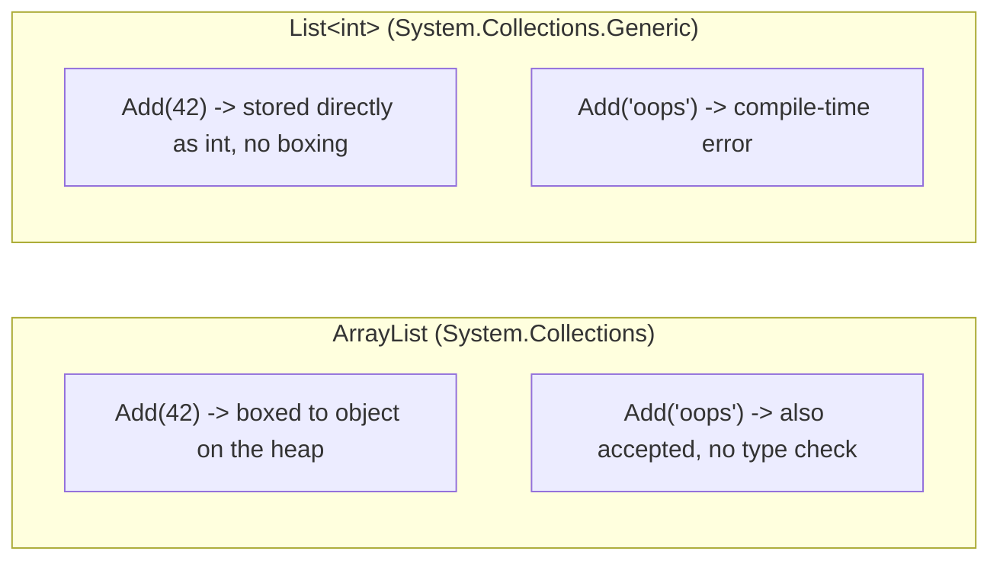
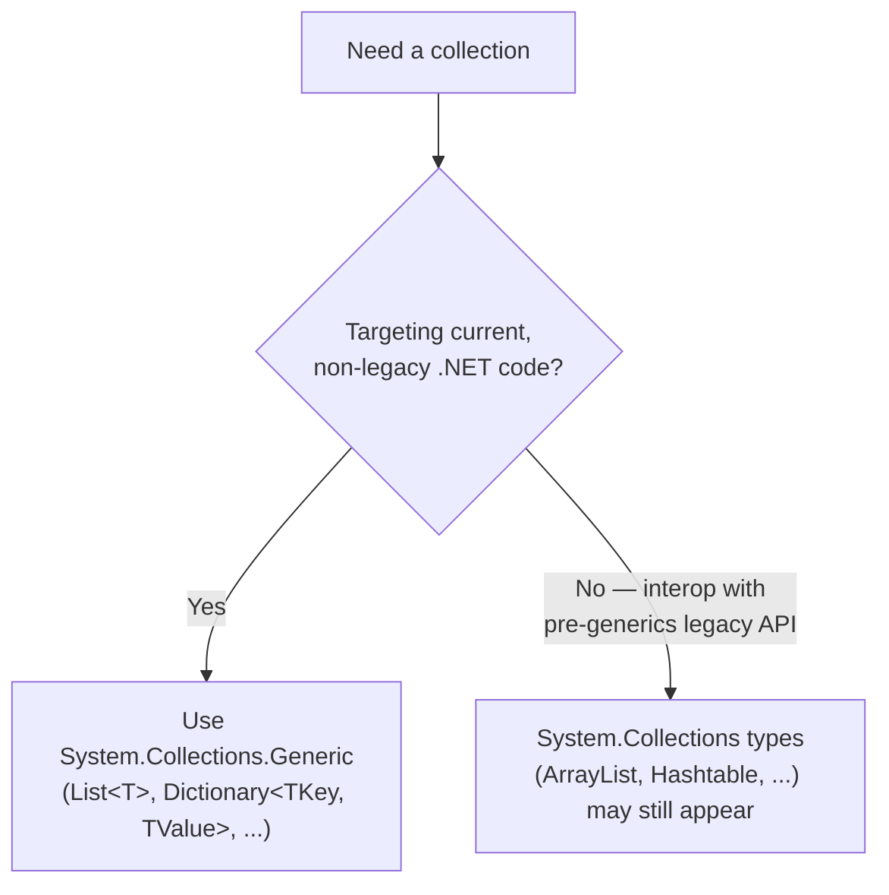

# Generic Collections vs Non-Generic (Legacy) Collections

## Introduction

Before reading this lesson, you should already be comfortable with **[Generic Methods](../03-collections-generics/03-17-generic-methods.md)** and, more broadly, with why generic type parameters exist at all. This lesson takes a step back in time to look at what .NET collections looked like *before* generics existed — `ArrayList` and `Hashtable` in the `System.Collections` namespace — and lays out, concretely, why their generic replacements in `System.Collections.Generic` made them obsolete for new code. You'll still encounter `ArrayList` and `Hashtable` occasionally, usually in older codebases or legacy interop scenarios, so this lesson is about recognizing them and knowing exactly why to migrate away from them, not about learning to write new code with them.

By the end of this lesson, you will be able to:

- Explain what boxing and unboxing cost when a value type is stored in a non-generic collection
- Contrast `ArrayList`/`Hashtable`'s runtime-only type checking with `List<T>`/`Dictionary<TKey, TValue>`'s compile-time type safety
- Identify the `System.Collections` vs `System.Collections.Generic` namespace split and what it signals about an API's age
- Convert `ArrayList`/`Hashtable`-based code to its generic equivalent
- State concretely why non-generic collections should essentially never appear in new .NET 10 code

## Generic vs Non-Generic Collections — A Layman's Perspective

Picture two different storage setups in the same warehouse. The first is a single, general-purpose "miscellaneous" bin — a big plastic tub with no label except "stuff goes here." Workers toss anything into it: screwdrivers, invoices, spare batteries, a stray sandwich wrapper. It works, in the sense that the bin never refuses anything. But every time someone needs a screwdriver from that bin, they have to reach in, pull an item out, and *inspect it* to figure out whether it's actually a screwdriver before they can use it as one — and if it turns out to be an invoice instead, they find that out only at the moment they try to unscrew something with it, which is exactly the wrong moment to discover the mistake.

The second setup is a wall of purpose-built bins: one sized and labeled specifically for screwdrivers, another specifically for batteries. Nothing else physically fits in the screwdriver bin in the first place, so nobody working there ever needs to double-check what they've pulled out — the bin itself already guarantees it. Mistakes that would have slipped into the miscellaneous tub and surfaced later as a nasty surprise simply can't happen here; they're caught the moment someone tries to put the wrong item in the wrong bin, long before anyone tries to use it.

There's a second cost hiding in the miscellaneous-bin setup, too. Suppose the warehouse's tub only accepts items packaged in a standard-size shipping box — so a small, raw item like a single screw has to be wrapped in a full-size box before it can go in, and then unwrapped again every single time someone wants to actually use that screw. That extra wrapping and unwrapping is pure overhead: work the raw item never needed at all, forced on it purely because the storage bin wasn't built to hold it directly. That's boxing — a value like a plain number getting "wrapped" into a general-purpose object box before a general-purpose bin will accept it, then "unwrapped" again every time it's retrieved.

The bridge to programming: `ArrayList` and `Hashtable` are the miscellaneous tub — they accept anything as `object`, silently wrap ("box") every value type on the way in, and only reveal a type mismatch when code tries to use the wrong-shaped item at run time. `List<T>` and `Dictionary<TKey, TValue>` are the purpose-built bins — built for one specific type, so mismatches are rejected before the program ever runs, and value types go in and out without ever needing to be wrapped at all.

## Generic vs Non-Generic Collections — A Programming Language Perspective

Before generics arrived in C# 2.0 (.NET 2.0, 2005), the `System.Collections` namespace provided collections — `ArrayList`, `Hashtable`, `Queue`, `Stack` — that stored every element as `object`. Adding a value type like `int` to an `ArrayList` triggers **boxing**: the runtime allocates the value on the heap and wraps it in an `object` reference, and retrieving it back out requires an explicit cast, which triggers **unboxing**. Because everything is typed as `object`, nothing stops you from adding mismatched types into the same collection, and a wrong cast surfaces only as an `InvalidCastException` at run time. `System.Collections.Generic` provides direct, type-parameterized replacements — `List<T>`, `Dictionary<TKey, TValue>`, `Queue<T>`, `Stack<T>` — where the element type is fixed at compile time, eliminating both the boxing overhead for value types and the runtime cast, since the compiler now rejects a type mismatch before the program ever runs.

## How to Compare ArrayList/Hashtable Against Their Generic Replacements

`ArrayList` accepts anything because it stores `object`; retrieving a value type back out of it means casting, and the compiler has no way to stop you from adding the wrong type in the first place. `List<T>` closes both gaps: the element type is fixed once, at compile time, for the whole collection.


*Figure 1: `ArrayList` boxes value types and accepts any mix of types; `List<int>` stores `int` directly and rejects mismatches before the program runs.*

```csharp
// Program.cs — .NET 10 / C# 14
using System.Collections; // needed for ArrayList — not implicitly imported

ArrayList untyped = new ArrayList();
untyped.Add(42);      // int boxed to object
untyped.Add("oops");  // nothing stops mixing types

int legacyTotal = 0;
foreach (object? item in untyped)
{
    if (item is int number) // must check and cast manually
    {
        legacyTotal += number;
    }
}
Console.WriteLine($"ArrayList total (skipping non-ints): {legacyTotal}");

List<int> typed = new List<int>();
typed.Add(42);
// typed.Add("oops"); // would not compile — compile-time type safety

int typedTotal = typed.Sum();
Console.WriteLine($"List<int> total: {typedTotal}");
```

**Console Output:**

```text
ArrayList total (skipping non-ints): 42
List<int> total: 42
```

Both totals come out the same, but the paths to get there are not equivalent. The `ArrayList` version has to check each element's type defensively at run time with `is int number`, silently skipping anything that doesn't match — a bug that mixed in a stray string would have to be *discovered* this way, one entry at a time. The `List<int>` version never has that problem: `typed.Add("oops")` simply would not compile, so there's no mismatched entry to defensively filter out in the first place.

## Real-Time Example: Library/Inventory Catalog Lookups, Legacy vs Modern

We compare two versions of a small Library/Inventory Management catalog lookup: one built the pre-generics way with `Hashtable`, and one built with `Dictionary<string, Book>`, both mapping an ISBN to a `Book`.

```csharp
// Program.cs — .NET 10 / C# 14 — Real-Time Example
using System.Collections; // needed for Hashtable — not implicitly imported

Console.WriteLine("--- Legacy: Hashtable-based catalog ---");
var legacyCatalog = new Hashtable
{
    ["978-0132350884"] = new Book("Clean Code", 3),
    ["978-0134757599"] = new Book("Refactoring", 1)
};
legacyCatalog["978-0000000000"] = "Mislabeled Entry"; // compiles fine — Hashtable stores object

PrintLegacyEntry(legacyCatalog, "978-0132350884");
PrintLegacyEntry(legacyCatalog, "978-0134757599");
PrintLegacyEntry(legacyCatalog, "978-0000000000");

Console.WriteLine();
Console.WriteLine("--- Modern: Dictionary<string, Book>-based catalog ---");
var catalog = new Dictionary<string, Book>
{
    ["978-0132350884"] = new Book("Clean Code", 3),
    ["978-0134757599"] = new Book("Refactoring", 1)
};
// catalog["978-0000000000"] = "Mislabeled Entry"; // would not compile — string isn't a Book

PrintCatalogEntry(catalog, "978-0132350884");
PrintCatalogEntry(catalog, "978-0134757599");

static void PrintLegacyEntry(Hashtable table, string isbn)
{
    try
    {
        var book = (Book)table[isbn]!; // must cast; a wrong type fails only here, at run time
        Console.WriteLine($"{isbn}: {book.Title} ({book.CopiesAvailable} copies)");
    }
    catch (InvalidCastException)
    {
        Console.WriteLine($"{isbn}: entry is not a Book — bad data caught only at run time");
    }
}

static void PrintCatalogEntry(Dictionary<string, Book> catalog, string isbn)
{
    Book book = catalog[isbn];
    Console.WriteLine($"{isbn}: {book.Title} ({book.CopiesAvailable} copies)");
}

class Book
{
    public string Title { get; }
    public int CopiesAvailable { get; }

    public Book(string title, int copiesAvailable)
    {
        Title = title;
        CopiesAvailable = copiesAvailable;
    }
}
```

**Console Output:**

```text
--- Legacy: Hashtable-based catalog ---
978-0132350884: Clean Code (3 copies)
978-0134757599: Refactoring (1 copies)
978-0000000000: entry is not a Book — bad data caught only at run time

--- Modern: Dictionary<string, Book>-based catalog ---
978-0132350884: Clean Code (3 copies)
978-0134757599: Refactoring (1 copies)
```

The `Hashtable` version compiles perfectly well even after a stray string gets stored under an ISBN key meant for a `Book` — nothing in the type system objects, because every value is just `object` as far as `Hashtable` is concerned. The mistake only becomes visible when `PrintLegacyEntry` tries to cast that entry to `Book` and an `InvalidCastException` has to be caught defensively. The `Dictionary<string, Book>` version can't have this bug at all: the commented-out line would fail to compile, because `Dictionary<string, Book>` only ever accepts a `Book` as its value. In a real library system tracking thousands of catalog entries, that's the difference between a data-integrity bug discovered by a developer at compile time and one discovered by a librarian at checkout time.

## System.Collections vs System.Collections.Generic

The two namespaces represent two different eras of the same idea. `System.Collections` predates generics entirely, so every one of its collections is built around storing and retrieving plain `object` references — which is precisely why it needs boxing for value types and defensive casting for everything coming back out. `System.Collections.Generic` was introduced specifically to eliminate both problems by letting the collection itself be parameterized over a concrete element type. In modern .NET, `System.Collections`'s non-generic types are effectively frozen in place for backward compatibility; essentially no new production code should reach for `ArrayList` or `Hashtable` when `List<T>` or `Dictionary<TKey, TValue>` do the same job with better safety and better performance.


*Figure 2: In new .NET 10 code, `System.Collections.Generic` is essentially the only acceptable choice; `System.Collections` survives only for legacy interop.*

| Aspect | `ArrayList` / `Hashtable` (`System.Collections`) | `List<T>` / `Dictionary<TKey, TValue>` (`System.Collections.Generic`) |
|---|---|---|
| Element type | `object` | The declared type parameter (e.g. `int`, `Book`) |
| Type safety | Checked only at run time, via casts | Checked at compile time |
| Value types | Boxed on insertion, unboxed on retrieval | Stored directly, no boxing |
| Mismatched-type bugs | Surface as `InvalidCastException` at run time | Rejected by the compiler before the program runs |
| Recommended for new code | No — legacy/interop only | Yes — the default choice |

## Types of Generic Collection Concepts to Explore Next

Understanding why non-generic collections were retired connects to several related generics topics in this module:

1. **[Generic Constraints](../03-collections-generics/03-16-generic-constraints.md)** — the `where` clauses that let generic collections and methods work safely with a restricted set of types.
2. **[Generic Methods](../03-collections-generics/03-17-generic-methods.md)** — how methods like `List<T>.Sum()` or `Find()` are themselves generic, independent of the collection's own type parameter.
3. **[Covariance and Contravariance in Generics](../03-collections-generics/03-19-covariance-and-contravariance.md)** — how generic interfaces like `IEnumerable<out T>` add flexibility that non-generic collections never had.
4. **[IComparable\<T\> and IComparer\<T\>](../03-collections-generics/03-20-icomparable-and-icomparer.md)** — the interfaces `List<T>.Sort()` relies on, in place of the loosely-typed `IComparer` used by non-generic collections.
5. **[Introduction to Generics](../03-collections-generics/03-15-introduction-to-generics.md)** — revisit this for the foundational reason type parameters exist at all.

## What You've Learned & What's Next

`ArrayList` and `Hashtable` belong to an era before generics, when every collection had to store `object` and pay for it with boxing on the way in and unsafe casts on the way out — mistakes that generics push from run time back to compile time. `List<T>` and `Dictionary<TKey, TValue>` do the same job with none of that overhead and none of that risk, which is exactly why new .NET 10 code should reach for the generic namespace by default and treat `System.Collections` as something to recognize in legacy code, not something to write.

Continue your learning journey with **[Covariance and Contravariance in Generics](../03-collections-generics/03-19-covariance-and-contravariance.md)**, where we look at the `out` and `in` modifiers that let generic interfaces like `IEnumerable<T>` be used more flexibly than any non-generic collection ever could.

---
*Applies to: .NET 10 / C# 14. Last reviewed 2026-08-16.*
