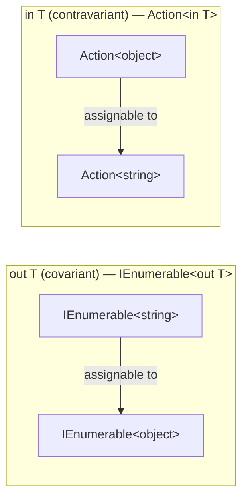
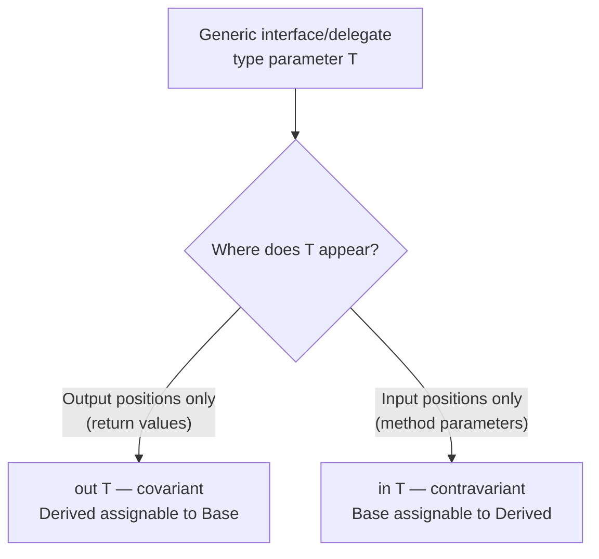

# Covariance and Contravariance in Generics

## Introduction

Before reading this lesson, you should already be comfortable with **[Generic Collections vs Non-Generic (Legacy) Collections](../03-collections-generics/03-18-generic-vs-non-generic-collections.md)** and, more generally, with how a generic type parameter like `T` fixes a specific type for a specific usage. What you may not have noticed yet is that some generic interfaces and delegates — `IEnumerable<T>`, `Action<T>` — let you substitute a *related but different* type argument and still have the assignment compile. That flexibility isn't accidental; it's a deliberate feature called variance, controlled by the `out` and `in` modifiers, and it's the subject of this lesson.

By the end of this lesson, you will be able to:

- Explain what it means for a generic type parameter to be covariant or contravariant
- Declare a covariant type parameter with `out T` and understand where it's legal to use `T`
- Declare a contravariant type parameter with `in T` and understand where it's legal to use `T`
- Use `IEnumerable<out T>`'s covariance to assign a more derived sequence to a less derived one
- Use `Action<in T>`'s contravariance to reuse a general handler for a more specific type
- Explain why variance increases API design flexibility without weakening type safety

## Covariance and Contravariance — A Layman's Perspective

Picture a bank's back office, where two very different kinds of staff roles exist. The first role only ever *hands things out* — think of an ATM cash dispenser that dispenses crisp, newly printed bills. If a branch manager needs "something that dispenses cash," a machine that specifically dispenses crisp new bills is perfectly acceptable — every crisp new bill is still cash, and since this machine's only job is handing cash *out*, never taking anything back in, there's no way substituting it could ever go wrong. A more specific dispenser can always stand in wherever a more general dispenser was asked for, because the direction of the interaction only ever flows outward.

The second role only ever *takes things in* — think of a fraud-review clerk whose entire job is reviewing incoming reports and flagging anything suspicious. Now suppose the bank needs someone specifically to review suspicious ATM withdrawals. A clerk who was trained to review *any* suspicious transaction whatsoever — deposits, wire transfers, withdrawals, everything — can absolutely be assigned that narrower task, because a person capable of handling the broad category is automatically capable of handling any one specific slice of it. Here the substitution runs the opposite direction from the dispenser: a more general handler can stand in wherever a more specific handler was asked for, precisely because this role only ever *consumes* things, never produces them.

Try to run either substitution backwards, though, and it falls apart. You would never trust the crisp-new-bills-only dispenser to also dispense worn, mismatched foreign currency — its whole design assumes it only hands out one specific thing. And you'd never assign a clerk trained *only* on ATM withdrawal fraud to the general "review anything suspicious" desk — they might not recognize wire-transfer fraud at all. Which substitution is safe depends entirely on whether the role only *produces* output or only *consumes* input — never both.

That's the whole idea behind variance in C#. A generic interface where the type parameter only ever appears in "producing" positions — return values, things handed back to the caller — can safely let a more specific type argument substitute for a more general one; that's **covariance**, marked with `out`. A generic interface or delegate where the type parameter only ever appears in "consuming" positions — parameters, things handed in by the caller — can safely let a more general type argument substitute for a more specific one; that's **contravariance**, marked with `in`.

## Covariance and Contravariance — A Programming Language Perspective

C# supports declaring variance on generic **interfaces and delegates** (not classes) via two modifiers applied to a type parameter in its declaration. `out T` marks `T` as **covariant**: the compiler only permits `T` to appear in output positions (return types, get-only properties), and in exchange, `ISomething<Derived>` becomes assignable to `ISomething<Base>` wherever `Base` derives from... wherever `Derived` derives from `Base`. `in T` marks `T` as **contravariant**: the compiler only permits `T` to appear in input positions (method parameters), and in exchange, `ISomething<Base>` becomes assignable to `ISomething<Derived>`. `IEnumerable<out T>` is the canonical covariant example in the BCL; `Action<in T>` and `IComparer<in T>` are canonical contravariant examples. The compiler strictly enforces these position rules at the interface/delegate declaration itself — attempting to use a covariant `T` as a parameter type is a compile error — so variance adds assignment flexibility without ever permitting an actual type-safety violation. This feature has existed since C# 4.0 (.NET Framework 4.0, 2010); nothing here is new to C# 14.

## How to Use Covariant and Contravariant Generic Types in C#

`IEnumerable<out T>` only ever hands elements *out* through its enumerator, never accepts one *in*, so it's safe to treat an `IEnumerable<string>` as an `IEnumerable<object>`. `Action<in T>` only ever accepts a `T` *in* as a parameter, never returns one, so it's safe to treat an `Action<object>` as an `Action<string>`.


*Figure 1: Covariance widens a producer's type argument upward; contravariance widens a consumer's type argument downward.*

```csharp
// Program.cs — .NET 10 / C# 14

IEnumerable<string> currencies = ["USD", "EUR"];
IEnumerable<object> objects = currencies; // covariance: IEnumerable<out T> allows this
foreach (object o in objects)
{
    Console.WriteLine($"Currency: {o}");
}

Action<object> logAny = obj => Console.WriteLine($"Logged: {obj}");
Action<string> logString = logAny; // contravariance: Action<in T> allows this
logString("Deposit received");
```

**Console Output:**

```text
Currency: USD
Currency: EUR
Logged: Deposit received
```

`IEnumerable<string>` is assignable to `IEnumerable<object>` only because `IEnumerable<out T>` restricts `T` to output positions — the sequence only ever hands `string` values *out*, and every `string` is already an `object`, so treating it as `IEnumerable<object>` can never go wrong. `Action<object>` is assignable to `Action<string>` only because `Action<in T>` restricts `T` to input positions — the delegate only ever accepts a value *in*, so a delegate willing to accept *any* `object` can certainly accept the narrower case of a `string`.

## Real-Time Example: Covariant Feeds and Contravariant Handlers in Banking/ATM

We extend a small Banking/ATM `Transaction` hierarchy — an abstract `Transaction` base with `Deposit` and `Withdrawal` subtypes — to show both directions of variance: a covariant `IEnumerable<Transaction>` feed built from a `List<Deposit>`, and a contravariant `Action<Transaction>` audit logger reused as a handler for specific transaction types.

```csharp
// Program.cs — .NET 10 / C# 14 — Real-Time Example

List<Deposit> deposits =
[
    new Deposit("ACC-1001", 500m),
    new Deposit("ACC-1002", 1200m)
];

// Covariance: IEnumerable<out T> lets a more specific sequence (IEnumerable<Deposit>)
// stand in wherever a more general one (IEnumerable<Transaction>) is expected.
IEnumerable<Transaction> transactionFeed = deposits;
PrintFeed(transactionFeed);

Action<Transaction> auditLogger = t =>
    Console.WriteLine($"[AUDIT] {t.AccountNumber}: {t.Amount:0.00}");

// Contravariance: Action<in T> lets a handler built for a general type (Transaction)
// stand in wherever a handler for a more specific type (Deposit / Withdrawal) is expected.
Action<Deposit> depositHandler = auditLogger;
Action<Withdrawal> withdrawalHandler = auditLogger;

depositHandler(new Deposit("ACC-1003", 300m));
withdrawalHandler(new Withdrawal("ACC-1001", 150m));

static void PrintFeed(IEnumerable<Transaction> feed)
{
    foreach (Transaction transaction in feed)
    {
        Console.WriteLine($"{transaction.AccountNumber}: {transaction.Amount:0.00}");
    }
}

abstract class Transaction
{
    public string AccountNumber { get; }
    public decimal Amount { get; }

    protected Transaction(string accountNumber, decimal amount)
    {
        AccountNumber = accountNumber;
        Amount = amount;
    }
}

class Deposit : Transaction
{
    public Deposit(string accountNumber, decimal amount) : base(accountNumber, amount)
    {
    }
}

class Withdrawal : Transaction
{
    public Withdrawal(string accountNumber, decimal amount) : base(accountNumber, amount)
    {
    }
}
```

**Console Output:**

```text
ACC-1001: 500.00
ACC-1002: 1200.00
[AUDIT] ACC-1003: 300.00
[AUDIT] ACC-1001: 150.00
```

`PrintFeed` was written once, against `IEnumerable<Transaction>`, yet it happily accepts the `List<Deposit>` passed to it — covariance means no adapter or manual conversion was needed. `auditLogger` was written once, against `Action<Transaction>`, yet it gets assigned directly to both `Action<Deposit>` and `Action<Withdrawal>` variables — contravariance means the bank's transaction-processing pipeline can reuse one general audit handler across every specific transaction type instead of writing a near-identical logger per subtype. In a real event-processing system handling dozens of transaction kinds, that's a meaningful reduction in duplicated handler code.

## Covariance (`out`) vs Contravariance (`in`)

The two modifiers restrict `T` to opposite positions and, as a result, permit assignment compatibility in opposite directions. `out T` (covariance) only allows `T` in output positions — return types, get-only properties — and permits a more derived type argument to substitute for a less derived one, matching how a type that only *produces* `T` values can safely be treated as producing something more general. `in T` (contravariance) only allows `T` in input positions — method parameters — and permits a less derived type argument to substitute for a more derived one, matching how a type that only *consumes* `T` values can safely be treated as handling something more specific. Trying to use a covariant parameter in an input position, or a contravariant parameter in an output position, is a compile-time error — the compiler enforces the restriction that makes the variance safe in the first place.


*Figure 2: The position `T` is allowed to appear in determines which variance direction is safe.*

| Aspect | Covariance (`out T`) | Contravariance (`in T`) |
|---|---|---|
| Modifier | `out` | `in` |
| `T` allowed only in | Output positions (return values) | Input positions (method parameters) |
| Assignment direction | `IProducer<Derived>` assignable to `IProducer<Base>` | `IConsumer<Base>` assignable to `IConsumer<Derived>` |
| Canonical BCL example | `IEnumerable<out T>` | `Action<in T>`, `IComparer<in T>` |
| Mnemonic | "Only ever produces" — safe to widen upward | "Only ever consumes" — safe to widen downward |

## Types of Variance-Related Concepts in C#

Variance connects closely to a few other generics topics worth exploring alongside this lesson:

1. **[IComparable\<T\> and IComparer\<T\>](../03-collections-generics/03-20-icomparable-and-icomparer.md)** — `IComparer<in T>` is itself a contravariant interface, covered next.
2. **[Generic Constraints](../03-collections-generics/03-16-generic-constraints.md)** — constraints and variance both restrict how a type parameter can be used, but for different purposes.
3. **[Generic Methods](../03-collections-generics/03-17-generic-methods.md)** — generic methods don't support `in`/`out` variance themselves; only generic interfaces and delegates do.
4. **[Generic Collections vs Non-Generic (Legacy) Collections](../03-collections-generics/03-18-generic-vs-non-generic-collections.md)** — non-generic collections predate generics entirely, so variance never applied to them at all.
5. **[Introduction to Generics](../03-collections-generics/03-15-introduction-to-generics.md)** — revisit this for the fundamentals of type parameters if variance still feels unfamiliar.

## What You've Learned & What's Next

Variance lets certain generic interfaces and delegates accept a related-but-different type argument without any manual conversion. `out T` (covariance) works for pure producers, letting a more specific type stand in for a more general one; `in T` (contravariance) works for pure consumers, letting a more general type stand in for a more specific one. Both directions are enforced strictly by the compiler at the position level, so the added flexibility never comes at the cost of type safety.

Continue your learning journey with **[IComparable\<T\> and IComparer\<T\>](../03-collections-generics/03-20-icomparable-and-icomparer.md)**, where we look closely at `IComparer<in T>` — the contravariant interface behind sorting and custom comparison logic throughout the BCL.

---
*Applies to: .NET 10 / C# 14. Last reviewed 2026-08-16.*
