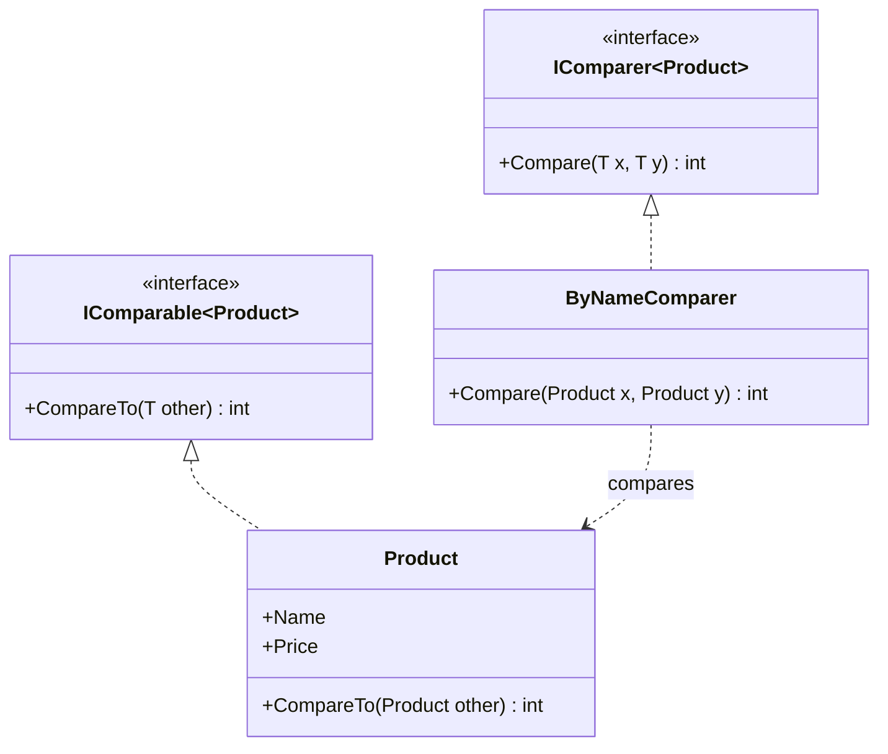
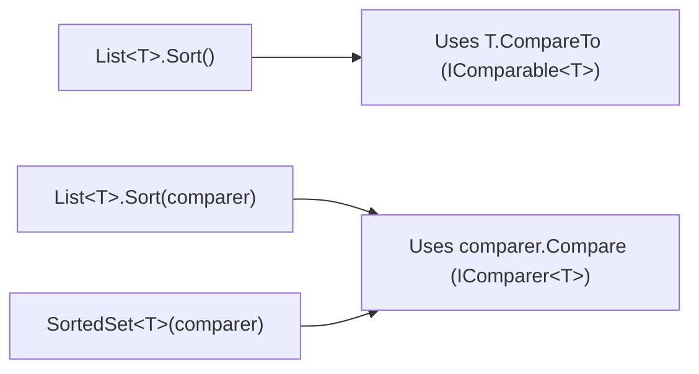

# IComparable<T> and IComparer<T>

## Introduction

Before reading this lesson, you should already be comfortable with **[Covariance and Contravariance in Generics](../03-collections-generics/03-19-covariance-and-contravariance.md)**, which explored how generic type parameters can safely vary in their assignment direction. In this lesson we shift from variance to a much more everyday generic concern: how does a collection like `List<T>` or `SortedSet<T>` know how to put your own custom types into order? The answer is two small, closely related interfaces — `IComparable<T>` and `IComparer<T>` — and knowing when to reach for each one is a skill every C# developer needs.

By the end of this lesson, you will be able to:

- Implement `IComparable<T>` to give a custom type one single, "natural" default ordering
- Implement `IComparer<T>` to define one or more alternate, external orderings for a type you may not even own
- Call `List<T>.Sort()` with no arguments to use a type's natural order, and with an `IComparer<T>` argument to use an alternate one
- Use `SortedSet<T>` to keep a collection continuously ordered, supplying a custom comparer when needed
- Explain why a type should generally have at most one `IComparable<T>` implementation but can have many `IComparer<T>` implementations

## Natural vs. Alternate Ordering — A Layman's Perspective

Picture a deck of playing cards. Every card has one obvious, built-in way to compare it to another: rank. A seven beats a five, a jack beats a nine, and everyone at the table agrees on that ordering without discussion — it's printed right there on the card itself. That's the card's *natural* order: an intrinsic property of the card that doesn't depend on who's looking at it or what game is being played.

But now suppose you're playing a game where suits matter more than rank — hearts always beat clubs, regardless of the numbers printed on them. That ordering isn't printed on the card at all. It's a rule the game itself supplies, from the outside, for this one particular round. The cards haven't changed; you've simply brought in an external rulebook that says "for this game, compare cards this way instead." Tomorrow, a different game might bring an entirely different rulebook — sort by color, sort by whether it's a face card, sort alphabetically by suit name — and the cards themselves never need to change to support any of it.

This is exactly the split between a type's natural order and an alternate order. A `Card` class can reasonably say "my natural order is by rank" once, baked directly into the card. That's a single, permanent fact about what a card *is*. But "sort by suit for this game" isn't a fact about the card — it's a rule supplied by whoever is running today's particular sort. It would be strange, even wrong, for the card itself to carry five different built-in orderings and have callers guess which one applies; a card has one true rank, but a table can bring as many rulebooks as it has games.

The dealer sorting a hand doesn't rewrite each card to change its rank — the dealer simply picks up a different comparison rulebook for a different game, and every card obeys whichever rulebook is currently in the dealer's hand. This is precisely the difference between a type defining its own single default comparison logic and a separate, swappable object supplying comparison logic from the outside. Your custom types get exactly one natural order baked in, the way a card's rank is printed on its face — and as many external comparers as you need for however many different sorting rules different parts of your program might reasonably want, without ever touching the type itself.

## IComparable<T> and IComparer<T> — A Programming Language Perspective

`IComparable<T>`, from `System`, is implemented *by* the type being compared. It declares a single member, `int CompareTo(T? other)`, which returns a negative number if the current instance sorts before `other`, zero if they're equivalent for ordering purposes, and a positive number if it sorts after. Implementing `IComparable<T>` establishes a type's one natural default order, and it is what `List<T>.Sort()` and `Array.Sort()` use when called with no comparer argument.

`IComparer<T>`, from `System.Collections.Generic`, is implemented by a *separate* helper class, not the type being compared. It declares `int Compare(T? x, T? y)` with the same sign convention. Because a comparer is a standalone object, you can write as many of them as you need — one per alternate sort rule — and pass whichever one applies to `List<T>.Sort(IComparer<T>)`, `SortedSet<T>`'s constructor, or LINQ's `OrderBy(keySelector, comparer)`. Neither interface is new to C# 14; both have existed since generics arrived in C# 2.0, but they remain the mechanism every sortable collection in .NET relies on today.

## How to Implement IComparable<T> and IComparer<T> in C#

Start with a type's natural order first. A `Product` naturally sorts by price — that's a permanent fact about a product catalog, so it belongs on the type itself via `IComparable<T>`. A separate `ByNameComparer` class supplies an alternate, external ordering by name, without `Product` needing to know that rule exists.


*Figure 1: `Product` implements its own natural order via `IComparable<Product>`; `ByNameComparer` is a separate object supplying an alternate order via `IComparer<Product>`.*

```csharp
// Program.cs — .NET 10 / C# 14

List<Product> products =
[
    new Product("Widget", 19.99m),
    new Product("Anvil", 49.99m),
    new Product("Cog", 9.99m)
];

products.Sort(); // Uses Product's natural order: IComparable<Product>.CompareTo
Console.WriteLine("Sorted by price (natural order):");
foreach (Product p in products)
{
    Console.WriteLine($"  {p.Name}: {p.Price:C}");
}

products.Sort(new ByNameComparer()); // Uses an external, alternate order
Console.WriteLine("Sorted by name (alternate order):");
foreach (Product p in products)
{
    Console.WriteLine($"  {p.Name}: {p.Price:C}");
}

class Product(string name, decimal price) : IComparable<Product>
{
    public string Name { get; } = name;
    public decimal Price { get; } = price;

    // Natural order: cheapest first.
    public int CompareTo(Product? other)
    {
        if (other is null) return 1;
        return Price.CompareTo(other.Price);
    }
}

class ByNameComparer : IComparer<Product>
{
    // Alternate order: alphabetical by name, independent of Product itself.
    public int Compare(Product? x, Product? y)
    {
        if (x is null) return y is null ? 0 : -1;
        if (y is null) return 1;
        return string.Compare(x.Name, y.Name, StringComparison.Ordinal);
    }
}
```

**Console Output:**

```text
Sorted by price (natural order):
  Cog: $9.99
  Widget: $19.99
  Anvil: $49.99
Sorted by name (alternate order):
  Anvil: $49.99
  Cog: $9.99
  Widget: $19.99
```

The first `Sort()` call takes no arguments, so `List<T>` reaches for `Product`'s own `CompareTo` — its one natural order, by price. The second call passes a `ByNameComparer` instance, so `List<T>` ignores `Product`'s natural order entirely and follows the external rule instead, sorting alphabetically by name. `Product` never needed to change, and never needed to know a name-based ordering existed, to support both.

## Real-Time Example: Sorting Orders in E-Commerce Order Processing

We extend the E-Commerce Order Processing case study with an `Order` type. An order's natural order is by `PlacedAt` — the timestamp it was placed — which is the sensible default for a processing queue. But a fulfillment dashboard also needs to sort the *same* orders by `Total` (highest-value orders first, for priority handling), without touching `Order` itself. We also keep a live, continuously sorted view using `SortedSet<Order>` with a custom comparer.

```csharp
// Program.cs — .NET 10 / C# 14 — Real-Time Example

List<Order> orders =
[
    new Order("ORD-1003", 249.50m, new DateTime(2026, 8, 16, 9, 15, 0)),
    new Order("ORD-1001", 89.00m, new DateTime(2026, 8, 16, 8, 0, 0)),
    new Order("ORD-1002", 512.75m, new DateTime(2026, 8, 16, 8, 45, 0))
];

orders.Sort(); // Natural order: IComparable<Order>.CompareTo, by PlacedAt
Console.WriteLine("Processing queue (oldest first):");
foreach (Order o in orders)
{
    Console.WriteLine($"  {o.OrderId} placed {o.PlacedAt:HH:mm} — {o.Total:C}");
}

orders.Sort(new ByTotalDescendingComparer()); // Alternate order for the dashboard
Console.WriteLine("Priority dashboard (highest value first):");
foreach (Order o in orders)
{
    Console.WriteLine($"  {o.OrderId} — {o.Total:C}");
}

// A live, continuously sorted set of high-priority orders, keyed by the same
// alternate comparer used above.
var priorityQueue = new SortedSet<Order>(new ByTotalDescendingComparer());
priorityQueue.Add(new Order("ORD-2001", 120.00m, new DateTime(2026, 8, 16, 10, 0, 0)));
priorityQueue.Add(new Order("ORD-2002", 875.25m, new DateTime(2026, 8, 16, 10, 5, 0)));
priorityQueue.Add(new Order("ORD-2003", 340.10m, new DateTime(2026, 8, 16, 10, 10, 0)));

Console.WriteLine("Live priority set (auto-sorted, highest value first):");
foreach (Order o in priorityQueue)
{
    Console.WriteLine($"  {o.OrderId} — {o.Total:C}");
}

class Order(string orderId, decimal total, DateTime placedAt) : IComparable<Order>
{
    public string OrderId { get; } = orderId;
    public decimal Total { get; } = total;
    public DateTime PlacedAt { get; } = placedAt;

    // Natural order: earliest-placed order first — the default for a processing queue.
    public int CompareTo(Order? other)
    {
        if (other is null) return 1;
        return PlacedAt.CompareTo(other.PlacedAt);
    }
}

class ByTotalDescendingComparer : IComparer<Order>
{
    // Alternate order: highest total first — for a priority fulfillment dashboard.
    public int Compare(Order? x, Order? y)
    {
        if (x is null) return y is null ? 0 : -1;
        if (y is null) return 1;
        return y.Total.CompareTo(x.Total); // Reversed for descending order.
    }
}
```

**Console Output:**

```text
Processing queue (oldest first):
  ORD-1001 placed 08:00 — $89.00
  ORD-1002 placed 08:45 — $512.75
  ORD-1003 placed 09:15 — $249.50
Priority dashboard (highest value first):
  ORD-1002 — $512.75
  ORD-1003 — $249.50
  ORD-1001 — $89.00
Live priority set (auto-sorted, highest value first):
  ORD-2002 — $875.25
  ORD-2003 — $340.10
  ORD-2001 — $120.00
```

Both the fulfillment queue and the priority dashboard operate on the exact same `Order` objects — only the sorting rule changed, and it changed from the outside. `SortedSet<Order>` takes this further: instead of sorting once, it maintains order continuously as each order is added, using whichever comparer it was constructed with. A real fulfillment system might keep several such views open simultaneously — oldest-first for normal processing, highest-value-first for a priority lane — without `Order` ever needing to be aware that more than one ordering exists.

## IComparable<T> vs. IComparer<T>

The two interfaces solve related but distinct problems, and mixing them up is a common source of confusion. `IComparable<T>` answers "how does this type compare itself to another instance of itself?" and lives on the type being sorted — a type should generally implement it once, expressing its one true default order. `IComparer<T>` answers "how should *these* two objects be compared, for this particular purpose?" and lives on a separate object entirely — you can write as many comparers as you have sorting needs, including for types you don't own and can't modify at all (a `DateTime` or a third-party library type, for instance).


*Figure 2: An overload with no comparer argument falls back to the type's own natural order; supplying a comparer overrides it with an external rule.*

| Aspect | `IComparable<T>` | `IComparer<T>` |
|---|---|---|
| Implemented by | The type being sorted itself | A separate, standalone class |
| Member | `int CompareTo(T? other)` | `int Compare(T? x, T? y)` |
| How many per type | Typically exactly one (the natural order) | As many as needed (one per alternate rule) |
| Works on types you don't own | No — requires modifying the type | Yes — no access to the type's source needed |
| Used by | `Sort()` / `Array.Sort()` with no arguments | `Sort(comparer)`, `SortedSet<T>(comparer)`, `OrderBy(key, comparer)` |

## Types and Variants Related to Comparison in C#

Sorting and comparison show up in more forms than just these two interfaces — several are worth knowing about even though they aren't the focus of this lesson:

1. **[SortedList<TKey, TValue> and SortedDictionary<TKey, TValue>](../03-collections-generics/03-08-sortedlist-and-sorteddictionary.md)** — key/value collections that stay ordered by key using the same comparison mechanics covered here.
2. **`Comparer<T>.Default`** — the static property .NET uses internally to fall back to a type's `IComparable<T>` implementation when no explicit comparer is supplied.
3. **`Comparer<T>.Create(Comparison<T>)`** — a shortcut for building a lightweight, throwaway `IComparer<T>` from a single lambda instead of a full class.
4. **`IEquatable<T>`** — a related but distinct interface for equality rather than ordering; a type can implement both independently.
5. **[LINQ's OrderBy and OrderByDescending](../04-linq/04-01-introduction-to-linq.md)** — the fluent, query-style alternative to calling `Sort()` directly, which also accepts an `IComparer<T>`.

## What You've Learned & What's Next

A type's natural order belongs on the type itself, through `IComparable<T>.CompareTo` — one rule, baked in, used automatically whenever `Sort()` is called with no arguments. Every alternate ordering belongs on a separate `IComparer<T>` implementation, supplied from the outside whenever a caller needs a different rule, without ever touching the original type. Real systems frequently need both at once, exactly as the E-Commerce dashboard did here.

Continue your learning journey with **[Building a Custom Collection Type](../03-collections-generics/03-21-building-a-custom-collection-type.md)**, where we put everything from this module together to build a domain-specific collection of our own — one that, fittingly, will need to decide how its contents get ordered and validated.

---
*Applies to: .NET 10 / C# 14. Last reviewed 2026-08-16.*
