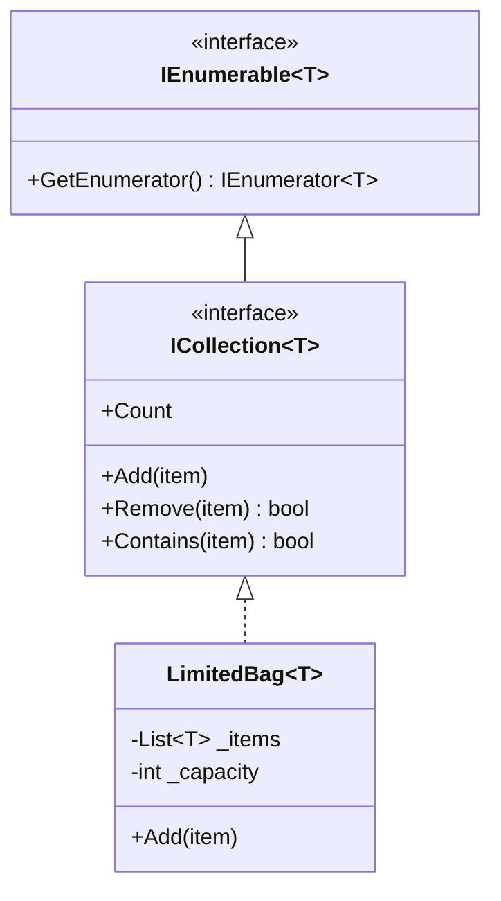
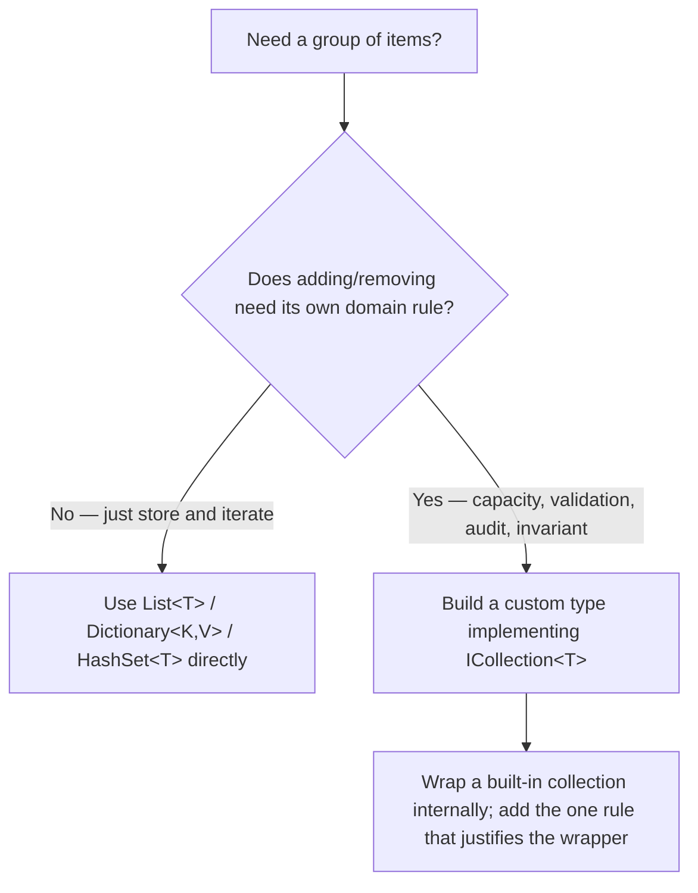

# Building a Custom Collection Type

## Introduction

Before reading this lesson, you should already be comfortable with **[IComparable<T> and IComparer<T>](../03-collections-generics/03-20-icomparable-and-icomparer.md)**, where a custom type learned to describe its own ordering to collections that already existed. This lesson goes a step further: instead of teaching a type to cooperate with `List<T>` or `SortedSet<T>`, we build a brand-new collection type of our own — one with domain-specific rules that no built-in collection enforces out of the box.

By the end of this lesson, you will be able to:

- Implement `IEnumerable<T>` so your custom type works with `foreach` and LINQ
- Implement `ICollection<T>` to add `Add`, `Remove`, `Contains`, and `Count` with your own validation logic
- Recognize the signal that justifies building a custom collection: domain rules on add/remove that a generic `List<T>` can't express
- Decide when *not* to build one, and just wrap or use a built-in collection instead
- Build a capacity-limited `BookShelf` for the Library/Inventory Management case study

## Building Your Own Container — A Layman's Perspective

Think about the difference between buying a generic plastic storage bin from a hardware store and having a custom-built display case made for a jeweler's shop window. The plastic bin is wonderful for what it is — cheap, available immediately, and flexible enough to hold almost anything you drop into it. You could store jewelry in it. Nothing stops you. But nothing about the bin *understands* jewelry either: it won't stop you from stacking a delicate necklace under a heavy ring, it won't warn you when it's holding more pieces than it can safely display, and it won't organize anything by value or type. It just holds whatever you put in.

A custom display case is a completely different proposition. It's built with exactly twelve velvet-lined slots because the jeweler knows, from experience, that displaying more than twelve pieces at once looks cluttered and cheapens the presentation. Try to place a thirteenth piece, and the case itself refuses — there's physically nowhere for it to go, by design, not by accident. The case also might refuse an item that doesn't belong: a price tag stapler doesn't get a velvet slot. Building that case took real carpentry work, glass-cutting, and design decisions that a five-dollar plastic bin never required. It was worth it precisely because the jeweler's business has real, specific rules about what "good storage" means for this particular kind of contents — rules a generic container simply cannot express.

Most of the time, in most stockrooms and most shops, the plastic bin is exactly the right call — buying a custom case for every single shelf in a warehouse would be enormous wasted effort for no real benefit, since a warehouse mostly just needs things held and found again. The decision to invest in a custom case only makes sense when the *contents themselves* carry rules that generic storage can't enforce: a limit that matters, a validation step that matters, a business reason the container itself needs to say "no."

That's the exact judgment call this lesson is about. Most of the time, `List<T>` and `Dictionary<TKey, TValue>` are the plastic bin — perfectly good, and building something custom around them would be wasted effort. But every so often, a collection needs its own real rules baked in — a hard capacity limit, a validation check on every item added — and at that point, a custom collection type, like the jeweler's display case, earns its cost.

## Custom Collections — A Programming Language Perspective

A custom collection type in C# is built by implementing one or both of two core interfaces from `System.Collections.Generic`. `IEnumerable<T>` is the minimum needed for `foreach` and LINQ to work — it declares a single member, `GetEnumerator()`, which returns an `IEnumerator<T>` that can be advanced one item at a time. `ICollection<T>` extends `IEnumerable<T>` and adds the mutating and querying members most collections need: `Add`, `Remove`, `Clear`, `Contains`, `Count`, and `CopyTo`. A type implementing `ICollection<T>` typically wraps an existing built-in collection internally (composition, not reinvention) and layers its own validation on top of the mutating members, while delegating iteration and the read-only members straight through. This pattern isn't new to C# 14 — it dates back to generics in C# 2.0 — but it remains the standard way to expose domain-specific container rules through a familiar, `foreach`-and-LINQ-compatible surface.

## How to Implement a Custom Collection in C#

The smallest useful custom collection needs `IEnumerable<T>` for iteration and just enough of `ICollection<T>` to add domain validation. Here, a `LimitedBag<T>` refuses to accept more than a fixed number of items — a rule no built-in collection enforces by default.


*Figure 1: `LimitedBag<T>` implements `ICollection<T>` (which itself extends `IEnumerable<T>`), wrapping an internal `List<T>` and adding its own capacity check.*

```csharp
// Program.cs — .NET 10 / C# 14

var bag = new LimitedBag<string>(capacity: 3);
bag.Add("apple");
bag.Add("banana");
bag.Add("cherry");
Console.WriteLine($"Count: {bag.Count}");

foreach (string item in bag)
{
    Console.WriteLine($"  {item}");
}

try
{
    bag.Add("date");
}
catch (InvalidOperationException ex)
{
    Console.WriteLine($"Add failed: {ex.Message}");
}

class LimitedBag<T>(int capacity) : ICollection<T>
{
    private readonly List<T> _items = new();

    public int Count => _items.Count;
    public bool IsReadOnly => false;

    public void Add(T item)
    {
        if (_items.Count >= capacity)
        {
            throw new InvalidOperationException($"Bag is full (capacity {capacity}).");
        }
        _items.Add(item);
    }

    public bool Remove(T item) => _items.Remove(item);
    public void Clear() => _items.Clear();
    public bool Contains(T item) => _items.Contains(item);
    public void CopyTo(T[] array, int arrayIndex) => _items.CopyTo(array, arrayIndex);

    public IEnumerator<T> GetEnumerator() => _items.GetEnumerator();
    System.Collections.IEnumerator System.Collections.IEnumerable.GetEnumerator() => GetEnumerator();
}
```

**Console Output:**

```text
Count: 3
  apple
  banana
  cherry
Add failed: Bag is full (capacity 3).
```

`LimitedBag<T>` delegates almost everything — `Contains`, `Clear`, iteration — straight to an internal `List<T>`, adding exactly one piece of real logic: `Add` refuses a fourth item once capacity is reached. The `foreach` loop works because `GetEnumerator()` is implemented; `List<T>`'s own enumerator does all the actual work. This is the shape almost every worthwhile custom collection takes: thin wrapping, one meaningful rule.

## Real-Time Example: A Capacity-Limited BookShelf for Library/Inventory Management

We extend the Library/Inventory Management case study with a `BookShelf` — a real physical shelf has a hard, finite capacity, which is exactly the kind of domain rule that justifies a custom collection instead of a plain `List<Book>`. `BookShelf` implements `ICollection<Book>` so it works with `foreach` and LINQ like any other collection, while enforcing that no shelf ever holds more books than it physically can.

```csharp
// Program.cs — .NET 10 / C# 14 — Real-Time Example

var shelf = new BookShelf(capacity: 3, location: "Shelf B-4");

shelf.Add(new Book("Clean Code", "978-0132350884"));
shelf.Add(new Book("Refactoring", "978-0134757599"));
shelf.Add(new Book("The Pragmatic Programmer", "978-0135957059"));

Console.WriteLine($"{shelf.Location}: {shelf.Count}/{shelf.Capacity} books shelved");
foreach (Book book in shelf)
{
    Console.WriteLine($"  {book.Title} ({book.Isbn})");
}

Console.WriteLine($"Contains 'Refactoring'? {shelf.Any(b => b.Title == "Refactoring")}");

try
{
    shelf.Add(new Book("Domain-Driven Design", "978-0321125217"));
}
catch (InvalidOperationException ex)
{
    Console.WriteLine($"Shelving failed: {ex.Message}");
}

bool removed = shelf.Remove(shelf.First(b => b.Title == "Clean Code"));
Console.WriteLine($"Removed 'Clean Code'? {removed}");
Console.WriteLine($"{shelf.Location}: {shelf.Count}/{shelf.Capacity} books shelved after removal");

shelf.Add(new Book("Domain-Driven Design", "978-0321125217"));
Console.WriteLine($"{shelf.Location}: {shelf.Count}/{shelf.Capacity} books shelved after re-adding");

record Book(string Title, string Isbn);

// A custom collection: a shelf has a hard, physical capacity that a plain
// List<Book> has no way to enforce on its own.
class BookShelf(int capacity, string location) : ICollection<Book>
{
    private readonly List<Book> _books = new();

    public string Location { get; } = location;
    public int Capacity { get; } = capacity;
    public int Count => _books.Count;
    public bool IsReadOnly => false;

    public void Add(Book item)
    {
        if (_books.Count >= Capacity)
        {
            throw new InvalidOperationException(
                $"{Location} is at full capacity ({Capacity} books).");
        }
        _books.Add(item);
    }

    public bool Remove(Book item) => _books.Remove(item);
    public void Clear() => _books.Clear();
    public bool Contains(Book item) => _books.Contains(item);
    public void CopyTo(Book[] array, int arrayIndex) => _books.CopyTo(array, arrayIndex);

    public IEnumerator<Book> GetEnumerator() => _books.GetEnumerator();
    System.Collections.IEnumerator System.Collections.IEnumerable.GetEnumerator() => GetEnumerator();
}
```

**Console Output:**

```text
Shelf B-4: 3/3 books shelved
  Clean Code (978-0132350884)
  Refactoring (978-0134757599)
  The Pragmatic Programmer (978-0135957059)
Contains 'Refactoring'? True
Shelving failed: Shelf B-4 is at full capacity (3 books).
Removed 'Clean Code'? True
Shelf B-4: 2/3 books shelved after removal
Shelf B-4: 3/3 books shelved after re-adding
```

Notice that `shelf.Any(...)` and `shelf.First(...)` — ordinary LINQ methods — work directly against `BookShelf` with no extra effort, purely because it implements `IEnumerable<Book>` via `ICollection<Book>`. The capacity check in `Add` is the one piece of logic that makes building this type worthwhile at all: a librarian's shelving system genuinely needs to reject a fourth book on a three-book shelf, and a plain `List<Book>` has no vocabulary for expressing that rule at all — it would happily grow forever.

## Custom Collection vs. Just Using a Built-In Collection

The judgment call is straightforward once you name it directly: build a custom collection only when the collection itself needs to enforce a rule on `Add` or `Remove` that matters to your domain — a capacity limit, a uniqueness constraint beyond what `HashSet<T>` gives you for free, a validation step, an audit log of every mutation. If all you need is "a group of items I can loop over and add things to," reach for `List<T>` directly and stop there; wrapping it in a custom type at that point adds a maintenance burden with no corresponding benefit.


*Figure 2: The deciding question is whether mutation needs domain logic — not whether the data merely needs to be grouped.*

| Aspect | Plain `List<T>` | Custom `ICollection<T>` type |
|---|---|---|
| Effort to build | None — it's provided | Requires implementing `IEnumerable<T>`/`ICollection<T>` |
| Enforces domain rules on Add/Remove | No | Yes — that's the entire reason to build one |
| Works with `foreach` and LINQ | Yes, natively | Yes, once `GetEnumerator()` is implemented |
| Risk of over-engineering | None | Real — don't build one "just in case" |
| Good fit | General-purpose storage, no special rules | Capacity limits, validation, invariants specific to one domain concept |

## Types and Approaches for Building Custom Collections in C#

Implementing `ICollection<T>` directly is only one way to build a custom collection — several related approaches are worth knowing:

1. **[Introduction to Collections in .NET](../03-collections-generics/03-01-introduction-to-collections.md)** — the core interfaces (`IEnumerable<T>`, `ICollection<T>`, `IList<T>`) this lesson builds directly on top of.
2. **`Collection<T>` (from `System.Collections.ObjectModel`)** — a base class designed specifically to be subclassed, with virtual `InsertItem`/`RemoveItem`/`ClearItems` hooks, often less code than implementing `ICollection<T>` from scratch.
3. **`KeyedCollection<TKey, TItem>`** — a specialized base class for a collection whose items each expose their own natural key, combining list and dictionary behavior.
4. **Custom iterator methods with `yield return`** — a lighter-weight option when you only need custom iteration logic, not full `Add`/`Remove` control.
5. **Wrapping and exposing as `IReadOnlyCollection<T>`** — when the goal is read-only exposure of an internal list rather than a new mutable type entirely.

## What You've Learned & What's Next

Building a custom collection is worth the effort exactly when a domain rule needs to live inside `Add` or `Remove` itself — as `BookShelf`'s capacity check demonstrated — and not worth it when a built-in collection would do the same job with none of the extra code. Implementing `IEnumerable<T>` (directly or through `ICollection<T>`) is what earns you `foreach` and LINQ support for free, no matter how much custom logic sits underneath.

Continue your learning journey with **[Choosing the Right Collection — Comparison Guide](../03-collections-generics/03-22-choosing-the-right-collection.md)**, the Module 03 capstone, where we step back and compare every collection type covered so far — including when reaching for a built-in type beats building a custom one at all.

---
*Applies to: .NET 10 / C# 14. Last reviewed 2026-08-16.*
