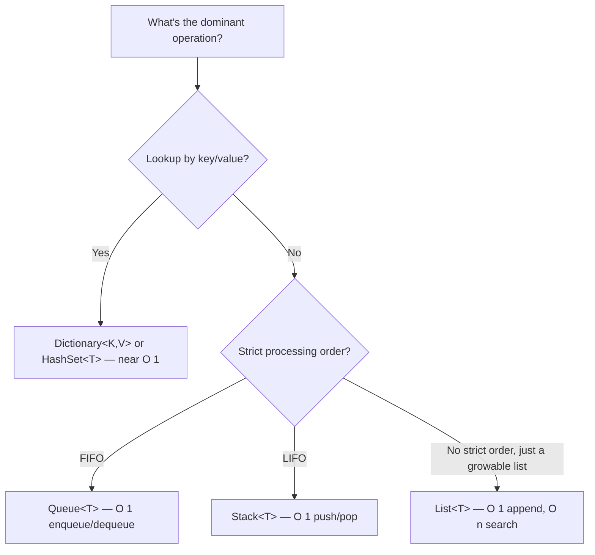
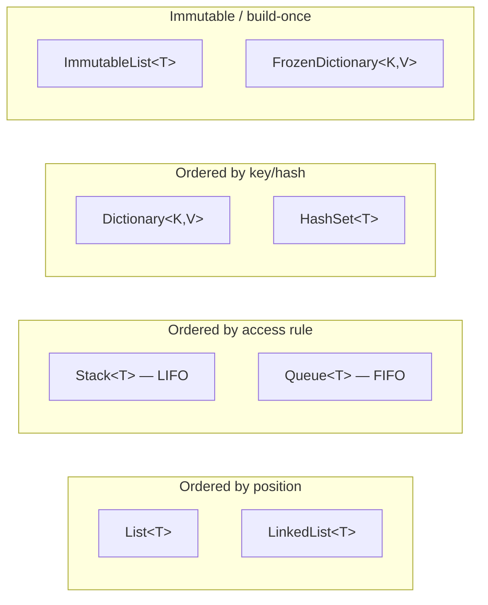

# Choosing the Right Collection — Comparison Guide

## Introduction

Before reading this lesson, you should already be comfortable with **[Building a Custom Collection Type](../03-collections-generics/03-21-building-a-custom-collection-type.md)** and, really, with the entire arc of Module 03 — `List<T>`, `Dictionary<TKey, TValue>`, `HashSet<T>`, `Stack<T>`, `Queue<T>`, `LinkedList<T>`, immutable and frozen collections, generics, `IComparable<T>`/`IComparer<T>`, and building your own collection types. This lesson is the module's capstone, and unlike the lessons before it, it introduces no new syntax at all. Instead, it steps back and asks the question every one of those lessons was implicitly building toward: **given a specific job, which collection do you actually reach for?**

By the end of this lesson, you will be able to:

- Compare the Big-O time complexity of `Add`, `Remove`, `Contains`, and key lookup across every major collection type covered in this module
- State a clear "use this when" rule of thumb for each collection type
- Recognize the symptoms of choosing the wrong collection for a job (slow lookups, unnecessary ordering overhead, wasted memory)
- Select an appropriate, distinct collection type for each of several different needs within a single real-world system
- Explain why "just use `List<T>` for everything" quietly becomes a performance bug as data grows

## Choosing the Right Container — A Layman's Perspective

Imagine you've just been put in charge of organizing an entire warehouse, and you have every kind of storage equipment available to you: shelving units, filing cabinets, conveyor belts, and revolving card files. A rookie manager might decide it's simpler to just use identical shelving units for absolutely everything, because shelves are flexible and familiar. It "works," in the sense that nothing physically prevents you from storing anything on a shelf. But watch what happens over the following weeks. The receiving dock needs to process incoming shipments strictly in the order trucks arrive — first truck in, first truck unloaded — and shelving has no concept of "order of arrival" at all; workers end up manually checking timestamps on every box to figure out what's next, which is slow and error-prone. Meanwhile, the customer service desk needs to look up a customer's order by their order number in under a second while a customer is on the phone — but "search every shelf until you find the right box" takes minutes, not seconds, and gets slower every single week as the warehouse fills up.

An experienced warehouse manager doesn't make this mistake, because they understand that different tasks have fundamentally different shapes, and the right piece of equipment for one task is often the wrong piece of equipment for another. The receiving dock doesn't need shelves — it needs a conveyor belt, where the first thing placed on it is mechanically guaranteed to be the first thing that comes off the other end, no manual checking required. The customer service desk doesn't need shelves either — it needs a card-catalog-style rotary file, indexed by order number, where any single record can be pulled in seconds no matter how many thousands of records the file holds. A pile of collected coupon codes that just needs "have we seen this one before" doesn't need order at all — a simple set of index cards, one per unique code, with no shelving or sequence required whatsoever.

None of these pieces of equipment is objectively "better" than the others in general — a conveyor belt would be a terrible way to look up a specific customer record, and a rotary card file would be a strange way to process a loading dock in strict arrival order. Each one is simply *shaped* for a particular access pattern, and a warehouse that thrives uses several different kinds of equipment side by side, choosing deliberately among them rather than defaulting to the same one everywhere out of habit.

That's the exact judgment call this capstone is about. Every collection type introduced across Module 03 — the resizable list, the key-indexed dictionary, the uniqueness-only set, the strict first-in-first-out queue, the last-in-first-out stack — is warehouse equipment shaped for a particular access pattern. Choosing well means naming the actual access pattern your code needs *before* reaching for a collection, the same way a good warehouse manager names the task before wheeling out any particular piece of equipment.

## Choosing the Right Collection — A Programming Language Perspective

Every collection type in `System.Collections.Generic` (and the newer `System.Collections.Immutable` and `System.Collections.Frozen` namespaces) makes a deliberate trade-off between insertion cost, removal cost, lookup cost, and ordering guarantees — no single type minimizes all four simultaneously, because some of those goals are in direct tension with each other. `List<T>` optimizes for indexed access and append order at the cost of slow linear search. `Dictionary<TKey, TValue>` and `HashSet<T>` optimize for near-constant-time lookup by giving up any guaranteed ordering. `Queue<T>` and `Stack<T>` don't optimize for lookup at all — they optimize for one specific, disciplined access order (FIFO or LIFO) at both ends. `ImmutableList<T>` and friends optimize for safe sharing across threads and time at the cost of allocating a new structure on every "mutation." `FrozenDictionary<TKey, TValue>` and `FrozenSet<T>`, introduced in .NET 8 and unchanged in shape through .NET 10, optimize construction-time cost upward in exchange for the fastest possible read-time lookup, appropriate only for collections built once and read many times afterward. Choosing correctly means matching your dominant operation — the one your code calls most often, in the hottest path — to the type built to make that specific operation cheap.

## How to Reason About Collection Big-O in C#

Before picking a collection for a real system, it helps to see the trade-offs side by side in one place, expressed in Big-O terms, so the underlying shape of each type is unmistakable rather than folklore.


*Figure 1: Naming the dominant operation first — lookup, FIFO, LIFO, or general storage — points directly at the right collection type.*

```csharp
// Program.cs — .NET 10 / C# 14

var list = new List<string>();
var dictionary = new Dictionary<string, string>();
var set = new HashSet<string>();

for (int i = 0; i < 5; i++)
{
    string key = $"item-{i}";
    list.Add(key);
    dictionary[key] = $"value-{i}";
    set.Add(key);
}

// A linear search through a List<T>: cost grows with every item added.
bool foundInList = list.Contains("item-4");
Console.WriteLine($"List.Contains (O(n) scan): {foundInList}");

// A dictionary lookup by key: cost stays roughly flat as the dictionary grows.
bool foundInDictionary = dictionary.ContainsKey("item-4");
Console.WriteLine($"Dictionary.ContainsKey (near O(1)): {foundInDictionary}");

// A set membership check: same near-constant-time guarantee, no value attached.
bool foundInSet = set.Contains("item-4");
Console.WriteLine($"HashSet.Contains (near O(1)): {foundInSet}");
```

**Console Output:**

```text
List.Contains (O(n) scan): True
Dictionary.ContainsKey (near O(1)): True
HashSet.Contains (near O(1)): True
```

All three calls return `True` here because the collections are tiny — five items each — so the performance difference is invisible at this scale. That's precisely the trap: the code above would look and behave identically whether the collections held five items or five million. The difference only shows up as the data grows, when `List<T>.Contains` must scan further and further with every added item while `Dictionary` and `HashSet` lookups stay essentially flat. Picking the right collection is about designing for the size your data will actually reach, not just the size it happens to be during a quick test.

## Real-Time Example: Picking the Right Collection Across E-Commerce Order Processing

We extend the E-Commerce Order Processing case study with three genuinely different needs, each solved with a deliberately different collection: a `Dictionary<string, Product>` for instant SKU lookup at checkout, a `Queue<Order>` for strictly first-in-first-out fulfillment processing, and a `HashSet<string>` for tracking which coupon codes have already been applied to an order, where order doesn't matter and duplicates must be rejected.

```csharp
// Program.cs — .NET 10 / C# 14 — Real-Time Example

// Need 1: instant SKU lookup — a Dictionary is built for exactly this.
var catalog = new Dictionary<string, Product>
{
    ["SKU-100"] = new Product("SKU-100", "Wireless Mouse", 24.99m),
    ["SKU-200"] = new Product("SKU-200", "Mechanical Keyboard", 89.99m),
    ["SKU-300"] = new Product("SKU-300", "USB-C Hub", 34.50m)
};

if (catalog.TryGetValue("SKU-200", out Product? product))
{
    Console.WriteLine($"SKU-200 found instantly: {product.Name} — {product.Price:C}");
}

// Need 2: fulfillment must process orders in the exact sequence they arrived —
// a Queue enforces that FIFO guarantee structurally, not by convention.
var fulfillmentQueue = new Queue<Order>();
fulfillmentQueue.Enqueue(new Order("ORD-5001", "SKU-100"));
fulfillmentQueue.Enqueue(new Order("ORD-5002", "SKU-300"));
fulfillmentQueue.Enqueue(new Order("ORD-5003", "SKU-200"));

Console.WriteLine("Processing fulfillment queue in arrival order:");
while (fulfillmentQueue.Count > 0)
{
    Order next = fulfillmentQueue.Dequeue();
    Console.WriteLine($"  Processing {next.OrderId} ({next.Sku})");
}

// Need 3: coupon codes applied to an order have no meaningful order and must
// never be applied twice — a HashSet enforces uniqueness directly.
var appliedCoupons = new HashSet<string>();
string[] attemptedCodes = ["SAVE10", "FREESHIP", "SAVE10"];

foreach (string code in attemptedCodes)
{
    bool wasNew = appliedCoupons.Add(code);
    Console.WriteLine(wasNew
        ? $"Coupon '{code}' applied."
        : $"Coupon '{code}' rejected — already applied to this order.");
}

Console.WriteLine($"Total distinct coupons applied: {appliedCoupons.Count}");

record Product(string Sku, string Name, decimal Price);
record Order(string OrderId, string Sku);
```

**Console Output:**

```text
SKU-200 found instantly: Mechanical Keyboard — $89.99
Processing fulfillment queue in arrival order:
  Processing ORD-5001 (SKU-100)
  Processing ORD-5002 (SKU-300)
  Processing ORD-5003 (SKU-200)
Coupon 'SAVE10' applied.
Coupon 'FREESHIP' applied.
Coupon 'SAVE10' rejected — already applied to this order.
Total distinct coupons applied: 2
```

Notice that none of these three needs could swap collections without a real cost. Using a `List<Order>` for fulfillment instead of a `Queue<Order>` would still "work," but nothing would stop a careless `RemoveAt(index)` call from processing orders out of sequence — the `Queue<T>` API physically only exposes `Enqueue`/`Dequeue`, making FIFO the only possible access pattern. Using a `List<string>` for coupon tracking instead of a `HashSet<string>` would require a manual `Contains` check before every `Add`, turning an O(1) operation into an O(n) one and inviting the exact duplicate-application bug the `HashSet` rules out structurally. The right collection doesn't just perform better — it makes the wrong usage harder to write in the first place.

## The Full Collection Comparison

This table consolidates every major collection type covered across Module 03. "Lookup" means finding an item by value or by key, depending on the type; `n` is the number of elements currently stored.


*Figure 2: Every collection in this module falls into one of four families, grouped by what actually governs the order and cost of access.*

| Collection | Add | Remove | Contains / lookup | Ordering | Use this when |
|---|---|---|---|---|---|
| `List<T>` | O(1) amortized (end) | O(n) | O(n) | Insertion order, indexable | You need positional/indexed access and mostly append at the end |
| `LinkedList<T>` | O(1) (at a known node) | O(1) (at a known node) | O(n) | Insertion order, no indexing | Frequent insert/remove in the middle, and you already hold the node |
| `Dictionary<TKey, TValue>` | O(1) average | O(1) average | O(1) average, by key | Unordered (insertion order not guaranteed) | Fast lookup by a unique key — the SKU catalog case above |
| `HashSet<T>` | O(1) average | O(1) average | O(1) average, by value | Unordered | Uniqueness tracking and fast membership checks — the coupon case above |
| `Stack<T>` | O(1) (`Push`) | O(1) (`Pop`) | O(n) | Strict LIFO | Undo history, expression evaluation, anything "last in, first out" |
| `Queue<T>` | O(1) (`Enqueue`) | O(1) (`Dequeue`) | O(n) | Strict FIFO | Sequential processing pipelines — the fulfillment case above |
| `SortedSet<T>` / `SortedDictionary<K,V>` | O(log n) | O(log n) | O(log n) | Always sorted by key | You need both fast lookup *and* continuously sorted iteration |
| `ImmutableList<T>` etc. | O(log n) (returns new instance) | O(log n) (returns new instance) | O(n) | Same as mutable counterpart | Safe sharing across threads or time without defensive copying |
| `FrozenDictionary<K,V>` / `FrozenSet<T>` | Not supported (build-once) | Not supported | Fastest possible O(1) | Unordered | A lookup table built once at startup and read very many times afterward |

## Types of Collections Covered Across Module 03

This capstone draws on every collection type this module introduced — each is worth revisiting individually if any row in the table above felt unfamiliar:

1. **[Introduction to Collections in .NET](../03-collections-generics/03-01-introduction-to-collections.md)** — the core interfaces (`IEnumerable<T>`, `ICollection<T>`, `IList<T>`, `IDictionary<TKey, TValue>`) every type in the table above implements.
2. **[IComparable<T> and IComparer<T>](../03-collections-generics/03-20-icomparable-and-icomparer.md)** — the mechanism `SortedSet<T>` and `SortedDictionary<TKey, TValue>` rely on to stay ordered.
3. **[Building a Custom Collection Type](../03-collections-generics/03-21-building-a-custom-collection-type.md)** — what to do when none of the built-in shapes in the table above enforce the domain rule you actually need.
4. **Immutable collections (`System.Collections.Immutable`)** — `ImmutableList<T>`, `ImmutableDictionary<TKey, TValue>`, and their peers, for safe sharing without defensive copying.
5. **Frozen collections (`System.Collections.Frozen`)** — `FrozenDictionary<TKey, TValue>` and `FrozenSet<T>`, for build-once, read-many lookup tables at maximum read speed.
6. **[Covariance and Contravariance in Generics](../03-collections-generics/03-19-covariance-and-contravariance.md)** — the generic type-system rules underlying how these collections' type parameters behave.

## What You've Learned & What's Next

Every collection type in .NET is a deliberate trade-off, not a universally "best" choice — `List<T>` trades lookup speed for simplicity and order, `Dictionary<TKey, TValue>` and `HashSet<T>` trade ordering for near-constant-time lookup, `Queue<T>` and `Stack<T>` trade general-purpose access for one strict, structurally enforced ordering rule. The E-Commerce example proved the point concretely: three genuinely different needs — SKU lookup, fulfillment sequencing, coupon deduplication — each called for a different collection, and no single type would have served all three well. That closes out Module 03.

Continue your learning journey with **[Introduction to LINQ](../04-linq/04-01-introduction-to-linq.md)**, the first lesson of Module 04, where the collections this module built now become the source data for expressive, declarative queries.

---
*Applies to: .NET 10 / C# 14. Last reviewed 2026-08-16.*
