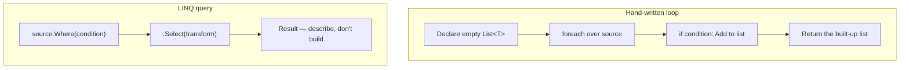

# Introduction to LINQ

## Introduction

Before reading this lesson, you should already be comfortable with **[Choosing the Right Collection — Comparison Guide](../03-collections-generics/03-22-choosing-the-right-collection.md)** — knowing which of `List<T>`, `Dictionary<TKey, TValue>`, `HashSet<T>`, `Queue<T>`, and their peers fits a given job. That entire module was about *storing* data correctly. This lesson opens Module 04, which is about something different but closely related: once your data is sitting in one of those collections, how do you *ask questions of it* — filter it, reshape it, sort it, summarize it — without writing a fresh hand-rolled loop every single time? The answer is **LINQ**, Language Integrated Query, and this lesson is your first, gentle introduction to it before the deep dives begin.

By the end of this lesson, you will be able to:

- Explain what LINQ (Language Integrated Query) is and the specific problem it was built to solve
- Identify the `System.Linq` namespace and the extension methods it adds to any `IEnumerable<T>`
- Write a first LINQ query chaining `Where` and `Select`
- Distinguish LINQ to Objects (querying in-memory collections) from other LINQ providers that share the same query surface, such as LINQ to XML and LINQ to Entities
- Recognize `IEnumerable<T>` as the common thread that makes one query pattern work across many different kinds of data sources
- Explain why LINQ replaced large amounts of hand-written filtering and shaping code in modern C#

## LINQ — A Layman's Perspective

Imagine you run research services for a large university, and the university's records are scattered across three completely different departments. The registrar keeps decades of paper transcripts in filing cabinets, organized by student ID. The library keeps its catalog in an old computer terminal with its own clunky, department-specific query language. The alumni office keeps everything in a modern searchable database. For years, if a dean wanted an answer like "show me the names of every student who graduated with honors after 2020," someone had to know three entirely different retrieval methods — one for flipping through paper folders, one for typing the terminal's cryptic command syntax, and one for writing a database query — and get three different-shaped answers back that then had to be manually reconciled.

Now imagine the university finally does something sensible: it creates a single, standardized "Request Slip" that any staff member can fill out, regardless of which department they're asking. The slip has exactly two blanks: "Only include records where ___" and "For each matching record, show me only ___." A staff member fills in the same slip whether they're asking the registrar, the library, or the alumni office, and behind the scenes, each department has agreed to accept that slip and translate it into whatever internal steps their own filing system needs — flipping through folders, running the old terminal command, or issuing a database query. The person asking the question never needs to learn three different retrieval languages ever again. They learn *one* request format, and every department knows how to honor it.

That standardized request slip — one shape, filled in the same way, that different back-end record systems each know how to fulfill in their own way — is exactly what LINQ is. Before LINQ existed in C#, filtering a `List<T>` used one style of hand-written loop, querying an XML document used an entirely different API, and querying a database used yet another API (often raw SQL strings glued together at runtime). LINQ standardizes the "request slip" — expressions like "only include items where ___" and "for each matching item, give me only ___" — into one consistent syntax that works whether the data underneath is an in-memory list, an XML document, or rows in a SQL Server table. You learn the request slip once, and it works everywhere the data can honor it.

The bridge back to programming: LINQ is a single, unified query syntax built into the C# language, and the specific "department" answering your request — objects in memory, XML, or a database — is called a **LINQ provider**. This lesson focuses on the provider you'll use constantly from here on: **LINQ to Objects**, which queries anything sitting in memory as an `IEnumerable<T>`.

## LINQ — A Programming Language Perspective

**LINQ (Language Integrated Query)** is a set of language features and library extension methods, introduced in C# 3.0 / .NET 3.5 and unchanged in its fundamental shape through C# 14 / .NET 10, that provide one uniform query syntax over many different data sources. The extension methods live in the `System.Linq` namespace, primarily in the static `Enumerable` class, and they operate on anything implementing `IEnumerable<T>` — which, thanks to Module 03, you already know includes `List<T>`, arrays, `Dictionary<TKey, TValue>`, `HashSet<T>`, and every other built-in collection type. Because these methods are *extension methods*, they attach themselves to `IEnumerable<T>` without modifying the interface itself, meaning any type you've already been using gains dozens of query operations — `Where`, `Select`, `OrderBy`, `GroupBy`, `Sum`, and many more — the moment `System.Linq` is in scope. LINQ to Objects, the provider this module focuses on, executes queries directly against in-memory sequences. Other providers — LINQ to XML (`System.Xml.Linq`) and LINQ to Entities (Entity Framework Core, Module 11) — accept the same query syntax but translate it into XML traversal or SQL respectively, behind an `IQueryable<T>` variant of the same interface family.

## How to Query a Collection with LINQ in C#

The simplest LINQ query chains two operations: `Where`, which keeps only the elements matching a condition, and `Select`, which transforms each remaining element into something else. Both are extension methods on `IEnumerable<T>`, both accept a lambda expression describing the rule, and both can be chained fluently, one after another, because `Where` returns another `IEnumerable<T>` that `Select` can immediately act on.


*Figure 1: A LINQ query is a pipeline — each stage narrows or reshapes the sequence flowing through it before the final `foreach` consumes the result.*

```csharp
// Program.cs — .NET 10 / C# 14
using System.Linq;

List<string> fruits = ["Apple", "Banana", "Cherry", "Date", "Elderberry", "Fig"];

var shortNames = fruits
    .Where(fruit => fruit.Length <= 5)
    .Select(fruit => fruit.ToUpper());

foreach (string name in shortNames)
{
    Console.WriteLine(name);
}
```

**Console Output:**

```text
APPLE
DATE
FIG
```

The explicit `using System.Linq;` is what brings the `Where` and `Select` extension methods into scope for `List<string>` — without it, the compiler wouldn't recognize `.Where(...)` as a valid method call at all (in a console project generated by the SDK templates, this using directive is typically already included via `ImplicitUsings`, but it's shown explicitly here since naming that namespace is one of this lesson's objectives). `Where` walks the list and keeps only the fruits whose name is five characters or fewer — "Apple" (5), "Date" (4), and "Fig" (3) qualify, while "Banana", "Cherry", and "Elderberry" are filtered out. `Select` then takes each surviving fruit and uppercases it. Notice that nothing here describes *how* to loop, check lengths, or build a result list step by step — you described *what* you wanted, and LINQ handled the mechanics.

## Real-Time Example: LINQ in E-Commerce Order Processing

We continue building on the E-Commerce Order Processing case study introduced across Module 03, where a `Product` catalog was stored in a `Dictionary<string, Product>` for fast SKU lookup. Here, the marketing team needs a different kind of question answered: "which in-stock products under $50 qualify for today's flash sale, and what would their 20%-off price be?" This is exactly the shape of question LINQ was built for — filter the catalog down to the qualifying products, then project each one into the exact shape the flash-sale banner needs.

```csharp
// Program.cs — .NET 10 / C# 14 — Real-Time Example
using System.Linq;

List<Product> catalog =
[
    new("SKU-100", "Wireless Mouse", 24.99m, InStock: true),
    new("SKU-200", "Mechanical Keyboard", 89.99m, InStock: true),
    new("SKU-300", "USB-C Hub", 34.50m, InStock: false),
    new("SKU-400", "Webcam 1080p", 42.00m, InStock: true),
    new("SKU-500", "Laptop Stand", 19.99m, InStock: true),
];

var flashSaleCandidates = catalog
    .Where(p => p.InStock && p.Price < 50m)
    .Select(p => new { p.Sku, p.Name, DiscountedPrice = p.Price * 0.8m });

Console.WriteLine("Flash Sale Candidates (in stock, under $50, 20% off):");
foreach (var item in flashSaleCandidates)
{
    Console.WriteLine($"  {item.Sku} — {item.Name}: {item.DiscountedPrice:C}");
}

record Product(string Sku, string Name, decimal Price, bool InStock);
```

**Console Output:**

```text
Flash Sale Candidates (in stock, under $50, 20% off):
  SKU-100 — Wireless Mouse: $19.99
  SKU-400 — Webcam 1080p: $33.60
  SKU-500 — Laptop Stand: $15.99
```

The `Where` clause does two jobs in one line — checking `InStock` and checking `Price < 50m` — which is why `SKU-300` (out of stock) and `SKU-200` (over the price ceiling) are silently excluded from the result, with no `if` statement or manual list-building anywhere in sight. The `Select` clause then projects each surviving `Product` into an anonymous type carrying only the three fields the flash-sale banner actually needs, computing `DiscountedPrice` inline rather than storing it on `Product` itself. In a real storefront, this same query — unchanged — would just as easily run against a catalog of fifty thousand products instead of five, because nothing about `Where` or `Select` depends on knowing the collection's size in advance.

## LINQ Queries vs Hand-Written Loops

Before LINQ, the flash-sale query above would have been written as an explicit loop: declare an empty `List<T>`, iterate the catalog, check the conditions with an `if`, and manually `Add` a new object to the result list. That approach still works today and is sometimes still the right call — but it scales poorly in readability as more filtering and shaping steps stack up, because every additional step means another nested `if` or another line mutating the accumulator list. LINQ instead expresses each step as its own link in a fluent chain, so adding a new step means adding a new method call, not restructuring the loop body.


*Figure 2: A hand-written loop describes each step of construction; a LINQ query describes only the end shape you want.*

| Aspect | Hand-Written Loop | LINQ Query |
|---|---|---|
| Style | Imperative — spells out *how*, step by step | Declarative — states *what* result you want |
| Composability | Extra filters/transforms mean more nested `if`s | Extra steps are just another chained method call |
| Readability at scale | Degrades as logic stacks up inside one loop body | Stays flat and linear as steps are added |
| Result construction | You declare and manually populate the result list | LINQ builds the resulting sequence for you |
| Portability across sources | Tied to whatever loop construct you hand-wrote | Same syntax works over lists, arrays, XML, EF Core, etc. |

## Types of LINQ Providers and Concepts in C#

LINQ is one query surface with several distinct "back ends" and building blocks — this module works through each one:

1. **[LINQ Method Syntax vs Query Syntax](../04-linq/04-02-method-syntax-vs-query-syntax.md)** — the two interchangeable ways to write the same query, fluent-chain style versus SQL-like style.
2. **[Deferred Execution vs Immediate Execution](../04-linq/04-03-deferred-vs-immediate-execution.md)** — when a LINQ query actually runs, and why it matters.
3. **[Filtering with Where](../04-linq/04-04-filtering-with-where.md)** — a closer look at the operator that started this lesson's example.
4. **[Projection with Select](../04-linq/04-05-projection-with-select.md)** — reshaping each element into a new form, including anonymous types and DTOs.
5. **LINQ to XML (`System.Xml.Linq`)** — the same query surface applied to XML documents instead of in-memory collections.
6. **LINQ to Entities (Entity Framework Core)** — the same query surface translated into SQL against a database, covered in Module 11.

## What You've Learned & What's Next

LINQ gives C# one consistent query vocabulary — `Where` to filter, `Select` to project, and many more operators beyond them — that works the same way whether your data lives in a `List<T>`, an XML document, or a database table, because every LINQ provider agrees to honor the same request shape. The `System.Linq` namespace is what puts that vocabulary onto every `IEnumerable<T>` you already know how to build.

Continue your learning journey with **[LINQ Method Syntax vs Query Syntax](../04-linq/04-02-method-syntax-vs-query-syntax.md)**, where we look at the two different ways to write the exact same LINQ query — the fluent `.Where().Select()` chain used above, and a SQL-like `from ... where ... select` form — and when each one reads better.

---
*Applies to: .NET 10 / C# 14. Last reviewed 2026-08-16.*
