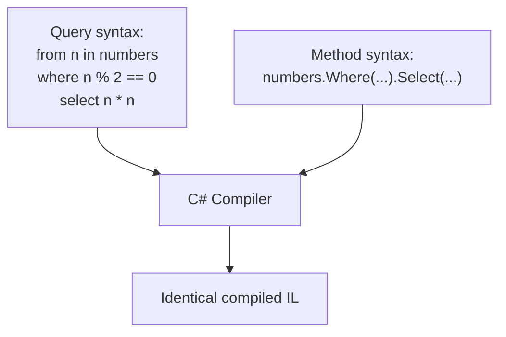
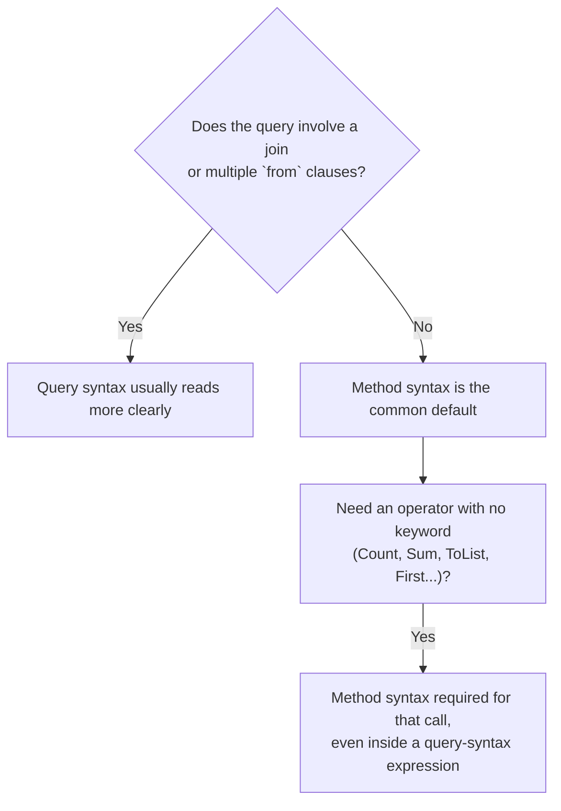

# LINQ Method Syntax vs Query Syntax

## Introduction

Before reading this lesson, you should already be comfortable with **[Introduction to LINQ](../04-linq/04-01-introduction-to-linq.md)** — what LINQ is, the `System.Linq` namespace, and a first `.Where().Select()` chain. That chain you just wrote is called **method syntax**. There's a second, entirely equivalent way to write the exact same query, called **query syntax**, that reads more like a SQL statement than a chain of method calls. This lesson puts both side by side so you can read either style fluently and choose the right one deliberately, rather than by habit.

By the end of this lesson, you will be able to:

- Write the same LINQ query in both method syntax and query syntax
- Explain that both syntaxes compile down to the identical sequence of method calls
- Recognize the SQL-like keywords query syntax supports: `from`, `where`, `select`, `orderby`, `join`, `group by`, and `let`
- Identify the specific situation where query syntax reads more clearly than method syntax: joins and multiple `from` clauses
- Convert confidently between the two syntaxes in either direction
- Recognize which LINQ operators have no query-syntax keyword and must be called as methods, even inside an otherwise query-syntax expression

## Method Syntax vs Query Syntax — A Layman's Perspective

Imagine two employees at a busy records office, both trained to fetch the same information from the same filing system, but each taught a different way of phrasing a request to the head clerk. The first employee was trained to bark short, rapid-fire commands: "Pull the ledger. Keep only entries over five hundred dollars. Now hand me just the totals." Each instruction is a separate, terse step, and the clerk executes them one after another, passing the narrowing result from each step into the next. The second employee was trained to phrase the exact same request as one flowing sentence, the way you'd write a formal request on a form: "From the ledger, where the amount exceeds five hundred dollars, give me the totals." Both employees get back the identical stack of totals. The clerk doesn't care which phrasing arrived at the counter — internally, the clerk performs the exact same steps either way, because both phrasings describe the identical underlying request.

Most days, either phrasing works fine, and which one an employee reaches for is mostly a matter of personal habit. But there's one situation where the difference in phrasing really starts to matter: when the request involves combining records from *two different filing cabinets* that need to be matched up by a shared reference number. Phrased as rapid-fire commands, this gets clunky fast: "Pull cabinet A. Pull cabinet B. For each item in cabinet A, find the item in cabinet B whose ID matches. Combine them. Now hand me just the combined names." That's a lot of short commands to hold in your head in sequence, and it's easy to lose track of which cabinet is which by the third instruction. Phrased as one flowing sentence instead, it reads far more naturally: "From cabinet A, matched against cabinet B where the ID numbers agree, give me the combined names." Naming both cabinets up front, and describing how they relate to each other in one breath, is simply easier for a human reader to follow than a list of terse, disconnected commands.

That's the exact trade-off between LINQ's two syntaxes. **Method syntax** is the rapid-fire command style — a chain of individual method calls, each one narrowing or reshaping the result of the one before it. **Query syntax** is the flowing-sentence style — a single expression, read almost like a sentence, that names your data sources and describes their relationship before narrowing down to what you want. Neither is "the real one" underneath; they're two phrasings of the identical request, and the C# compiler — playing the part of the head clerk — turns both into exactly the same set of steps before your program ever runs.

## Method Syntax vs Query Syntax — A Programming Language Perspective

**Method syntax** calls LINQ's extension methods — `Where`, `Select`, `OrderBy`, `Join`, and the rest — directly, chaining each call onto the `IEnumerable<T>` (or `IQueryable<T>`) returned by the one before it. **Query syntax** is C# compiler syntax sugar: a `from`/`where`/`select` expression that the compiler translates, at compile time, into the identical chain of method calls before any further compilation happens — there is no separate "query engine" involved, and the two forms produce identical IL. Query syntax supports only a fixed subset of LINQ operators as keywords: `from`, `where`, `select`, `orderby` (with optional `descending`), `join ... on ... equals ...`, `group ... by ...`, and `let` (for naming an intermediate value). Operators without a keyword form — `Count()`, `Sum()`, `First()`, `ToList()`, and many others — have no query-syntax equivalent and must be invoked as a method call, often by wrapping a query-syntax expression in parentheses and calling the method on the result. This split has been stable in C# since version 3.0 and remains exactly this shape in C# 14.

## How to Write the Same Query Both Ways in C#

Because query syntax is translated into method syntax before compilation proceeds, any query you can write one way, you can write the other way too — the two are always interchangeable for the operators query syntax supports.


*Figure 1: Query syntax is translated by the compiler into the same method calls you'd write by hand — both paths end at the same compiled code.*

```csharp
// Program.cs — .NET 10 / C# 14
using System.Linq;

int[] numbers = [1, 2, 3, 4, 5, 6, 7, 8, 9, 10];

var methodSyntaxResult = numbers
    .Where(n => n % 2 == 0)
    .Select(n => n * n);

var querySyntaxResult =
    from n in numbers
    where n % 2 == 0
    select n * n;

Console.WriteLine("Method syntax: " + string.Join(", ", methodSyntaxResult));
Console.WriteLine("Query syntax:  " + string.Join(", ", querySyntaxResult));
```

**Console Output:**

```text
Method syntax: 4, 16, 36, 64, 100
Query syntax:  4, 16, 36, 64, 100
```

Both queries keep only the even numbers from `numbers` (2, 4, 6, 8, 10) and square each one, producing the identical five results in the identical order. `methodSyntaxResult` reads as a chain: start with `numbers`, filter, then project. `querySyntaxResult` reads as a sentence: from each `n` in `numbers`, where `n` is even, select `n * n`. Neither version is faster or "more correct" than the other — the compiler erases the difference entirely before your program runs.

## Real-Time Example: Method Syntax vs Query Syntax in Library/Inventory Management

We introduce the Library/Inventory Management case study with two related types: `Author` and `Book`, where each `Book` references its author only by `AuthorId` — a common shape for data that will later come from a real database. Producing a readable catalog line like "Kafka on the Shore by Haruki Murakami" requires **joining** the two sequences on that shared ID, which is exactly the scenario where query syntax's `join` clause reads far more clearly than the method-syntax `Join` call it compiles down to.

```csharp
// Program.cs — .NET 10 / C# 14 — Real-Time Example
using System.Linq;

List<Author> authors =
[
    new(1, "Haruki Murakami"),
    new(2, "Agatha Christie"),
    new(3, "Isaac Asimov"),
];

List<Book> books =
[
    new("978-0-1", "Norwegian Wood", 1),
    new("978-0-2", "Murder on the Orient Express", 2),
    new("978-0-3", "Foundation", 3),
    new("978-0-4", "Kafka on the Shore", 1),
];

var catalog =
    from book in books
    join author in authors on book.AuthorId equals author.AuthorId
    orderby author.Name, book.Title
    select $"{book.Title} by {author.Name}";

Console.WriteLine("Library Catalog (sorted by author, then title):");
foreach (string entry in catalog)
{
    Console.WriteLine($"  {entry}");
}

record Author(int AuthorId, string Name);
record Book(string Isbn, string Title, int AuthorId);
```

**Console Output:**

```text
Library Catalog (sorted by author, then title):
  Murder on the Orient Express by Agatha Christie
  Kafka on the Shore by Haruki Murakami
  Norwegian Wood by Haruki Murakami
  Foundation by Isaac Asimov
```

The equivalent method syntax would be `books.Join(authors, book => book.AuthorId, author => author.AuthorId, (book, author) => new { book.Title, author.Name }).OrderBy(x => x.Name).ThenBy(x => x.Title).Select(...)` — correct, but four separate lambda parameters (two key selectors, one result selector, plus the sort keys) that a reader has to mentally reassemble to see how `book` and `author` actually relate. The query-syntax version states that relationship once, in place, with `on book.AuthorId equals author.AuthorId`, which is precisely why library and inventory systems — full of exactly this kind of "match records across two related tables" logic — tend to read more naturally in query syntax than in method syntax.

## Method Syntax vs Query Syntax — Choosing Between Them

Outside of joins and queries with multiple `from` clauses, most C# codebases lean toward method syntax by default, simply because it composes more uniformly — every LINQ operator, including the ones with no query-syntax keyword at all, is available as a method call, so a codebase written in method syntax never has to switch styles mid-query. Query syntax earns its keep specifically when a query's structure — matching two sequences, or iterating a sequence of sequences — mirrors the shape of a SQL statement closely enough that the SQL-like reading genuinely clarifies intent.


*Figure 2: Query syntax and method syntax aren't rivals — most real code mixes them, defaulting to method syntax except where a join or multiple `from` clauses make query syntax read more naturally.*

| Aspect | Method Syntax | Query Syntax |
|---|---|---|
| Form | Fluent chain of extension method calls | SQL-like `from` / `where` / `select` expression |
| Compiles to | The actual method calls executed at runtime | Translated by the compiler into the identical method calls |
| Operator coverage | Every LINQ operator has a method form | Only `from`, `where`, `select`, `orderby`, `join`, `group by`, `let` have keywords |
| Reads best for | Most everyday filters, projections, and aggregates | Joins and queries with multiple `from` clauses |
| Mixing the two | N/A | Common — wrap a query-syntax expression in parentheses, then call a method-only operator like `.Count()` on it |

## Types of Query Syntax Clauses in C#

Query syntax supports a fixed set of SQL-like keyword clauses, each with a method-syntax equivalent covered elsewhere in this module or curriculum:

1. **`where`** — filters a sequence down to matching elements; covered in depth in [Filtering with Where](../04-linq/04-04-filtering-with-where.md).
2. **`select`** — projects each element into a new shape; covered in depth in [Projection with Select](../04-linq/04-05-projection-with-select.md).
3. **`orderby`** (optionally `orderby ... descending`) — sorts a sequence, equivalent to method syntax's `OrderBy`/`OrderByDescending`.
4. **`join ... on ... equals ...`** — combines two sequences by matching keys, as shown in this lesson's Real-Time Example.
5. **`group ... by ...`** — buckets elements into groups sharing a key, equivalent to method syntax's `GroupBy`.
6. **`let`** — introduces a named intermediate value inside a query expression, useful for reusing a computed value across a later `where` or `select` without recomputing it.

## What You've Learned & What's Next

Method syntax and query syntax are two readings of the identical LINQ query — the compiler erases the difference before your program runs, so choosing between them is purely a matter of which one communicates intent more clearly for the query at hand. Reach for query syntax when a `join` or multiple `from` clauses make the SQL-like phrasing genuinely clearer, as it did for the library catalog above, and default to method syntax everywhere else.

Continue your learning journey with **[Deferred Execution vs Immediate Execution](../04-linq/04-03-deferred-vs-immediate-execution.md)**, where we look at exactly *when* a LINQ query — written in either syntax — actually runs.

---
*Applies to: .NET 10 / C# 14. Last reviewed 2026-08-16.*
