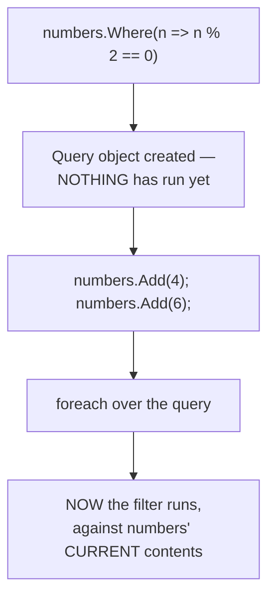
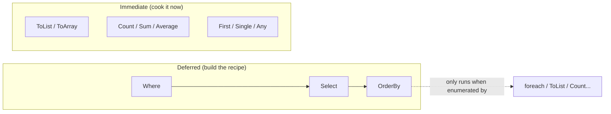

# Deferred Execution vs Immediate Execution

## Introduction

Before reading this lesson, you should already be comfortable with **[LINQ Method Syntax vs Query Syntax](../04-linq/04-02-method-syntax-vs-query-syntax.md)** — both ways of writing a LINQ query. Both lessons so far have quietly relied on an assumption worth questioning directly: when you write `numbers.Where(n => n % 2 == 0)`, does that line of code actually filter the numbers right then and there? The answer is no — and understanding exactly when a LINQ query really runs is the single most important mental model for avoiding a whole category of confusing bugs.

By the end of this lesson, you will be able to:

- Explain what deferred execution means for a LINQ query
- Identify which LINQ operators force immediate execution, such as `ToList()`, `Count()`, and `First()`
- Predict when a deferred query will re-evaluate its source data
- Reproduce and explain the classic "Collection was modified" bug that deferred execution causes
- Decide when to force immediate execution deliberately, such as snapshotting data before it changes
- Trace a query variable to determine whether it holds a query definition or an already-materialized result

## Deferred Execution — A Layman's Perspective

Imagine you leave a note for the evening chef at a restaurant: "Tonight, use whichever vegetables are freshest in the walk-in fridge." That note is not dinner. It's an instruction — a recipe — that doesn't produce anything by itself. Nothing gets cooked the moment you write it. The note only turns into an actual plate of food later, at the moment the chef actually starts cooking, and whatever vegetables happen to be in the fridge *at that later moment* are the ones that end up on the plate — not whatever happened to be in the fridge when you wrote the note. If a supplier restocks the fridge with different vegetables between the time you wrote the note and the time the chef finally cooks, dinner reflects the new delivery, because the instruction says "whichever is freshest when you cook," not "whichever was there when I wrote this."

Contrast that with a different kind of order: you ask the chef to cook something *right now*, plate it, and hand it to you immediately. That meal is locked in the instant it's plated. Nothing that happens to the fridge afterward — a new delivery, spoiled produce, anything — changes what's already on your plate. It stopped depending on the fridge the moment it was cooked.

A LINQ query built from operators like `Where` and `Select` behaves exactly like that note left for the chef — it's a *recipe*, not a *meal*. Writing `var evenNumbers = numbers.Where(n => n % 2 == 0);` doesn't examine `numbers` at all in that moment; it just writes down the instruction "when someone asks, filter whatever `numbers` looks like at that time." The actual filtering only happens later, the moment something forces the recipe to be "cooked" — typically a `foreach` loop, or a call like `.ToList()`. And just like the chef's dinner, if the underlying list changes between when you wrote the LINQ query and when you finally enumerate it, the query reflects the list's *current* contents at enumeration time, not its contents back when the query was first written.

This is where the classic bug comes from, too. Imagine the chef starts cooking with tonight's fridge contents, and halfway through, someone runs into the kitchen and starts rearranging the same fridge shelves the chef is actively pulling ingredients from. The chef, understandably, can't guarantee a coherent result anymore and stops, confused, mid-recipe. That's exactly what happens when code enumerates a deferred LINQ query with a `foreach` loop and, inside that same loop, modifies the very list the query is reading from — .NET's collections detect the mid-enumeration change and refuse to continue, rather than silently producing a corrupted or unpredictable result.

The bridge back to programming: a LINQ query built from operators like `Where`, `Select`, and `OrderBy` is a *definition* of work to be done, not the result of that work — the work only happens, against whatever the data looks like *at that moment*, when something actually enumerates the query.

## Deferred Execution — A Programming Language Perspective

**Deferred execution** means a LINQ query built from operators such as `Where`, `Select`, `OrderBy`, `GroupBy`, and `Join` does not touch its source sequence at the point it's written — it instead builds up a chain of enumerator logic that only runs when something calls `GetEnumerator()` on it, which happens implicitly via `foreach` or explicitly via another enumeration. Crucially, each separate enumeration re-runs the entire pipeline against whatever the source sequence currently contains at that moment, which is why the same deferred query variable can produce different results on two successive `foreach` loops if the source changed in between. **Immediate execution**, by contrast, refers to LINQ operators that walk the entire pipeline right away and return a concrete, already-computed value or collection, fully decoupled from any later changes to the source: `ToList()`, `ToArray()`, `ToDictionary()`, `ToHashSet()`, `Count()`, `Sum()`, `Average()`, `Min()`, `Max()`, `First()`, `Single()`, `Any()`, and `All()` all force immediate execution. This split has existed since LINQ's introduction in C# 3.0 / .NET 3.5 and is unchanged in C# 14 / .NET 10.

## How Deferred Execution Actually Runs in C#

The clearest way to see deferred execution is to define a query, mutate the source afterward, and only then enumerate the query — the result reflects the mutation, proving the filtering hadn't happened yet when the query was defined.


*Figure 1: A deferred query only reads its source at enumeration time — any changes made between the query's definition and its enumeration are included.*

```csharp
// Program.cs — .NET 10 / C# 14
using System.Linq;

List<int> numbers = [1, 2, 3];

var evenNumbers = numbers.Where(n => n % 2 == 0);   // query defined, not yet run

Console.WriteLine("Query created — nothing has run yet.");

numbers.Add(4);
numbers.Add(6);

Console.WriteLine("Enumerating now:");
foreach (int n in evenNumbers)
{
    Console.WriteLine($"  {n}");
}
```

**Console Output:**

```text
Query created — nothing has run yet.
Enumerating now:
  2
  4
  6
```

Notice that `4` and `6` appear in the result even though they were added to `numbers` *after* `evenNumbers` was defined. If `Where` had run immediately at the point it was written, the result would have been just `2` — the only even number present in `numbers` at that moment. Instead, `evenNumbers` held nothing more than an unexecuted recipe until the `foreach` loop enumerated it, at which point the filter ran against `numbers`' contents as they stood *right then* — three original values plus the two just added.

## Real-Time Example: Deferred Execution in Banking/ATM Transaction Processing

We introduce the Banking/ATM case study with a batch job that processes an ATM's queued `WithdrawalRequest` objects. A naive first attempt defines a deferred query over the pending requests and then tries to remove each one from that same list, inside the very loop that's enumerating it — exactly the "chef whose fridge gets rearranged mid-recipe" scenario from the analogy above, and exactly the bug deferred execution explains.

```csharp
// Program.cs — .NET 10 / C# 14 — Real-Time Example
using System.Linq;

List<WithdrawalRequest> requestQueue =
[
    new("ATM-001", 200m, "Pending"),
    new("ATM-002", 500m, "Pending"),
    new("ATM-003", 100m, "Pending"),
];

var pendingWithdrawals = requestQueue.Where(r => r.Status == "Pending");

Console.WriteLine("Attempting to process withdrawals while modifying the same list:");
try
{
    foreach (WithdrawalRequest request in pendingWithdrawals)
    {
        Console.WriteLine($"  Processing {request.AtmId}: {request.Amount:C}");
        requestQueue.Remove(request); // modifies the very list the query is enumerating
    }
}
catch (InvalidOperationException ex)
{
    Console.WriteLine($"  Failed: {ex.Message}");
}

Console.WriteLine();
Console.WriteLine("Retrying safely with a snapshot (ToList) first:");

List<WithdrawalRequest> snapshot = requestQueue.Where(r => r.Status == "Pending").ToList();
foreach (WithdrawalRequest request in snapshot)
{
    Console.WriteLine($"  Processing {request.AtmId}: {request.Amount:C}");
    requestQueue.Remove(request); // safe — snapshot is an independent List<T>, not the live query
}

Console.WriteLine($"Remaining requests in queue: {requestQueue.Count}");

record WithdrawalRequest(string AtmId, decimal Amount, string Status);
```

**Console Output:**

```text
Attempting to process withdrawals while modifying the same list:
  Processing ATM-001: $200.00
  Failed: Collection was modified; enumeration operation may not execute.

Retrying safely with a snapshot (ToList) first:
  Processing ATM-002: $500.00
  Processing ATM-003: $100.00
Remaining requests in queue: 0
```

The first attempt processes `ATM-001` successfully, but the moment `requestQueue.Remove(request)` structurally changes the list, the *next* attempt to advance the still-active `foreach` over `pendingWithdrawals` detects the change and throws — the deferred query was mid-enumeration against a list that just moved underneath it. The fix is `.ToList()`: calling it forces immediate execution right there, copying the currently-matching requests into an independent `List<WithdrawalRequest>` that has no further connection to `requestQueue`. Removing items from `requestQueue` while looping over that separate `snapshot` is now completely safe. This exact pattern — snapshot before you mutate the source you looped over — is what every production batch job touching a live, mutable collection needs to get right.

## Deferred Execution vs Immediate Execution

The core question to ask about any LINQ expression is: does this line of code *do the work now*, or does it just *describe work to be done later*? Operators like `Where`, `Select`, `OrderBy`, `GroupBy`, and `Join` all describe work — they're deferred. Operators like `ToList()`, `Count()`, `Sum()`, and `First()` all do the work immediately and hand back a finished, disconnected result.


*Figure 2: Deferred operators only assemble a pipeline; immediate operators walk that pipeline right away and hand back a finished value.*

| Aspect | Deferred Execution | Immediate Execution |
|---|---|---|
| When the query runs | Only when enumerated (`foreach`, `ToList`, etc.) | Immediately, at the point the method is called |
| Example operators | `Where`, `Select`, `OrderBy`, `GroupBy`, `Join` | `ToList`, `ToArray`, `Count`, `Sum`, `First`, `Any` |
| Reflects later source changes | Yes — re-evaluates against the current source every time it's enumerated | No — the result is a fixed snapshot taken at call time |
| Risk | "Collection was modified" if the source mutates mid-enumeration | None from that specific risk — already materialized |
| Typical use case | Composing a multi-step pipeline before deciding whether/when to run it | Locking in a stable snapshot to safely mutate the source afterward, or getting one scalar answer |

## Types of Operators by Execution Timing in C#

Recognizing which category an operator falls into is a habit worth building for every LINQ method you learn from here on:

1. **`ToList()` / `ToArray()`** — materializes a deferred query into a concrete, independent collection, exactly as used to fix the bug above.
2. **`ToDictionary()` / `ToHashSet()`** — also forces immediate execution, materializing into a keyed or uniqueness-checked collection.
3. **`Count()` / `Sum()` / `Average()` / `Min()` / `Max()`** — immediately walks the full pipeline to produce a single scalar value.
4. **`First()` / `FirstOrDefault()` / `Single()` / `Any()` / `All()`** — immediately execute just enough of the pipeline to answer the question, then stop.
5. **[Filtering with Where](../04-linq/04-04-filtering-with-where.md)** — a deferred operator, and the very next lesson's topic.
6. **[Projection with Select](../04-linq/04-05-projection-with-select.md)** — also deferred; nothing runs until the projected result is enumerated.

## What You've Learned & What's Next

A LINQ query built from `Where`, `Select`, `OrderBy`, and similar operators is a description of work, not the work itself — it only runs when something enumerates it, and it always runs against the source's contents *at that moment*, which is exactly why modifying a list while a deferred query over that same list is still being enumerated throws `InvalidOperationException`. Calling `ToList()` (or another immediate operator) is how you deliberately lock in a stable snapshot before making changes.

Continue your learning journey with **[Filtering with Where](../04-linq/04-04-filtering-with-where.md)**, where we take a closer, more detailed look at the deferred operator this lesson leaned on throughout — including chaining multiple `Where` calls and its index-aware overload.

---
*Applies to: .NET 10 / C# 14. Last reviewed 2026-08-16.*
