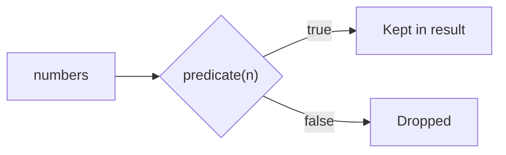
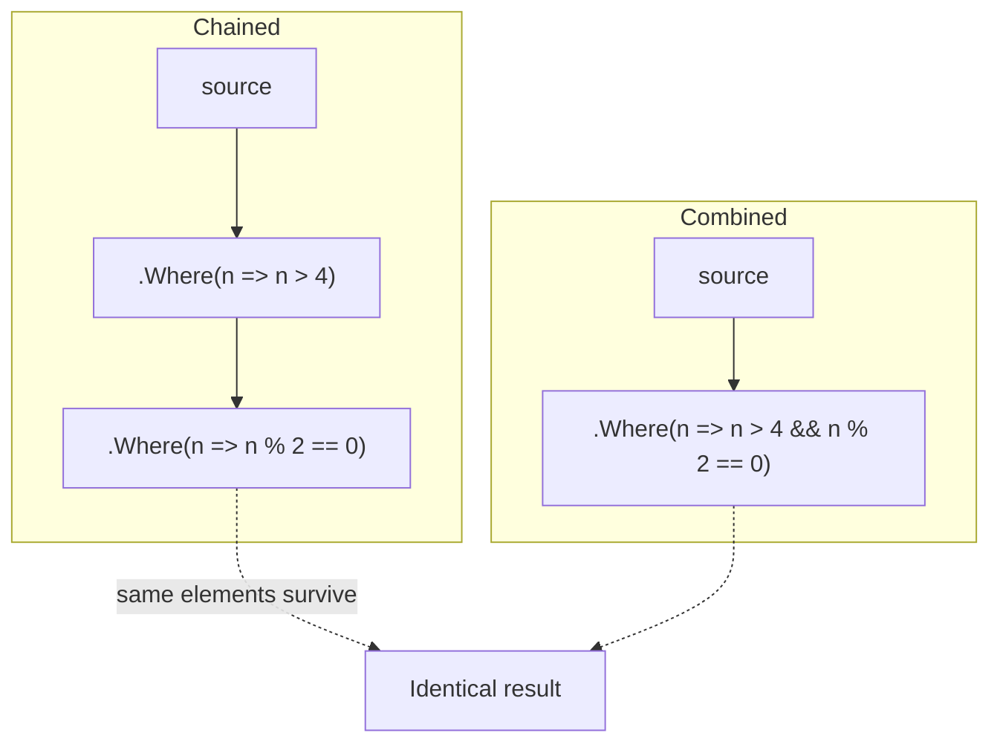

# Filtering with Where

## Introduction

Before reading this lesson, you should already be comfortable with **[Deferred Execution vs Immediate Execution](../04-linq/04-03-deferred-vs-immediate-execution.md)** — the fact that a LINQ query like `Where` doesn't run until it's enumerated, and always runs against the source's current contents at that moment. This lesson zooms into `Where` itself: the single most-used LINQ operator, and the one every earlier lesson has already leaned on without fully explaining.

By the end of this lesson, you will be able to:

- Explain how `Where`'s predicate delegate decides which elements survive and which are dropped
- Write a `Where` clause using a lambda expression that returns `true`/`false`
- Compare chaining multiple `Where` calls against combining conditions with `&&` in a single `Where`
- Use `Where`'s index-aware overload, `Where((x, i) => ...)`, to filter based on an element's position
- Explain why `Where` returns its result lazily, tying back to deferred execution
- Recognize common pitfalls in a `Where` predicate, such as an overly complex condition or a hidden null-reference risk

## Filtering with Where — A Layman's Perspective

Imagine an airport security checkpoint. Every passenger walks up to a guard who applies one simple yes/no rule: "Are you carrying liquids over 100 milliliters?" Passengers who answer "no" continue on toward the gate; passengers who answer "yes" get pulled aside and don't proceed. The guard doesn't make judgment calls or weigh options — they apply one clear test to every single passenger, one at a time, and only those who pass the test keep moving forward. That's the entire job: apply the rule, keep the ones who pass, drop the rest.

Now, some airports combine several rules into one longer checklist a single guard runs through for each passenger: "No liquids over 100ml, AND no metal objects, AND your boarding pass matches your ID." One guard, one stop, one combined judgment — a passenger either clears the whole checklist or doesn't. Other airports instead set up a sequence of separate checkpoints, each enforcing just one rule: a metal detector first, then a liquids check further down the corridor, then an ID check at the gate. A passenger has to clear every checkpoint in sequence to reach the plane, but at any given checkpoint, the guard there is only thinking about their one rule. Both airport designs end up admitting the exact same set of passengers onto the plane — the difference is purely about how the rules are organized, not about who gets through.

Some airports add one more kind of rule, less common but worth knowing: a mandatory random search of, say, every fifth passenger in line, regardless of what they're carrying. That rule isn't about any property of the passenger at all — it's about their *position* in the queue. The guard doesn't ask "what are you carrying," they ask "what number are you in line right now."

That's `Where` in a nutshell. Most of the time, `Where`'s rule looks at a *property of the item itself* — does this order's total exceed $100, is this product in stock, is this customer's account active — exactly like the liquids checkpoint asking about the passenger's bag. You can write that rule as one combined checklist in a single `Where` call, or as several separate `Where` checkpoints in a row that an item has to clear one after another — both produce the identical set of survivors. And occasionally, the rule you need is about *position* rather than content — flag every fifth item, or the first three, or every other one — which is exactly what `Where`'s lesser-known, index-aware overload exists for.

The bridge back to programming: `Where` is a checkpoint that applies one rule (a lambda that returns `true` or `false`) to every element of a sequence, keeping only the ones that pass — and you can build that rule as a single combined condition, several chained checkpoints, or a rule based on an item's position rather than its content.

## Filtering with Where — A Programming Language Perspective

`Where` is a deferred `System.Linq.Enumerable` extension method on `IEnumerable<T>` with two overloads. The common form, `Where(Func<TSource, bool> predicate)`, accepts a predicate delegate invoked once per element; elements for which the predicate returns `true` are yielded into the result sequence, and elements for which it returns `false` are silently dropped. The second, index-aware overload, `Where(Func<TSource, int, bool> predicate)`, invokes a predicate that additionally receives the zero-based position of the current element within the sequence being enumerated, allowing filtering rules based on position rather than (or in addition to) the element's own value. Because `Where`'s predicate is a plain delegate, any C# boolean expression is valid inside it, including combined conditions using `&&`, `||`, and `!`, and — per the previous lesson — `Where` itself does not execute until the resulting sequence is enumerated.

## How to Filter a Sequence with Where in C#

`Where` can express a compound condition in two equivalent ways: as a single predicate combining conditions with `&&`, or as several `Where` calls chained one after another, where each element must pass every call in the chain to survive. `Where` also has a second overload accepting an element's index, useful for position-based rules that have nothing to do with the element's value.


*Figure 1: `Where` applies its predicate to every element in turn, keeping only the ones that return `true`.*

```csharp
// Program.cs — .NET 10 / C# 14
using System.Linq;

List<int> numbers = [1, 2, 3, 4, 5, 6, 7, 8, 9, 10, 11, 12];

// Two ways to express "even AND greater than 4" — identical results.
var chained = numbers.Where(n => n > 4).Where(n => n % 2 == 0);
var combined = numbers.Where(n => n > 4 && n % 2 == 0);

Console.WriteLine("Chained Where calls:  " + string.Join(", ", chained));
Console.WriteLine("Combined condition:   " + string.Join(", ", combined));

// Index-aware overload: keep every element at an even position (0, 2, 4, ...).
var everyOther = numbers.Where((n, index) => index % 2 == 0);
Console.WriteLine("Every other element:  " + string.Join(", ", everyOther));
```

**Console Output:**

```text
Chained Where calls:  6, 8, 10, 12
Combined condition:   6, 8, 10, 12
Every other element:  1, 3, 5, 7, 9, 11
```

`chained` and `combined` produce the identical result, `6, 8, 10, 12` — every value greater than 4 *and* even, whether that rule is expressed as two sequential `Where` checkpoints or one combined `&&` predicate. `everyOther` demonstrates the index-aware overload: it doesn't inspect each number's value at all, only its zero-based position, keeping the elements at positions 0, 2, 4, 6, 8, and 10 — which are the values `1, 3, 5, 7, 9, 11` in this particular list, purely because of where they sit, not what they equal.

## Real-Time Example: Filtering with Where in E-Commerce Order Processing

We continue building on the E-Commerce Order Processing case study, this time with an `Order` record carrying a `Status`. Finance needs two genuinely different filters over the same `orders` list: orders still awaiting shipment worth more than $100, which need expedited review, and — as part of an unrelated fraud spot-check — every fourth order overall, regardless of its status or total, flagged for random manual audit.

```csharp
// Program.cs — .NET 10 / C# 14 — Real-Time Example
using System.Linq;

List<Order> orders =
[
    new("ORD-9001", "Priya Nair",   145.00m, "Placed"),
    new("ORD-9002", "Wei Chen",      42.50m, "Shipped"),
    new("ORD-9003", "Lucas Silva",  210.00m, "Placed"),
    new("ORD-9004", "Amara Obi",     89.99m, "Cancelled"),
    new("ORD-9005", "Priya Nair",   310.00m, "Placed"),
    new("ORD-9006", "Wei Chen",     125.00m, "Delivered"),
    new("ORD-9007", "Lucas Silva",   75.00m, "Shipped"),
    new("ORD-9008", "Amara Obi",    260.00m, "Placed"),
];

// Need 1: orders still awaiting shipment, over $100 — needs expedited review.
var needsExpediting = orders.Where(o => o.Status == "Placed" && o.Total > 100m);

Console.WriteLine("Orders needing expedited review:");
foreach (Order order in needsExpediting)
{
    Console.WriteLine($"  {order.OrderId} — {order.CustomerName}: {order.Total:C}");
}

// Need 2: fraud spot-check — flag every 4th order overall (index-aware), regardless of status.
var spotCheckFlagged = orders.Where((order, index) => index % 4 == 0);

Console.WriteLine();
Console.WriteLine("Orders flagged for random fraud spot-check:");
foreach (Order order in spotCheckFlagged)
{
    Console.WriteLine($"  {order.OrderId} — {order.CustomerName} ({order.Status})");
}

record Order(string OrderId, string CustomerName, decimal Total, string Status);
```

**Console Output:**

```text
Orders needing expedited review:
  ORD-9001 — Priya Nair: $145.00
  ORD-9003 — Lucas Silva: $210.00
  ORD-9005 — Priya Nair: $310.00
  ORD-9008 — Amara Obi: $260.00

Orders flagged for random fraud spot-check:
  ORD-9001 — Priya Nair (Placed)
  ORD-9005 — Priya Nair (Placed)
```

The expedited-review filter combines two conditions on the order's own data — `Status == "Placed"` and `Total > 100m` — correctly excluding `ORD-9004` (cancelled) and `ORD-9006` (already delivered) even though both exceed $100, because neither is still `"Placed"`. The fraud spot-check filter, by contrast, never looks at `Status` or `Total` at all — it only asks "is this order's position in the list a multiple of 4," which is exactly why `ORD-9001` (index 0) and `ORD-9005` (index 4) are flagged while orders with identical or higher totals sitting at other positions are not. Two genuinely different filtering needs, solved with the same operator, because `Where` cleanly separates "what rule applies" from "what data the rule looks at."

## Chaining Multiple Where Calls vs a Single Combined Condition

Both forms are functionally identical for a fixed set of conditions — the choice comes down to readability and flexibility rather than correctness. A single combined predicate reads well when the conditions are closely related and unlikely to change independently, as with the expedited-review filter above. Chaining separate `Where` calls tends to read better when conditions are conceptually distinct, or when a filter needs to be built up conditionally — for example, appending an extra `.Where(...)` only if a search box's "in stock only" checkbox is ticked, without restructuring an existing combined predicate.


*Figure 2: Chained `Where` calls and one combined condition can produce the identical surviving set — the choice is about readability and flexibility, not correctness.*

| Aspect | Chained `.Where().Where()` | Combined `Where(a && b)` |
|---|---|---|
| Predicate delegates | One per chained call | A single delegate evaluating both conditions |
| Readability | Each condition isolated on its own line — good when conditions are conceptually unrelated | Compact — good when the conditions are closely related and fixed |
| Building filters dynamically | Easy — append another `.Where(...)` only when a condition applies | Requires restructuring the existing predicate |
| Per-element overhead | Slightly more (an extra iterator wrapper per chained call) | Marginally leaner — one iterator, one delegate invocation |
| Best for | Optional/conditional filters assembled at runtime | A fixed, well-known compound rule |

## Types of Filtering Operators in C#

`Where` is the general-purpose filter, but LINQ includes several more specialized filtering operators worth knowing:

1. **`Where((x, i) => ...)`** — the index-aware overload used for the fraud spot-check above, filtering by position rather than value.
2. **`OfType<T>()`** — filters a mixed-type or non-generic sequence down to elements of a specific runtime type.
3. **`Distinct()`** — a different kind of filter: removes duplicate values rather than applying a predicate.
4. **`TakeWhile` / `SkipWhile`** — position-and-predicate filters that stop yielding (or start yielding) the moment a condition first fails.
5. **[Deferred Execution vs Immediate Execution](../04-linq/04-03-deferred-vs-immediate-execution.md)** — why `Where` doesn't run until its result is enumerated.
6. **[Projection with Select](../04-linq/04-05-projection-with-select.md)** — the next lesson: reshaping the elements `Where` left behind.

## What You've Learned & What's Next

`Where` applies a predicate — a rule returning `true` or `false` — to every element of a sequence, keeping only the survivors, and that rule can be a single combined boolean condition, a chain of separate `Where` calls, or (via the index-aware overload) a rule based on position rather than value. Which form to reach for is a readability and flexibility decision, not a correctness one, since both forms of combining conditions produce identical results.

Continue your learning journey with **[Projection with Select](../04-linq/04-05-projection-with-select.md)**, where we look at reshaping each surviving element — the natural next step after `Where` has decided which elements make it through.

---
*Applies to: .NET 10 / C# 14. Last reviewed 2026-08-16.*
