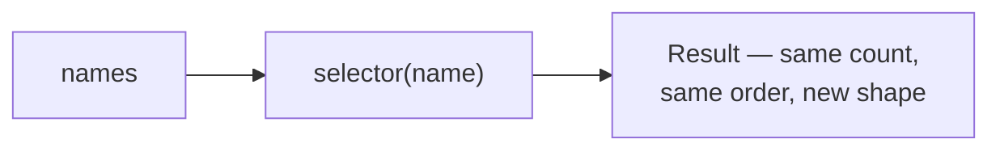
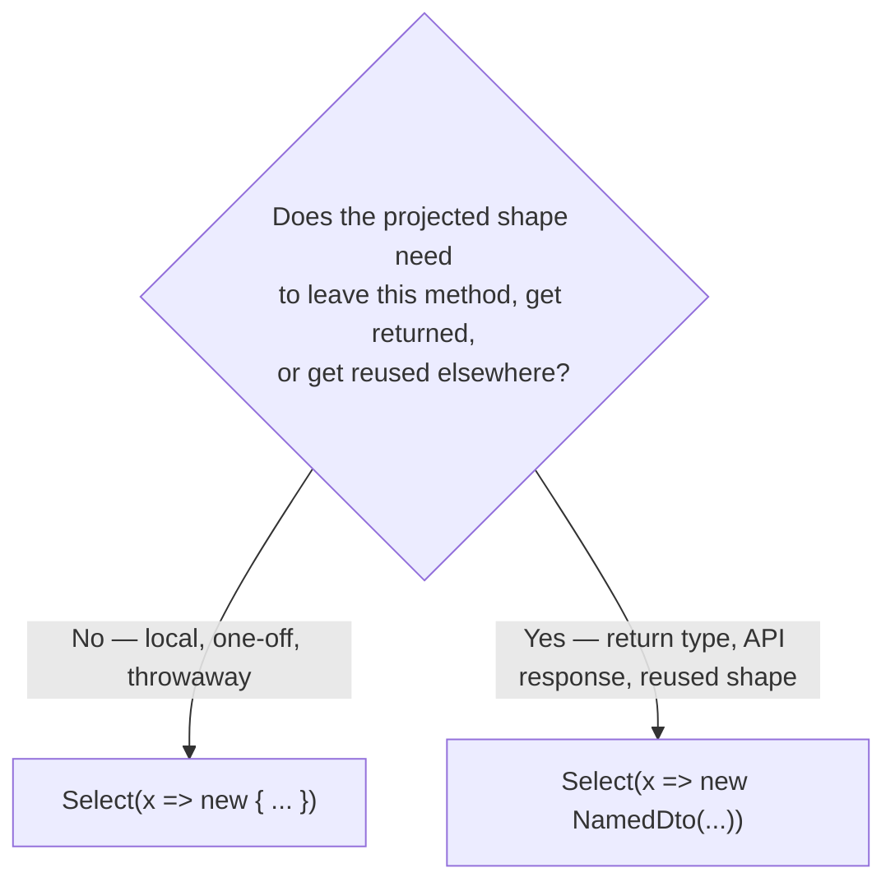

# Projection with Select

## Introduction

Before reading this lesson, you should already be comfortable with **[Filtering with Where](../04-linq/04-04-filtering-with-where.md)** — the checkpoint operator that decides which elements survive. `Where` only ever answers "keep or drop"; it never changes what an element actually *is*. This lesson covers the operator that does exactly that: **`Select`**, which transforms every element in a sequence into a new form, called a **projection**, without changing how many elements there are.

By the end of this lesson, you will be able to:

- Explain what `Select` does: transforming every element of a sequence into a new form
- Write a `Select` that projects each element into a simple derived value
- Project elements into an anonymous type for a quick, throwaway shape
- Project elements into a named DTO/record for a shape meant to be reused or returned
- Use `Select`'s index-aware overload, `Select((x, i) => ...)`
- Explain why `Select` changes a sequence's *shape* while `Where` only ever changes its *size*

## Projection with Select — A Layman's Perspective

Imagine a mint that stamps coins. Blank metal discs roll down a conveyor belt into a die-stamping press. Every single disc that enters the press comes out the other side — the press never rejects a disc or pulls one off the belt, that's a different machine's job entirely. But every disc that passes through is physically transformed: it goes in as a featureless blank and comes out bearing a specific design stamped into both faces. The count of discs never changes, and their order on the belt never changes, but what each one *is* changes completely — a blank disc becomes a coin.

That's exactly what `Select` does to a sequence. It never decides who gets through — that's `Where`'s entire job, the checkpoint from the previous lesson. `Select` assumes every element it receives has already earned its place, and its only job is to reshape each one into something new: turning a `Customer` object into just their email address, turning an `Order` into a formatted receipt line, turning a raw number into a computed result. The count stays identical, the order stays identical, but the *shape* of what comes out the other end is often completely different from what went in.

Now, here's a detail worth noticing about the mint: sometimes the press stamps a one-off commemorative design, made for a single afternoon's museum display and never minted again — nobody bothers giving that design an official currency name or filing paperwork for it, because it's disposable and local to one event. Other times, the press stamps the country's actual, official currency — a design with a real, registered name, a published specification, and mints all over the country producing coins to that exact same spec, because that coin needs to be recognized and accepted everywhere, not just in one room.

`Select` faces the exact same choice every time it reshapes data. Sometimes the new shape is a quick, disposable grouping needed for one report on one screen — and for that, an **anonymous type** (`new { ... }`, from [Anonymous Types](../02-oop/02-28-anonymous-types.md)) is the perfect, lightweight tool, exactly like the one-off commemorative coin. Other times, the new shape needs to be recognized elsewhere — returned from a method, passed across an API boundary, serialized to JSON for another system to consume — and for that, a **named record** (a proper DTO with a real, reusable name) is the right call, exactly like the country's official currency design.

The bridge back to programming: `Select` reshapes every element of a sequence into something new, and the shape you reshape it *into* — a primitive, an anonymous type, or a named record — depends entirely on whether that shape needs to stay local to one method or needs a name other code can recognize.

## Projection with Select — A Programming Language Perspective

**`Select`** is a deferred `System.Linq.Enumerable` extension method on `IEnumerable<T>` that projects each element of a source sequence into a result sequence via a selector delegate, producing exactly one output element per input element, in the same order. It has two overloads: `Select(Func<TSource, TResult> selector)`, and an index-aware form, `Select(Func<TSource, int, TResult> selector)`, whose selector additionally receives the zero-based position of the current element. `TResult` can be anything — a primitive value, an anonymous type produced inline with `new { ... }`, or an instance of a named `record` or `class` constructed inside the selector. `Select` performs a strict one-to-one mapping: each input element becomes exactly one output element. When a projection needs to turn each input element into a *sequence* of output elements and flatten all of those into one combined result, that's a job for `SelectMany`, covered in the next lesson — `Select` alone never changes how many elements the overall result contains.

## How to Project a Sequence with Select in C#

`Select` walks a source sequence and applies a transformation to every element, producing a new sequence of (possibly) an entirely different element type, in the same order, with the same count.


*Figure 1: `Select` reshapes every element that reaches it — nothing is ever added or dropped, unlike `Where`.*

```csharp
// Program.cs — .NET 10 / C# 14
using System.Linq;

List<string> names = ["Ana", "Bilal", "Chidi", "Deepa"];

// Select transforms every element — the count and order never change.
var nameLengths = names.Select(name => name.Length);
Console.WriteLine("Name lengths: " + string.Join(", ", nameLengths));

// Index-aware overload: pair each name with its position.
var numbered = names.Select((name, index) => $"{index + 1}. {name}");
foreach (string line in numbered)
{
    Console.WriteLine(line);
}
```

**Console Output:**

```text
Name lengths: 3, 5, 5, 5
1. Ana
2. Bilal
3. Chidi
4. Deepa
```

`nameLengths` projects each `string` into an `int` — the element type itself changes, from `string` to `int`, but there are still exactly four results, one per input name, in the same order. `numbered` demonstrates the index-aware overload: each name is combined with its own zero-based position (shown as a 1-based label), which is information `Select`'s ordinary overload has no access to at all, since a plain `Func<TSource, TResult>` selector never sees where its input sits in the sequence.

## Real-Time Example: Projection with Select in E-Commerce Order Processing

We continue building on the E-Commerce Order Processing case study, using the `Order` record from the previous lesson. Two different downstream consumers need the same `orders` list reshaped in two different ways: a quick console summary for today's manual review — disposable, local, and never referenced again — and a response shape meant to be returned from an API method, where the shape needs a real, discoverable name because other code, and potentially another system entirely, will consume it.

```csharp
// Program.cs — .NET 10 / C# 14 — Real-Time Example
using System.Linq;

List<Order> orders =
[
    new("ORD-9001", "Priya Nair", 145.00m, "Placed"),
    new("ORD-9002", "Wei Chen", 42.50m, "Shipped"),
    new("ORD-9003", "Lucas Silva", 210.00m, "Delivered"),
];

// Quick, throwaway shape for a one-off console report — an anonymous type is enough.
var consoleSummary = orders.Select(o => new { o.OrderId, Label = $"{o.CustomerName} ({o.Status})" });

Console.WriteLine("Quick console summary:");
foreach (var line in consoleSummary)
{
    Console.WriteLine($"  {line.OrderId}: {line.Label}");
}

// Reusable shape crossing a method boundary — a named record (DTO) instead.
List<OrderSummaryDto> apiResponse = orders
    .Select(o => new OrderSummaryDto(o.OrderId, o.Total, IsFulfilled: o.Status is "Shipped" or "Delivered"))
    .ToList();

Console.WriteLine();
Console.WriteLine("Reusable DTO shape (ready to serialize/return from an API):");
foreach (OrderSummaryDto dto in apiResponse)
{
    Console.WriteLine($"  {dto}");
}

record Order(string OrderId, string CustomerName, decimal Total, string Status);
record OrderSummaryDto(string OrderId, decimal Total, bool IsFulfilled);
```

**Console Output:**

```text
Quick console summary:
  ORD-9001: Priya Nair (Placed)
  ORD-9002: Wei Chen (Shipped)
  ORD-9003: Lucas Silva (Delivered)

Reusable DTO shape (ready to serialize/return from an API):
  OrderSummaryDto { OrderId = ORD-9001, Total = 145.00, IsFulfilled = False }
  OrderSummaryDto { OrderId = ORD-9002, Total = 42.50, IsFulfilled = True }
  OrderSummaryDto { OrderId = ORD-9003, Total = 210.00, IsFulfilled = True }
```

The `consoleSummary` projection is thrown together right where it's printed and never referenced again — an anonymous type costs nothing to declare and needs no name, exactly the right tool for a shape that dies the moment this method returns. `apiResponse`, by contrast, is built from `OrderSummaryDto` — a real, named `record` declared once and reusable anywhere: as a method's return type, serialized to JSON for a client, or passed into another layer of the system entirely. Notice `IsFulfilled` is computed inline inside the selector using a pattern-matching `is ... or ...` check — `Select`'s selector can run arbitrary logic, not just rename a field, which is exactly how raw domain entities get turned into the clean, purpose-built shapes an API's callers actually want to see.

## Select's Projection Target — Anonymous Type vs Named Type (DTO/Record)

`Select` doesn't care what shape you project into — the decision of *anonymous type versus named record* lives entirely with you, the caller, based on where the result needs to travel. The test is simple: will this exact shape ever cross a method boundary, get returned publicly, get serialized, or get reused somewhere else in the codebase? If yes, it has already outgrown an anonymous type.


*Figure 2: The same `Select` call can target either shape — the deciding factor is whether the projection needs to be recognized outside the method that created it.*

| Aspect | `Select` → Anonymous Type | `Select` → Named Record (DTO) |
|---|---|---|
| Declared shape | `new { ... }`, inferred inline, no name | A `record` declared once, referenced by name |
| Can leave the method | No — cannot be a return type, field, or parameter type | Yes — usable as a return type, field, parameter, or serialized payload |
| Best for | One-off console output, quick local reports | API responses, cross-layer DTOs, anything reused elsewhere |
| Where the shape is defined | Right where it's used, inline | In one central declaration, discoverable by name |

## Types of Projection-Related Concepts in C#

`Select` is the workhorse projection operator, but its target shape and its close relatives are each worth their own lesson:

1. **[Flattening with SelectMany](../04-linq/04-06-flattening-with-selectmany.md)** — projecting each element into a *sequence*, then flattening every one of those sequences into a single combined result, covered next.
2. **`Select((x, i) => ...)`** — the index-aware overload demonstrated in this lesson's How-To section.
3. **[Anonymous Types](../02-oop/02-28-anonymous-types.md)** — the throwaway projection shape used for the quick console summary above.
4. **[Records in C#](../02-oop/02-19-records-in-csharp.md)** — the named, reusable projection shape used for the DTO above.
5. **[Filtering with Where](../04-linq/04-04-filtering-with-where.md)** — the operator that decides *which* elements reach `Select` in the first place, without ever changing their shape.

## What You've Learned & What's Next

`Select` reshapes every element of a sequence into something new — a primitive, an anonymous type, or a named record — while leaving the count and order untouched, in direct contrast to `Where`, which changes only how many elements survive without ever changing what they are. Choosing between an anonymous type and a named DTO for that new shape comes down to one question: does it need to be recognized anywhere outside the method that created it?

Continue your learning journey with **[Flattening with SelectMany](../04-linq/04-06-flattening-with-selectmany.md)**, where we look at what happens when `Select`'s projection produces a *sequence* per element instead of a single value, and how `SelectMany` flattens all of those into one.

---
*Applies to: .NET 10 / C# 14. Last reviewed 2026-08-16.*
