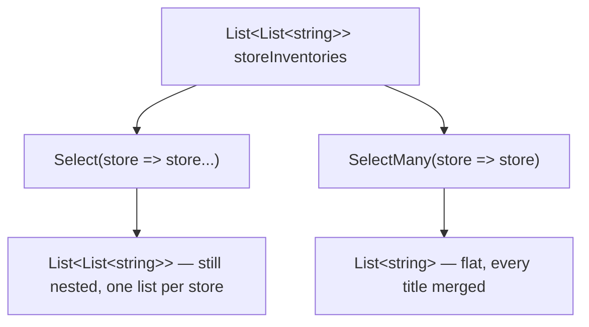
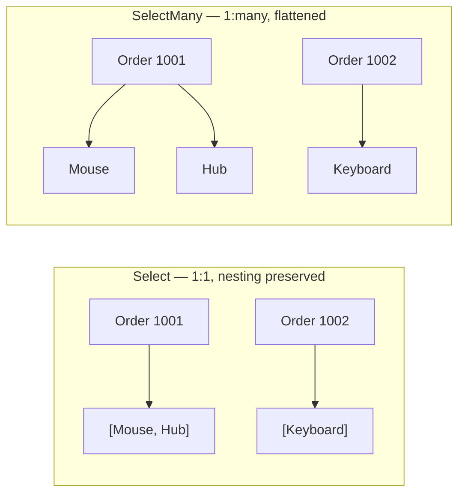

# Flattening with SelectMany

## Introduction

Before reading this lesson, you should already be comfortable with **[Projection with Select](../04-linq/04-05-projection-with-select.md)** — the idea that `Select` transforms every element of a sequence into something new, one-to-one, without changing how many elements there are. That one-to-one rule is exactly where `Select` starts to feel awkward: what happens when each source element doesn't map to *one* new value, but to a whole collection of its own? An order doesn't have one line item — it has many. A customer doesn't have one past purchase — they have many. In this lesson we introduce **`SelectMany`**, the LINQ operator built specifically for turning "a sequence of sequences" into one flat, unified sequence.

By the end of this lesson, you will be able to:

- Explain why applying `Select` to a one-to-many relationship produces a *nested* result rather than a flat one
- Use `SelectMany` to flatten a one-to-many relationship into a single flat sequence
- Use the collection-selector-plus-result-selector overload of `SelectMany` to combine data from both the outer and inner elements in one projection
- Recognize query syntax's multiple `from` clauses as syntactic sugar for `SelectMany`
- Choose correctly between `Select` and `SelectMany` when a projection itself returns a collection

## Flattening with SelectMany — A Layman's Perspective

Picture the head office of a small chain of bookstores — three locations across town — and imagine you've been asked to produce a single flyer listing every book on sale today, mall-wide, with no distinction about which store it came from. Each store manager sends you their own list: Store A sends a list of two titles, Store B sends a list of one title, Store C sends a list of three titles. If you handled this request carelessly, you might staple the three lists together as three separate pages — a "list of lists." Technically every title is somewhere in that packet, but it's not what was asked for. Someone flipping through it still has to know to check all three pages, keep track of which page they're on, and mentally merge everything themselves before they can answer a simple question like "how many different books are on sale today?"

What the task actually calls for is different: take all three incoming lists and merge every single title from every store into one continuous list, printed on one page, in one pass. Store A's two titles, Store B's one title, and Store C's three titles become six lines on a single flyer, indistinguishable in kind from one another — you've thrown away the "which store did this come from" boundary and kept only the titles themselves, all six of them, flattened into one sequence. That flyer is far easier to work with. Counting entries, searching for a specific title, sorting the whole thing alphabetically — all of these become simple, single-pass operations instead of an outer loop over stores wrapped around an inner loop over each store's own list.

This is the exact distinction between mapping something one-to-one and flattening something one-to-many. If your job were "convert each store's list into an uppercase version of that same list," you'd still end up with three separate lists — one per store, each transformed, but still grouped by store. That's a one-to-one transformation applied to each store, and the shape you started with (three groups) is the shape you end with. But "merge every store's titles into one master flyer" is fundamentally different: you're not transforming each store's list into another list, you're *flattening* three lists into one, discarding the store boundary in the process.

Both instincts are useful in different situations, and a warehouse of head-office paperwork uses both constantly. When you need to keep each store's report separate — for accounting, say, where Store A's sales must stay attributable to Store A — you want the "list of lists" shape preserved. When you need one unified view across every store — like this sale-day flyer, or a mall-wide inventory count — you want everything flattened into a single sequence. Knowing which one a task actually calls for, before you start building the report, is the whole judgment call this lesson is training.

In C#, `Select` is the "transform each store's list independently" tool — it preserves the nesting. `SelectMany` is the "merge everything into one flyer" tool — it flattens the nesting away entirely.

## Flattening with SelectMany — A Programming Language Perspective

`SelectMany<TSource, TResult>` is the LINQ standard query operator that projects each element of a source sequence to an `IEnumerable<TResult>`, then concatenates every one of those resulting sequences into a single, flat `IEnumerable<TResult>`. It has two commonly used shapes. The simple form, `source.SelectMany(x => x.InnerCollection)`, returns just the flattened inner elements. The second form takes an additional result selector — `source.SelectMany(x => x.InnerCollection, (outer, inner) => ...)` — and lets you combine data from the *outer* element (say, an order) with each *inner* element (say, one of that order's line items) in the same projection, which is what makes `SelectMany` powerful rather than merely a flattening utility. In query syntax, a second `from` clause over a property of the first range variable — `from order in orders from item in order.Items select ...` — compiles directly to this collection-selector-plus-result-selector overload. Deferred execution applies here exactly as it does to `Where` and `Select`: nothing runs until the result is enumerated.

## How to Use SelectMany in C#

Before reaching for `SelectMany`, it helps to see the contrast directly: apply `Select` to a collection of collections and you get a collection of collections back (nested), but apply `SelectMany` to the same input and you get every inner element merged into one flat sequence.


*Figure 1: `Select` preserves the outer grouping; `SelectMany` discards it and merges every inner sequence into one.*

```csharp
// Program.cs — .NET 10 / C# 14

List<List<string>> storeInventories =
[
    ["Book A", "Book B"],
    ["Book C"],
    ["Book D", "Book E", "Book F"]
];

// Select maps each store to its own transformed list — the result is still
// "grouped by store," a sequence of sequences (nested).
List<List<string>> nestedByStore = storeInventories
    .Select(store => store.Select(title => title.ToUpper()).ToList())
    .ToList();

Console.WriteLine("Select (nested — one list per store):");
foreach (List<string> store in nestedByStore)
{
    Console.WriteLine($"  [{string.Join(", ", store)}]");
}

// SelectMany maps each store to its list of titles AND flattens every
// resulting list into a single, flat sequence — the store boundary is gone.
List<string> flatTitles = storeInventories
    .SelectMany(store => store)
    .Select(title => title.ToUpper())
    .ToList();

Console.WriteLine($"\nSelectMany (flat — {flatTitles.Count} titles mall-wide):");
Console.WriteLine($"  [{string.Join(", ", flatTitles)}]");
```

**Console Output:**

```text
Select (nested — one list per store):
  [BOOK A, BOOK B]
  [BOOK C]
  [BOOK D, BOOK E, BOOK F]

SelectMany (flat — 6 titles mall-wide):
  [BOOK A, BOOK B, BOOK C, BOOK D, BOOK E, BOOK F]
```

Notice that `nestedByStore` still has three elements — one `List<string>` per store — because `Select` never changes the count of the outer sequence. `flatTitles`, on the other hand, has six elements: two from the first store, one from the second, three from the third, all merged into one sequence with no memory of which store any given title came from. That's the defining behavior of `SelectMany` — the resulting count equals the *sum* of the inner counts, not the count of the outer sequence.

## Real-Time Example: Flattening Orders into a Pick List in E-Commerce Order Processing

We continue building on the E-Commerce Order Processing case study, modeling an `Order` that carries a customer name and a `List<OrderItem>` of line items. A warehouse doesn't fulfill "orders" — it fulfills individual physical items, one at a time, regardless of which order each item happens to belong to. That's precisely a one-to-many flattening problem: many orders, each containing many items, need to become one flat pick list that a warehouse worker can walk down from top to bottom.

```csharp
// Program.cs — .NET 10 / C# 14 — Real-Time Example

List<Order> orders =
[
    new Order(1001, "Alice Chen", DateOnly.Parse("2026-08-10"),
    [
        new OrderItem("Wireless Mouse", 2, 24.99m),
        new OrderItem("USB-C Hub", 1, 34.50m)
    ]),
    new Order(1002, "Brian Osei", DateOnly.Parse("2026-08-11"),
    [
        new OrderItem("Mechanical Keyboard", 1, 89.99m)
    ]),
    new Order(1003, "Alice Chen", DateOnly.Parse("2026-08-12"),
    [
        new OrderItem("USB-C Hub", 2, 34.50m),
        new OrderItem("Webcam", 1, 59.99m),
        new OrderItem("Wireless Mouse", 1, 24.99m)
    ])
];

// SelectMany's result-selector overload flattens every order's items into one
// sequence while still tagging each line with which order and customer it
// came from — information a plain flattened list of items would lose.
var pickList = orders.SelectMany(
    order => order.Items,
    (order, item) => new { order.OrderId, order.CustomerName, item.ProductName, item.Quantity });

Console.WriteLine("Warehouse pick list (flattened across all orders):");
foreach (var line in pickList)
{
    Console.WriteLine($"  Order #{line.OrderId} ({line.CustomerName}): {line.Quantity} x {line.ProductName}");
}

int totalUnitsToPick = orders.SelectMany(order => order.Items).Sum(item => item.Quantity);
Console.WriteLine($"\nTotal units to pick across all orders: {totalUnitsToPick}");

record OrderItem(string ProductName, int Quantity, decimal UnitPrice);
record Order(int OrderId, string CustomerName, DateOnly OrderDate, List<OrderItem> Items);
```

**Console Output:**

```text
Warehouse pick list (flattened across all orders):
  Order #1001 (Alice Chen): 2 x Wireless Mouse
  Order #1001 (Alice Chen): 1 x USB-C Hub
  Order #1002 (Brian Osei): 1 x Mechanical Keyboard
  Order #1003 (Alice Chen): 2 x USB-C Hub
  Order #1003 (Alice Chen): 1 x Webcam
  Order #1003 (Alice Chen): 1 x Wireless Mouse

Total units to pick across all orders: 8
```

Without `SelectMany`, producing this pick list would require a nested loop — `foreach` over `orders`, then a nested `foreach` over each order's `Items` — just to reach the same flat sequence of lines. `SelectMany` expresses that nested traversal as a single, composable LINQ call, and because it's still just building an `IEnumerable<T>`, it composes directly with `Sum`, `Where`, `OrderBy`, or any other operator you'd apply to a normal flat sequence. That composability is exactly why real fulfillment systems flatten orders into pick lists this way rather than hand-rolling nested loops.

## Select vs SelectMany

The core distinction is about *shape*, not about which operator is "better." `Select` is a strict one-to-one operator: give it a sequence of `n` elements, and you get back a sequence of exactly `n` elements — even if each of those elements happens to itself be a collection. `SelectMany` is a one-to-many *flattening* operator: give it a sequence of `n` elements, where each element maps to its own inner collection, and you get back a single flat sequence whose count is the *sum* of every inner collection's count, with the outer grouping discarded entirely.

A useful test: if the question you're answering is "what does each *order* look like after I transform it?", you want `Select`. If the question is "what does the flat list of every *item* across all orders look like?", you want `SelectMany`. Reaching for `Select` when you actually need `SelectMany` is a common beginner mistake — it doesn't cause a compiler error (you simply get back a sequence of sequences), but it forces every caller downstream to write nested loops to get at the data they actually wanted flat.


*Figure 2: `Select` keeps each order's items in their own group; `SelectMany` merges every order's items into one flat sequence.*

| Aspect | `Select` | `SelectMany` |
|---|---|---|
| Mapping | One-to-one — one output per input element | One-to-many — one *sequence* per input element, then flattened |
| Result count | Always equals the source count | Equals the sum of every inner sequence's count |
| Result shape when projecting a collection | `IEnumerable<IEnumerable<T>>` (nested) | `IEnumerable<T>` (flat) |
| Query syntax equivalent | Single `select` clause | A second (or later) `from` clause |
| Typical use case | Transforming each element independently | Flattening a one-to-many relationship, e.g. orders → items |

## Types and Variants of SelectMany in C#

`SelectMany` itself has a small number of forms, and it pairs naturally with several other operators covered elsewhere in this module:

1. **Simple collection selector** — `source.SelectMany(x => x.Inner)` returns only the flattened inner elements, discarding the outer element entirely.
2. **Collection selector with result selector** — `source.SelectMany(x => x.Inner, (outer, inner) => ...)` lets you combine outer and inner data in the projected result, as the pick-list example above does.
3. **Query syntax's multiple `from` clauses** — `from x in source from y in x.Inner select ...` compiles to the result-selector overload automatically.
4. **[Joining Data with Join](../04-linq/04-09-joining-data-with-join.md)** — for combining two genuinely *independent* sequences matched by a shared key, rather than flattening a natural one-to-many nesting.
5. **[GroupJoin and Left-Outer-Join Patterns](../04-linq/04-10-groupjoin-left-outer-join.md)** — pairs `GroupJoin`, `SelectMany`, and `DefaultIfEmpty` to emulate a SQL left outer join.
6. **[`ToLookup` and Lookup Tables](../04-linq/04-17-tolookup-and-lookup-tables.md)** — a related one-to-many structure, but built eagerly and indexed by key rather than streamed lazily.

## What You've Learned & What's Next

`SelectMany` solves a problem `Select` structurally cannot: turning a one-to-many relationship — orders and their items, stores and their inventories — into one flat, unified sequence instead of a nested sequence-of-sequences. The result-selector overload additionally lets you carry outer-element context (like which order a line item came from) along with each flattened inner element, which is what made the warehouse pick-list example possible in a single LINQ expression.

Continue your learning journey with **[Ordering with OrderBy and ThenBy](../04-linq/04-07-ordering-with-orderby-thenby.md)**, where we take a flattened sequence like this pick list and learn how to sort it — by a single key, and then by additional tie-breaking keys.

---
*Applies to: .NET 10 / C# 14. Last reviewed 2026-08-16.*
