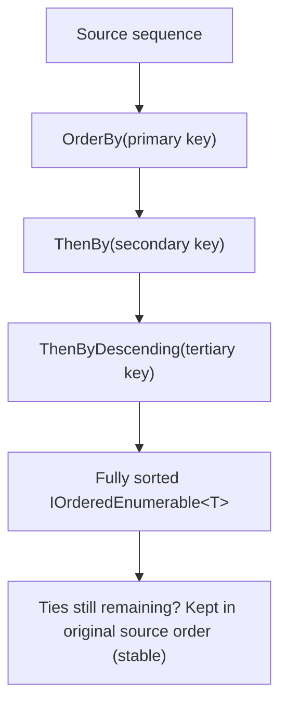
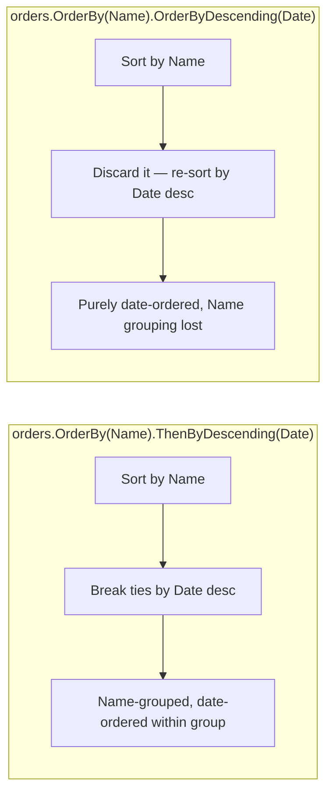

# Ordering with OrderBy and ThenBy

## Introduction

Before reading this lesson, you should already be comfortable with **[Flattening with SelectMany](../04-linq/04-06-flattening-with-selectmany.md)** and, more broadly, with building up flat sequences using `Where` and `Select`. Once you have a flat sequence of data — the warehouse pick list from the previous lesson, for instance — the next natural question is almost always "in what order should this be presented?" This lesson covers LINQ's ordering operators: `OrderBy`, `OrderByDescending`, and the tie-breaking operators `ThenBy` and `ThenByDescending`.

By the end of this lesson, you will be able to:

- Sort a sequence ascending or descending by a single key using `OrderBy` and `OrderByDescending`
- Break ties in a primary sort key using one or more secondary keys with `ThenBy` and `ThenByDescending`
- Explain what a "stable sort" guarantees and why it matters for anyone relying on original ordering as an implicit tie-breaker
- Chain multiple `ThenBy` calls to express a genuinely multi-level sort, such as "by customer, then by most recent order first"
- Recognize why calling `OrderBy` twice in a row is a common mistake, and use `ThenBy` instead

## Ordering with OrderBy and ThenBy — A Layman's Perspective

Picture a school administrator preparing a printed graduation program that lists every graduating student, and imagine the seating and speaking order needs to follow a specific set of rules. The primary rule is simple: list students in descending order by their final grade average, highest achiever first, because that's the order in which the top honors are announced from the stage. But grades aren't perfectly unique — several students might share the exact same average down to the decimal point — and the program needs some sensible, deterministic way to decide who's listed first among students who are tied.

A thoughtful administrator handles this with a two-level rule, not a single rule: first sort everyone by grade average, highest first; then, for any students who are exactly tied on grade average, break the tie by listing them alphabetically by last name. Notice that this is fundamentally different from sorting twice, once by grade and then separately by name — that would simply throw away the grade ordering and leave you with an alphabetical list. What the administrator actually wants is a sort *within* the ties: the grade ordering stays firmly in charge overall, and the name ordering only ever gets consulted to break a tie, never to override the primary rule.

There's a second subtlety a careful administrator has to handle too: what if, after applying both rules, some students are *still* perfectly tied — same grade average, same last name? A well-run process falls back to some existing, implicit order — perhaps the order the students appear in the master enrollment roster — rather than shuffling those students unpredictably every time the program is reprinted. If two students are tied on every rule the administrator explicitly stated, the fairest thing to do is leave them in whatever relative order they arrived in, rather than let the sorting process toss a coin. A process that behaves this way — falling back to original order for anything left unresolved by the stated rules — is called a *stable* process, and it's a property people expect without ever writing it down as an explicit rule.

This is the exact shape of `OrderBy` and `ThenBy` in C#. `OrderBy` establishes the primary rule. Each `ThenBy` after it adds another rule that only ever breaks ties left over from everything before it — it never overrides the primary sort. And critically, .NET's implementation of this sort is guaranteed stable: any students (or orders, or records) left tied after every explicit rule has been applied keep their original relative order, exactly like the enrollment-roster fallback a careful administrator would use.

## Ordering with OrderBy and ThenBy — A Programming Language Perspective

`OrderBy<TSource, TKey>` and `OrderByDescending<TSource, TKey>` are the LINQ standard query operators that sort a sequence by a key selector, returning an `IOrderedEnumerable<TSource>` rather than a plain `IEnumerable<TSource>` — that distinct return type is what allows `ThenBy` and `ThenByDescending` to be chained afterward, since they're only defined as extension methods on `IOrderedEnumerable<TSource>`, not on `IEnumerable<TSource>` itself. Each `ThenBy`/`ThenByDescending` call adds a secondary sort key that is only consulted to break ties left by every key before it in the chain — it never re-sorts by the earlier keys. Both `OrderBy` and its descending and chained variants are documented as *stable*: elements that compare equal under every key in the chain retain their original relative order from the source sequence. Like `Where` and `Select`, ordering is deferred — nothing is actually sorted until the resulting sequence is enumerated.

## How to Order and Chain Sorts in C#

A single `OrderBy` call handles a one-key sort directly. Chaining `ThenBy` afterward adds tie-breaking keys without disturbing the primary order, and because .NET's sort is stable, any values still tied after every explicit key is applied simply keep their original position.


*Figure 1: Each `ThenBy` only breaks ties left over from the keys before it; anything still tied falls back to the original source order.*

```csharp
// Program.cs — .NET 10 / C# 14

record Student(string Name, int Score);

List<Student> students =
[
    new Student("Diana", 85),
    new Student("Alan", 90),
    new Student("Carol", 85),
    new Student("Bob", 90)
];

// Single-key descending sort: highest score first. Alan and Bob are tied at
// 90, and Diana and Carol are tied at 85.
List<Student> byScoreOnly = students
    .OrderByDescending(s => s.Score)
    .ToList();

Console.WriteLine("OrderByDescending(Score) only — ties keep source order:");
foreach (Student s in byScoreOnly)
{
    Console.WriteLine($"  {s.Name}: {s.Score}");
}
```

**Console Output:**

```text
OrderByDescending(Score) only — ties keep source order:
  Alan: 90
  Bob: 90
  Diana: 85
  Carol: 85
```

Notice that Alan appears before Bob, and Diana appears before Carol — exactly the order they had in the original `students` list. Nothing in the code explicitly said "Alan before Bob" or "Diana before Carol"; that ordering fell out entirely from the sort being stable and the ties never being broken by any additional key. If a second key had been supplied — say, `.ThenBy(s => s.Name)` — Bob would move ahead of Alan alphabetically within the 90-point tie, and Carol would move ahead of Diana within the 85-point tie, because that key would now explicitly resolve what stability was previously resolving implicitly.

## Real-Time Example: Ordering Orders in E-Commerce Order Processing

We continue building on the `Order` and `OrderItem` classes from the previous lesson's warehouse pick-list example. A customer service dashboard needs to display each customer's orders grouped visually by customer, with each customer's most recent order shown first — a genuine two-level sort: primary key is `CustomerName` (ascending, alphabetical), secondary key is `OrderDate` (descending, most recent first).

```csharp
// Program.cs — .NET 10 / C# 14 — Real-Time Example

record OrderItem(string ProductName, int Quantity, decimal UnitPrice);
record Order(int OrderId, string CustomerName, DateOnly OrderDate, List<OrderItem> Items)
{
    public decimal Total => Items.Sum(item => item.Quantity * item.UnitPrice);
}

List<Order> orders =
[
    new Order(1001, "Alice Chen", DateOnly.Parse("2026-08-10"),
    [
        new OrderItem("Wireless Mouse", 2, 24.99m),
        new OrderItem("USB-C Hub", 1, 34.50m)
    ]),
    new Order(1002, "Brian Osei", DateOnly.Parse("2026-08-11"),
    [
        new OrderItem("Mechanical Keyboard", 1, 89.99m)
    ]),
    new Order(1003, "Alice Chen", DateOnly.Parse("2026-08-12"),
    [
        new OrderItem("USB-C Hub", 2, 34.50m),
        new OrderItem("Webcam", 1, 59.99m),
        new OrderItem("Wireless Mouse", 1, 24.99m)
    ])
];

// Primary key: CustomerName, alphabetical. Secondary key: OrderDate, most
// recent first — ThenByDescending only breaks ties left by CustomerName.
var dashboardView = orders
    .OrderBy(order => order.CustomerName)
    .ThenByDescending(order => order.OrderDate)
    .ToList();

Console.WriteLine("Customer dashboard — orders by customer, most recent first:");
foreach (Order order in dashboardView)
{
    Console.WriteLine($"  {order.CustomerName} | Order #{order.OrderId} | {order.OrderDate} | {order.Total:C}");
}
```

**Console Output:**

```text
Customer dashboard — orders by customer, most recent first:
  Alice Chen | Order #1003 | 2026-08-12 | $153.98
  Alice Chen | Order #1001 | 2026-08-10 | $84.48
  Brian Osei | Order #1002 | 2026-08-11 | $89.99
```

Both of Alice Chen's orders are grouped together, exactly as the alphabetical primary key requires, and within that group her most recent order (August 12) appears before her older order (August 10), exactly as the descending secondary key requires. Brian Osei's single order sorts after all of Alice's alphabetically. A real customer-service dashboard needs this exact shape: entries visually grouped by customer without an explicit `GroupBy`, and within each customer's group, freshest activity surfaced first — the kind of ordering a support agent needs to answer "what did this customer order most recently?" at a glance.

## OrderBy Chains vs Repeated OrderBy Calls

A subtle but important mistake is calling `OrderBy` a second time instead of `ThenBy`. `OrderBy`, `OrderByDescending`, `ThenBy`, and `ThenByDescending` are all defined so that calling `OrderBy` *again* on an already-ordered sequence discards the previous sort entirely and re-sorts from scratch by the new key — it does not compose with the earlier `OrderBy` the way `ThenBy` does. This is easy to get wrong because both calls compile and run without error; the bug only shows up as wrong output, not a wrong build.


*Figure 2: `ThenBy` composes with the sort before it; a second `OrderBy` call throws the previous sort away and starts over.*

| Aspect | `ThenBy` / `ThenByDescending` | Calling `OrderBy` again |
|---|---|---|
| Relationship to prior sort | Composes with it — only breaks existing ties | Replaces it — the sequence is re-sorted from scratch |
| Requires | An `IOrderedEnumerable<T>` (result of a prior `OrderBy`/`ThenBy`) | Any `IEnumerable<T>`, including an already-ordered one |
| Correct for multi-key sorting | Yes — this is its purpose | No — silently loses the earlier ordering |
| Stability across the whole chain | Guaranteed for the full multi-key chain | Only guaranteed for the final key alone |

## Types and Variants of Ordering in C#

`OrderBy` and `ThenBy` form a small, composable family, and they connect directly to several other operators you'll use alongside sorted data:

1. **[`OrderBy`](../04-linq/04-07-ordering-with-orderby-thenby.md)** — ascending sort by a single primary key.
2. **`OrderByDescending`** — descending sort by a single primary key.
3. **`ThenBy` / `ThenByDescending`** — chained tie-breaking keys applied only after a prior `OrderBy`/`ThenBy`.
4. **`IComparer<T>` overloads** — every ordering method accepts an optional `IComparer<TKey>` for custom comparison logic, such as case-insensitive string sorts.
5. **[Grouping with GroupBy](../04-linq/04-08-grouping-with-groupby.md)** — often paired with ordering, e.g. sort each group's members after grouping them.
6. **[Partitioning: Skip, Take, SkipWhile, TakeWhile](../04-linq/04-14-partitioning-skip-take.md)** — commonly applied immediately after an `OrderBy` chain to page through sorted results.

## What You've Learned & What's Next

`OrderBy` establishes a primary sort key, and each `ThenBy` afterward adds a secondary key that only ever resolves ties left by everything before it — never overriding the primary order. Because .NET's sort implementation is guaranteed stable, anything left tied after every explicit key falls back predictably to its original position in the source sequence, which is exactly the behavior the customer dashboard example relied on to group orders by customer while still surfacing the most recent order first within each group.

Continue your learning journey with **[Grouping with GroupBy](../04-linq/04-08-grouping-with-groupby.md)**, where instead of merely ordering records around a key, we partition them into explicit groups by that key.

---
*Applies to: .NET 10 / C# 14. Last reviewed 2026-08-16.*
