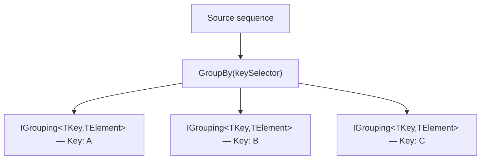
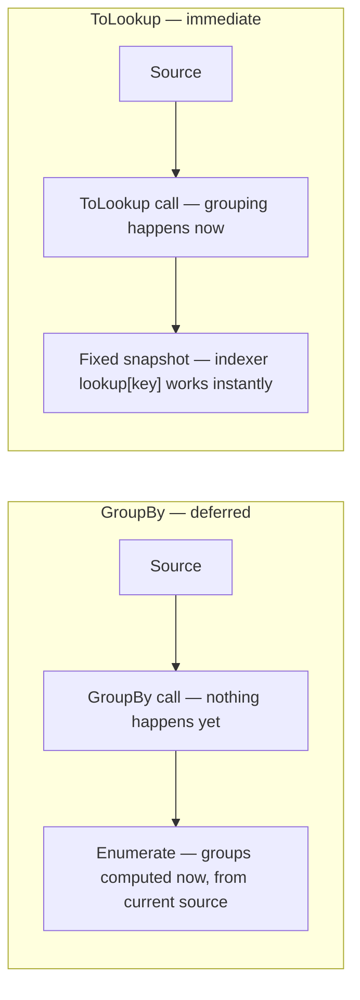

# Grouping with GroupBy

## Introduction

Before reading this lesson, you should already be comfortable with **[Ordering with OrderBy and ThenBy](../04-linq/04-07-ordering-with-orderby-thenby.md)**. Ordering rearranges a sequence without changing its membership — every element you started with is still there, just repositioned. Grouping does something categorically different: it *partitions* a sequence into distinct buckets based on a key, so that instead of one flat sequence you get a sequence of groups, each carrying its own key and its own subset of members. This lesson introduces `GroupBy`, the LINQ operator that performs exactly this partitioning.

By the end of this lesson, you will be able to:

- Partition a flat sequence into keyed groups using `GroupBy`
- Work with the resulting `IGrouping<TKey, TElement>` objects, each carrying a `Key` and its own member elements
- Group by a computed key rather than a raw property, such as a bucketed grade or a derived category
- Combine `GroupBy` with aggregation operators like `Sum` and `Count` to compute a per-group summary
- Distinguish `GroupBy`'s deferred, streaming behavior from `ToLookup`'s immediate, cached behavior

## Grouping with GroupBy — A Layman's Perspective

Picture a teacher standing at the front of a classroom holding a stack of graded exams, about to hand them back. A simple approach would be to call names one at a time in whatever order the papers happen to be in — but a more organized teacher sorts the stack first, arranging the papers by grade band before handing anything back: all the A papers together, all the B papers together, all the C papers together, and so on. Sorting alone, though, only rearranges the order the papers are handed back in; it doesn't change the fact that you're still handing back 30 individual papers one at a time.

Grouping is a different, more structural move. Instead of handing back 30 papers in a particular order, imagine the teacher instead makes four distinct piles on the front desk — a pile labeled "A," a pile labeled "B," a pile labeled "C," a pile labeled "D" — and simply announces "there are three A's, two B's, two C's, and one D" before calling students up pile by pile. Now the data isn't just reordered, it's been restructured into genuinely separate collections, each with its own label and its own count. A parent asking "how many students got a B?" doesn't need to flip through the whole stack counting — they can just look at the size of the B pile directly, because the grouping already did that partitioning work up front.

This is exactly the shape of the trade-off between ordering and grouping. Ordering answers "in what sequence should I look at this data?" Grouping answers a fundamentally different question: "how should this data be split into meaningful clusters, and what does each cluster look like on its own?" A well-organized teacher doesn't choose one over the other permanently — they group papers by grade band for handing them back efficiently, and within each pile, they might further sort alphabetically by last name so calling names within a pile is predictable too. Grouping and ordering compose naturally; they answer different questions about the same underlying pile of papers.

Notice one more detail about those four piles on the desk: each pile has a label (the grade band) attached to it, and each pile still contains the original exam papers themselves — nothing about the papers changed, they were just physically routed into the right pile based on a rule (score >= 90 goes to the A pile, and so on). That's precisely what `GroupBy` gives you in code: a small number of labeled groups, each one holding onto the original elements that earned that label, with the label and its members bundled together as a single unit you can inspect, count, or summarize.

## Grouping with GroupBy — A Programming Language Perspective

`GroupBy<TSource, TKey>` is the LINQ standard query operator that partitions a source sequence into a sequence of `IGrouping<TKey, TElement>` objects, one per distinct key produced by a key selector function. `IGrouping<TKey, TElement>` itself is simply an `IEnumerable<TElement>` with one additional property, `Key`, that carries the value all of that group's members share. By default, `GroupBy` preserves each group's members in their original source order, and the groups themselves appear in the order their key was *first* encountered in the source sequence — not sorted alphabetically or numerically unless you explicitly add an `OrderBy` afterward. The key selector can be any expression, including a computed value derived from several source properties, not just a direct property access. Like the operators before it in this module, `GroupBy` is deferred: no partitioning happens until the resulting sequence of groups is enumerated.

## How to Group Sequences in C#

Grouping requires a key selector — a function that, given one element, returns the value used to decide which bucket it belongs in. That key doesn't have to already exist as a property; it's just as common to compute one on the fly, such as bucketing a numeric score into a letter-grade band.


*Figure 1: `GroupBy` partitions one flat sequence into several `IGrouping<TKey, TElement>` buckets, each carrying its own `Key` and its own members.*

```csharp
// Program.cs — .NET 10 / C# 14

List<int> scores = [92, 85, 77, 90, 65, 88, 73, 95];

// The key is computed on the fly — it isn't a raw property of int, it's a
// letter-grade band derived from each score.
var byGradeBand = scores.GroupBy(score => score switch
{
    >= 90 => "A",
    >= 80 => "B",
    >= 70 => "C",
    _ => "D"
});

foreach (IGrouping<string, int> group in byGradeBand)
{
    Console.WriteLine($"Grade {group.Key} ({group.Count()} students): {string.Join(", ", group)}");
}
```

**Console Output:**

```text
Grade A (3 students): 92, 90, 95
Grade B (2 students): 85, 88
Grade C (2 students): 77, 73
Grade D (1 students): 65
```

Each `IGrouping<string, int>` carries both a `Key` ("A", "B", "C", or "D") and the actual scores that earned that key, in their original order — 92 appears before 90 and 95 within the "A" group because that's the order they appeared in the source list. The groups themselves appear in the order their key was first seen: "A" first (because 92 is the first score processed), then "B" (from 85), then "C" (from 77), then "D" (from 65) — not alphabetically, and not sorted by score.

## Real-Time Example: A Per-Product Sales Report in E-Commerce Order Processing

We continue building on the `Order` and `OrderItem` classes and the flattened pick-list technique from **[Flattening with SelectMany](../04-linq/04-06-flattening-with-selectmany.md)**. A merchandising team doesn't care about individual orders — they care about totals *per product*: how many units of each product sold, and how much revenue each product generated, across every order. That's `SelectMany` to flatten, followed immediately by `GroupBy` to partition by product name, followed by an aggregation inside each group.

```csharp
// Program.cs — .NET 10 / C# 14 — Real-Time Example

record OrderItem(string ProductName, int Quantity, decimal UnitPrice);
record Order(int OrderId, string CustomerName, DateOnly OrderDate, List<OrderItem> Items);

List<Order> orders =
[
    new Order(1001, "Alice Chen", DateOnly.Parse("2026-08-10"),
    [
        new OrderItem("Wireless Mouse", 2, 24.99m),
        new OrderItem("USB-C Hub", 1, 34.50m)
    ]),
    new Order(1002, "Brian Osei", DateOnly.Parse("2026-08-11"),
    [
        new OrderItem("Mechanical Keyboard", 1, 89.99m)
    ]),
    new Order(1003, "Alice Chen", DateOnly.Parse("2026-08-12"),
    [
        new OrderItem("USB-C Hub", 2, 34.50m),
        new OrderItem("Webcam", 1, 59.99m),
        new OrderItem("Wireless Mouse", 1, 24.99m)
    ])
];

// Flatten every order's items (SelectMany), then partition the flat sequence
// by product name (GroupBy), then aggregate quantity and revenue per group.
var salesByProduct = orders
    .SelectMany(order => order.Items)
    .GroupBy(item => item.ProductName)
    .Select(group => new
    {
        ProductName = group.Key,
        TotalQuantity = group.Sum(item => item.Quantity),
        TotalRevenue = group.Sum(item => item.Quantity * item.UnitPrice)
    })
    .OrderByDescending(report => report.TotalRevenue);

Console.WriteLine("Per-product sales report (all orders):");
foreach (var report in salesByProduct)
{
    Console.WriteLine($"  {report.ProductName,-20} qty {report.TotalQuantity,3}   revenue {report.TotalRevenue,8:C}");
}
```

**Console Output:**

```text
Per-product sales report (all orders):
  USB-C Hub            qty   3   revenue  $103.50
  Mechanical Keyboard  qty   1   revenue   $89.99
  Wireless Mouse       qty   3   revenue   $74.97
  Webcam               qty   1   revenue   $59.99
```

Notice how three separate LINQ operators compose into one pipeline: `SelectMany` collapses every order's items into one flat sequence, `GroupBy` partitions that flat sequence by product name, and the `Select` immediately after computes a summary — total quantity and total revenue — for each group before `OrderByDescending` ranks products by revenue. A merchandising dashboard built this way stays correct automatically as new orders are added; there's no manual running-total bookkeeping to keep in sync, because the whole report is recomputed declaratively from the current order list every time it runs.

## GroupBy vs ToLookup

`GroupBy` and `ToLookup` both partition a sequence into keyed groups, and their per-group shape — `IGrouping<TKey, TElement>` — is identical. The difference is entirely about *when* the grouping happens and how the result behaves afterward. `GroupBy` is a deferred LINQ operator: it doesn't group anything until you enumerate the result, and if the underlying source changes before you enumerate, the grouping reflects the latest state. `ToLookup` executes immediately, right at the point you call it, producing an `ILookup<TKey, TElement>` snapshot that's fixed at that moment — later changes to the source have no effect on a lookup you already built. `ILookup<TKey, TElement>` also adds a capability `IGrouping`-based `GroupBy` results don't have directly: indexer access, `lookup[key]`, which safely returns an *empty* sequence for a key that was never present, rather than throwing.


*Figure 2: `GroupBy` waits until enumeration to do any work; `ToLookup` does the grouping immediately and hands back a fixed, indexable snapshot.*

| Aspect | `GroupBy` | `ToLookup` |
|---|---|---|
| Execution timing | Deferred — runs when enumerated | Immediate — runs at the call site |
| Return type | `IEnumerable<IGrouping<TKey, TElement>>` | `ILookup<TKey, TElement>` |
| Reflects later source changes | Yes, re-evaluated on each enumeration | No, snapshot is fixed at build time |
| Direct key access | Requires filtering/`First` over the groups | `lookup[key]` — returns empty sequence if key absent, never throws |
| Typical use | One step inside a larger declarative pipeline | A reusable, repeatedly-queried grouping structure |

## Types and Variants of Grouping in C#

`GroupBy` has a small family of overloads and closely related operators worth knowing:

1. **`GroupBy(keySelector)`** — the basic form used above, grouping by a key with the element type unchanged.
2. **`GroupBy(keySelector, elementSelector)`** — groups by a key while also projecting each element to a different shape before it's added to the group.
3. **`GroupBy(keySelector, resultSelector)`** — groups and immediately projects each finished group into a summary shape in one call, skipping a separate `Select` afterward.
4. **[`ToLookup` and Lookup Tables](../04-linq/04-17-tolookup-and-lookup-tables.md)** — the immediate, indexable sibling of `GroupBy` covered above.
5. **[GroupJoin and Left-Outer-Join Patterns](../04-linq/04-10-groupjoin-left-outer-join.md)** — groups the *matching elements of a second sequence* per element of the first, rather than grouping one sequence by its own key.
6. **[Custom Aggregation with Aggregate](../04-linq/04-12-custom-aggregation-with-aggregate.md)** — for per-group summaries that `Sum`/`Count`/`Average` can't express directly.

## What You've Learned & What's Next

`GroupBy` partitions a flat sequence into `IGrouping<TKey, TElement>` buckets, each carrying a `Key` and its own members, and it composes naturally with `SelectMany` (to flatten first) and aggregation operators (to summarize each group afterward) — exactly the pipeline the per-product sales report relied on. Unlike `ToLookup`, `GroupBy` stays deferred and lazy, re-evaluating against the current state of the source every time it's enumerated.

Continue your learning journey with **[Joining Data with Join](../04-linq/04-09-joining-data-with-join.md)**, where instead of grouping one sequence by its own key, we combine two entirely separate sequences by matching keys between them.

---
*Applies to: .NET 10 / C# 14. Last reviewed 2026-08-16.*
