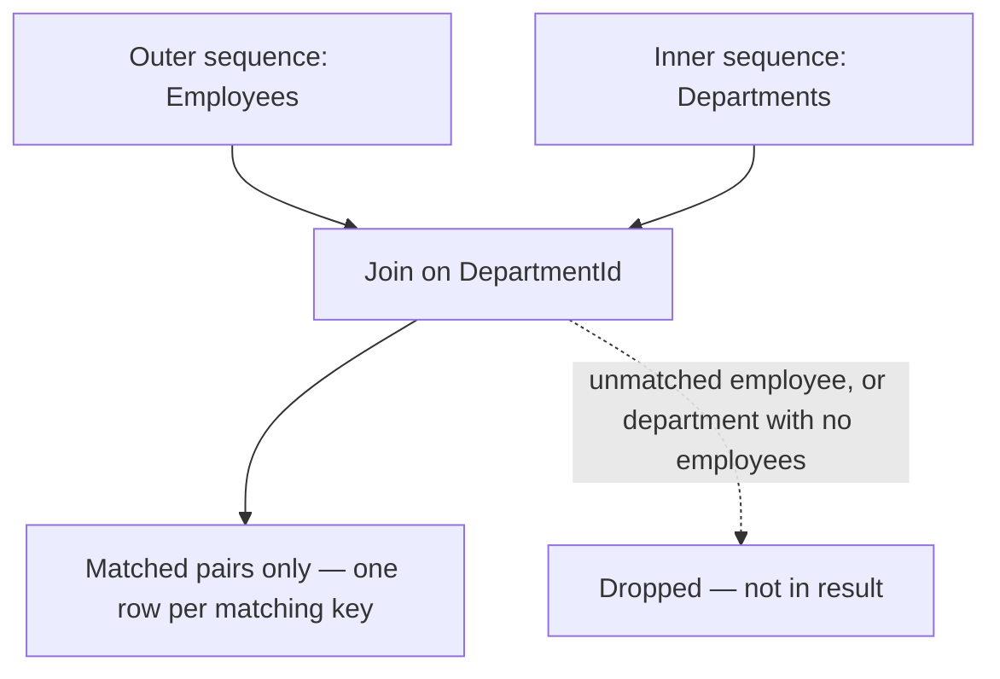
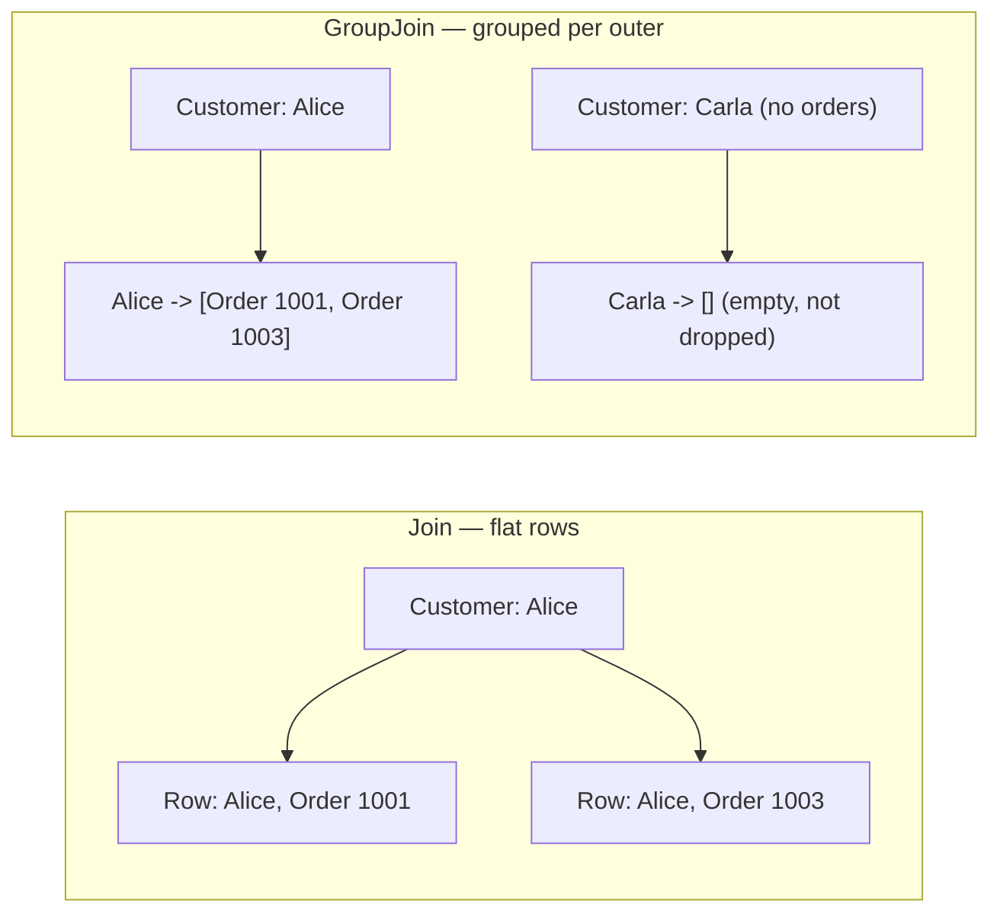

# Joining Data with Join

## Introduction

Before reading this lesson, you should already be comfortable with **[Grouping with GroupBy](../04-linq/04-08-grouping-with-groupby.md)**. Grouping partitions *one* sequence by a key it already contains within itself. This lesson tackles a related but distinct problem: combining *two separate* sequences — say, a list of orders and a completely independent list of customers — by matching a key that appears in both. That's what LINQ's `Join` operator is for, and it behaves almost exactly like a SQL `INNER JOIN`.

By the end of this lesson, you will be able to:

- Combine two independent sequences into one using `Join`, matching elements on a shared key
- Explain why `Join` only produces a result for keys that exist on *both* sides, discarding unmatched elements from either sequence
- Compare `Join`'s behavior directly to a SQL `INNER JOIN`
- Project a combined result shape that pulls fields from both the outer and inner matched elements
- Recognize when relational, foreign-key-style data — rather than nested collections — calls for `Join` instead of `SelectMany`

## Joining Data with Join — A Layman's Perspective

Picture two separate filing cabinets in an office: one cabinet holds a folder for every registered customer, organized by customer account number, and a completely different cabinet holds a folder for every order that's come in, each order folder stamped with the account number of whichever customer placed it. These two cabinets were never designed to be browsed together — they're maintained by different departments, updated on different schedules, and neither one contains a copy of the other's information.

Now imagine a clerk is asked to produce a single report listing every order alongside the name and city of the customer who placed it. The clerk's task is mechanical but requires discipline: for every order folder, look at the account number stamped on it, go find the *one* customer folder in the other cabinet with that exact same account number, and staple a summary of both together into one combined sheet. If an order folder is stamped with an account number that simply doesn't exist in the customer cabinet — perhaps a data-entry error, or a customer record that was archived — that order can't be matched to anything, and the clerk leaves it out of the combined report entirely, because there's nothing to staple it to. Likewise, if a customer has a folder in the customer cabinet but has never placed a single order, that customer never shows up in the combined report either — there's no order folder carrying their account number for the clerk to match against.

The finished report, then, only ever contains pairs that both sides agreed on: an order that really does correspond to a real, findable customer. Nothing appears in the report on the strength of just one cabinet alone. This "both sides must agree" rule is the entire point of the exercise — the clerk isn't just piling every order and every customer into one long list; they're deliberately producing only the *matched* pairs, and silently dropping anything from either cabinet that has no counterpart on the other side.

This is precisely the behavior of a join between two independent datasets. One sequence (orders) carries a foreign key (the account number); a second, entirely separate sequence (customers) carries the same kind of key as its own identity. Matching them up — and only keeping the pairs where a match genuinely exists on both sides — is what `Join` does in C#, the same way it's what an `INNER JOIN` does in SQL, and the same way it's what the office clerk did by hand with two filing cabinets.

## Joining Data with Join — A Programming Language Perspective

`Join<TOuter, TInner, TKey, TResult>` is the LINQ standard query operator that combines two sequences — an outer sequence and an inner sequence — by matching a key selector applied to each. For every element in the outer sequence, `Join` looks for elements in the inner sequence whose key compares equal, and produces one result for each such matching pair via a result selector; outer elements with no matching inner element produce no result at all, and inner elements with no matching outer element are likewise never surfaced. This is exactly the semantics of a SQL `INNER JOIN`. Under the hood, LINQ to Objects builds a lookup from the inner sequence keyed by the key selector, so the join runs in roughly linear time rather than comparing every outer element against every inner element. In query syntax, `join inner in innerSequence on outerKey equals innerKey` compiles directly to this operator. `Join` also has an overload accepting a custom `IEqualityComparer<TKey>` for cases where the default equality comparison for the key type isn't the comparison you want, such as case-insensitive string keys.

## How to Join Two Sequences in C#

`Join` needs four things: the inner sequence to join against, a key selector for the outer sequence, a key selector for the inner sequence, and a result selector describing what a matched pair should look like. Only pairs whose keys compare equal ever reach the result selector.


*Figure 1: `Join` produces one result per matched pair and silently drops anything from either side that has no counterpart on the other.*

```csharp
// Program.cs — .NET 10 / C# 14

record Employee(int EmployeeId, string Name, int DepartmentId);
record Department(int DepartmentId, string DepartmentName);

List<Employee> employees =
[
    new Employee(1, "Ann", 10),
    new Employee(2, "Bo", 20),
    new Employee(3, "Cy", 99) // DepartmentId 99 doesn't exist below — no match.
];

List<Department> departments =
[
    new Department(10, "Engineering"),
    new Department(20, "Sales"),
    new Department(30, "Marketing") // No employee has DepartmentId 30 — no match.
];

var employeeDepartments = employees.Join(
    departments,
    emp => emp.DepartmentId,
    dept => dept.DepartmentId,
    (emp, dept) => new { emp.Name, dept.DepartmentName });

Console.WriteLine("Matched employee-department pairs (inner join):");
foreach (var row in employeeDepartments)
{
    Console.WriteLine($"  {row.Name} works in {row.DepartmentName}");
}

Console.WriteLine($"\nTotal matched pairs: {employeeDepartments.Count()} (out of {employees.Count} employees, {departments.Count} departments)");
```

**Console Output:**

```text
Matched employee-department pairs (inner join):
  Ann works in Engineering
  Bo works in Sales

Total matched pairs: 2 (out of 3 employees, 3 departments)
```

Cy is missing from the output entirely — their `DepartmentId` of 99 has no matching `Department`, so `Join` never produces a row for them. Marketing is missing too, for the mirror-image reason: no employee has `DepartmentId` 30, so the department with no staff never appears in the result either. Only two matched pairs remain out of three employees and three departments, which is exactly the "both sides must agree" behavior an `INNER JOIN` guarantees.

## Real-Time Example: Joining Orders to Customers in E-Commerce Order Processing

We extend the E-Commerce Order Processing case study by formalizing a `Customer` type with a `CustomerId`, and updating `Order` to carry a `CustomerId` foreign key instead of a duplicated customer name — the same normalized, relational shape a real database schema would use. A billing report needs each order enriched with its customer's name and city, and it must gracefully skip any order whose customer record can no longer be found.

```csharp
// Program.cs — .NET 10 / C# 14 — Real-Time Example

record Customer(int CustomerId, string Name, string City);
record Order(int OrderId, int CustomerId, decimal Total);

List<Customer> customers =
[
    new Customer(1, "Alice Chen", "Seattle"),
    new Customer(2, "Brian Osei", "Austin"),
    new Customer(3, "Carla Gomez", "Denver") // Has no orders below — excluded from the join.
];

List<Order> orders =
[
    new Order(1001, CustomerId: 1, Total: 84.48m),
    new Order(1002, CustomerId: 2, Total: 89.99m),
    new Order(1003, CustomerId: 1, Total: 153.98m),
    new Order(1004, CustomerId: 99, Total: 42.00m) // CustomerId 99 doesn't exist — excluded.
];

var billingReport = orders.Join(
    customers,
    order => order.CustomerId,
    customer => customer.CustomerId,
    (order, customer) => new { order.OrderId, customer.Name, customer.City, order.Total });

Console.WriteLine("Billing report (order + customer, inner join):");
foreach (var line in billingReport)
{
    Console.WriteLine($"  Order #{line.OrderId} | {line.Name} ({line.City}) | {line.Total:C}");
}

int unmatchedOrders = orders.Count() - billingReport.Count();
Console.WriteLine($"\nOrders excluded due to missing customer record: {unmatchedOrders}");
```

**Console Output:**

```text
Billing report (order + customer, inner join):
  Order #1001 | Alice Chen (Seattle) | $84.48
  Order #1002 | Brian Osei (Austin) | $89.99
  Order #1003 | Alice Chen (Seattle) | $153.98

Orders excluded due to missing customer record: 1
```

Order #1004 references `CustomerId` 99, which has no matching `Customer` record — perhaps the account was deleted after the order was placed — and `Join` correctly excludes it from the billing report rather than producing a row with a missing or null customer name. Carla Gomez, who has a valid customer record but has never placed an order, also never appears, because nothing on the order side carries her `CustomerId`. A real billing system depends on exactly this behavior: it would be a much worse bug to silently print a blank customer name for order #1004 than to simply omit a row that has no valid customer to bill.

## Join vs GroupJoin

`Join` and `GroupJoin` both match two sequences on a key, but they differ sharply in the *shape* of the result. `Join` produces one flat row per matched pair — if one customer has three matching orders, `Join` produces three separate rows, one per order, each carrying a copy of that customer's details. `GroupJoin`, covered in the next lesson, instead produces one result *per outer element*, with all of its matching inner elements attached as a single collection — one row per customer, carrying a list of that customer's orders, however many there are (including zero). `Join` also has no way to represent an unmatched outer element at all — it simply excludes it — while `GroupJoin` explicitly keeps every outer element and just gives unmatched ones an empty inner collection, which is the foundation the next lesson builds on to emulate a SQL `LEFT OUTER JOIN`.


*Figure 2: `Join` flattens matches into individual rows and drops unmatched outer elements; `GroupJoin` keeps every outer element and groups its matches (even zero of them) alongside it.*

| Aspect | `Join` | `GroupJoin` |
|---|---|---|
| Result shape | One flat row per matched pair | One result per outer element, with a collection of all its matches |
| Outer element with no match | Excluded entirely from the result | Included, with an empty inner collection |
| Closest SQL equivalent | `INNER JOIN` | No direct single-clause equivalent; foundation for emulating `LEFT OUTER JOIN` |
| Typical use | Combined, flattened rows — e.g. order + customer details | Master-detail shape — e.g. each customer with all of their orders |

## Types and Variants of Joining in C#

`Join` is one member of a small family of key-based and positional combination operators:

1. **`Join` (basic overload)** — the inner-join-style match used throughout this lesson.
2. **`Join` with a custom `IEqualityComparer<TKey>`** — for key comparisons that shouldn't use the default equality, such as case-insensitive string matching.
3. **Query syntax `join ... in ... on ... equals ...`** — compiles directly to the method-syntax `Join` shown above.
4. **[GroupJoin and Left-Outer-Join Patterns](../04-linq/04-10-groupjoin-left-outer-join.md)** — groups matches per outer element instead of flattening them, and keeps unmatched outer elements.
5. **[`Zip` and Combining Sequences](../04-linq/04-16-zip-and-combining-sequences.md)** — combines two sequences positionally, by index, rather than by matching keys at all.
6. **[`ToLookup` and Lookup Tables](../04-linq/04-17-tolookup-and-lookup-tables.md)** — the indexed structure `Join` builds internally from the inner sequence to make matching efficient.

## What You've Learned & What's Next

`Join` combines two independent sequences into one, producing exactly one result per matched key pair and silently excluding anything from either side that has no counterpart — the same "both sides must agree" semantics as a SQL `INNER JOIN`. The billing report example showed why that matters concretely: an order referencing a missing customer is correctly dropped rather than reported with incomplete data.

Continue your learning journey with **[GroupJoin and Left-Outer-Join Patterns](../04-linq/04-10-groupjoin-left-outer-join.md)**, where we learn how to keep *every* outer element — even ones with zero matches — and emulate a SQL `LEFT OUTER JOIN`.

---
*Applies to: .NET 10 / C# 14. Last reviewed 2026-08-16.*
