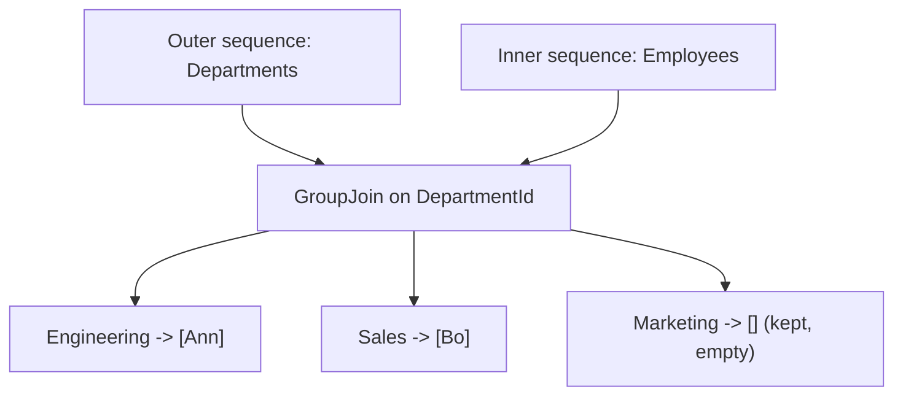
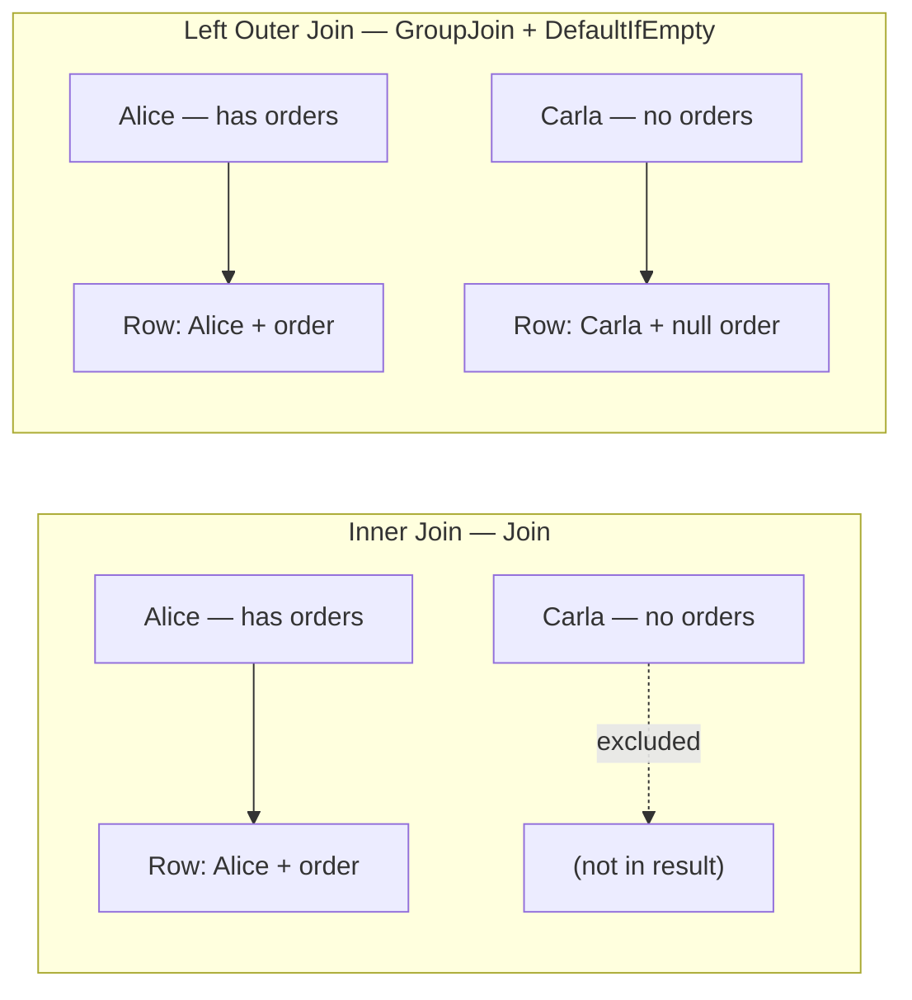

# GroupJoin and Left-Outer-Join Patterns

## Introduction

Before reading this lesson, you should already be comfortable with **[Joining Data with Join](../04-linq/04-09-joining-data-with-join.md)** and its central limitation: `Join` only ever produces a result for keys that exist on *both* sides, silently dropping any outer element with no match at all. That's exactly right for a billing report that only cares about orders with a valid customer — but plenty of real questions need the opposite guarantee: "show me *every* customer, whether or not they've ordered anything." This lesson introduces `GroupJoin`, and the `SelectMany` + `DefaultIfEmpty` pattern that turns it into a LINQ equivalent of a SQL `LEFT OUTER JOIN`.

By the end of this lesson, you will be able to:

- Use `GroupJoin` to pair every outer element with the full collection of its matches from an inner sequence, including an empty collection when there are none
- Explain why `GroupJoin` keeps every outer element but still drops inner elements that match nothing
- Flatten a `GroupJoin` result with `SelectMany` and `DefaultIfEmpty` to emulate a SQL `LEFT OUTER JOIN`
- Distinguish this pattern's flat left-outer-join rows from `GroupJoin`'s own grouped, master-detail shape
- Choose between `Join`, `GroupJoin`, and the left-outer-join pattern based on whether unmatched outer elements should be excluded, grouped, or flattened with a placeholder

## GroupJoin and Left-Outer-Join Patterns — A Layman's Perspective

Return to the office clerk from the previous lesson, still working with the customer filing cabinet and the order filing cabinet — but now imagine a different manager walks in with a different request. Instead of "give me a report of every order matched to its customer," the manager says: "I need a complete roster of every single customer we have on file, and next to each one, list every order they've placed — and if a customer hasn't placed any orders at all, I still want them on the roster, just with an empty list next to their name." This is a meaningfully different task from before. The clerk can no longer simply skip customers with no matching orders, because the whole point of the roster is completeness — every customer must appear, no exceptions.

The clerk's new process looks like this: go through the customer cabinet one folder at a time, and for each customer, search the order cabinet for every order stamped with that customer's account number. If there are three matching orders, staple all three onto that customer's roster line. If there's exactly one, staple that one. And if there are none whatsoever, the customer still gets a line on the roster — it's just left blank underneath their name, or marked "no orders on file," rather than the customer being omitted entirely. Notice this produces a genuinely different shape of paperwork than before: instead of one flat sheet with one line per matched order, you now have one line *per customer*, and some of those lines have several orders bundled underneath them while others have none at all.

Now suppose a second manager arrives with yet another request, building on that same roster: "actually, I want this printed as one flat list again, one line per order — but unlike the earlier report, I still want every customer to appear at least once, even the ones with zero orders, just with blanks where the order details would normally go." The clerk handles this by taking the roster they just built and "unrolling" it back into flat lines: each customer with orders gets one line per order, exactly like before, but a customer with zero orders still gets exactly one line, with the order columns simply left blank rather than the customer vanishing from the page.

That two-step process — first build a complete roster where every customer is guaranteed to appear with all of their matches (or none), then unroll that roster back into flat lines while preserving the customers who had nothing to unroll — is precisely what `GroupJoin` followed by `SelectMany` and `DefaultIfEmpty` accomplishes in code. It's the disciplined way to guarantee "everyone appears, matched or not," which a plain `Join` structurally cannot do.

## GroupJoin and Left-Outer-Join Patterns — A Programming Language Perspective

`GroupJoin<TOuter, TInner, TKey, TResult>` is the LINQ standard query operator that pairs each element of an outer sequence with the *collection* of all inner-sequence elements whose key matches it — producing exactly one result per outer element, regardless of how many inner elements matched, including zero. Unlike `Join`, no outer element is ever dropped; an outer element with no matches simply receives an empty `IEnumerable<TInner>` rather than being excluded. Inner elements that match no outer element, however, are still never surfaced by `GroupJoin` — that asymmetry is preserved from `Join`. C# has no single operator that directly emulates a SQL `LEFT OUTER JOIN`; instead, the idiomatic LINQ pattern composes three operators: `GroupJoin` to produce the grouped, master-detail shape, `SelectMany` to flatten each group back into individual rows, and `DefaultIfEmpty()` on each group *before* flattening, so that a group with zero inner elements still yields exactly one row — carrying `default(TInner)` (typically `null` for reference types) — instead of contributing zero rows and disappearing from the flattened result. In query syntax, `join inner in innerSequence on outerKey equals innerKey into groupName` compiles to `GroupJoin`.

## How to Use GroupJoin in C#

`GroupJoin` takes the same four arguments as `Join` — an inner sequence, two key selectors, and a result selector — but its result selector receives the *entire matching collection* for the current outer element, not one inner element at a time.


*Figure 1: `GroupJoin` keeps every outer element — even Marketing, which has no matching employees — and groups its matches alongside it.*

```csharp
// Program.cs — .NET 10 / C# 14

record Department(int DepartmentId, string DepartmentName);
record Employee(int EmployeeId, string Name, int DepartmentId);

List<Department> departments =
[
    new Department(10, "Engineering"),
    new Department(20, "Sales"),
    new Department(30, "Marketing") // No employees below — kept anyway, with an empty group.
];

List<Employee> employees =
[
    new Employee(1, "Ann", 10),
    new Employee(2, "Bo", 20),
    new Employee(3, "Cy", 99) // DepartmentId 99 doesn't exist above — never surfaced by GroupJoin.
];

var departmentRoster = departments.GroupJoin(
    employees,
    dept => dept.DepartmentId,
    emp => emp.DepartmentId,
    (dept, matchedEmployees) => new { dept.DepartmentName, Employees = matchedEmployees.ToList() });

Console.WriteLine("Department roster (every department, matched employees grouped):");
foreach (var row in departmentRoster)
{
    string names = row.Employees.Count > 0
        ? string.Join(", ", row.Employees.Select(e => e.Name))
        : "(no employees)";
    Console.WriteLine($"  {row.DepartmentName}: {names}");
}
```

**Console Output:**

```text
Department roster (every department, matched employees grouped):
  Engineering: Ann
  Sales: Bo
  Marketing: (no employees)
```

Marketing appears on the roster despite having zero matching employees — that's the defining difference from `Join`, which would have dropped Marketing entirely. Cy, meanwhile, never appears anywhere in the output: their `DepartmentId` of 99 matches no department, and `GroupJoin` — like `Join` — never surfaces inner elements that match nothing on the outer side. Only the outer sequence (departments) is guaranteed complete coverage; the inner sequence (employees) is not.

## Real-Time Example: A Complete Customer Roster in E-Commerce Order Processing

We continue building on the `Customer` and `Order` types from the previous lesson's billing report. A customer relationship team needs a complete roster of every customer — including ones who have never ordered anything, so they can be targeted for a first-purchase promotion — and separately, a flat activity log with one row per order, or one placeholder row for customers with none, which is exactly what the `GroupJoin` + `SelectMany` + `DefaultIfEmpty` pattern produces.

```csharp
// Program.cs — .NET 10 / C# 14 — Real-Time Example

record Customer(int CustomerId, string Name, string City);
record Order(int OrderId, int CustomerId, decimal Total);

List<Customer> customers =
[
    new Customer(1, "Alice Chen", "Seattle"),
    new Customer(2, "Brian Osei", "Austin"),
    new Customer(3, "Carla Gomez", "Denver") // Placed no orders below — must still appear.
];

List<Order> orders =
[
    new Order(1001, CustomerId: 1, Total: 84.48m),
    new Order(1002, CustomerId: 2, Total: 89.99m),
    new Order(1003, CustomerId: 1, Total: 153.98m),
    new Order(1004, CustomerId: 99, Total: 42.00m) // No matching customer — never surfaced, same as Join.
];

// GroupJoin: every customer, paired with the full collection of their orders.
var customerOrderGroups = customers.GroupJoin(
    orders,
    customer => customer.CustomerId,
    order => order.CustomerId,
    (customer, matchedOrders) => new { Customer = customer, Orders = matchedOrders });

Console.WriteLine("GroupJoin — every customer, orders grouped:");
foreach (var group in customerOrderGroups)
{
    string summary = group.Orders.Any()
        ? string.Join(", ", group.Orders.Select(o => $"#{o.OrderId}"))
        : "(none)";
    Console.WriteLine($"  {group.Customer.Name}: {summary}");
}

// SelectMany + DefaultIfEmpty: flatten back into rows, but a customer with
// zero orders still yields exactly one row — with a null order — instead of
// disappearing, emulating a SQL LEFT OUTER JOIN.
var leftOuterJoinRows = customerOrderGroups.SelectMany(
    group => group.Orders.DefaultIfEmpty(),
    (group, order) => new
    {
        group.Customer.Name,
        group.Customer.City,
        OrderId = order?.OrderId,
        Total = order?.Total ?? 0m
    });

Console.WriteLine("\nLeft-outer-join rows (flattened, customers without orders kept):");
foreach (var row in leftOuterJoinRows)
{
    Console.WriteLine(row.OrderId is int orderId
        ? $"  {row.Name} ({row.City}) | Order #{orderId} | {row.Total:C}"
        : $"  {row.Name} ({row.City}) | No orders placed");
}
```

**Console Output:**

```text
GroupJoin — every customer, orders grouped:
  Alice Chen: #1001, #1003
  Brian Osei: #1002
  Carla Gomez: (none)

Left-outer-join rows (flattened, customers without orders kept):
  Alice Chen (Seattle) | Order #1001 | $84.48
  Alice Chen (Seattle) | Order #1003 | $153.98
  Brian Osei (Austin) | Order #1002 | $89.99
  Carla Gomez (Denver) | No orders placed
```

Carla Gomez appears in both outputs even though she has never placed an order — the customer relationship team can see her on the roster and target her for a promotion, which a plain `Join` would have made impossible since it would have excluded her entirely. Order #1004, referencing a nonexistent `CustomerId` of 99, still never appears anywhere — `GroupJoin`'s completeness guarantee only ever applies to the outer sequence (customers), never to the inner sequence (orders), which is exactly consistent with how `Join` behaved in the previous lesson.

## Inner Join vs Left Outer Join

`Join` and the `GroupJoin` + `DefaultIfEmpty` pattern answer subtly different business questions, and mixing them up produces reports that are either missing rows a stakeholder expected, or padded with rows a stakeholder didn't expect. `Join` (an inner join) answers "show me only the matched pairs" — correct for a billing report that has nothing meaningful to say about a customer with no orders. The left-outer-join pattern answers "show me every record on the primary side, matched or not" — correct for a customer roster, an inventory audit, or anything where the *absence* of a match is itself the useful signal.


*Figure 2: An inner join silently excludes Carla because she has no matching order; the left-outer-join pattern keeps her, with a null in place of the missing order.*

| Aspect | Inner Join (`Join`) | Left Outer Join (`GroupJoin` + `DefaultIfEmpty`) |
|---|---|---|
| Outer elements with no match | Excluded from the result entirely | Included, with a default/null inner value |
| Operators required | `Join` alone | `GroupJoin`, then `SelectMany`, then `DefaultIfEmpty` |
| SQL equivalent | `INNER JOIN` | `LEFT OUTER JOIN` |
| Result shape | Flat, one row per matched pair | Flat, one row per match, plus one placeholder row per unmatched outer element |
| Typical use | Only entities that genuinely have a counterpart matter | Every entity on the primary side must be reported, matched or not |

## Types and Variants of GroupJoin in C#

`GroupJoin` and its left-outer-join pattern connect to several related operators and the module's next topic, aggregation:

1. **`GroupJoin` (basic form)** — every outer element paired with its full collection of matches, used for the department and customer rosters above.
2. **`GroupJoin` + `SelectMany` + `DefaultIfEmpty`** — the flattening pattern that emulates a SQL `LEFT OUTER JOIN`.
3. **Query syntax `join ... into groupName`** — compiles directly to `GroupJoin`.
4. **[Joining Data with Join](../04-linq/04-09-joining-data-with-join.md)** — the inner-join sibling that excludes unmatched outer elements instead of keeping them.
5. **[Aggregation: Sum, Count, Average, Min, Max](../04-linq/04-11-aggregation-sum-count-average.md)** — commonly applied to each `GroupJoin` group, e.g. counting how many orders each customer placed, including zero.
6. **[`ToLookup` and Lookup Tables](../04-linq/04-17-tolookup-and-lookup-tables.md)** — an alternative, eagerly built structure that also supports "ask for a key that might not exist" without excluding anything.

## What You've Learned & What's Next

`GroupJoin` guarantees every outer element appears in the result, paired with the full collection of its matches — even an empty one — which `Join` structurally cannot do. Flattening that grouped result with `SelectMany` and `DefaultIfEmpty` produces the LINQ equivalent of a SQL `LEFT OUTER JOIN`: flat rows, but with a placeholder row preserved for anything that had no match, as the customer roster example demonstrated by keeping Carla Gomez visible despite having never placed an order.

Continue your learning journey with **[Aggregation: Sum, Count, Average, Min, Max](../04-linq/04-11-aggregation-sum-count-average.md)**, where we take grouped and joined data like this and reduce it down to single summary numbers.

---
*Applies to: .NET 10 / C# 14. Last reviewed 2026-08-16.*
