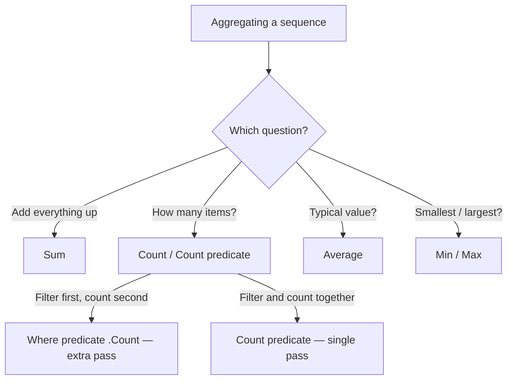
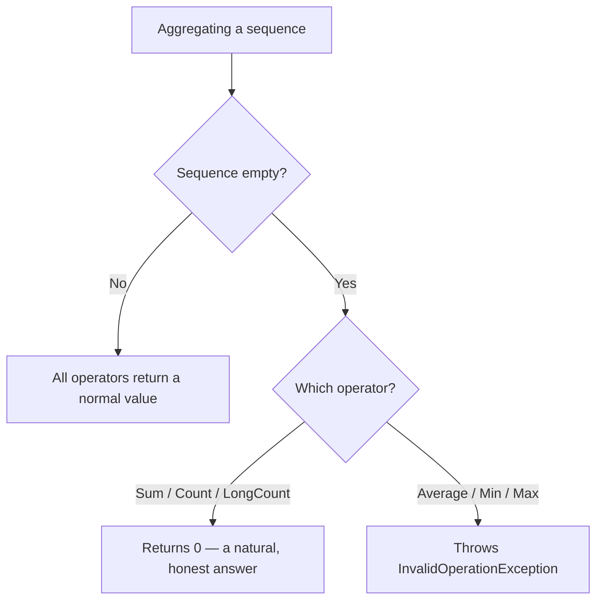

# Aggregation: Sum, Count, Average, Min, Max

## Introduction

Before reading this lesson, you should already be comfortable with **[GroupJoin and Left-Outer-Join Patterns](../04-linq/04-10-groupjoin-left-outer-join.md)**, and more broadly with the idea that LINQ operators either transform a sequence into another sequence (`Where`, `Select`, `GroupBy`, `Join`) or run it through to completion immediately. This lesson introduces the second category properly: the **aggregation operators** — `Sum`, `Count`, `Average`, `Min`, and `Max` — which collapse an entire sequence down into a single scalar value.

By the end of this lesson, you will be able to:

- Use `Sum`, `Count`, `Average`, `Min`, and `Max` with and without a selector function
- Distinguish `Count(predicate)` from `Where(predicate).Count()` and explain why the difference matters
- Explain why `Average`, `Min`, and `Max` throw `InvalidOperationException` on an empty sequence while `Sum` and `Count` do not
- Choose the correct aggregation overload when summarizing a property of a complex type
- Defensively guard aggregation calls against empty-sequence exceptions in production code

## Aggregation — A Layman's Perspective

Picture the manager of a small retail store closing out the cash register at the end of the day. Several numbers matter for that end-of-day report, and each one is calculated in a genuinely different way, even though they all come from the exact same pile of receipts sitting in the till.

The first number is the **total revenue** — the manager adds up every single receipt, one after another, until every dollar has been counted. Whether there were three receipts or three hundred, adding them together always produces a sensible number, and if there happened to be no receipts at all that day, the honest answer is simply zero dollars. Nothing about "add up nothing" is confusing — zero is a completely normal, meaningful answer.

The second number is the **transaction count** — literally just how many receipts are in the pile. Same story: if the store had no customers all day, the count is zero. Nobody is confused by a store reporting zero transactions; it is a perfectly ordinary, if disappointing, fact about the day.

But now consider a third number: the **average sale**. To compute this, the manager divides total revenue by transaction count. If there were zero transactions, this calculation breaks down completely — you cannot divide anything by zero and get a sensible dollar figure back. There simply is no "average sale" on a day with no sales; the question itself stops making sense. The same problem hits the fourth and fifth numbers, the **smallest sale** and the **largest sale** of the day. If no receipts exist, there is no smallest or largest receipt to point to — those questions presuppose that at least one sale happened.

This is precisely the split you will find in LINQ's aggregation operators. `Sum` and `Count` are like adding up receipts and counting them — they have a completely natural, honest answer even when the pile is empty, and that answer is zero. `Average`, `Min`, and `Max`, on the other hand, are like asking "what was the average/smallest/largest sale" on a day with no sales at all — the question presupposes at least one item exists to answer it, and when that assumption is false, C# refuses to make up a fake answer. Instead of silently returning some arbitrary placeholder number that a developer might mistake for real data, it throws an exception, forcing you to notice and handle the "there was nothing to aggregate" case explicitly, the same way a careful store manager would simply write "N/A" rather than inventing a fictional average sale for a day the store was closed.

That distinction — some questions have a natural zero answer, others don't — is the single most important thing to internalize before writing aggregation code, because it's exactly the boundary where production bugs hide.

## Aggregation — A Programming Language Perspective

`Sum`, `Count`, `Average`, `Min`, and `Max` are extension methods defined on `IEnumerable<T>` in `System.Linq`, and unlike `Where` or `Select`, they execute **immediately** rather than lazily — calling any of them walks the entire source sequence right then and there and returns a single scalar value, not another `IEnumerable<T>`. Each has a parameterless overload that operates directly on the sequence's elements (for numeric sequences) and a selector overload — `Sum(Func<TSource, TResult> selector)`, `Average(Func<TSource, TResult> selector)`, and so on — that projects each element to a numeric value first, which is the overload you reach for whenever `T` is a class or record rather than a bare number. `Count` additionally has a predicate overload, `Count(Func<T, bool> predicate)`, that filters and counts in a single pass. `Min` and `Max` are generic over any type implementing `IComparable<T>`, not just numeric types, since they only need to compare elements to each other, never add them. `Average` always widens its result — averaging a sequence of `int` returns `double`, since an average is rarely a whole number even when every input is.

## How to Use Aggregation Operators in C#

Before summarizing a sequence, it helps to see all five core operators applied to the same data side by side, and then to confront the empty-sequence question directly rather than discover it in production.


*Figure 1: Each aggregation operator answers a different question about the same sequence; `Count(predicate)` answers "how many match?" in one pass, while `Where(predicate).Count()` answers it in two.*

```csharp
// Program.cs — .NET 10 / C# 14

int[] dailySales = { 120, 45, 300, 75, 60, 15 };

int totalRevenue = dailySales.Sum();
int transactionCount = dailySales.Count();
double averageSale = dailySales.Average();
int smallestSale = dailySales.Min();
int largestSale = dailySales.Max();

Console.WriteLine($"Total revenue: {totalRevenue:C}");
Console.WriteLine($"Transaction count: {transactionCount}");
Console.WriteLine($"Average sale: {averageSale:C}");
Console.WriteLine($"Smallest sale: {smallestSale:C}");
Console.WriteLine($"Largest sale: {largestSale:C}");

// Count(predicate) filters and counts in one pass over the sequence.
int largeSaleCount = dailySales.Count(sale => sale >= 100);
Console.WriteLine($"Sales of $100 or more (Count predicate): {largeSaleCount}");

// Where(predicate).Count() reaches the same answer, but builds a filtered
// sequence first and then counts it — an extra, unnecessary step.
int largeSaleCountViaWhere = dailySales.Where(sale => sale >= 100).Count();
Console.WriteLine($"Sales of $100 or more (Where().Count()): {largeSaleCountViaWhere}");
```

**Console Output:**

```text
Total revenue: $615.00
Transaction count: 6
Average sale: $102.50
Smallest sale: $15.00
Largest sale: $300.00
Sales of $100 or more (Count predicate): 2
Sales of $100 or more (Where().Count()): 2
```

Both `Count` approaches print the same answer, `2`, because they're logically equivalent — but they are not mechanically identical. `Where(sale => sale >= 100)` first builds a filtered sequence (deferred, but still materialized when `Count()` enumerates it), and only then counts its elements. `Count(sale => sale >= 100)` never builds an intermediate sequence at all; it walks the source once, incrementing a counter for each match. For small in-memory arrays the difference is invisible, but `Count(predicate)` is both clearer intent and marginally cheaper, so prefer it over chaining `Where().Count()`.

Now the empty-sequence question, made concrete:

```csharp
// Program.cs — .NET 10 / C# 14 — empty-sequence behavior

int[] emptySales = Array.Empty<int>();

Console.WriteLine($"Sum of empty sequence: {emptySales.Sum()}");
Console.WriteLine($"Count of empty sequence: {emptySales.Count()}");

try
{
    double average = emptySales.Average();
    Console.WriteLine($"Average: {average}");
}
catch (InvalidOperationException ex)
{
    Console.WriteLine($"Average threw: {ex.Message}");
}

try
{
    int min = emptySales.Min();
    Console.WriteLine($"Min: {min}");
}
catch (InvalidOperationException ex)
{
    Console.WriteLine($"Min threw: {ex.Message}");
}
```

**Console Output:**

```text
Sum of empty sequence: 0
Count of empty sequence: 0
Average threw: Sequence contains no elements
Min threw: Sequence contains no elements
```

`Sum` and `Count` handle the empty array without complaint, because zero is a perfectly valid total and a perfectly valid count. `Average` and `Min`, by contrast, throw the exact moment there is nothing to average or compare — there is no sensible `double` or `int` value they could silently return instead that wouldn't risk being mistaken for real data. `Max` behaves identically to `Min` here. Any code that aggregates a sequence whose size isn't guaranteed at compile time — user input, a database query result, a filtered collection — needs to account for this before calling `Average`, `Min`, or `Max`.

## Real-Time Example: Aggregation in E-Commerce Order Processing

We extend the E-Commerce Order Processing case study with an order-history summary — the kind of report a customer account page or a support dashboard would compute on demand. Given a customer's list of past orders, we aggregate total spend, order count, average order value, and the cheapest and most expensive order, then show the defensive pattern required for a brand-new customer with no order history at all.

```csharp
// Program.cs — .NET 10 / C# 14 — Real-Time Example

List<Order> customerOrders =
[
    new Order("ORD-6001", "Priya Patel", 89.99m),
    new Order("ORD-6002", "Priya Patel", 24.50m),
    new Order("ORD-6003", "Priya Patel", 154.00m),
    new Order("ORD-6004", "Priya Patel", 42.75m)
];

decimal totalSpent = customerOrders.Sum(order => order.Total);
int orderCount = customerOrders.Count();
decimal averageOrderValue = customerOrders.Average(order => order.Total);
decimal smallestOrder = customerOrders.Min(order => order.Total);
decimal largestOrder = customerOrders.Max(order => order.Total);
int ordersOverFifty = customerOrders.Count(order => order.Total > 50m);

Console.WriteLine("Customer: Priya Patel");
Console.WriteLine($"Total spent: {totalSpent:C}");
Console.WriteLine($"Order count: {orderCount}");
Console.WriteLine($"Average order value: {averageOrderValue:C}");
Console.WriteLine($"Smallest order: {smallestOrder:C}");
Console.WriteLine($"Largest order: {largestOrder:C}");
Console.WriteLine($"Orders over $50: {ordersOverFifty}");

// A brand-new customer has no order history yet — guard before aggregating,
// since Average/Min/Max throw on an empty sequence but Sum/Count do not.
List<Order> newCustomerOrders = [];

decimal newCustomerTotal = newCustomerOrders.Sum(order => order.Total);
decimal newCustomerAverage = newCustomerOrders.Count == 0
    ? 0m
    : newCustomerOrders.Average(order => order.Total);

Console.WriteLine();
Console.WriteLine($"New customer total spent: {newCustomerTotal:C}");
Console.WriteLine($"New customer average order value: {newCustomerAverage:C}");

record Order(string OrderId, string CustomerName, decimal Total);
```

**Console Output:**

```text
Customer: Priya Patel
Total spent: $311.24
Order count: 4
Average order value: $77.81
Smallest order: $24.50
Largest order: $154.00
Orders over $50: 2

New customer total spent: $0.00
New customer average order value: $0.00
```

Notice the guard clause `newCustomerOrders.Count == 0 ? 0m : ...Average(...)` — this is not defensive paranoia, it is a required check. Without it, the moment a real customer account page renders for a first-time visitor with zero orders, `Average` throws `InvalidOperationException` and the page crashes instead of showing "$0.00 average order value." `Sum` and `Count`, on the other hand, needed no such guard at all — they handled the empty list correctly on their own. A production reporting dashboard that aggregates across hundreds of customer accounts will inevitably hit at least one account with no history; code that doesn't account for this ships a live bug.

## Aggregating an Empty Sequence: Sum/Count vs Average/Min/Max

The single most important distinction in this lesson is not between the five operators individually, but between the two groups they fall into once the source sequence might be empty. `Sum` and `Count` (and its cousin `LongCount`) always have a mathematically honest zero answer, so they never need special-casing. `Average`, `Min`, and `Max` are all fundamentally division- or comparison-based questions that simply have no answer when there is nothing to divide or compare, so the runtime refuses to fabricate one and throws instead.


*Figure 2: `Sum` and `Count` have a natural "zero" answer for an empty sequence; `Average`, `Min`, and `Max` do not, so they throw rather than guess.*

| Aspect | `Sum()` / `Count()` | `Average()` / `Min()` / `Max()` |
|---|---|---|
| Empty-sequence result | Returns `0` | Throws `InvalidOperationException` |
| Why | Zero items sums to zero, counts to zero — always meaningful | There is no meaningful "average," "smallest," or "largest" of nothing |
| Return type | Same numeric type as elements (or wider, e.g. `long` for `LongCount`) | `Average` always returns a floating/decimal type; `Min`/`Max` match the element type |
| Safe usage pattern | Call directly, no guard required | Check `.Count == 0` or `.Any()` first, or catch `InvalidOperationException` |

## Types of Aggregation Operators in C#

`Sum`, `Count`, `Average`, `Min`, and `Max` are the core aggregation operators, but a few related operators and overloads are worth knowing as you go further:

1. **[Custom Aggregation with Aggregate](../04-linq/04-12-custom-aggregation-with-aggregate.md)** — the general-purpose fold/reduce operator for aggregation logic none of these five built-ins express directly.
2. **`LongCount()`** — behaves exactly like `Count()` but returns `long`, for sequences large enough that a plain `int` count could overflow.
3. **`MinBy()` / `MaxBy()`** *(since .NET 6)* — return the entire element with the smallest/largest key, rather than just the key value itself, useful when you need "the cheapest order," not just its price.
4. **[Grouping with GroupBy](../04-linq/04-08-grouping-with-groupby.md)** — frequently paired with these aggregation operators to compute a sum or average *per group*, not just across the whole sequence.
5. **Nullable numeric overloads** — `Sum`/`Average` over sequences of `int?`, `decimal?`, and similar nullable numeric types automatically skip `null` elements rather than throwing.

## What You've Learned & What's Next

`Sum`, `Count`, `Average`, `Min`, and `Max` collapse a sequence into a single scalar, but they don't all agree on what an empty sequence means: `Sum` and `Count` treat it as a natural zero, while `Average`, `Min`, and `Max` treat it as an unanswerable question and throw `InvalidOperationException`. Guarding aggregation calls against empty input — as the new-customer example above did — is not optional defensive coding; it is required for any sequence whose size isn't guaranteed at compile time.

Continue your learning journey with **[Custom Aggregation with Aggregate](../04-linq/04-12-custom-aggregation-with-aggregate.md)**, where we cover the general-purpose fold/reduce operator that underlies all of these built-ins and lets you express aggregation logic none of them cover directly.

---
*Applies to: .NET 10 / C# 14. Last reviewed 2026-08-16.*
