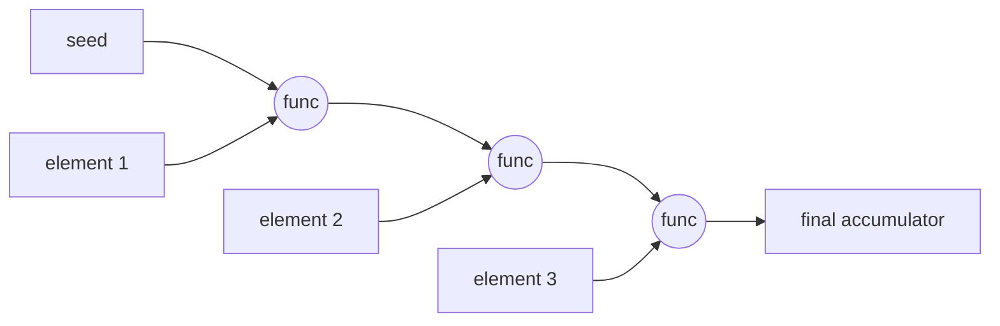
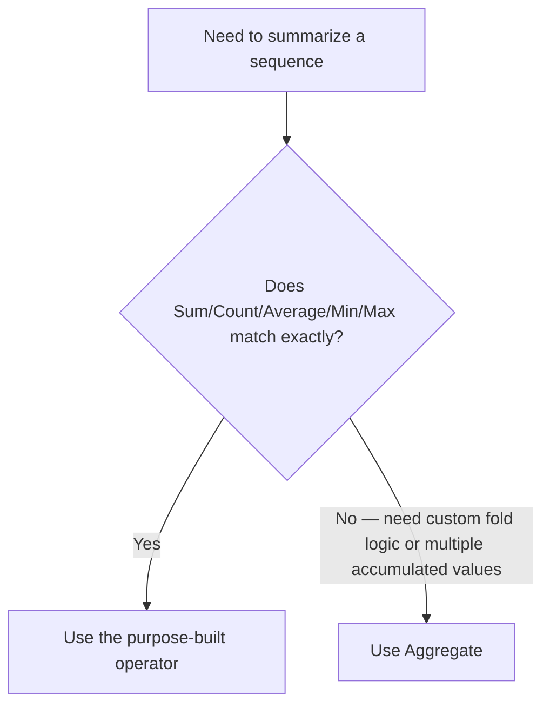

# Custom Aggregation with Aggregate

## Introduction

Before reading this lesson, you should already be comfortable with **[Aggregation: Sum, Count, Average, Min, Max](../04-linq/04-11-aggregation-sum-count-average.md)**. Those five operators cover the most common ways of collapsing a sequence into a single value, but they are all, in fact, special cases of one more general operator: `Aggregate`. This lesson introduces `Aggregate` as LINQ's general-purpose fold — the operator you reach for the moment your summarizing logic doesn't fit neatly into "add them up" or "find the biggest."

By the end of this lesson, you will be able to:

- Use the no-seed overload of `Aggregate` and explain the risk it carries on an empty sequence
- Use the seed-value overload to supply a starting value and avoid that risk
- Use the three-parameter overload with a result selector to transform the final accumulated value
- Implement custom fold logic — such as tracking multiple accumulated values at once — that no built-in operator expresses directly
- Decide when to reach for `Aggregate` versus a purpose-built operator like `Sum` or `Count`

## Aggregate — A Layman's Perspective

Picture a bookkeeper working through a stack of paper transaction slips by hand, updating a running balance in a ledger one slip at a time. The bookkeeper doesn't look at the whole stack at once and instantly know the final total — instead, they start with whatever number is currently written at the bottom of the ledger, pick up the next slip, add or subtract its amount from that running number, write the new running number down, and then move on to the next slip. By the time the stack is exhausted, the very last number written in the ledger is the answer — but crucially, every number along the way was built directly out of the number that came before it, plus one new slip.

This is exactly the shape of `Aggregate`. The "running number in the ledger" is called the **accumulator**, and each time it processes one more element from a sequence, it hands you the current accumulator and the next element, and asks you: "given where we are now, and this next piece of information, what should the new running value be?" Whatever you answer becomes the new accumulator, which then gets carried forward into the next round. This is a fundamentally different way of thinking about aggregation than `Sum` or `Max`, because those operators only ever do one specific kind of update — always add, always keep the bigger one. `Aggregate` doesn't care what the update rule is; you supply it, and it just keeps applying your rule, slip after slip, faithfully carrying the running value forward.

Now imagine the bookkeeper isn't just tracking a running balance — they're also keeping a second, parallel notebook where they jot down a one-line description of the balance after each slip, building up a full statement as they go. Nothing about "running total" logic alone gives you that second notebook for free; it requires carrying *two* pieces of state forward together, updated in lockstep, one slip at a time. A bookkeeper who insists on using only pre-printed forms — one for totals only, another for counts only — could never produce that combined statement. But a bookkeeper willing to define their own rule for "what happens to my running state when I see the next slip" can build almost anything: a balance, a formatted statement, a running maximum with a timestamp attached, anything at all.

That is the entire idea behind `Aggregate` — it is the blank ledger page rather than the pre-printed form, and once you're comfortable writing your own "given what I have so far, and this next item, what's my new running state?" rule, you stop being limited to whatever built-in aggregation operators happen to exist.

## Aggregate — A Programming Language Perspective

`Aggregate` is an extension method on `IEnumerable<T>` in `System.Linq`, and it is the general-purpose **fold** (sometimes called *reduce*) operation found across functional programming languages. It has three overloads. The simplest, `Aggregate(Func<TSource, TSource, TSource> func)`, uses the sequence's first element as the initial accumulator and applies `func` to each subsequent element — but it throws `InvalidOperationException` on an empty sequence, since there is no first element to seed with. The seed overload, `Aggregate<TSource, TAccumulate>(TAccumulate seed, Func<TAccumulate, TSource, TAccumulate> func)`, takes an explicit starting value, so an empty sequence simply returns the seed unchanged rather than throwing. The third overload adds a `Func<TAccumulate, TResult> resultSelector`, applied once at the very end to transform the final accumulator into a different return type entirely. Like every other aggregation operator, `Aggregate` executes immediately, walking the source sequence exactly once.

## How to Use Aggregate in C#

Before applying `Aggregate` to a realistic scenario, it helps to see all three overloads side by side, and to confront the same empty-sequence risk that `Min`/`Max`/`Average` carry, since the no-seed overload shares it.


*Figure 1: `Aggregate` threads an accumulator through the sequence one element at a time — each step's output becomes the next step's input, ending in the final accumulated value.*

```csharp
// Program.cs — .NET 10 / C# 14

int[] numbers = { 2, 3, 4, 5 };

// No-seed overload: the first element becomes the initial accumulator value.
int product = numbers.Aggregate((accumulator, next) => accumulator * next);
Console.WriteLine($"Product (no seed): {product}");

// Seed overload: start from an explicit value instead of the first element.
int sumStartingAt100 = numbers.Aggregate(100, (accumulator, next) => accumulator + next);
Console.WriteLine($"Sum starting at 100 (seed): {sumStartingAt100}");

// Result-selector overload: transform the final accumulator before returning it.
string summary = numbers.Aggregate(
    seed: 0,
    func: (accumulator, next) => accumulator + next,
    resultSelector: total => $"Total of {numbers.Length} numbers: {total}");
Console.WriteLine(summary);
```

**Console Output:**

```text
Product (no seed): 120
Sum starting at 100 (seed): 114
Total of 4 numbers: 14
```

`product` multiplies `2 * 3 * 4 * 5`, using `2` itself as the starting accumulator since no seed was supplied. `sumStartingAt100` begins at `100` instead of `0` and adds every element on top of it, landing on `114`. The result-selector overload computes the same plain sum, `14`, but then hands that number to `resultSelector` for one final transformation into a formatted string — the accumulator type (`int`) and the return type (`string`) don't have to match.

The no-seed overload carries the same empty-sequence risk as `Min`, `Max`, and `Average` from the previous lesson:

```csharp
int[] empty = Array.Empty<int>();

try
{
    int result = empty.Aggregate((acc, next) => acc + next);
    Console.WriteLine(result);
}
catch (InvalidOperationException ex)
{
    Console.WriteLine($"No-seed Aggregate threw: {ex.Message}");
}

// The seed overload never throws — it simply returns the seed unchanged.
int safeResult = empty.Aggregate(0, (acc, next) => acc + next);
Console.WriteLine($"Seeded Aggregate on empty sequence: {safeResult}");
```

**Console Output:**

```text
No-seed Aggregate threw: Sequence contains no elements
Seeded Aggregate on empty sequence: 0
```

The pattern is identical to what you saw with `Min`/`Max` in the previous lesson: whenever there's no natural starting value to fall back on, C# throws rather than guesses. Supplying an explicit seed sidesteps the exception entirely, which is why production code almost always prefers the seed overload over the bare no-seed one, even when the first element would have worked as a seed.

## Real-Time Example: Custom Aggregation in Banking/ATM Transaction History

We extend the Banking/ATM case study by folding a customer's transaction history into a fully formatted account statement — a running balance *and* a line-by-line record of that balance after every transaction, computed in a single pass with `Aggregate`. No built-in operator from the previous lesson could produce this on its own, because it requires carrying two pieces of state forward together: the running balance and the growing list of statement lines.

```csharp
// Program.cs — .NET 10 / C# 14 — Real-Time Example

List<Transaction> transactions =
[
    new Transaction("Opening balance", 500.00m),
    new Transaction("ATM withdrawal", -80.00m),
    new Transaction("Payroll deposit", 1200.00m),
    new Transaction("Utility bill payment", -145.50m),
    new Transaction("Coffee shop purchase", -6.75m)
];

// Aggregate folds two things at once: a running balance and a growing list
// of formatted statement lines — logic no built-in operator expresses directly.
var statement = transactions.Aggregate(
    seed: (Balance: 0m, Lines: new List<string>()),
    func: (state, transaction) =>
    {
        decimal newBalance = state.Balance + transaction.Amount;
        string sign = transaction.Amount >= 0 ? "+" : "-";
        string line = $"{transaction.Description} | {sign}{Math.Abs(transaction.Amount):C} | Balance: {newBalance:C}";
        return (Balance: newBalance, Lines: new List<string>(state.Lines) { line });
    });

Console.WriteLine("Account Statement");
Console.WriteLine("------------------");
foreach (string line in statement.Lines)
{
    Console.WriteLine(line);
}

Console.WriteLine("------------------");
Console.WriteLine($"Closing balance: {statement.Balance:C}");

// Sum() answers "what's the net change?" in one line, but it can't also
// produce the line-by-line statement — that's where Aggregate earns its
// place over a purpose-built operator.
decimal netChange = transactions.Sum(t => t.Amount);
Console.WriteLine($"Net change via Sum(): {netChange:C}");

record Transaction(string Description, decimal Amount);
```

**Console Output:**

```text
Account Statement
------------------
Opening balance | +$500.00 | Balance: $500.00
ATM withdrawal | -$80.00 | Balance: $420.00
Payroll deposit | +$1,200.00 | Balance: $1,620.00
Utility bill payment | -$145.50 | Balance: $1,474.50
Coffee shop purchase | -$6.75 | Balance: $1,467.75
------------------
Closing balance: $1,467.75
Net change via Sum(): $1,467.75
```

Each step in the fold returns a brand-new `(Balance, Lines)` tuple rather than mutating shared state in place, keeping the fold logic itself pure and easy to reason about. Notice that `Closing balance` and `Net change via Sum()` agree — `Aggregate` and `Sum` computed the same underlying total through entirely different mechanisms, but only `Aggregate` could also hand back the formatted line-by-line statement alongside it. That's the real payoff: `Sum` answers one narrow question well; `Aggregate` answers whatever question you're willing to define a fold rule for, including several at once.

## Aggregate vs Sum (and Other Purpose-Built Operators)

`Aggregate` and `Sum` can compute the exact same number, as the example above just demonstrated — so when should you reach for one over the other? The rule of thumb is simple: start with the purpose-built operator, and only drop down to `Aggregate` once you hit a wall it can't get past.


*Figure 2: Reach for a purpose-built operator first; drop to `Aggregate` only when your fold logic doesn't fit any of them.*

| Aspect | Purpose-built (`Sum`/`Count`/`Average`/`Min`/`Max`) | `Aggregate` |
|---|---|---|
| Expressiveness | One specific calculation each | Arbitrary fold logic, including several accumulated values at once |
| Readability | Intent is obvious from the method name alone | Requires reading the lambda body to know what it actually computes |
| Empty-sequence behavior | `Sum`/`Count` return 0; `Average`/`Min`/`Max` throw | No-seed overload throws; seeded overload safely returns the seed |
| Performance | Implemented directly against the sequence, no delegate call overhead | One delegate invocation per element |
| When to use | Your calculation matches one of them exactly | You need running state, several accumulated values, or genuinely custom fold logic |

## Types of Aggregate Overloads and Related Concepts

`Aggregate` itself comes in three overload shapes, and a few related ideas round out the picture:

1. **No-seed overload** — `Aggregate(func)`; uses the first element as the initial accumulator, throwing `InvalidOperationException` on an empty sequence.
2. **Seed overload** — `Aggregate(seed, func)`; supplies an explicit starting accumulator, safely returning the seed unchanged for an empty sequence.
3. **Result-selector overload** — `Aggregate(seed, func, resultSelector)`; transforms the final accumulator into a different return type entirely, as the formatted-string example above did.
4. **[Aggregation: Sum, Count, Average, Min, Max](../04-linq/04-11-aggregation-sum-count-average.md)** — the purpose-built operators `Aggregate` generalizes; prefer them whenever they match your calculation exactly.
5. **[Writing Custom LINQ Operators](../04-linq/04-18-writing-custom-linq-operators.md)** — for when even `Aggregate` isn't the right shape and you need a genuinely new, reusable operator of your own.

## What You've Learned & What's Next

`Aggregate` is the fold operation underlying every built-in aggregation operator you've met so far — it threads an accumulator through a sequence one element at a time, letting you define exactly what "the next running value" means. Reach for it once your summarizing logic needs custom rules, multiple accumulated values carried together, or a final transformation that a purpose-built operator like `Sum` simply can't express.

Continue your learning journey with **[Set Operators: Distinct, Union, Intersect, Except](../04-linq/04-13-set-operators-in-linq.md)**, where we shift from summarizing a single sequence to combining and comparing two sequences against each other.

---
*Applies to: .NET 10 / C# 14. Last reviewed 2026-08-16.*
